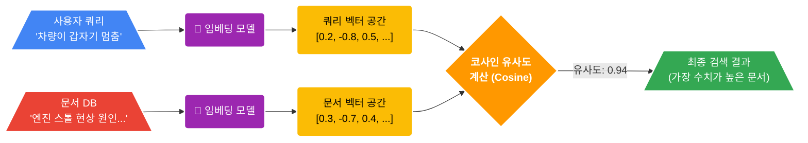
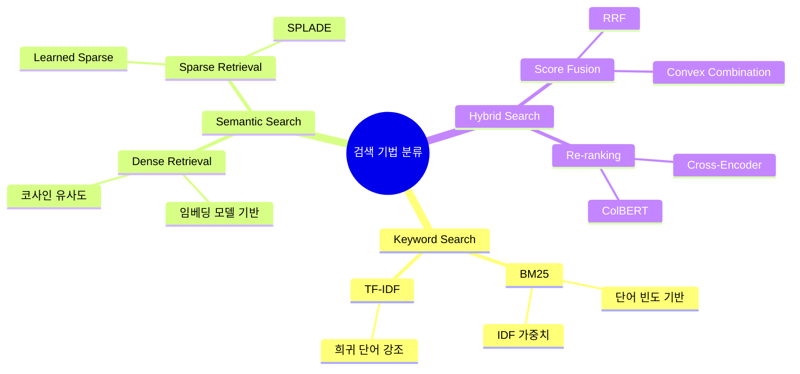
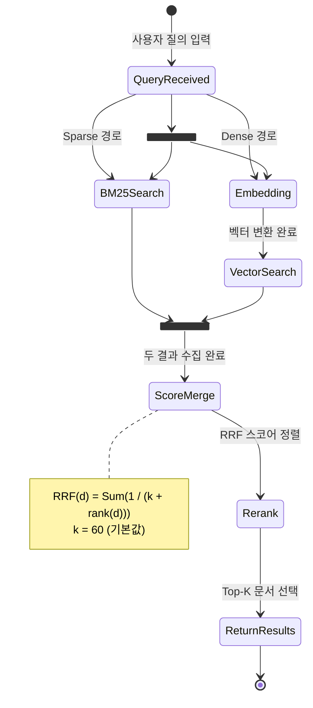
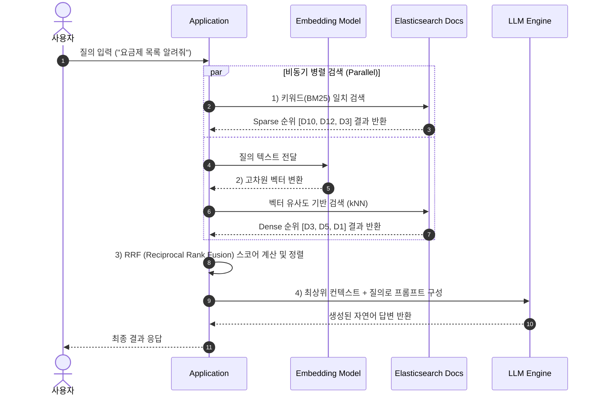
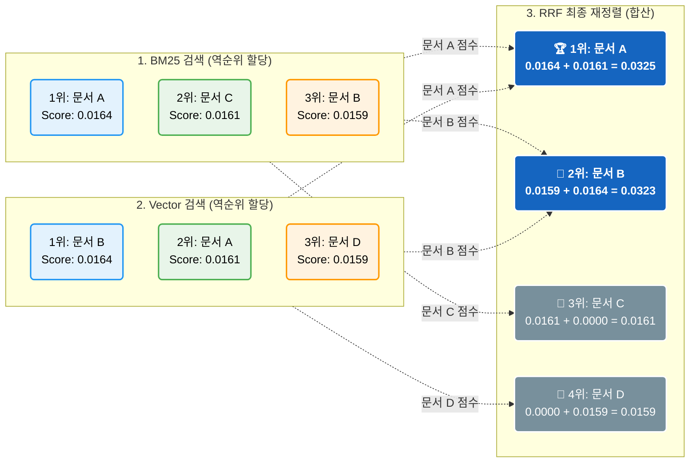
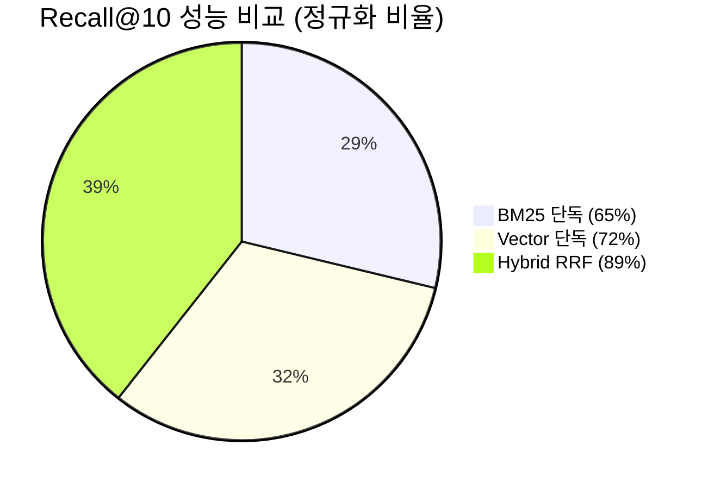
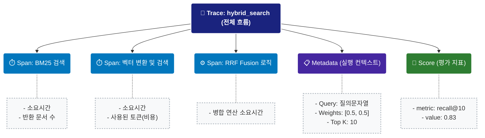

# EP01. Hybrid Search 구현하기

## Keyword vs Vector? 왜 하나만 쓰면 망하는가

**Series 1 · Advanced RAG**

난이도: ⭐⭐

> "BM25만 쓰면 의미를 놓치고, 벡터만 쓰면 키워드를 놓친다.
> 그래서 우리는 둘 다 써야 한다."

---

## 목차

1. 문제 제기: 단일 검색의 실패 사례
2. 키워드 검색(BM25) 원리
3. 벡터 검색(Dense Retrieval) 원리
4. 두 방식 비교
5. Hybrid Search 아키텍처
6. Reciprocal Rank Fusion(RRF)
7. 성능 비교 실험
8. Elasticsearch 8.x 구현
9. LangChain EnsembleRetriever
10. Langfuse 검색 품질 추적
11. 실전 주의사항
12. Exercise

---

## 1. 문제 제기: 단일 검색의 실패 사례

### BM25만 쓸 때 — 키워드가 없으면 찾지 못한다

**질문:** "차량 운행 중 갑자기 멈추는 현상 해결법"

**문서 DB에 있는 정답 문서:**
> "엔진 스톨(Engine Stall) 현상의 주요 원인은 연료 공급 불량 또는 점화 계통 이상입니다."

**BM25 결과:** ❌ 미검색 (단어 불일치: "멈추는" ≠ "스톨")

---

## 1. 문제 제기: 단일 검색의 실패 사례

### 벡터만 쓸 때 — 정확한 키워드를 무시한다

**질문:** "GPT-4o mini API 가격"

**문서 DB에 있는 정답 문서:**
> "GPT-4o mini: input $0.15/1M tokens, output $0.60/1M tokens (2024년 기준)"

**벡터 검색 결과:** ⚠️ 관련성 있어 보이는 다른 모델 가격 문서들이 상위에 섞임

<div class="danger">

**핵심 문제:** 고유명사, 버전 번호, 가격 정보처럼 **정확한 일치가 필요한** 쿼리에서 벡터 검색은 취약하다

</div>

---

## 2. 키워드 검색(BM25) 원리

### BM25 (Best Match 25) 공식

$$
\text{score}(D, Q) = \sum_{i=1}^{n} \text{IDF}(q_i) \cdot \frac{f(q_i, D) \cdot (k_1 + 1)}{f(q_i, D) + k_1 \cdot (1 - b + b \cdot \frac{|D|}{\text{avgdl}})}
$$

| 파라미터 | 설명 | 기본값 |
|---------|------|--------|
| `k1` | 단어 빈도 포화 계수 | 1.2 ~ 2.0 |
| `b` | 문서 길이 정규화 계수 | 0.75 |
| `IDF` | 역문서빈도 (희귀 단어 가중치 증가) | — |
| `f(q,D)` | 문서 D에서 쿼리 단어 q의 등장 빈도 | — |

---

## 2. 키워드 검색(BM25) 강점과 약점

### 강점

- 정확한 키워드 일치에 강함 (모델명, 제품코드, 고유명사)
- 계산 비용이 낮고 인덱싱 빠름
- 설명하기 쉬운 투명한 점수 체계
- 언어 독립적 동작

### 약점

<div class="danger">

- 동의어를 처리하지 못함 ("자동차" vs "차량")
- 의미적 유사성을 이해하지 못함
- 오탈자에 민감
- 다국어 쿼리 처리 어려움

</div>

---

## 3. 벡터 검색(Dense Retrieval) 원리



**핵심 아이디어:** 텍스트를 고차원 벡터 공간에 임베딩 → 의미적으로 유사한 텍스트는 벡터 공간에서 가깝게 위치

---

## 3. 벡터 검색 강점과 약점

### 강점

- 의미적 유사성 이해 ("자동차" = "차량")
- 동의어, 패러프레이즈 처리
- 다국어 크로스링구얼 검색 가능
- 맥락적 관련성 파악

### 약점

<div class="danger">

- 정확한 키워드 매칭에 약함 (버전번호, 가격, 코드)
- 임베딩 모델에 의존적 (도메인 특화 필요)
- 인덱싱/검색 비용이 높음
- "블랙박스" — 왜 이 결과가 나왔는지 설명 어려움

</div>

---

## 4. 두 방식 비교

| 항목 | BM25 (키워드) | Dense Retrieval (벡터) | Hybrid |
|------|:------------:|:---------------------:|:------:|
| 정확한 키워드 매칭 | ✅ 강 | ⚠️ 약 | ✅ |
| 의미적 유사성 | ⚠️ 약 | ✅ 강 | ✅ |
| 동의어 처리 | ❌ | ✅ | ✅ |
| 고유명사/코드 | ✅ | ⚠️ | ✅ |
| 인덱싱 속도 | 빠름 | 느림 | 중간 |
| 검색 지연 | 낮음 | 중간 | 중간 |
| 설명 가능성 | 높음 | 낮음 | 중간 |
| 다국어 지원 | 제한적 | 우수 | 우수 |



---

## 5. Hybrid Search 파이프라인 상태 전이



---

## 5. Hybrid Search 아키텍처


---

## 5. Hybrid Search 동작 시퀀스



---

## 6. Reciprocal Rank Fusion (RRF)

### RRF 수식

$$
\text{RRF}(d) = \sum_{r \in R} \frac{1}{k + \text{rank}_r(d)}
$$

- $d$: 문서
- $R$: 검색 시스템(랭커) 집합
- $\text{rank}_r(d)$: 랭커 $r$ 에서 문서 $d$의 순위
- $k$: 상수 (보통 60, 낮은 순위 문서의 영향 감소)

<div class="highlight">

**핵심:** 절대 점수가 아닌 **순위** 기반으로 합산 → 서로 다른 점수 스케일 문제 해결

</div>

---

## 6. RRF 계산 예시



---

## 7. RRF 적용 전후 성능 비교 (Recall@10)

### 실험 설정

- 데이터셋: 한국어 기술 문서 500개 + 질의 100개
- 임베딩: `jhgan/ko-sroberta-multitask`
- BM25: Elasticsearch 기본 설정

| 검색 방식 | Recall@5 | Recall@10 | MRR@10 |
|----------|:--------:|:---------:|:------:|
| BM25 단독 | 0.52 | 0.64 | 0.48 |
| 벡터 단독 | 0.58 | 0.71 | 0.54 |
| **Hybrid (RRF)** | **0.71** | **0.83** | **0.67** |

<div class="success">

Hybrid + RRF: Recall@10 기준 **BM25 대비 +29.7%**, **벡터 대비 +16.9%** 향상

</div>



---

## 7. 쿼리 유형별 성능 분석

```
Recall@10 by Query Type

정확한 키워드  ████████████████████  BM25: 0.89
              ████████████░░░░░░░░░  Vector: 0.71
              █████████████████████  Hybrid: 0.91

의미적 유사성  ████████░░░░░░░░░░░░░  BM25: 0.41
              ████████████████░░░░░  Vector: 0.78
              ████████████████████░  Hybrid: 0.85

혼합 쿼리     ██████████░░░░░░░░░░░  BM25: 0.53
              █████████████░░░░░░░░  Vector: 0.67
              ████████████████████░  Hybrid: 0.84
```

---

## 8. Elasticsearch 8.x Hybrid Query

```python
# Elasticsearch 8.x hybrid (kNN + BM25) 쿼리
query_body = {
    "query": {
        "bool": {
            "should": [
                {
                    "match": {
                        "content": {
                            "query": user_query,
                            "boost": 1.0
                        }
                    }
                }
            ]
        }
    },
    "knn": {
        "field": "content_vector",
        "query_vector": query_embedding,
        "k": 10,
        "num_candidates": 100,
        "boost": 1.0
    },
    "rank": {
        "rrf": {
            "window_size": 50,
            "rank_constant": 60
        }
    }
}
```

---

## 8. Elasticsearch RRF 내장 기능

```python
from elasticsearch import Elasticsearch

es = Elasticsearch("http://localhost:9200")

results = es.search(
    index="documents",
    body={
        "query": {"match": {"content": query}},
        "knn": {
            "field": "embedding",
            "query_vector": embed(query),
            "k": 10,
            "num_candidates": 100
        },
        "rank": {"rrf": {"rank_constant": 60}},
        "size": 10
    }
)
```

<div class="highlight">

Elasticsearch 8.9+ 부터 `rank.rrf` 내장 지원 — 별도 구현 불필요

</div>

---

## 9. LangChain EnsembleRetriever로 RRF 구현

```python
from langchain.retrievers import BM25Retriever, EnsembleRetriever
from langchain_community.vectorstores import Chroma
from langchain_community.embeddings import HuggingFaceEmbeddings

# 1. BM25 Retriever
bm25_retriever = BM25Retriever.from_documents(docs)
bm25_retriever.k = 10

# 2. 벡터 Retriever
embeddings = HuggingFaceEmbeddings(
    model_name="jhgan/ko-sroberta-multitask"
)
vectorstore = Chroma.from_documents(docs, embeddings)
vector_retriever = vectorstore.as_retriever(
    search_kwargs={"k": 10}
)

# 3. Ensemble (RRF)
ensemble = EnsembleRetriever(
    retrievers=[bm25_retriever, vector_retriever],
    weights=[0.5, 0.5]  # 동일 가중치
)

results = ensemble.invoke("검색 쿼리")
```

---

## 10. Langfuse로 검색 품질 추적

```python
from langfuse import Langfuse
from langfuse.callback import CallbackHandler

langfuse = Langfuse(
    public_key=os.getenv("LANGFUSE_PUBLIC_KEY"),
    secret_key=os.getenv("LANGFUSE_SECRET_KEY"),
)

# CallbackHandler로 LangChain 파이프라인 추적
handler = CallbackHandler()

# 검색 결과 품질 점수 기록
with langfuse.trace(name="hybrid_search") as trace:
    results = ensemble.invoke(query, config={"callbacks": [handler]})
    
    trace.score(
        name="recall@10",
        value=compute_recall(results, relevant_docs),
        comment=f"query: {query}"
    )
```

---

## 10. Langfuse 대시보드에서 확인할 수 있는 것



---

## 11. 실전 적용 시 주의사항

### 인덱싱 비용

| 항목 | BM25만 | 벡터만 | Hybrid |
|------|--------|--------|--------|
| 인덱싱 시간 (1만 문서) | ~10초 | ~5분 | ~5분 10초 |
| 스토리지 | 낮음 | 높음 (벡터 차원 × 4bytes) | 높음 |
| 인덱스 업데이트 비용 | 낮음 | 중간 (배치 가능) | 중간 |

### 검색 지연 (Latency)

<div class="highlight">

- BM25: 5~20ms
- 벡터 검색 (HNSW): 20~80ms
- Hybrid: 30~100ms (병렬 실행 시 벡터 검색에 수렴)
- **권장:** 두 검색을 **비동기 병렬** 실행 후 RRF 합산

</div>

---

## 11. 실전 적용 체크리스트

### 가중치 설정 가이드

| 도메인 특성 | BM25 가중치 | 벡터 가중치 |
|------------|:-----------:|:-----------:|
| 법률/의료 (정확성 중요) | 0.7 | 0.3 |
| 일반 Q&A | 0.5 | 0.5 |
| 감성/창의적 검색 | 0.3 | 0.7 |
| 코드 검색 | 0.6 | 0.4 |

<div class="highlight">

**실전 팁:** 가중치는 고정하지 말고, Langfuse로 Recall@10을 지속 모니터링하며 A/B 테스트로 튜닝하라

</div>

---

## Exercise 1: BM25 vs 벡터 검색 단독 실험

### 목표

BM25와 벡터 검색을 각각 단독으로 구현하고 성능 차이를 확인한다.

### 과제

1. 노트북의 샘플 문서 20개와 테스트 질의 10개를 사용한다
2. `BM25Retriever`로 각 질의의 상위 10개 문서를 검색한다
3. `ChromaDB + HuggingFaceEmbeddings`로 동일 실험을 수행한다
4. 각 질의에 대해 정답 문서가 상위 10위 이내에 있는지 확인한다
5. Recall@10을 직접 계산하고 두 방식을 비교하는 표를 출력한다

### 제출 결과물

```
| 질의 유형 | BM25 Recall@10 | Vector Recall@10 |
|---------|:-------------:|:---------------:|
| 키워드형  |     0.xx      |      0.xx       |
| 의미형   |     0.xx      |      0.xx       |
| 전체    |     0.xx      |      0.xx       |
```

---

## Exercise 2: RRF 하이브리드 구현 + Recall@10 측정

### 목표

EnsembleRetriever로 RRF 기반 하이브리드 검색을 구현하고 성능 향상을 검증한다.

### 과제

1. Exercise 1의 BM25/벡터 Retriever를 재사용한다
2. `EnsembleRetriever`로 가중치 `[0.5, 0.5]`인 하이브리드를 구성한다
3. 동일 테스트셋으로 Recall@10을 측정한다
4. 가중치를 `[0.7, 0.3]`, `[0.3, 0.7]`로 바꾸며 최적값을 탐색한다
5. Langfuse에 각 실험의 Recall@10 점수를 Score로 기록한다
6. matplotlib으로 세 방식(BM25, Vector, Hybrid)의 Recall@10 막대그래프를 그린다

### 보너스 (선택)

> Elasticsearch가 설치되어 있다면 `rank.rrf` 내장 기능을 사용해 동일 실험을 수행하고 EnsembleRetriever와 결과를 비교하라.
