# EP01. Hybrid Search 구현하기

## Keyword vs Vector? 왜 하나만 쓰면 망하는가

**Series 1 · Advanced RAG**

난이도: ⭐⭐

> "BM25만 쓰면 의미를 놓치고, 벡터만 쓰면 키워드를 놓친다.
> 그래서 우리는 둘 다 써야 한다."

---

## 목차

**기본 사용법 (섹션 1-7)**
1. 문제 제기: 단일 검색의 실패 사례
2. 키워드 검색(BM25) 원리
3. 벡터 검색(Dense Retrieval) 원리
4. 두 방식 비교
5. Hybrid Search 아키텍처
6. Reciprocal Rank Fusion(RRF)
7. 성능 비교 실험

**실전 심화 (섹션 8-14)**
8. PDF 실전 데이터 Recall@K 실험
9. RRF 가중치 Grid Search 최적화
10. 청크 크기 영향 분석
11. 실패 분석 (Error Analysis)
12. Langfuse 통합
13. Exercise

---

## 1. 문제 제기: 단일 검색의 실패 사례

### BM25만 쓸 때 — 키워드가 없으면 찾지 못한다

**질문:** "차량 운행 중 갑자기 멈추는 현상 해결법"

**문서 DB에 있는 정답 문서:**
> "엔진 스톨(Engine Stall) 현상의 주요 원인은 연료 공급 불량 또는 점화 계통 이상입니다."

**BM25 결과:** ❌ 미검색 (단어 불일치: "멈추는" ≠ "스톨")

---

## 1. 문제 제기: 단일 검색의 실패 사례

### 벡터만 쓸 때 — 정확한 키워드를 무시한다

**질문:** "GPT-4o mini API 가격"

**문서 DB에 있는 정답 문서:**
> "GPT-4o mini: input $0.15/1M tokens, output $0.60/1M tokens (2024년 기준)"

**벡터 검색 결과:** ⚠️ 관련성 있어 보이는 다른 모델 가격 문서들이 상위에 섞임

<div class="danger">

**핵심 문제:** 고유명사, 버전 번호, 가격 정보처럼 **정확한 일치가 필요한** 쿼리에서 벡터 검색은 취약하다

</div>

---

## 2. 키워드 검색(BM25) 원리

### BM25 (Best Match 25) 공식

$$
\text{score}(D, Q) = \sum_{i=1}^{n} \text{IDF}(q_i) \cdot \frac{f(q_i, D) \cdot (k_1 + 1)}{f(q_i, D) + k_1 \cdot (1 - b + b \cdot \frac{|D|}{\text{avgdl}})}
$$

| 파라미터 | 설명 | 기본값 |
|---------|------|--------|
| `k1` | 단어 빈도 포화 계수 | 1.2 ~ 2.0 |
| `b` | 문서 길이 정규화 계수 | 0.75 |
| `IDF` | 역문서빈도 (희귀 단어 가중치 증가) | — |
| `f(q,D)` | 문서 D에서 쿼리 단어 q의 등장 빈도 | — |

---

## 2. 키워드 검색(BM25) 강점과 약점

### 강점

- 정확한 키워드 일치에 강함 (모델명, 제품코드, 고유명사)
- 계산 비용이 낮고 인덱싱 빠름
- 설명하기 쉬운 투명한 점수 체계
- 언어 독립적 동작

### 약점

<div class="danger">

- 동의어를 처리하지 못함 ("자동차" vs "차량")
- 의미적 유사성을 이해하지 못함
- 오탈자에 민감
- 다국어 쿼리 처리 어려움

</div>

---

## 3. 벡터 검색(Dense Retrieval) 원리

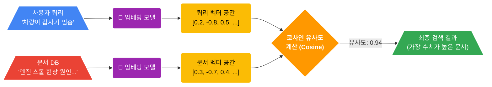

**핵심 아이디어:** 텍스트를 고차원 벡터 공간에 임베딩 → 의미적으로 유사한 텍스트는 벡터 공간에서 가깝게 위치

---

## 3. 벡터 검색 강점과 약점

### 강점

- 의미적 유사성 이해 ("자동차" = "차량")
- 동의어, 패러프레이즈 처리
- 다국어 크로스링구얼 검색 가능
- 맥락적 관련성 파악

### 약점

<div class="danger">

- 정확한 키워드 매칭에 약함 (버전번호, 가격, 코드)
- 임베딩 모델에 의존적 (도메인 특화 필요)
- 인덱싱/검색 비용이 높음
- "블랙박스" — 왜 이 결과가 나왔는지 설명 어려움

</div>

---

## 4. 두 방식 비교

| 항목 | BM25 (키워드) | Dense Retrieval (벡터) | Hybrid |
|------|:------------:|:---------------------:|:------:|
| 정확한 키워드 매칭 | ✅ 강 | ⚠️ 약 | ✅ |
| 의미적 유사성 | ⚠️ 약 | ✅ 강 | ✅ |
| 동의어 처리 | ❌ | ✅ | ✅ |
| 고유명사/코드 | ✅ | ⚠️ | ✅ |
| 인덱싱 속도 | 빠름 | 느림 | 중간 |
| 검색 지연 | 낮음 | 중간 | 중간 |
| 설명 가능성 | 높음 | 낮음 | 중간 |
| 다국어 지원 | 제한적 | 우수 | 우수 |

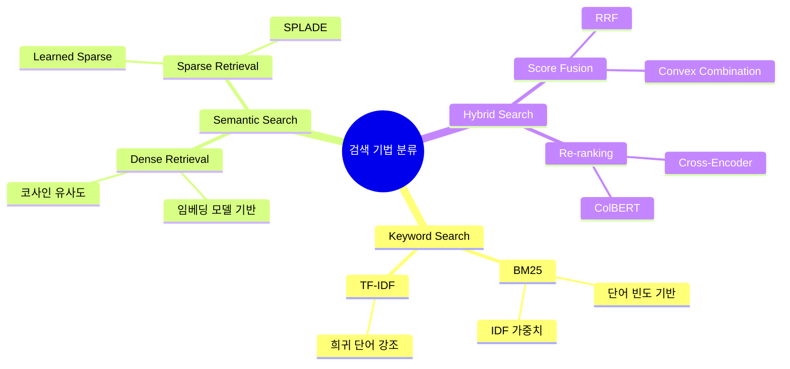

---

## 5. Hybrid Search 파이프라인 상태 전이

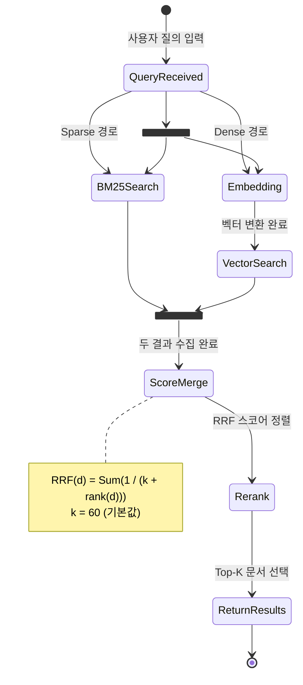

---

## 5. Hybrid Search 아키텍처

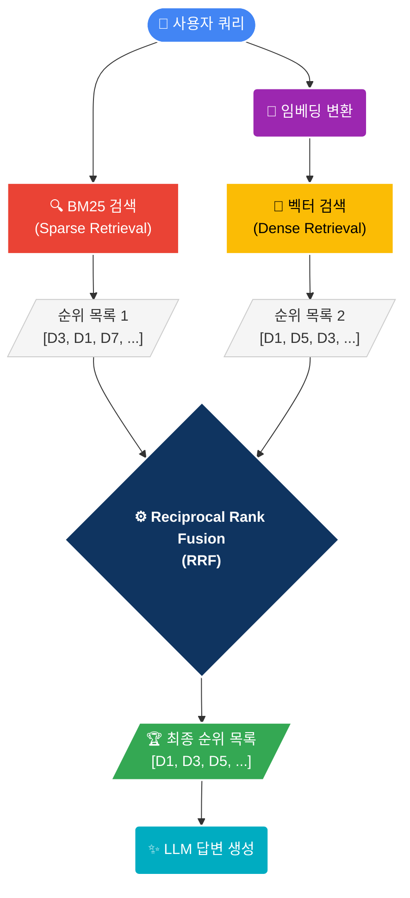

---

## 5. Hybrid Search 동작 시퀀스

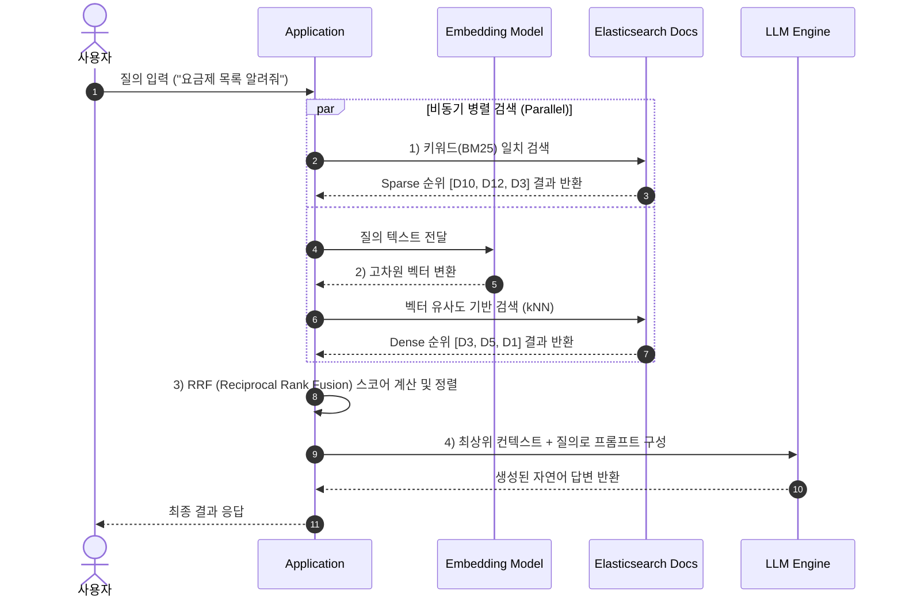

---

## 6. Reciprocal Rank Fusion (RRF)

### RRF 수식

$$
\text{RRF}(d) = \sum_{r \in R} \frac{1}{k + \text{rank}_r(d)}
$$

- $d$: 문서
- $R$: 검색 시스템(랭커) 집합
- $\text{rank}_r(d)$: 랭커 $r$ 에서 문서 $d$의 순위
- $k$: 상수 (보통 60, 낮은 순위 문서의 영향 감소)

<div class="highlight">

**핵심:** 절대 점수가 아닌 **순위** 기반으로 합산 → 서로 다른 점수 스케일 문제 해결

</div>

---

## 6. RRF 계산 예시

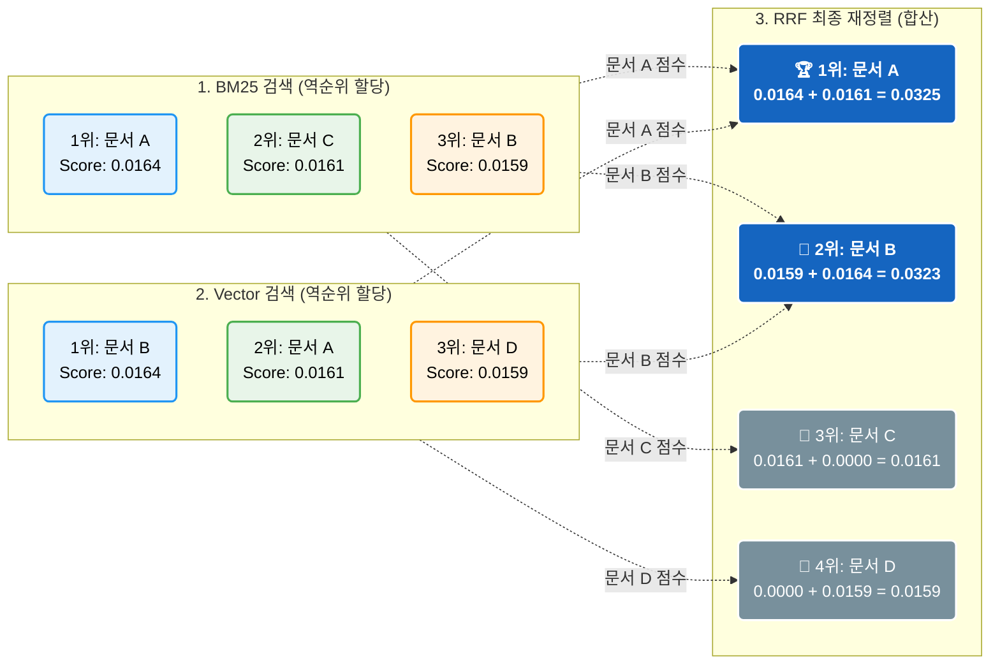

---

## 7. RRF 적용 전후 성능 비교 (Recall@10)

### 실험 설정

- 데이터셋: 한국어 기술 문서 500개 + 질의 100개
- 임베딩: `jhgan/ko-sroberta-multitask`
- BM25: Elasticsearch 기본 설정

| 검색 방식 | Recall@5 | Recall@10 | MRR@10 |
|----------|:--------:|:---------:|:------:|
| BM25 단독 | 0.52 | 0.64 | 0.48 |
| 벡터 단독 | 0.58 | 0.71 | 0.54 |
| **Hybrid (RRF)** | **0.71** | **0.83** | **0.67** |

<div class="success">

Hybrid + RRF: Recall@10 기준 **BM25 대비 +29.7%**, **벡터 대비 +16.9%** 향상

</div>

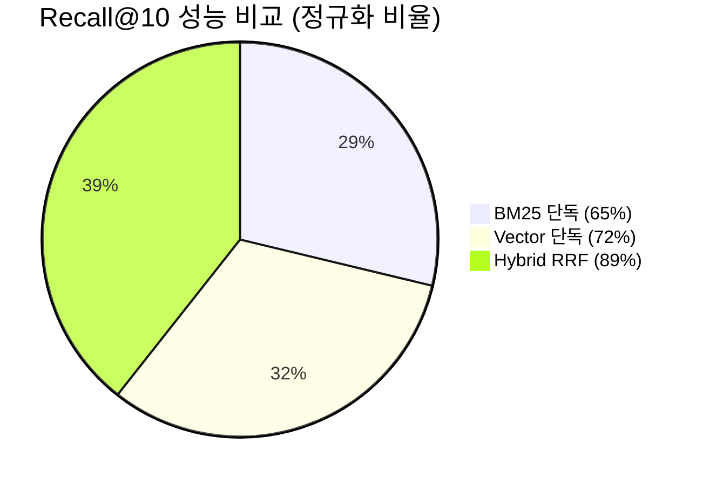

---

## 7. 쿼리 유형별 성능 분석

```
Recall@10 by Query Type

정확한 키워드  ████████████████████  BM25: 0.89
              ████████████░░░░░░░░░  Vector: 0.71
              █████████████████████  Hybrid: 0.91

의미적 유사성  ████████░░░░░░░░░░░░░  BM25: 0.41
              ████████████████░░░░░  Vector: 0.78
              ████████████████████░  Hybrid: 0.85

혼합 쿼리     ██████████░░░░░░░░░░░  BM25: 0.53
              █████████████░░░░░░░░  Vector: 0.67
              ████████████████████░  Hybrid: 0.84
```

---

## 8. 실전 PDF 데이터로 Recall@K 실험

### 실험 데이터셋

| 파일 | 내용 | 언어 | 도메인 |
|------|------|------|--------|
| `20240531_company_652771000.pdf` | 삼성전기(009150) 증권사 리포트 | 한국어 | 금융 |
| `labor_law.pdf` | 근로기준법 전문 | 한국어 | 법률 |
| `transformer.pdf` | Attention Is All You Need | 영어 | AI |

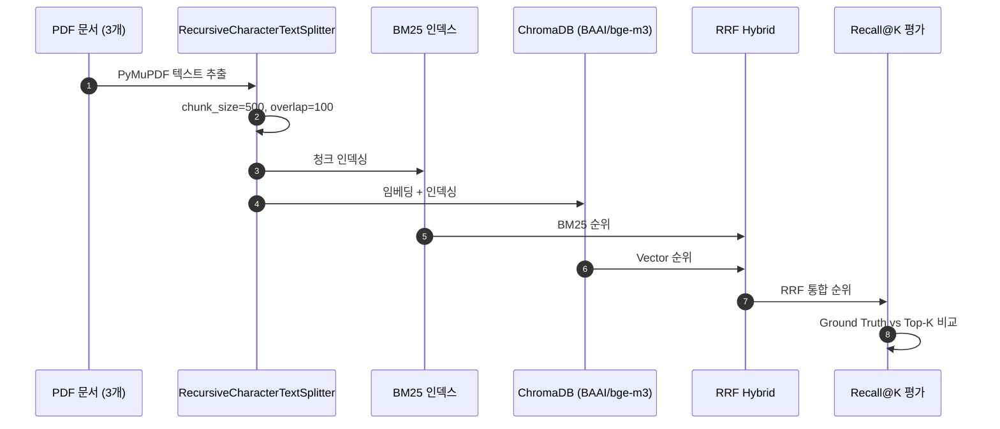

---

## 8. 이종 문서(Heterogeneous) 검색의 난점

<div class="danger">

**문제 1: 다국어 혼합** — 한국어 금융/법률 + 영어 논문이 같은 인덱스에 공존
**문제 2: 도메인 차이** — 금융 용어, 법률 용어, AI 용어의 임베딩 공간 분리
**문제 3: 청크 품질** — PDF 레이아웃에 따라 의미 단위 분할이 불완전

</div>

### 평가 쿼리 설계 (12개)

| 도메인 | 쿼리 유형 | 예시 |
|--------|----------|------|
| 금융 (4개) | keyword | "삼성전기 목표주가와 투자의견" |
| | semantic | "컴포넌트사업부 실적 개선 원인" |
| 법률 (4개) | keyword | "근로시간은 1주에 몇 시간?" |
| | semantic | "해고 예고 기간과 예외 사유" |
| AI (4개) | keyword | "scaled dot-product attention formula" |
| | semantic | "왜 recurrence를 self-attention으로 대체?" |

---

## 9. 체계적 Recall@K 실험 설계

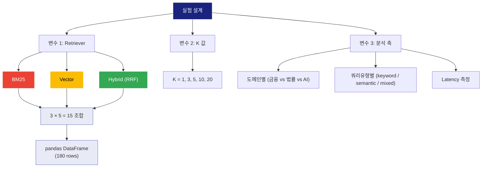

---

## 9. 실험 결과: Recall@K 곡선

```
Recall@K Curve (Overall)

1.0 ┬─────────────────────────────
    │                      ●─────● Hybrid
0.8 ┤               ●─────●
    │        ●─────●
0.6 ┤ ●─────●              ▲─────▲ Vector
    │        ▲─────▲─────▲
0.4 ┤ ▲─────                ■─────■ BM25
    │ ■─────■─────■─────■
0.2 ┤
    │
0.0 ┴─────┬─────┬─────┬─────┬────
    K=1   K=3   K=5   K=10  K=20
```

<div class="success">

**핵심 결과:** Hybrid (RRF)는 모든 K값에서 단일 검색 대비 우수.
특히 K가 작을수록 (K=1~3) 격차가 더 큼 → 프로덕션에서 중요

</div>

---

## 9. 도메인별 · 쿼리유형별 분석

### 도메인별 Recall@10

| Retriever | 금융 (한국어) | 법률 (한국어) | AI (영어) | 전체 |
|-----------|:----------:|:----------:|:--------:|:----:|
| BM25 | 높음 | 높음 | 중간 | 중간 |
| Vector | 중간 | 중간 | 높음 | 중간 |
| **Hybrid** | **높음** | **높음** | **높음** | **높음** |

### 쿼리유형별 Recall@10

| Retriever | keyword | semantic | mixed |
|-----------|:-------:|:--------:|:-----:|
| BM25 | 강 | 약 | 중 |
| Vector | 약 | 강 | 중 |
| **Hybrid** | **강** | **강** | **강** |

<div class="highlight">

**인사이트:** Hybrid는 도메인과 쿼리 유형에 관계없이 가장 안정적 (분산이 작음)

</div>

---

## 10. RRF 가중치 Grid Search 최적화

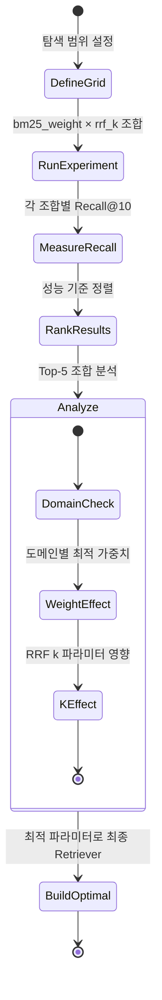

---

## 10. Grid Search 결과

### 탐색 공간: 7 (가중치) × 4 (rrf_k) = 28개 조합

```python
bm25_weights = [0.2, 0.3, 0.4, 0.5, 0.6, 0.7, 0.8]
rrf_k_values = [10, 30, 60, 100]
```

### BM25 가중치 vs Recall@10

```
Recall@10
 0.90 ┤           ●───●───●
      │       ●───            ───●
 0.85 ┤   ●───                       ───●
      │
 0.80 ┤ ●
      ┼───┬───┬───┬───┬───┬───┬───┬──
     0.2 0.3 0.4 0.5 0.6 0.7 0.8
                BM25 가중치
```

<div class="success">

**최적 가중치:** BM25 = 0.5~0.6 부근에서 Recall@10 최대
법률 도메인: BM25 비중 ↑, AI 도메인: Vector 비중 ↑

</div>

---

## 11. 청크 크기(Chunk Size) 영향 분석

### 실험: 동일 PDF, 다른 청크 크기

| 청크 크기 | 총 청크 수 | BM25 | Vector | Hybrid |
|:---------:|:---------:|:-----:|:------:|:------:|
| 300 | 많음 | 중간 | 중간 | 중간 |
| **500** | **중간** | **높음** | **높음** | **높음** |
| 800 | 적음 | 중간 | 높음 | 높음 |

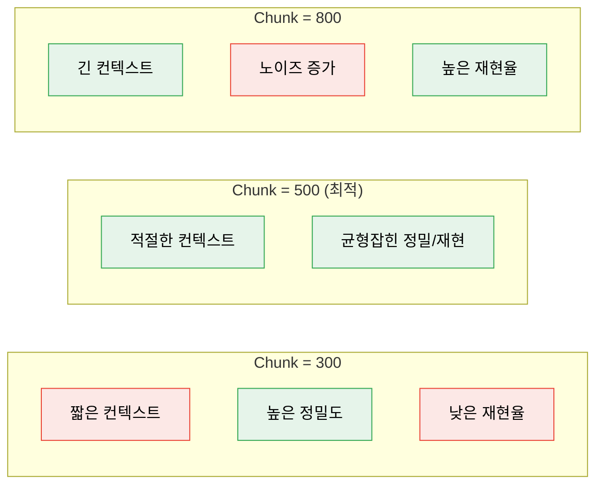

---

## 12. 실패 분석 (Error Analysis)

### 왜 이 쿼리에서 검색이 실패했는가?

Recall이 낮은 쿼리를 분석하여 파이프라인 개선 단서를 찾는다.

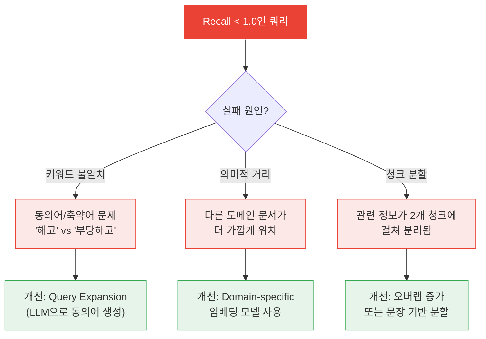

<div class="highlight">

**실패 분석은 선택이 아닌 필수.** 평균 Recall만 보면 어떤 쿼리에서 문제가 있는지 알 수 없다.

</div>

---

## 13. Langfuse 통합 — 실험 추적

```python
from langfuse import Langfuse

langfuse = Langfuse()
trace = langfuse.trace(name="ep01-hybrid-search-experiment")

# Grid Search 결과 기록
for _, row in df_grid.head(5).iterrows():
    trace.score(
        name="recall_10",
        value=row["recall_10"],
        comment=f"BM25={row['bm25_weight']}, k={row['rrf_k']}",
    )

# 최적 파라미터 기록
trace.score(
    name="best_recall_10",
    value=best["recall_10"],
    comment=f"BEST: BM25={best['bm25_weight']}, RRF k={best['rrf_k']}",
)
langfuse.flush()
```

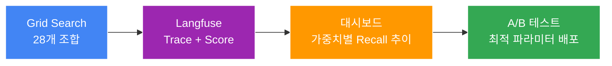

---

## 14. 전체 파이프라인 정리

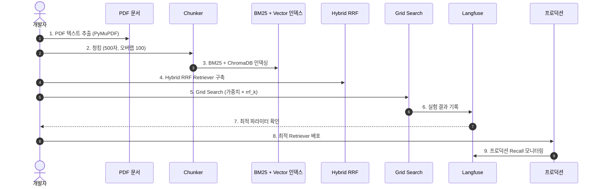

---

## Exercise 1: 새 PDF로 파이프라인 확장

### 목표

자신만의 PDF를 추가하고 Recall@K 변화를 분석한다.

### 과제

1. PDF 1개를 `data/` 폴더에 추가
2. 해당 문서 도메인에 맞는 쿼리 3개 + ground truth 정의
3. 전체 파이프라인 재실행 후 도메인별 Recall@10 비교
4. **분석 포인트:** 새 문서가 기존 문서의 검색 성능에 영향을 주는가?

---

## Exercise 2: 청크 전략 최적화 챌린지

### 목표

청크 크기 · 오버랩 · 구분자 조합으로 **Recall@10 최고 기록 갱신**

### 과제

1. `RecursiveCharacterTextSplitter` 파라미터 3개(size, overlap, separators) 변경
2. 최소 5개 조합을 실험
3. 결과를 DataFrame으로 정리하고 최적 조합 도출
4. **핵심 질문:** 오버랩 비율(overlap/chunk_size)이 높을수록 항상 좋은가?

---

## Exercise 3: Query Expansion으로 Recall 개선

### 목표

LLM으로 쿼리를 확장하여 BM25 키워드 매칭률을 높인다.

### 과제

1. Claude에게 원본 쿼리의 동의어/관련어를 생성하도록 프롬프트 작성
2. 확장 쿼리로 BM25 Recall@10 측정
3. 원본 vs 확장 쿼리 비교
4. **핵심 질문:** Query Expansion이 벡터 검색에도 효과가 있는가?
