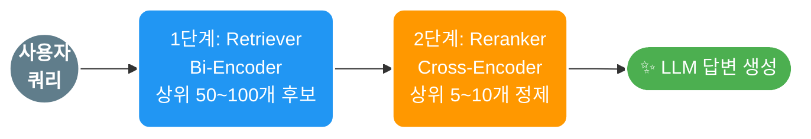
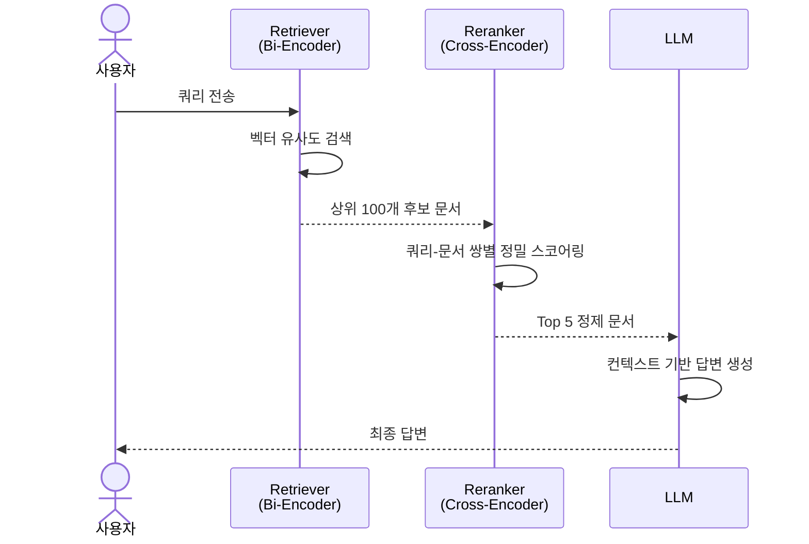
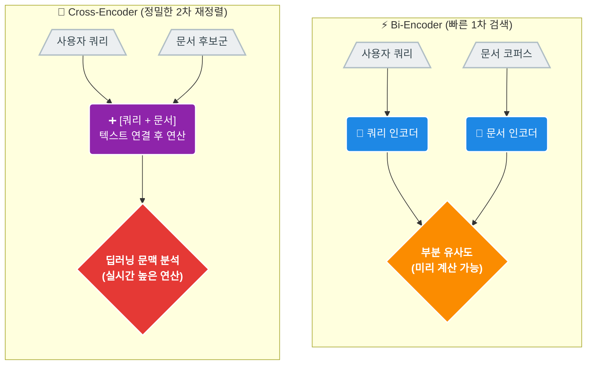
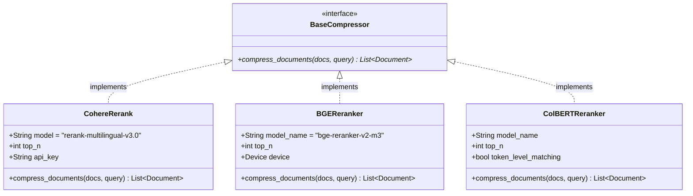
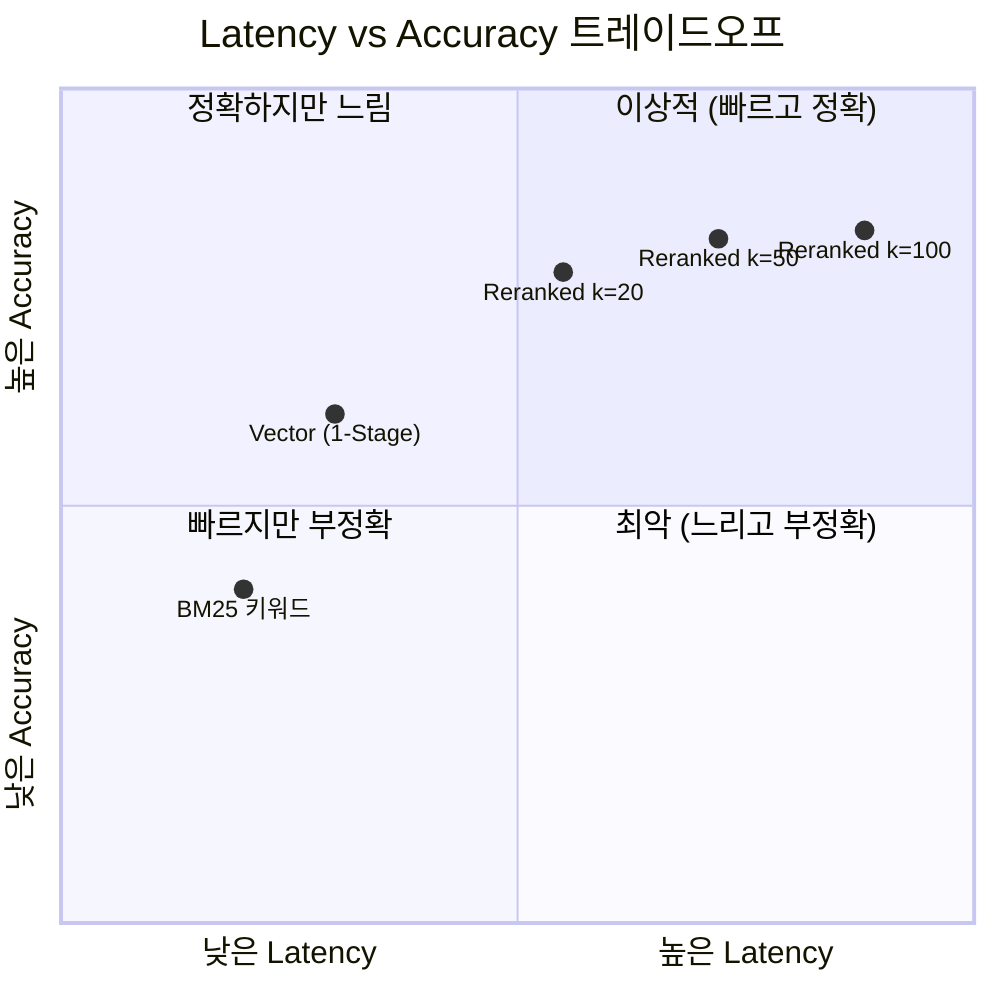
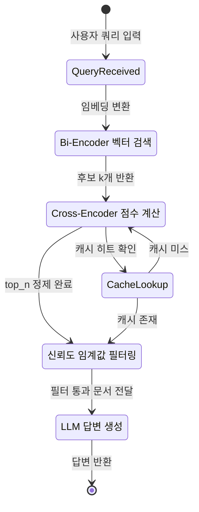
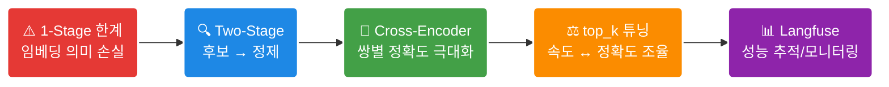

<!-- _class: lead -->

# EP02. Re-ranking 적용기

## 검색 결과 100개 중 진짜 필요한 5개만 고르기

난이도: ⭐⭐

> 1-Stage 검색의 한계를 넘어서  
> Two-Stage Retrieval로 정확도를 극적으로 끌어올리는 법

---

## 1. 이번 에피소드 학습 목표

- 1-Stage 검색이 왜 부족한지 **근본 원인** 이해
- **Two-Stage Retrieval** 아키텍처 설계 원리 파악
- **Bi-Encoder vs Cross-Encoder** 차이를 수식 없이 직관적으로 이해
- LangChain `ContextualCompressionRetriever` + `CohereRerank` 구현
- **Latency ↔ 정확도 트레이드오프** 분석 및 top\_k 튜닝
- Langfuse로 Reranking 전후 성능 추적

---

## 2. 문제: 1-Stage 검색의 한계

### 상황 예시

> 질문: "분산 트랜잭션에서 2PC 프로토콜의 단점은?"

| 순위 | 1-Stage 검색 결과 | 관련성 |
|------|-----------------|--------|
| 1 | "트랜잭션 개요" | 낮음 |
| 2 | "2PC 개요 및 역사" | 중간 |
| 3 | "분산 시스템 패턴" | 낮음 |
| 4 | **"2PC 타임아웃·블로킹 문제"** | **높음** |
| 5 | "SAGA 패턴 소개" | 낮음 |

**진짜 답이 담긴 문서가 4위!** → LLM은 상위 3개만 보고 틀린 답 생성

---

## 3. 왜 이런 일이 생길까?

### Bi-Encoder (1-Stage) 의 구조적 한계

```
쿼리 임베딩:  [0.2, 0.8, 0.1, ...]   (독립 계산)
문서 임베딩:  [0.3, 0.7, 0.2, ...]   (독립 계산)
유사도:       코사인 거리만으로 판단
```

**문제점:**
- 쿼리와 문서를 **별도로** 인코딩 → 상호작용 정보 손실
- 임베딩 공간의 압축 과정에서 **세밀한 의미 손실**
- 짧은 쿼리 vs 긴 문서 → 벡터 공간 불균형

**결과:** 키워드 겹침이 많은 문서가 실제로 더 관련 있는 문서보다 상위에 오름

---

## 4. Two-Stage Retrieval 아키텍처



| 단계 | 역할 | 속도 | 정확도 |
|------|------|------|--------|
| 1단계 (Retriever) | 후보 풀 생성 | 빠름 | 보통 |
| 2단계 (Reranker) | 최종 순위 결정 | 느림 | 높음 |



> 핵심: **속도는 Bi-Encoder, 정확도는 Cross-Encoder**

---

## 5. Bi-Encoder vs Cross-Encoder 원리 비교



| 항목 | Bi-Encoder | Cross-Encoder |
|------|-----------|---------------|
| 인코딩 방식 | 쿼리·문서 각각 | 쿼리+문서 쌍을 함께 |
| 속도 | O(1) 검색 | O(n) 쌍별 추론 |
| 정확도 | 보통 | 높음 |
| 사전 계산 | 가능 (인덱싱) | 불가능 |

---

## 6. Cross-Encoder가 정확한 이유

### 쿼리-문서 쌍을 **함께** 인코딩

```
입력: "[CLS] 2PC 단점 [SEP] 2PC는 코디네이터가 장애 시 블로킹... [SEP]"
         ↓ Transformer Self-Attention (전체 쌍 상호작용)
출력: 관련성 점수 0.94  ← 문맥 완전 활용
```

**왜 더 정확한가?**

1. **Self-Attention**이 쿼리 단어 ↔ 문서 단어 직접 연결
2. "2PC"라는 단어가 문서에서 어떤 **맥락**으로 쓰였는지 파악
3. 부정("단점이 없다")도 정확히 구분

**단점:** 문서 수만큼 모델 추론 필요 → 대규모 인덱스에 직접 적용 불가

---

## 7. Reranker 옵션 비교

| 옵션 | 유형 | 언어 지원 | 비용 | 특징 |
|------|------|---------|------|------|
| **Cohere Rerank** | API | 다국어 | 유료 ($0.001/검색) | 즉시 사용, 고성능 |
| **BGE Reranker** | 로컬 모델 | 영어/중국어 | 무료 | `bge-reranker-large` |
| **ms-marco-MiniLM** | 로컬 모델 | 영어 | 무료 | 경량, 빠름 |
| **ColBERT** | 하이브리드 | 영어 | 무료 | 토큰 수준 매칭 |
| **RankGPT** | LLM 기반 | 다국어 | 유료 | LLM으로 직접 재순위 |



**한국어 권장:**
- API: **Cohere Rerank v3** (다국어 지원)
- 로컬: **bge-reranker-v2-m3** (한국어 포함 다국어)

---

## 8. LangChain 구현: ContextualCompressionRetriever

```python
from langchain.retrievers import ContextualCompressionRetriever
from langchain_cohere import CohereRerank
from langchain_chroma import Chroma

# 1단계: Base Retriever (Bi-Encoder)
base_retriever = vectorstore.as_retriever(
    search_kwargs={"k": 50}  # 후보 50개 검색
)

# 2단계: Cohere Reranker
compressor = CohereRerank(
    model="rerank-multilingual-v3.0",
    top_n=5  # 최종 5개만 반환
)

# Two-Stage Retriever 조립
compression_retriever = ContextualCompressionRetriever(
    base_compressor=compressor,
    base_retriever=base_retriever
)

# 사용
docs = compression_retriever.invoke("분산 트랜잭션 2PC 단점")
```

---

## 9. BGE Reranker Fallback 구현

```python
from langchain.retrievers.document_compressors import (
    CrossEncoderReranker
)
from langchain_community.cross_encoders import HuggingFaceCrossEncoder

def create_reranker(use_cohere: bool = True):
    if use_cohere and os.getenv("COHERE_API_KEY"):
        return CohereRerank(
            model="rerank-multilingual-v3.0",
            top_n=5
        )
    else:
        # 로컬 BGE Reranker fallback
        model = HuggingFaceCrossEncoder(
            model_name="BAAI/bge-reranker-v2-m3"
        )
        return CrossEncoderReranker(model=model, top_n=5)
```

> API 키 없이도 로컬에서 동일한 파이프라인 실행 가능

---

## 10. Latency vs 정확도 트레이드오프

### top\_k (후보 수) 변화에 따른 영향

```
후보 수 (k)    Latency     MRR@5
━━━━━━━━━━━━━━━━━━━━━━━━━━━━━━
k=10          ~120ms      0.71
k=20          ~180ms      0.78  ← 권장
k=50          ~350ms      0.82
k=100         ~650ms      0.83
```



**관찰:**
- k=20 → k=50: 정확도 +4%, 지연 +94% → **비효율 구간**
- k=10 → k=20: 정확도 +7%, 지연 +50% → **효율 구간**

**권장 전략:** 프로덕션 기본값 `k=20`, 정밀도 우선 `k=50`

---

## 11. top\_k 파라미터 튜닝 전략

### 유즈케이스별 권장 설정

| 유즈케이스 | base\_k | top\_n | 이유 |
|-----------|---------|--------|------|
| 고객 지원 챗봇 | 20 | 3 | 빠른 응답 우선 |
| 법률 문서 검색 | 50 | 5 | 정확도 우선 |
| 실시간 검색 | 10 | 3 | 최저 지연 |
| 연구 보조 | 100 | 10 | 재현율 우선 |

### 튜닝 공식

```
효율성 지수 = (MRR@5 향상) / (Latency 증가%)
최적 k = 효율성 지수가 최대인 지점
```

---

## 12. Reranking 비용 분석

### Cohere Rerank API 비용 구조

```
비용 = 검색 횟수 × 후보 문서 수 × 단가
     = 1,000회/일 × 50문서 × $0.001/검색
     = $50/일 = $1,500/월
```

**비용 최적화 전략:**

1. **캐싱:** 동일 쿼리 결과 Redis에 TTL 1시간 캐시
2. **Selective Reranking:** 신뢰도 낮은 쿼리만 Reranking
3. **배치 처리:** 오프라인 작업은 배치로 묶어 처리
4. **로컬 fallback:** BGE Reranker로 비용 0원 대체 가능

> **핵심:** 고가치 쿼리에만 Cohere API, 나머지는 로컬 모델

---

## 13. Langfuse로 Reranking 성능 추적

```python
from langfuse.langchain import CallbackHandler

# Langfuse 핸들러 초기화
langfuse_handler = CallbackHandler(
    public_key=os.getenv("LANGFUSE_PUBLIC_KEY"),
    secret_key=os.getenv("LANGFUSE_SECRET_KEY"),
)

# Reranking 파이프라인에 추적 추가
chain = (
    compression_retriever
    | format_docs
    | prompt
    | llm
    | StrOutputParser()
)

result = chain.invoke(
    {"question": query},
    config={"callbacks": [langfuse_handler]}
)
```

**Langfuse 대시보드에서 확인:**
- 각 단계 지연시간 분해
- 검색된 문서 목록 및 Reranking 점수
- 토큰 사용량 및 비용 추적

---

## 14. 실전: 언제 Reranking이 효과적인가

### 효과적인 경우 ✓

- **도메인 특화 문서:** 일반 임베딩 모델이 도메인 용어를 이해 못할 때
- **긴 문서:** 임베딩이 문서 전체 의미를 압축하기 어려울 때
- **복합 질문:** 여러 조건을 동시에 만족해야 하는 쿼리
- **낮은 Signal-to-Noise:** 관련 문서가 코퍼스에 적을 때

### 효과 미미한 경우 ✗

- 이미 도메인 파인튜닝된 임베딩 모델 사용 시
- 문서 수가 매우 적은 경우 (< 100개)
- 키워드 매칭이 충분한 단순 검색

---

## 15. 성능 비교 실험 결과

### 한국어 기술 문서 100개 기준

| 지표 | 1-Stage | 2-Stage (Cohere) | 2-Stage (BGE) |
|------|---------|-----------------|---------------|
| MRR@5 | 0.61 | **0.84** | 0.79 |
| Recall@5 | 0.68 | **0.89** | 0.83 |
| P@1 | 0.52 | **0.78** | 0.71 |
| Latency (p50) | 45ms | 280ms | 410ms |
| Latency (p95) | 120ms | 650ms | 980ms |

**핵심 인사이트:**
- MRR@5 기준 **+38%** 향상 (Cohere)
- 지연시간은 6배 증가 → 허용 가능한 트레이드오프 여부는 서비스마다 다름

---

## 16. MRR@5 지표 이해하기

### Mean Reciprocal Rank @5

```
MRR@5 = (1/|Q|) × Σ (1/rank_i)

예시:
- 쿼리1: 정답이 2위 → 1/2 = 0.5
- 쿼리2: 정답이 1위 → 1/1 = 1.0
- 쿼리3: 5위 밖    → 0
MRR@5 = (0.5 + 1.0 + 0) / 3 = 0.5
```

**왜 MRR인가?**
- 검색에서 **첫 번째 관련 문서**가 얼마나 높은 순위에 있는지 측정
- RAG에서 LLM이 상위 N개만 보므로 순위 민감도가 중요

---

## 17. 파이프라인 최적화 체크리스트



```
✅ Base Retriever: k 값은 Reranker top_n의 5~10배
✅ Reranker: 언어에 맞는 모델 선택 (다국어 vs 영어 전용)
✅ Fallback: API 장애 시 로컬 모델로 자동 전환
✅ 캐싱: 동일 쿼리 중복 API 호출 방지
✅ 모니터링: Langfuse로 단계별 지연시간 추적
✅ 알람: MRR@5 < 임계값 시 알림 설정
✅ A/B 테스트: 새 Reranker 모델 점진적 배포
```

---

## 18. 핵심 요약



**Three Takeaways:**

1. Reranking은 RAG 정확도를 가장 쉽게 올리는 방법 중 하나
2. top\_k = 20이 대부분의 케이스에서 최적 균형점
3. Langfuse 없이는 실험 결과를 신뢰하기 어렵다

---

## Exercise 1: Reranking 전후 MRR@5 비교

### 목표

1-Stage와 2-Stage 검색의 MRR@5를 정량적으로 비교

### 과제

```python
# 1. 한국어 기술 문서 15개를 ChromaDB에 인덱싱
# 2. 테스트 쿼리 5개에 대해 1-Stage 검색 결과 수집
# 3. CohereRerank 적용 후 결과 수집
# 4. MRR@5, Recall@5 계산 및 비교
# 5. 결과를 표와 막대 그래프로 시각화

def calculate_mrr(results: list, relevant_doc_ids: list, k: int = 5) -> float:
    """MRR@k 계산 함수를 직접 구현하세요"""
    pass
```

**제출물:** 두 방식의 MRR@5 수치 + 개선율 계산

---

## Exercise 2: top\_k 트레이드오프 실험

### 목표

top\_k (base\_k) 값 변화에 따른 정확도와 지연시간 트레이드오프 측정

### 과제

```python
# k = [5, 10, 20, 50, 100] 각각에 대해:
# 1. base_retriever search_kwargs={"k": k} 설정
# 2. 쿼리 5개 × 각 k값에 대해 MRR@5 측정
# 3. time.perf_counter()로 지연시간 측정
# 4. (latency, MRR@5) scatter plot 그리기
# 5. "효율성 지수 = MRR 향상 / Latency 증가%" 계산

# 보너스: Langfuse에 실험 결과 로깅
```

**제출물:** k별 결과 테이블 + scatter plot + 최적 k 값 근거

---

<!-- _class: lead -->

# 다음 에피소드 예고

## EP03. Graph RAG

**단순 RAG와 Graph RAG의 결정적 차이**

> 관계(Relation)를 이해하는 RAG를 만드는 법  
> LangChain LLMGraphTransformer + NetworkX

난이도: ⭐⭐⭐

**다음 주 공개**
