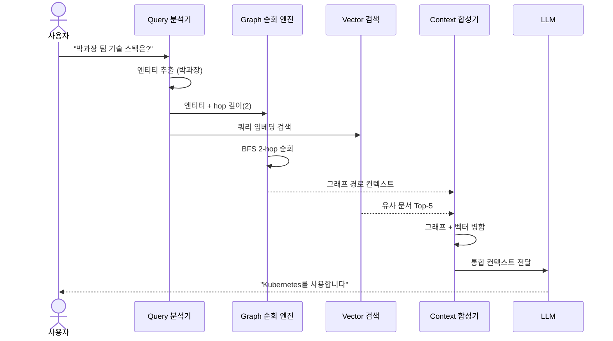
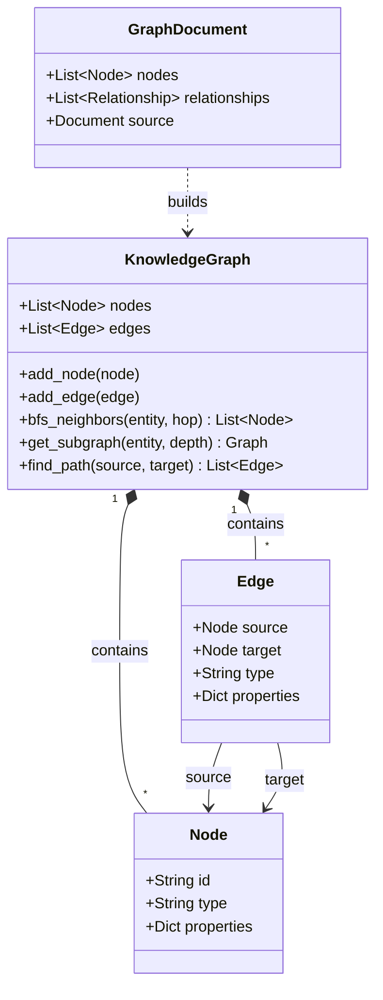
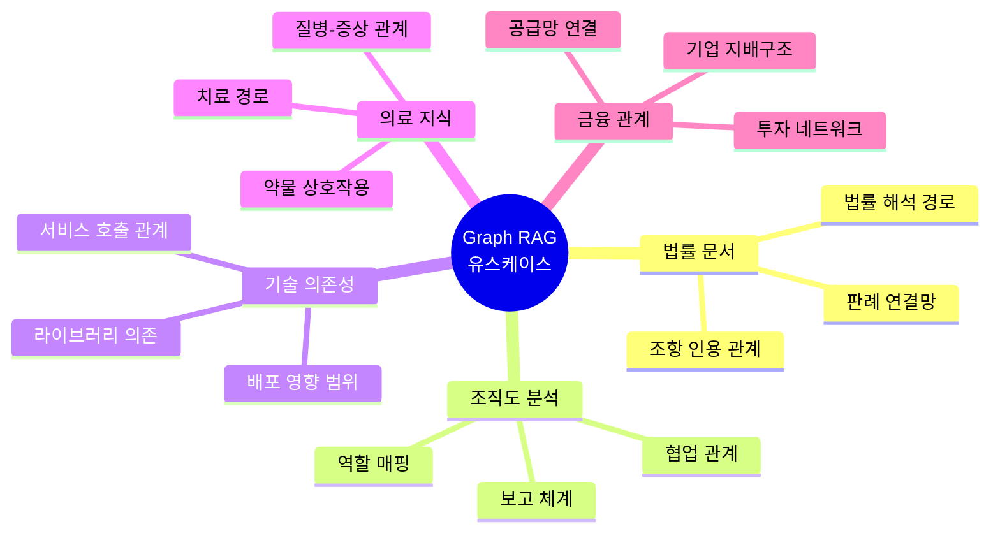
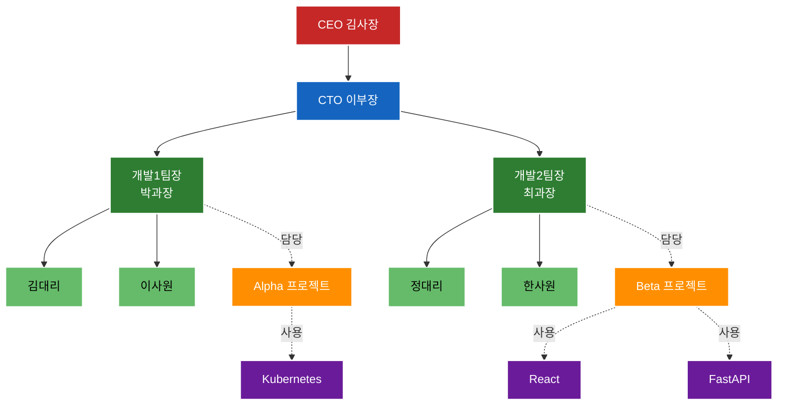
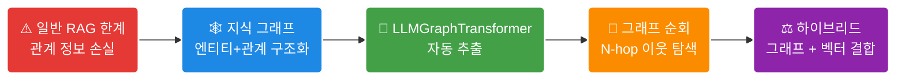

<!-- _class: lead -->

# EP03. Graph RAG

## 단순 RAG와 Graph RAG의 결정적 차이

난이도: ⭐⭐⭐

> 일반 RAG가 놓치는 **관계(Relation)**를 그래프로 포착하는 법  
> LangChain LLMGraphTransformer + NetworkX 실전 구현

---

## 1. 이번 에피소드 학습 목표

- 일반 RAG가 **다단계 관계 질문**에 실패하는 이유 이해
- **지식 그래프(Knowledge Graph)** 핵심 개념 파악
- `LangChain LLMGraphTransformer`로 엔티티-관계 자동 추출
- **NetworkX**로 지식 그래프 구축 및 시각화
- **그래프 순회 + 벡터 검색** 결합 전략 구현
- Langfuse로 Graph RAG 파이프라인 추적

---

## 2. 문제: 일반 RAG가 관계를 놓친다

### 상황 예시

> 질문: "박과장이 관리하는 팀의 프로젝트에 어떤 기술이 쓰이나요?"

**관련 정보가 3개의 다른 문서에 분산:**

```
문서 A: "김대리는 박과장 팀 소속입니다."
문서 B: "박과장은 Alpha 프로젝트를 담당합니다."
문서 C: "Alpha 프로젝트는 Kubernetes를 사용합니다."
```

**일반 RAG의 실패:**
- 각 문서를 독립적으로 검색 → **연결 고리** 없음
- "박과장 → Alpha 프로젝트 → Kubernetes" 경로를 추론 불가
- 문서 B나 C 중 하나만 검색될 가능성이 높음

---

## 3. 지식 그래프(Knowledge Graph) 개념

### 노드(Node) = 엔티티, 엣지(Edge) = 관계

```
[박과장] ──(담당)──▶ [Alpha 프로젝트]
                           │
                       (사용기술)
                           │
                           ▼
[김대리] ──(소속)──▶ [박과장 팀]    [Kubernetes]
```

**지식 그래프의 강점:**

| 항목 | 일반 벡터 검색 | 지식 그래프 |
|------|-------------|------------|
| 단일 사실 검색 | 우수 | 보통 |
| 다단계 관계 | 실패 | **우수** |
| 경로 추론 | 불가 | **가능** |
| 명시적 관계 표현 | 없음 | **구조화** |

---

## 4. Graph RAG 아키텍처

```mermaid
flowchart TD
    T[/"📄 원문 텍스트"\]:::doc --> E("🤖 엔티티/관계 추출<br/>LLMGraphTransformer"):::extract
    E --> G[("🕸️ 지식 그래프 구축<br/>NetworkX")]:::graph
    G --> GT("🏃 그래프 순회<br/>BFS (1-hop, 2-hop)"):::traverse
    
    Q((사용자<br/>쿼리)):::query --> VS("🔍 벡터 검색<br/>ChromaDB"):::vector
    Q --> GT
    
    GT --> M{"🔗 컨텍스트 병합<br/>(그래프 + 벡터문서)"}:::merge
    VS --> M
    
    M --> LLM([✨ LLM 답변 생성<br/>Claude / GPT]):::llm
    
    classDef doc fill:#EA4335,stroke:#fff,color:#fff,stroke-width:2px,rx:5px,ry:5px
    classDef extract fill:#4285F4,stroke:#fff,color:#fff,stroke-width:2px,rx:5px,ry:5px
    classDef graph fill:#FBBC05,stroke:#fff,color:#000,stroke-width:2px,rx:5px,ry:5px
    classDef traverse fill:#8e24aa,stroke:#fff,color:#fff,stroke-width:2px,rx:5px,ry:5px
    classDef query fill:#607d8b,stroke:#fff,color:#fff,stroke-width:2px,font-weight:bold
    classDef vector fill:#26a69a,stroke:#fff,color:#fff,stroke-width:2px,rx:5px,ry:5px
    classDef merge fill:#ff7043,stroke:#fff,color:#fff,stroke-width:2px,font-weight:bold
    classDef llm fill:#5c6bc0,stroke:#fff,color:#fff,stroke-width:2px,rx:5px,ry:5px
```

---

## 5. 기본 RAG vs Graph RAG 비교

| 항목 | 기본 RAG | Graph RAG |
|------|---------|-----------|
| 저장 구조 | 벡터 인덱스 | 벡터 + 그래프 |
| 검색 방식 | 유사도 검색 | 그래프 순회 + 유사도 |
| 관계 포착 | 암묵적 (임베딩) | **명시적 (엣지)** |
| 다단계 추론 | 어려움 | **자연스러움** |
| 구축 비용 | 낮음 | 중간~높음 |
| 유지보수 | 쉬움 | 복잡 |
| 적합 도메인 | 일반 Q&A | 관계 중심 도메인 |



**결론:** 단순 사실 검색 → 기본 RAG, 관계·경로 추론 → Graph RAG

---

## 6. 엔티티-관계 추출: LLMGraphTransformer

### LangChain 제공 자동화 도구

```python
from langchain_experimental.graph_transformers import (
    LLMGraphTransformer
)
from langchain_anthropic import ChatAnthropic

llm = ChatAnthropic(model="claude-3-5-sonnet-20241022")

transformer = LLMGraphTransformer(
    llm=llm,
    allowed_nodes=["사람", "팀", "프로젝트", "기술"],
    allowed_relationships=["소속", "담당", "사용기술", "관리"],
    strict_mode=False  # 유연한 추출
)

documents = [Document(page_content="김대리는 박과장 팀 소속입니다.")]
graph_docs = transformer.convert_to_graph_documents(documents)
```

**출력 예시:**
```
노드: [김대리(사람), 박과장팀(팀)]
엣지: [김대리 --소속--> 박과장팀]
```



---

## 7. LLMGraphTransformer 상세 설정

```python
# 더 정밀한 추출을 위한 프롬프트 커스터마이징
transformer = LLMGraphTransformer(
    llm=llm,
    # 추출할 노드 타입 제한 (None이면 모두 추출)
    allowed_nodes=["Person", "Team", "Project", "Technology"],
    # 추출할 관계 타입 제한
    allowed_relationships=[
        "MEMBER_OF", "MANAGES", "WORKS_ON", "USES"
    ],
    # 노드 속성도 추출 (선택적)
    node_properties=["role", "department"],
    relationship_properties=["since", "weight"],
    strict_mode=True  # 지정된 타입만 추출
)

# 배치 처리로 여러 문서 처리
graph_docs = transformer.convert_to_graph_documents(documents)

for doc in graph_docs:
    print(f"노드: {[n.id for n in doc.nodes]}")
    print(f"엣지: {[(r.source.id, r.type, r.target.id) for r in doc.relationships]}")
```

---

## 8. NetworkX로 지식 그래프 구축

```python
import networkx as nx
import matplotlib.pyplot as plt

# 방향 그래프 생성
G = nx.DiGraph()

# LLMGraphTransformer 결과를 NetworkX에 추가
for graph_doc in graph_docs:
    for node in graph_doc.nodes:
        G.add_node(node.id, type=node.type,
                   **node.properties)
    for rel in graph_doc.relationships:
        G.add_edge(
            rel.source.id,
            rel.target.id,
            relation=rel.type,
            **rel.properties
        )

# 시각화
pos = nx.spring_layout(G, k=2, seed=42)
nx.draw_networkx(G, pos, with_labels=True,
                 node_color='lightblue',
                 arrows=True, arrowsize=20)
plt.title("지식 그래프 시각화")
plt.show()
```

---

## 9. 그래프 순회 전략

### BFS 기반 N-hop 이웃 탐색

```mermaid
flowchart LR
    Q((쿼리: "박과장")):::start
    Q --> H1("1-hop 이웃<br/>(직접 연결)"):::hop1
    H1 -.-> N1[/"Alpha 프로젝트<br/>박과장 팀"\]:::node1
    
    H1 --> H2("2-hop 이웃<br/>(간접 연결)"):::hop2
    H2 -.-> N2[/"Kubernetes<br/>김대리<br/>이사원"\]:::node2
    
    H2 --> H3("3-hop... <br/>(노이즈 증가)"):::hop3
    
    classDef start fill:#e53935,stroke:#fff,color:#fff,stroke-width:2px,font-weight:bold
    classDef hop1 fill:#1e88e5,stroke:#fff,color:#fff,stroke-width:2px,rx:10px,ry:10px
    classDef hop2 fill:#43a047,stroke:#fff,color:#fff,stroke-width:2px,rx:10px,ry:10px
    classDef hop3 fill:#fb8c00,stroke:#fff,color:#fff,stroke-width:2px,rx:10px,ry:10px
    classDef node1 fill:#bbdefb,stroke:#1e88e5,color:#000
    classDef node2 fill:#c8e6c9,stroke:#43a047,color:#000
```

**hop 수 가이드라인:**

| hop 수 | 탐색 범위 | 컨텍스트 크기 | 권장 상황 |
|--------|---------|------------|---------|
| 1-hop | 직접 관계 | 작음 | 단순 관계 질의 |
| 2-hop | 간접 관계 | 중간 | 일반적 경우 |
| 3-hop+ | 전이적 관계 | 큼 (노이즈 위험) | 복잡한 추론 |

---

## 10. 그래프 순회 + 벡터 검색 결합

```python
class GraphRAGRetriever:
    def __init__(self, graph: nx.DiGraph, vectorstore):
        self.graph = graph
        self.vectorstore = vectorstore

    def retrieve(self, query: str, hop: int = 2) -> list:
        # 1. 벡터 검색으로 관련 엔티티 찾기
        vector_results = self.vectorstore.similarity_search(query, k=5)

        # 2. 결과에서 엔티티 이름 추출
        entities = self._extract_entities(vector_results)

        # 3. 각 엔티티에서 N-hop 그래프 순회
        graph_context = []
        for entity in entities:
            if entity in self.graph:
                subgraph = self._bfs_neighbors(entity, hop)
                graph_context.extend(subgraph)

        # 4. 그래프 경로 + 원본 문서 병합
        return self._merge_context(vector_results, graph_context)
```

---

## 11. 유즈케이스별 Graph RAG 적용

| 유즈케이스 | 엔티티 예시 | 관계 예시 | 효과 |
|-----------|---------|---------|------|
| **법률 문서** | 조항, 법률, 판례 | 인용, 적용, 위반 | 판례 연결망 탐색 |
| **조직도 분석** | 사람, 팀, 역할 | 소속, 보고, 협업 | 보고 체계 추론 |
| **기술 의존성** | 서비스, 라이브러리 | 의존, 호출, 배포 | 영향 범위 분석 |
| **의학 지식** | 질병, 약물, 증상 | 치료, 유발, 금기 | 약물 상호작용 |
| **공급망** | 공급사, 부품, 제품 | 납품, 포함, 대체 | 병목 지점 탐지 |



**핵심:** 도메인 내 **명시적 관계**가 중요한 모든 곳에 적합

---

## 12. Neo4j vs NetworkX 비교

| 항목 | NetworkX | Neo4j |
|------|---------|-------|
| 목적 | 분석·실습 | 프로덕션 |
| 설치 | `pip install networkx` | 별도 서버 필요 |
| 지속성 | 메모리 (파일 저장 가능) | 영구 저장 |
| 쿼리 언어 | Python API | Cypher |
| 확장성 | 수백만 노드 | 수십억 노드 |
| LangChain 통합 | `NetworkxEntityGraph` | `Neo4jGraph` |
| 권장 상황 | 학습, 프로토타입 | 프로덕션 서비스 |

**실습 선택:** NetworkX (설치 간편, LangChain 직접 통합)

**프로덕션 마이그레이션:** `Neo4jGraph`로 교체만 하면 동일 코드 동작

---

## 13. Langfuse로 Graph RAG 파이프라인 추적

```python
from langfuse.langchain import CallbackHandler
from langfuse import Langfuse

langfuse = Langfuse(
    public_key=os.getenv("LANGFUSE_PUBLIC_KEY"),
    secret_key=os.getenv("LANGFUSE_SECRET_KEY"),
)
langfuse_handler = CallbackHandler()

# 추적할 메타데이터 추가
with langfuse.trace(name="graph-rag-query") as trace:
    trace.update(metadata={
        "graph_nodes": G.number_of_nodes(),
        "graph_edges": G.number_of_edges(),
        "hop_depth": 2,
        "query": query
    })
    result = chain.invoke(
        {"question": query},
        config={"callbacks": [langfuse_handler]}
    )
```

**대시보드에서 확인:** 그래프 순회 경로, 검색된 엔티티 수, 응답 품질

---

## 14. 성능 비교: 다단계 관계 질문

### 실험 조건: 조직도 + 프로젝트 관계 텍스트 20개

| 질문 유형 | 기본 RAG | Graph RAG |
|---------|---------|-----------|
| 단일 사실 ("박과장 역할은?") | 0.91 | 0.89 |
| 1-hop 관계 ("박과장 팀원은?") | 0.74 | **0.92** |
| 2-hop 관계 ("박과장 팀 프로젝트는?") | 0.43 | **0.87** |
| 3-hop 관계 ("박과장 팀 기술 스택은?") | 0.21 | **0.79** |

*(정확도: 정답 포함 비율)*



**관찰:** hop 수가 늘어날수록 Graph RAG의 우위가 **급격히** 증가

---

## 15. 구현 시 주의사항

### 엔티티 추출 품질 관리

```python
# 1. 엔티티 정규화 (동일 엔티티 다른 표기 처리)
def normalize_entity(name: str) -> str:
    aliases = {
        "박 과장": "박과장",
        "박과장님": "박과장",
        "Mr. Park": "박과장"
    }
    return aliases.get(name.strip(), name.strip())

# 2. 낮은 신뢰도 엣지 필터링
def filter_relationships(graph_docs, min_confidence=0.7):
    return [r for r in graph_docs
            if r.properties.get("confidence", 1.0) >= min_confidence]

# 3. 그래프 업데이트 (새 문서 추가 시)
def incremental_update(G, new_graph_docs):
    # 기존 엣지와 충돌 없이 점진적 업데이트
    for rel in new_graph_docs:
        if not G.has_edge(rel.source.id, rel.target.id):
            G.add_edge(rel.source.id, rel.target.id,
                       relation=rel.type)
```

---

## 16. 핵심 요약



**Three Takeaways:**

1. Graph RAG는 다단계 관계 질문에서 일반 RAG를 압도한다
2. LLMGraphTransformer로 엔티티 추출을 자동화할 수 있다
3. NetworkX로 프로토타입 → Neo4j로 프로덕션 마이그레이션 전략 유효

---

## Exercise 1: 조직도 텍스트에서 그래프 구축

### 목표

한국 IT 회사 조직도 텍스트를 입력으로 지식 그래프 자동 구축

### 과제

```python
org_text = """
CTO 이부장은 개발1팀과 개발2팀을 총괄한다.
개발1팀장 박과장은 김대리, 이사원을 관리한다.
개발2팀장 최과장은 정대리, 한사원을 관리한다.
Alpha 프로젝트는 개발1팀이 담당하며 Kubernetes를 사용한다.
Beta 프로젝트는 개발2팀이 담당하며 React, FastAPI를 사용한다.
"""

# 1. LLMGraphTransformer로 엔티티-관계 추출
# 2. NetworkX 그래프 구축
# 3. matplotlib으로 시각화
# 4. 노드 수, 엣지 수, 중심성 높은 노드 출력
```

---

## Exercise 2: 그래프 순회로 다단계 관계 질의

### 목표

구축한 그래프에서 N-hop 순회로 다단계 관계 질문에 답하기

### 과제

```python
# Exercise 1에서 구축한 그래프를 사용하여:

# 질문 1: "이부장이 관리하는 모든 팀원은?" (2-hop)
# 질문 2: "Alpha 프로젝트에 간접적으로 관련된 모든 사람은?" (2-hop)
# 질문 3: "Beta 프로젝트 기술 스택을 담당하는 팀장은?" (역방향 순회)

# 구현 목표:
# - BFS 기반 N-hop 이웃 탐색 함수
# - 일반 RAG(벡터 검색만) vs Graph RAG 정확도 비교
# - 각 방법으로 위 3개 질문 답변 생성 및 평가

# 보너스: Langfuse에 각 질의 결과 로깅
```

**제출물:** 두 방법의 답변 비교표 + 정확도 수치

---

<!-- _class: lead -->

# 다음 에피소드 예고

## EP04. Self-RAG

**검색할지 말지를 LLM 스스로 판단하게 하는 법**

> Adaptive RAG + Self-Reflection으로  
> 불필요한 검색을 제거하고 정확도를 높이는 전략

난이도: ⭐⭐⭐

**다음 주 공개**
