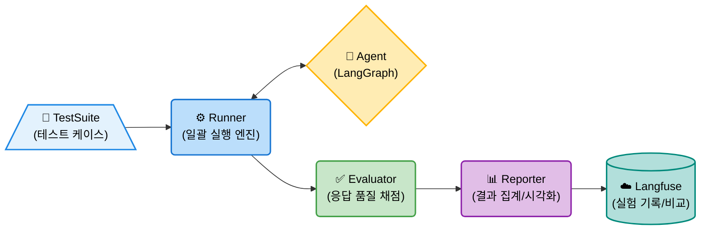
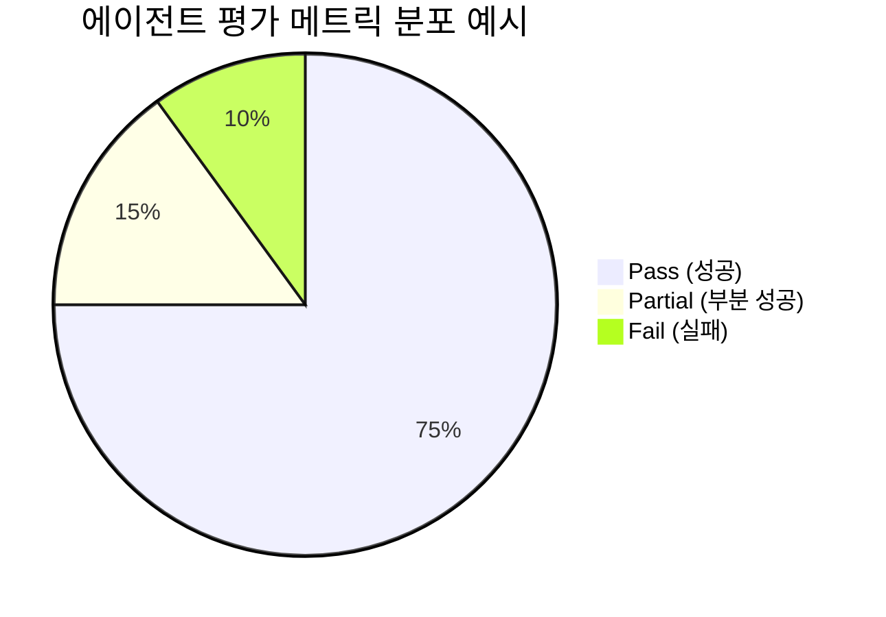
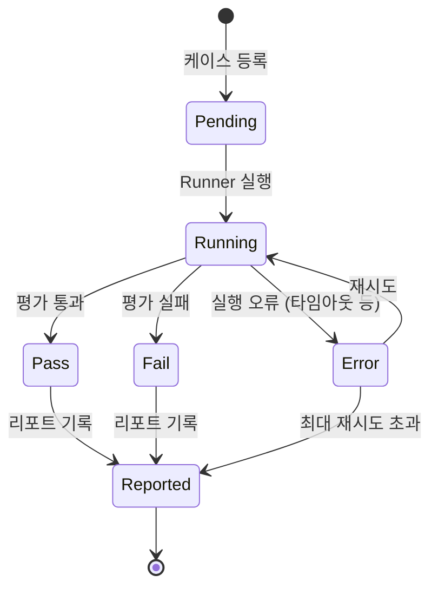
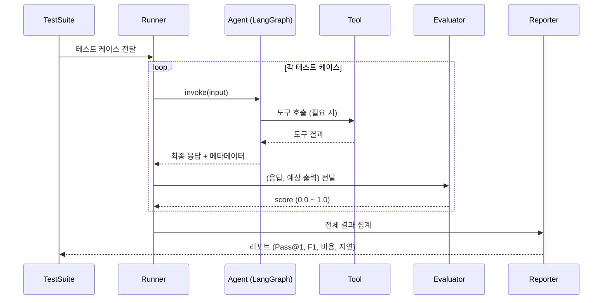
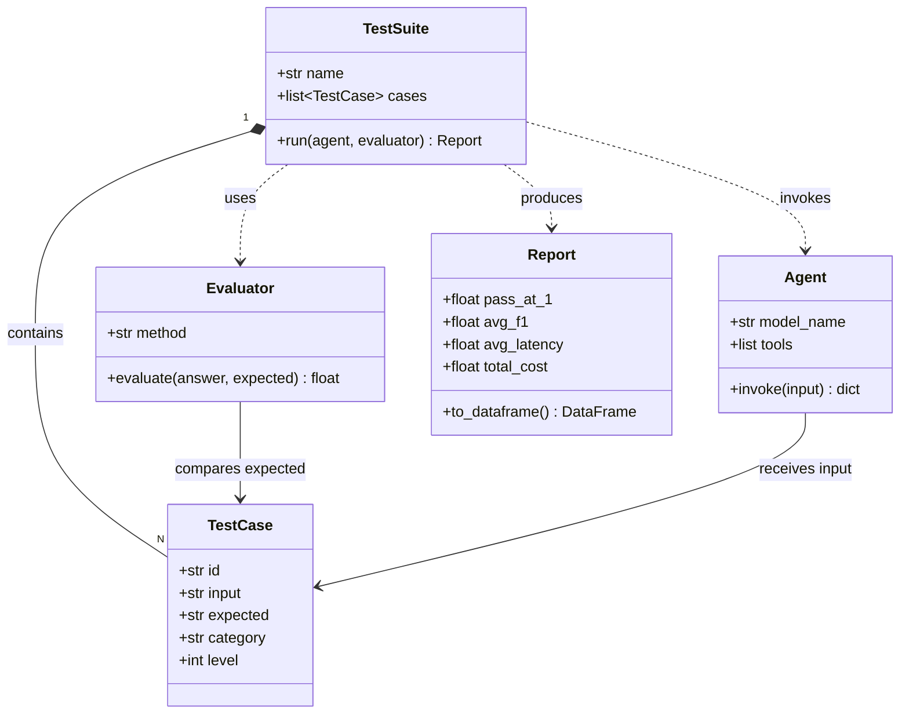
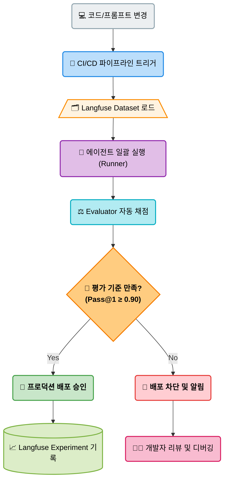
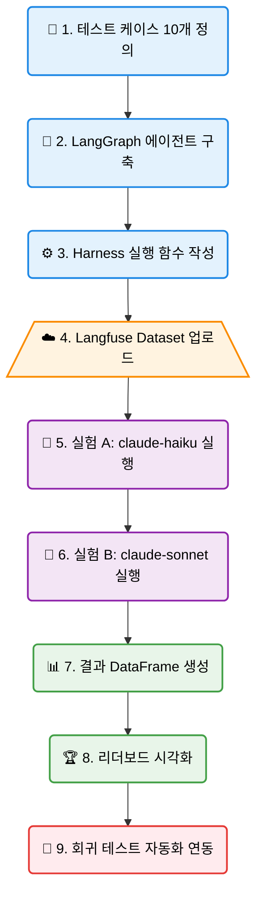

# EP04. Agent Harness를 활용한 성능 평가

## 내 에이전트는 얼마나 똑똑할까?

> 반복 가능한 테스트 프레임워크로 에이전트 성능을 **수치로 측정**하고, **Langfuse**로 실험을 비교한다

난이도: ⭐⭐

---

## 1. 문제 제기: 에이전트 성능을 어떻게 측정하는가?

에이전트를 개발하고 나서 가장 먼저 드는 의문

```
"이 에이전트가 잘 동작하고 있는가?"
"프롬프트를 바꾸면 더 나아졌는가?"
"비용 대비 성능이 충분한가?"
```

**현실의 함정**

| 방법 | 문제점 |
|------|--------|
| 눈으로 확인 | 주관적, 재현 불가, 규모 한계 |
| 단발성 테스트 | 일관성 없음, 회귀 탐지 불가 |
| 직감으로 판단 | 개선 방향 불명확 |

**해결책**: Agent Harness — 에이전트를 **자동으로, 반복적으로** 평가하는 프레임워크

---

## 2. Agent Harness 개념 정의

> **Agent Harness**: 에이전트를 표준화된 입력 세트로 반복 실행하고, 출력을 자동으로 평가하여 성능 지표를 산출하는 테스트 프레임워크

**핵심 구성 요소**

- **TestSuite**: 입력 + 예상 출력으로 구성된 테스트 케이스 모음
- **Runner**: 에이전트를 일괄 실행하고 응답을 수집하는 엔진
- **Evaluator**: 응답 품질을 자동으로 채점하는 평가기
- **Reporter**: 결과를 집계하고 시각화하는 리포터

**왜 Harness인가?**
자동차 충돌 테스트의 "테스트 하네스"처럼, 에이전트를 통제된 환경에서 반복 실험하여 안전성과 성능을 검증한다

---

## 3. Agent Harness 아키텍처



**데이터 흐름**
1. TestSuite에서 테스트 케이스를 하나씩 꺼낸다
2. Runner가 에이전트를 호출하고 응답과 메타데이터(시간, 비용)를 수집한다
3. Evaluator가 응답을 채점한다
4. Reporter가 모든 결과를 집계하여 리포트를 생성한다

---

## 4. 단일 턴 vs 멀티 턴 평가 설계

| 항목 | 단일 턴 (Single-turn) | 멀티 턴 (Multi-turn) |
|------|----------------------|---------------------|
| **정의** | 질문 1개 → 응답 1개 | 대화 흐름 전체 평가 |
| **난이도** | 낮음 | 높음 |
| **평가 기준** | Exact Match, F1 | 태스크 완료율, 일관성 |
| **테스트 케이스 수** | 50~200개 | 10~50개 시나리오 |
| **실행 비용** | 낮음 | 높음 |
| **적합한 용도** | 팩트 QA, 계산, 분류 | 고객상담, 복합 에이전트 |
| **LangGraph 연동** | 단순 invoke | 상태 누적 invoke |
| **Langfuse 트레이싱** | 트레이스 1개 | 세션으로 묶음 |

**권장**: 초기 개발 단계에는 단일 턴으로 빠르게 반복하고, 프로덕션 전에 멀티 턴 시나리오 추가

---

## 5. 4대 핵심 메트릭



**에이전트 성능을 숫자로 표현하는 4가지 지표**

| 메트릭 | 정의 | 계산 방법 | 목표 |
|--------|------|-----------|------|
| **Pass@k** | k번 시도 중 1번 이상 성공률 | (성공 케이스 수) / (전체 케이스) | ≥ 0.90 |
| **Exact Match / F1** | 예상 답과 일치 정도 | 토큰 단위 F1 점수 | ≥ 0.85 |
| **비용 ($/task)** | 태스크당 평균 API 비용 | Σ(input+output tokens × price) | ≤ $0.01 |
| **지연시간 (초/task)** | 태스크당 평균 응답 시간 | Σ(end_time - start_time) / N | ≤ 5초 |

```python
# Pass@k 계산 예시
def pass_at_k(results: list[bool], k: int = 1) -> float:
    successes = sum(results)
    return successes / len(results)  # k=1 기준
```

---

## 6. 테스트 케이스 설계



**좋은 테스트 케이스의 3요소: 입력 · 예상 출력 · 평가 기준**

| 케이스 ID | 입력 (질문) | 예상 출력 | 평가 기준 | 난이도 |
|-----------|------------|-----------|-----------|--------|
| TC-001 | "2024년 2월 29일이 존재하나요?" | "예, 2024년은 윤년입니다" | 키워드: 윤년, exact | Level 1 |
| TC-002 | "123 × 456 = ?" | "56088" | Exact Match | Level 1 |
| TC-003 | "오늘부터 100일 후는?" | 날짜 계산 결과 | 날짜 형식 + 정확도 | Level 2 |
| TC-004 | "소수 10번째는?" | "29" | Exact Match | Level 2 |
| TC-005 | "피보나치 수열 10번째는?" | "55" | Exact Match | Level 2 |

**설계 원칙**
- 정답이 명확히 존재하는 케이스 우선
- 레벨(난이도) 분류로 약점 구간 파악
- 도구 사용 여부를 테스트 케이스에 명시

---

## 7. 평가 함수 설계: Exact Match vs F1

**케이스 유형에 맞는 평가 함수를 선택해야 한다**

| 평가 방법 | 적합한 케이스 | 예시 | Python 구현 |
|-----------|--------------|------|-------------|
| **Exact Match** | 단일 숫자, 날짜, 고유명사 | "56088", "서울" | `answer == expected` |
| **Substring Match** | 긴 응답 속 핵심 키워드 | "윤년", "토요일" | `expected in answer` |
| **Token F1** | 문장형 응답, 순서 무관 | 설명문 답변 | ROUGE-1 / 토큰 겹침 |
| **Numeric Approx** | 소수점 있는 계산 결과 | "8.0467" | `abs(a-e)/e < 0.02` |
| **LLM-as-Judge** | 주관식, 복합 설명 | 장문 답변 | LLM 채점 프롬프트 |

```python
def evaluate(answer: str, expected: str, method: str = "substring") -> float:
    if method == "exact":
        return 1.0 if answer.strip() == expected.strip() else 0.0
    if method == "substring":
        return 1.0 if expected.lower() in answer.lower() else 0.0
    return 0.0  # 기본값
```

---

## 9. LangGraph 에이전트 + Harness 연동



```python
from langgraph.prebuilt import create_react_agent
from langchain_anthropic import ChatAnthropic

# 에이전트 생성
model = ChatAnthropic(model="claude-haiku-4-5")
agent = create_react_agent(model, tools=[calculator])

# Harness 실행 함수
def run_single_test(agent, test_case: dict) -> dict:
    import time
    start = time.time()
    result = agent.invoke(
        {"messages": [("user", test_case["input"])]},
        config={"recursion_limit": 15}
    )
    elapsed = time.time() - start
    answer = result["messages"][-1].content
    return {
        "id": test_case["id"],
        "answer": answer,
        "expected": test_case["expected"],
        "passed": evaluate(answer, test_case["expected"]),
        "latency": elapsed,
    }
```

---

## 10. Langfuse Dataset으로 테스트 세트 관리

Langfuse의 **Dataset** 기능으로 테스트 케이스를 중앙 관리

```python
from langfuse import Langfuse

langfuse = Langfuse()

# 데이터셋 생성
dataset = langfuse.create_dataset(name="agent-harness-v1")

# 테스트 케이스 업로드
for tc in test_cases:
    langfuse.create_dataset_item(
        dataset_name="agent-harness-v1",
        input={"question": tc["input"]},
        expected_output={"answer": tc["expected"]},
        metadata={"level": tc["level"], "category": tc["category"]}
    )
```

**장점**
- 팀 전체가 동일한 테스트 세트 공유
- 버전 관리 (dataset_name에 버전 포함)
- 실험 결과와 테스트 케이스를 한 곳에서 관리

---

## 11. Langfuse Experiment로 실험 비교

**같은 테스트 세트로 여러 에이전트 버전을 비교**

```python
# 실험 A: claude-haiku
def run_experiment(agent, dataset_name: str, experiment_name: str):
    dataset = langfuse.get_dataset(dataset_name)
    for item in dataset.items:
        with item.observe(run_name=experiment_name) as span:
            result = agent.invoke(
                {"messages": [("user", item.input["question"])]}
            )
            answer = result["messages"][-1].content
            span.score(
                name="correctness",
                value=1.0 if answer == item.expected_output["answer"] else 0.0
            )
```

Langfuse 대시보드에서 **실험 A vs 실험 B** 나란히 비교 가능

---

## 12. 자동화된 회귀 테스트 파이프라인



새 코드 배포 전 에이전트 성능이 저하되지 않았는지 자동 검증



**회귀 테스트 기준선(Baseline)**
- 최초 배포 시 성능을 기준선으로 저장
- 이후 모든 변경은 기준선 대비 ±5% 이내여야 배포 허용

---

## 13. 비용 추정: 테스트 1회당 API 비용 계산

에이전트 평가의 숨은 비용 — 미리 계산하지 않으면 예산 초과

**Claude 모델별 토큰 요금 (2025년 기준)**

| 모델 | Input ($/1M) | Output ($/1M) | 100 케이스 예상 비용 |
|------|-------------|--------------|-------------------|
| claude-haiku-4-5 | $0.80 | $4.00 | ~$0.10 |
| claude-3-5-sonnet | $3.00 | $15.00 | ~$0.80 |
| claude-3-7-sonnet | $3.00 | $15.00 | ~$0.90 |

```python
def estimate_cost(input_tokens: int, output_tokens: int,
                  model: str = "claude-haiku-4-5") -> float:
    """API 비용 추정 (USD)"""
    pricing = {
        "claude-haiku-4-5":         (0.80, 4.00),
        "claude-3-5-sonnet-20241022": (3.00, 15.00),
    }
    input_price, output_price = pricing.get(model, (3.00, 15.00))
    return (input_tokens * input_price + output_tokens * output_price) / 1_000_000
```

**팁**: 개발 단계에는 Haiku로 빠르게 반복, 최종 검증만 Sonnet으로

---

## 16. Harness 확장: 병렬 실행으로 속도 향상

10개 테스트 케이스를 순차 실행하면 50초, 병렬 실행하면 10초

```python
from concurrent.futures import ThreadPoolExecutor, as_completed

def run_test_suite_parallel(agent, test_cases: list,
                             max_workers: int = 5) -> list:
    """병렬 실행으로 Harness 속도를 높입니다."""
    results = [None] * len(test_cases)

    def run_one(idx, tc):
        return idx, run_single_test(agent, tc)

    with ThreadPoolExecutor(max_workers=max_workers) as executor:
        futures = {executor.submit(run_one, i, tc): i
                   for i, tc in enumerate(test_cases)}
        for future in as_completed(futures):
            idx, result = future.result()
            results[idx] = result
            print(f"  완료: {result['id']} → {result['status']}")

    return results
```

**주의**: 병렬 실행 시 API rate limit 초과에 주의. `max_workers=3~5` 권장

---

## 14. 레벨별 성능 분석으로 약점 파악

**Pass@1 전체 점수 뒤에 숨어 있는 약점을 찾는 법**

```python
import pandas as pd

# 레벨별 분석
level_analysis = df_results.groupby("level").agg(
    pass_rate=("score", "mean"),
    avg_latency=("latency", "mean"),
    count=("id", "count")
).round(3)
print(level_analysis)

# 카테고리별 분석
cat_analysis = df_results.groupby("category")["score"].mean().sort_values()
print(cat_analysis)

# 실패 케이스만 추출
failures = df_results[df_results["status"] == "FAIL"][
    ["id", "level", "category", "input", "expected", "answer"]
]
```

**분석 인사이트 예시**

| 관찰 | 가능한 원인 | 대응 |
|------|------------|------|
| Level 3만 낮음 | 다단계 추론 부족 | 더 강한 모델 또는 Chain-of-Thought |
| calendar 카테고리만 낮음 | 날짜 계산 도구 없음 | datetime 도구 추가 |
| 랜덤하게 실패 | 프롬프트 명확도 부족 | 프롬프트 개선 |

---

## 15. 결과 시각화: 리더보드 비교

**동일 테스트 세트 기준 모델 성능 리더보드**

| 순위 | 모델 | Pass@1 | F1 | 비용($/task) | 지연(초) | 총점 |
|------|------|--------|----|-----------|---------|----|
| 🥇 1 | claude-3-5-sonnet | **0.95** | **0.93** | $0.008 | 3.2초 | **94** |
| 🥈 2 | claude-haiku-4-5 | 0.88 | 0.85 | **$0.001** | **1.8초** | 86 |
| 🥉 3 | gpt-4o-mini | 0.82 | 0.80 | $0.002 | 2.4초 | 81 |

**해석 방법**
- **정확도 우선**: Sonnet 선택 (비용 8배 비싸도 Pass@1 +7%)
- **비용 우선**: Haiku 선택 (Pass@1 -7%지만 비용 1/8)
- **균형**: 용도별로 모델을 다르게 적용 (라우팅 전략)

---

## 17. 실습 흐름 요약



**오늘의 핵심 인사이트**

> 에이전트 개발에서 측정할 수 없으면 개선할 수 없다.
> Agent Harness는 **반복 가능한 측정 기반**을 만드는 도구다.

---

## 15. Harness 운영 패턴: 언제 어떻게 실행할까?

**3가지 Harness 실행 시나리오**

```
1. 개발 중 빠른 검증 (Quick Check)
   - 10개 케이스, Haiku 모델
   - 목적: 새 기능이 기존 기능을 깨지 않았는지
   - 소요 시간: ~2분 / 비용: ~$0.01

2. PR 머지 전 표준 검사 (Standard Check)
   - 전체 테스트 케이스, 기준 모델
   - 목적: Pass@1 기준선 유지 확인
   - 소요 시간: ~15분 / 비용: ~$0.10

3. 릴리즈 전 종합 평가 (Full Benchmark)
   - 전체 테스트 케이스, 다중 모델 비교
   - 목적: 최적 모델 선택 + 성능 리포트 생성
   - 소요 시간: ~1시간 / 비용: ~$1.00
```

**자동화 팁**: GitHub Actions에 Harness 통합 → PR마다 Pass@1 배지 자동 업데이트

---

## 16. Langfuse 대시보드 활용 가이드

Langfuse에서 Harness 결과를 어떻게 읽을 것인가?

**Dataset 뷰**
- 업로드한 테스트 케이스 목록 확인
- 각 케이스별 최신 실행 결과 비교

**Experiment 뷰**
- 실험 A vs B 나란히 비교
- 점수 분포, 실패 케이스 하이라이트

**Trace 뷰**
- 개별 케이스 실행 상세 확인
- LLM 호출 횟수, 도구 사용 내역, 토큰 수

```
Langfuse 대시보드 탐색 순서:
1. Datasets → ep04-agent-harness-v1 → 문제 목록 확인
2. Experiments → experiment-haiku / experiment-sonnet → 점수 비교
3. 점수가 낮은 케이스 클릭 → Trace 상세 보기
4. 에이전트가 어디서 틀렸는지 분석
```

---

## Exercise 1: 5개 테스트 케이스로 Harness 구축

**목표**: 직접 테스트 케이스를 설계하고 Agent Harness를 처음부터 구축한다

**단계**:
1. 아래 5개 카테고리에서 각 1개씩 테스트 케이스 작성
   - 수학 계산 (예: "367 × 29 = ?")
   - 날짜/달력 (예: "2025년 3월 첫 번째 월요일은?")
   - 단위 변환 (예: "5 마일은 몇 킬로미터?")
   - 논리 추론 (예: "A가 B보다 크고 B가 C보다 크면 A와 C의 관계는?")
   - 한국어 팩트 (예: "대한민국 수도는?")
2. `run_test_suite(agent, test_cases)` 함수 구현
3. Pass@1, 평균 응답 시간 측정
4. Langfuse Dataset에 업로드

**확인 기준**: 5개 케이스 모두 실행되고, Pass@1이 DataFrame으로 출력됨

---

## Exercise 2: 모델 A vs B 성능 비교 실험

**목표**: 동일한 10개 테스트 케이스로 두 모델을 비교하여 데이터 기반 모델 선택 근거를 만든다

**단계**:
1. Exercise 1의 테스트 케이스에 5개 더 추가 (총 10개)
2. Langfuse Dataset `ep04-model-comparison` 생성 및 업로드
3. 실험 A: `claude-haiku-4-5`로 전체 실행 → Langfuse에 `experiment="haiku"` 기록
4. 실험 B: `claude-3-5-sonnet-20241022`로 전체 실행 → Langfuse에 `experiment="sonnet"` 기록
5. 결과를 DataFrame으로 정리하고 다음 지표를 비교:
   - Pass@1, 평균 F1, 평균 응답 시간, 추정 비용
6. Langfuse 대시보드에서 두 실험을 나란히 비교하는 스크린샷 첨부

**제출**: 비교 DataFrame + "이 용도에는 어떤 모델이 적합한가?" 한 줄 결론

---

## 정리 & 다음 에피소드

**오늘 배운 것**

- Agent Harness = 에이전트를 자동으로 반복 테스트하는 프레임워크
- 4대 핵심 메트릭: Pass@k, F1, 비용, 지연시간
- Langfuse Dataset으로 테스트 세트를 중앙 관리
- Langfuse Experiment로 모델 A vs B 비교

**다음 에피소드**: EP05. GAIA · SWE-bench를 내 프로젝트에
— 업계 표준 벤치마크를 내 프로젝트에 적용하는 법

> 코드와 노트북은 GitHub 레포에서 확인하세요
