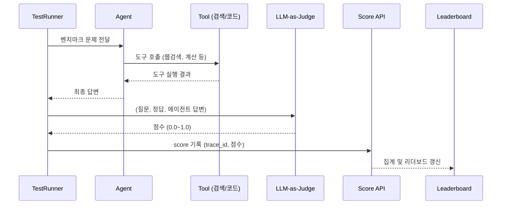
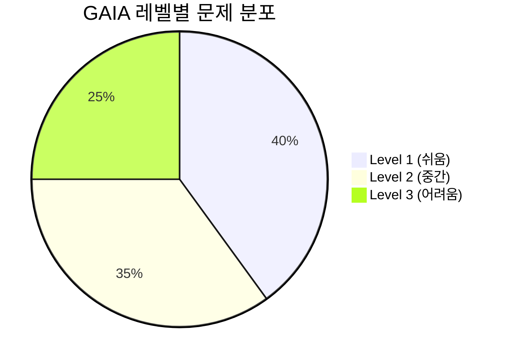
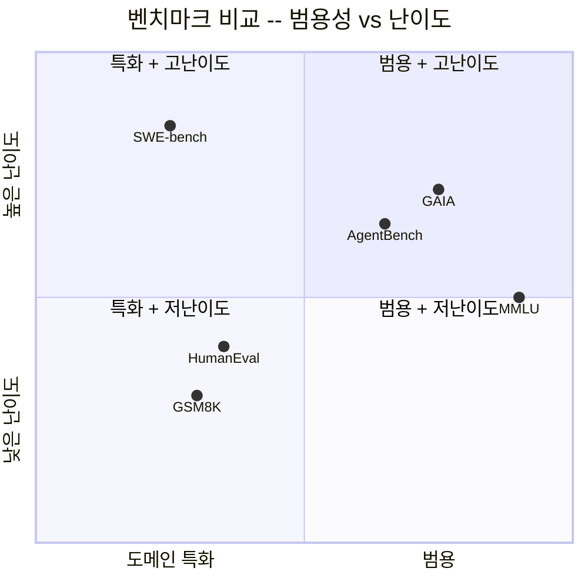
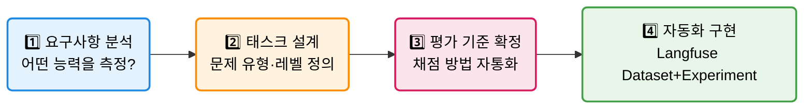
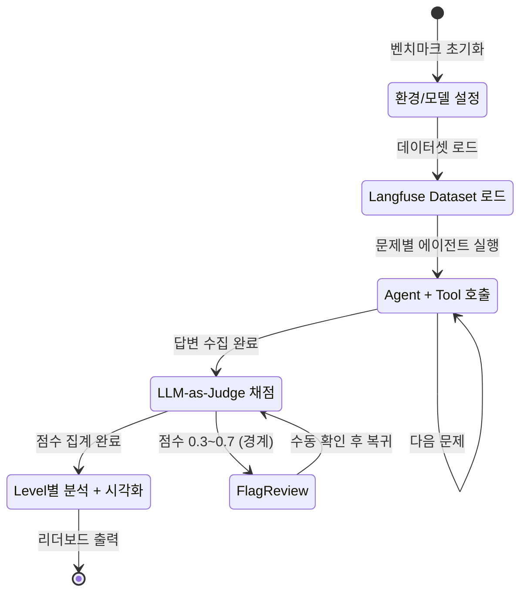
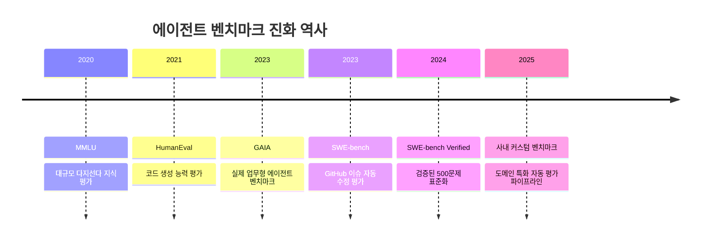
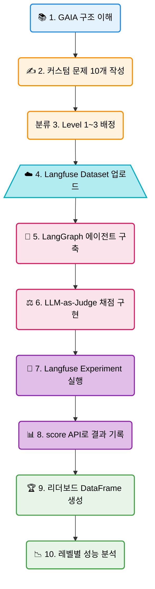

# EP05. GAIA · SWE-bench를 내 프로젝트에

## 에이전트 성능 측정의 표준을 내 프로젝트에

> 논문 속 벤치마크를 내 도메인에 맞게 재설계하고, **Langfuse**로 자동 평가 파이프라인을 구축한다

난이도: ⭐⭐⭐

---

## 1. 벤치마크가 왜 필요한가?

**자체 평가의 주관성 문제**

```
개발자 A: "이 에이전트 꽤 잘 되는데?"
개발자 B: "어? 나는 이 질문에서 틀리던데"
PM:      "그래서 정확도가 몇 퍼센트예요?"
```

**자체 평가의 한계**

| 문제 | 설명 |
|------|------|
| **확증 편향** | 잘 되는 케이스만 테스트 |
| **재현 불가** | 어제 된 것이 오늘 안 됨 |
| **상대 비교 불가** | 다른 모델과 객관적 비교 어려움 |
| **커버리지 부족** | 엣지 케이스 누락 |



**해결책**: 업계 표준 벤치마크의 **설계 원칙**을 내 프로젝트에 적용

---

## 2. GAIA 벤치마크 소개

**GAIA**: General AI Assistants — 실제 사람이 도움을 요청하는 상황을 모사한 에이전트 벤치마크

| 항목 | 내용 |
|------|------|
| **출처** | Meta AI Research, 2023 |
| **문제 수** | 466개 (검증셋 165, 테스트셋 301) |
| **평가 방법** | 정확한 최종 답변 (Exact Match) |
| **특징** | 웹 검색 + 파일 분석 + 다단계 추론 복합 |
| **인간 정답률** | 약 92% |
| **GPT-4 정답률** | 약 15% (플러그인 포함 30%) |

**레벨 구분**

| 레벨 | 난이도 | 특징 | 예시 |
|------|--------|------|------|
| Level 1 | 쉬움 | 단일 도구, 직접 답변 | 위키 검색 1회 |
| Level 2 | 중간 | 다단계, 파일 분석 | PDF 읽기 + 계산 |
| Level 3 | 어려움 | 복합 추론, 다중 도구 | 여러 소스 종합 |



---

## 3. GAIA 문제 유형

**실제 GAIA 문제는 이렇게 생겼다**

**Level 1 예시**
> "2024년 파리 올림픽에서 대한민국이 획득한 금메달 수는?"
- 필요: 웹 검색 1회
- 정답: 숫자 하나

**Level 2 예시**
> "첨부된 PDF의 2페이지에서 언급된 회사의 2023년 매출을 검색하여 전년 대비 성장률을 계산하세요"
- 필요: PDF 파싱 + 웹 검색 + 수학 계산
- 정답: 퍼센트 값

**Level 3 예시**
> "A, B, C 세 회사의 연간 보고서를 분석하고 ESG 점수가 가장 개선된 회사와 그 이유를 설명하세요"
- 필요: 다중 문서 + 비교 분석 + 근거 설명

---

## 4. SWE-bench 소개

**SWE-bench**: Software Engineering Bench — GitHub 실제 이슈를 에이전트가 코드로 수정하여 테스트를 통과해야 하는 벤치마크

```
Input:  GitHub 이슈 설명 + 코드베이스
Output: 문제를 수정하는 패치(diff)
Judge:  수정된 코드가 기존 테스트를 통과하는지 자동 검증
```

**SWE-bench Verified (2024년 기준)**

| 항목 | 내용 |
|------|------|
| **문제 수** | 500개 (실제 GitHub PR에서 추출) |
| **저장소** | 12개 Python 오픈소스 프로젝트 |
| **평가 기준** | 단위 테스트 통과율 (%) |
| **Claude 3.5 Sonnet** | 약 49% |
| **인간 전문가** | 약 60~70% |

---

## 5. GAIA vs SWE-bench 비교

| 항목 | GAIA | SWE-bench |
|------|------|-----------|
| **도메인** | 일반 지식, 정보 검색 | 소프트웨어 엔지니어링 |
| **입력** | 자연어 질문 (+첨부 파일) | 코드베이스 + 이슈 텍스트 |
| **출력** | 짧은 정답 문자열 | 코드 패치 (diff) |
| **평가 방법** | Exact Match | 테스트 통과/실패 |
| **필요 도구** | 웹 검색, 파일 분석, 계산기 | 코드 편집기, 쉘 실행 |
| **실행 환경** | 가벼움 (API 호출) | 무거움 (Docker + 테스트) |
| **내 프로젝트 적용** | 범용 에이전트 평가 | 코딩 에이전트 특화 |
| **커스터마이즈 난이도** | 쉬움 | 어려움 |



---

## 6. 현재 SOTA 모델 성능 비교

**GAIA 리더보드 (2025년 기준, 검증셋)**

| 순위 | 시스템 | 전체 | Level 1 | Level 2 | Level 3 |
|------|--------|------|---------|---------|---------|
| 1 | OpenAI o3 + 도구 | 67.4% | 82.1% | 65.3% | 51.2% |
| 2 | Gemini 2.0 Pro | 58.9% | 74.3% | 56.1% | 42.0% |
| 3 | Claude 3.5 Sonnet | 53.6% | 70.8% | 51.2% | 36.4% |
| 4 | GPT-4o | 44.2% | 61.5% | 42.3% | 27.1% |
| - | 인간 (baseline) | 92.0% | 97.0% | 90.0% | 87.0% |

**핵심 인사이트**
- 최고 AI도 인간의 73% 수준 (Level 3은 인간의 절반)
- 도구 사용 유무가 성능에 결정적 영향
- **커스텀 도메인에서는 이 격차가 더 벌어짐**

---

## 7. 사내 커스텀 벤치마크 설계 가이드

**GAIA 방법론을 내 도메인에 적용하는 4단계**



**각 단계 체크리스트**

- **요구사항**: 에이전트가 실제로 해야 할 업무 5~10개 나열
- **태스크 설계**: 각 업무를 Level 1~3으로 분류, 정답이 명확한 것부터
- **평가 기준**: Exact Match가 불가능하면 LLM-as-Judge 채점 프롬프트 설계
- **자동화**: CI/CD 파이프라인에 벤치마크 실행 포함

---

## 8. Langfuse Dataset으로 벤치마크 데이터셋 관리

**GAIA 스타일 데이터셋을 Langfuse에 올리는 방법**

```python
from langfuse import Langfuse

langfuse = Langfuse()

# 벤치마크 데이터셋 생성
dataset = langfuse.create_dataset(
    name="custom-gaia-v1",
    description="사내 GAIA 스타일 벤치마크 v1.0"
)

# 문제 업로드
for item in gaia_items:
    langfuse.create_dataset_item(
        dataset_name="custom-gaia-v1",
        input={"question": item["question"], "level": item["level"]},
        expected_output={"answer": item["answer"]},
        metadata={"category": item["category"], "required_tools": item["tools"]}
    )
```

**버전 관리 전략**: `custom-gaia-v1`, `custom-gaia-v2` 식으로 버전을 데이터셋 이름에 포함

---

## 9. Langfuse Experiment + LLM-as-Judge 자동 평가

**Exact Match가 어려울 때: LLM이 채점**

```python
def llm_judge(question: str, answer: str, expected: str) -> float:
    """LLM-as-Judge: 0.0~1.0 점수 반환"""
    prompt = f"""
    질문: {question}
    정답(기준): {expected}
    에이전트 응답: {answer}

    위 응답이 정답과 의미적으로 동일한지 0.0~1.0으로 평가하세요.
    정확히 동일: 1.0 / 부분 정확: 0.5 / 완전 오답: 0.0
    점수만 숫자로 출력하세요.
    """
    response = judge_model.invoke(prompt)
    return float(response.content.strip())
```

**Langfuse score API로 결과 기록**

```python
langfuse.score(
    trace_id=trace_id,
    name="llm_judge_score",
    value=llm_judge(question, answer, expected),
    data_type="NUMERIC"
)
```

---

## 10. 결과 리더보드 대시보드 만들기

**Langfuse + Pandas로 리더보드 생성**

```python
import pandas as pd

results = []
for experiment in ["haiku", "sonnet", "gpt4o-mini"]:
    runs = langfuse.get_dataset_run(
        dataset_name="custom-gaia-v1",
        run_name=experiment
    )
    scores = [r.scores for r in runs.dataset_run_items]
    results.append({
        "model": experiment,
        "overall": mean([s["llm_judge_score"] for s in scores]),
        "level_1": mean_by_level(scores, 1),
        "level_2": mean_by_level(scores, 2),
        "level_3": mean_by_level(scores, 3),
        "avg_latency": mean([r.latency for r in runs.dataset_run_items]),
    })

leaderboard = pd.DataFrame(results).sort_values("overall", ascending=False)
```

---

## 11. 벤치마크 함정 주의

**3가지 위험 — 결과를 믿기 전에 반드시 확인**

**함정 1: 데이터 오염 (Contamination)**
```
벤치마크 문제가 학습 데이터에 포함 → 점수 과장
대책: 비공개 테스트셋 유지, 정기적 문제 교체
```

**함정 2: 오버피팅 (Overfitting)**
```
특정 벤치마크에만 최적화된 프롬프트 → 실전에서 성능 저하
대책: 여러 벤치마크 동시 평가, 실제 업무 샘플 포함
```

**함정 3: 데이터 누수 (Data Leakage)**
```
평가 셋이 학습/파인튜닝에 사용 → 의미 없는 높은 점수
대책: 엄격한 train/val/test 분리, 평가 셋 격리 관리
```



**핵심 원칙**: 벤치마크 점수보다 **실제 업무 성능**이 항상 우선

---

## 12. GAIA 문제 작성 실습: 한국어 데이터셋 샘플

**GAIA 방법론을 따라 한국어 문제를 직접 만드는 방법**

**Level 1 예시 (단일 도구, 1단계)**

| 필드 | 예시 값 |
|------|---------|
| question | "대한민국의 국화(國花)는 무엇인가요?" |
| answer | "무궁화" |
| level | 1 |
| category | "korean_culture" |
| required_tools | ["search"] |

**Level 3 예시 (다단계 + 계산)**

| 필드 | 예시 값 |
|------|---------|
| question | "KTX가 처음 개통된 해(2004)부터 현재까지 운행 년수와, 그 기간의 대한민국 GDP 성장률(약 3.2%/년 가정)을 적용하면 GDP는 몇 배가 됐을까?" |
| answer | "약 1.98배" |
| level | 3 |
| required_tools | ["calculator"] |

**핵심**: 정답이 명확히 하나인 문제만 벤치마크에 포함할 것

---

## 13. LLM-as-Judge 채점 프롬프트 설계 심화

**좋은 Judge 프롬프트의 3가지 요소**

**1. 채점 기준 명확화**
```
- 1.0: 정확히 동일하거나 의미적으로 완전히 일치
- 0.7: 핵심 정보는 맞지만 표현이나 단위가 다름
- 0.3: 방향은 맞지만 핵심 수치/사실 오류
- 0.0: 완전 오답 또는 관련 없는 응답
```

**2. Few-shot 예시 포함** — 경계 케이스(0.5점)에 예시 제공

**3. Chain-of-Thought 유도**
```
먼저 기준 정답의 핵심 요소를 나열하세요.
그 다음 에이전트 응답에 각 요소가 포함되었는지 확인하세요.
마지막으로 0.0~1.0 점수를 출력하세요.
```

**Judge 모델 선택**: Haiku (비용 절감) vs Sonnet (정확도 향상) — 일반적으로 Haiku로 충분

---

## 14. 벤치마크 데이터 버전 관리 전략

**Langfuse Dataset 버전 관리 규칙**

```
ep05-custom-gaia-v1   ← 초기 버전 (10개 문제)
ep05-custom-gaia-v2   ← 문제 추가/수정 (15개)
ep05-custom-gaia-v3   ← 레벨 재분류, 오염 제거 (15개)
```

**버전 업그레이드 시기**

| 상황 | 조치 |
|------|------|
| 문제 오류 발견 | 새 버전 생성, 이전 버전 아카이브 |
| 문제 추가 | 새 버전으로 마이그레이션 |
| 모델이 정답 암기(오염 의심) | 유사 난이도 신규 문제로 교체 |
| 도메인 변경 | 별도 데이터셋 생성 |



**불변 원칙**: 기존 버전의 문제는 절대 수정하지 않는다.  
이전 실험 결과와의 비교 가능성이 무너지기 때문

---

## 15. 실습 흐름 요약



---

## 16. Langfuse로 팀 벤치마크 협업하기

**혼자가 아닌 팀 전체의 평가 인프라로 확장**

**역할별 사용 패턴**

| 역할 | Langfuse 활용 방법 |
|------|-------------------|
| ML 엔지니어 | Dataset 업로드, Experiment 실행, 모델 비교 |
| 프롬프트 엔지니어 | 낮은 점수 트레이스 분석, 프롬프트 개선 |
| PM/기획자 | 리더보드 대시보드 조회, 배포 결정 |
| DevOps | CI/CD에 벤치마크 파이프라인 통합 |

**협업 팁**

```python
# 실험 이름에 날짜 + 작성자 포함
run_name = f"benchmark-{author}-{date}"  # "benchmark-alice-20250405"

# 메타데이터에 변경 내용 기록
metadata = {
    "prompt_version": "v3.2",
    "changed_by": "alice",
    "change_summary": "시스템 프롬프트에 계산 예시 3개 추가"
}
```

---

## 17. 실제 GAIA 데이터셋 접근 방법

**오픈소스 GAIA 데이터셋을 Hugging Face에서 다운로드**

```python
from datasets import load_dataset

# GAIA 공식 데이터셋 (Hugging Face Hub)
dataset = load_dataset("gaia-benchmark/GAIA", "2023_all")

# 구조 확인
print(dataset["validation"].features)
# {'task_id', 'Question', 'Level', 'final_answer',
#  'Annotator Metadata', 'file_name'}

# Level 1만 추출
level1 = dataset["validation"].filter(lambda x: x["Level"] == 1)
print(f"Level 1 문제 수: {len(level1)}")

# Langfuse Dataset으로 변환
for item in level1.select(range(10)):  # 처음 10개만
    langfuse.create_dataset_item(
        dataset_name="gaia-official-level1",
        input={"question": item["Question"], "level": 1},
        expected_output={"answer": item["final_answer"]},
    )
```

**주의**: 공식 GAIA 테스트셋 정답은 비공개 → 검증셋만 사용 가능

---

## 18. 벤치마크 점수 해석 가이드

**숫자만 보지 말고 분포를 봐야 한다**

**흔한 오독 패턴**

```
잘못된 해석: "Sonnet이 Haiku보다 전체 점수 10% 높으니 무조건 Sonnet 사용"

올바른 해석:
- Level 1: 두 모델 동일 (90%)  → Haiku 사용 (비용 1/8)
- Level 2: Sonnet +15%          → 중요도에 따라 선택
- Level 3: Sonnet +30%          → Sonnet 필수
```

**실전 의사결정 프레임워크**

| 케이스 특성 | 권장 모델 | 근거 |
|------------|----------|------|
| Level 1 단순 태스크 | Haiku | 비용 효율, 충분한 성능 |
| Level 2 중간 난이도 | Haiku 우선 테스트 | 충분하면 유지 |
| Level 3 복잡 추론 | Sonnet | 정확도 gap 큼 |
| 실시간 응답 필요 | Haiku | 지연시간 2배 빠름 |
| 배치 처리 | Sonnet | 비용보다 정확도 우선 |

---

## Exercise 1: GAIA 스타일 5문제 커스텀 데이터셋 작성

**목표**: GAIA의 설계 원칙으로 내 도메인 벤치마크 데이터셋을 직접 제작한다

**단계**:
1. 아래 형식으로 Level 1~3 문제를 각각 작성 (최소 Level 1: 2개, Level 2: 2개, Level 3: 1개)
   ```python
   {"question": "...", "answer": "...", "level": 1,
    "category": "math|reasoning|search|file",
    "required_tools": ["calculator"]}
   ```
2. 각 문제에 대해 "왜 이 레벨인가?" 한 줄 주석 작성
3. Langfuse Dataset `ep05-custom-v1`으로 업로드
4. 에이전트로 5문제 실행하여 Pass@1 측정

**확인 기준**: Langfuse 데이터셋에 5개 항목이 올라가고, 에이전트 실행 결과가 스코어로 기록됨

---

## Exercise 2: Langfuse로 리더보드 구축

**목표**: 두 에이전트 설정으로 벤치마크를 실행하고 Langfuse 기반 리더보드를 완성한다

**단계**:
1. Exercise 1의 데이터셋으로 두 실험 실행:
   - 실험 A: `claude-haiku-4-5` + LLM-as-Judge 채점
   - 실험 B: `claude-3-5-sonnet-20241022` + LLM-as-Judge 채점
2. 각 실험의 결과를 Langfuse score API로 기록
3. 다음 지표가 포함된 리더보드 DataFrame 생성:
   - 전체 점수, Level별 점수, 평균 응답 시간, 추정 비용
4. 레벨별 약점 분석 (어느 레벨에서 가장 큰 차이가 나는가?)
5. "우리 서비스에 적합한 모델은?" 결론 문단 작성

**제출**: 리더보드 DataFrame + Langfuse 대시보드 스크린샷 + 결론 문단

---

## 정리 & 다음 에피소드

**오늘 배운 것**

- GAIA: 실제 업무형 에이전트 벤치마크의 설계 원리
- SWE-bench: 코드 수정 능력을 자동 검증하는 방법
- 커스텀 벤치마크 설계 4단계: 요구사항 → 태스크 → 평가기준 → 자동화
- Langfuse Dataset + Experiment + LLM-as-Judge 로 완전 자동화 파이프라인
- 벤치마크 함정: 오염, 오버피팅, 데이터 누수

**다음 에피소드**: EP06. 에이전트 디버깅 & 모니터링
— 프로덕션에서 에이전트가 무한루프에 빠졌을 때 탈출하는 법

> 코드와 노트북은 GitHub 레포에서 확인하세요
