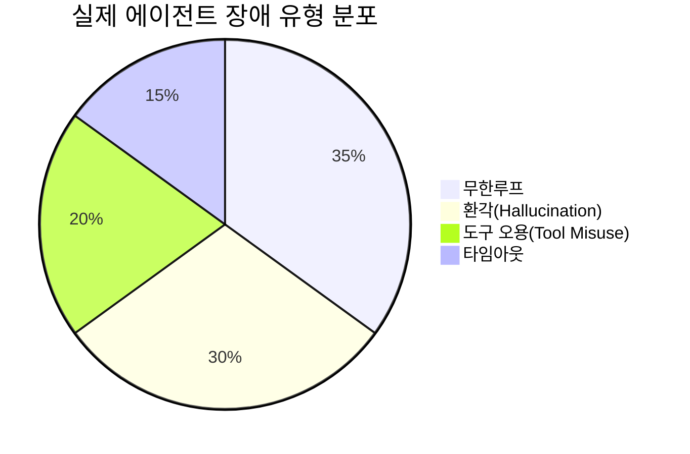
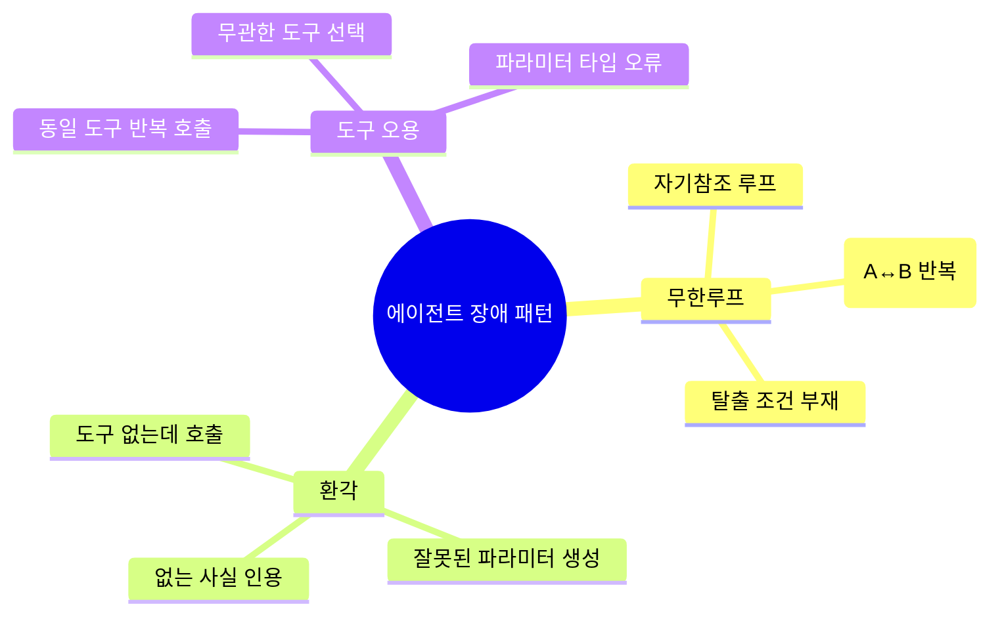
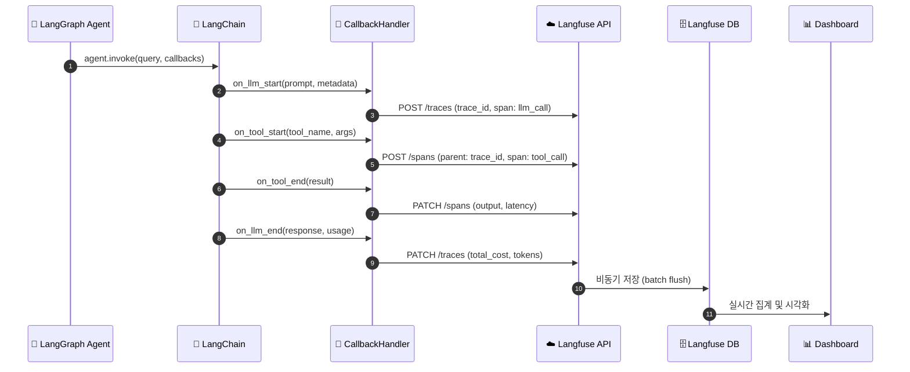
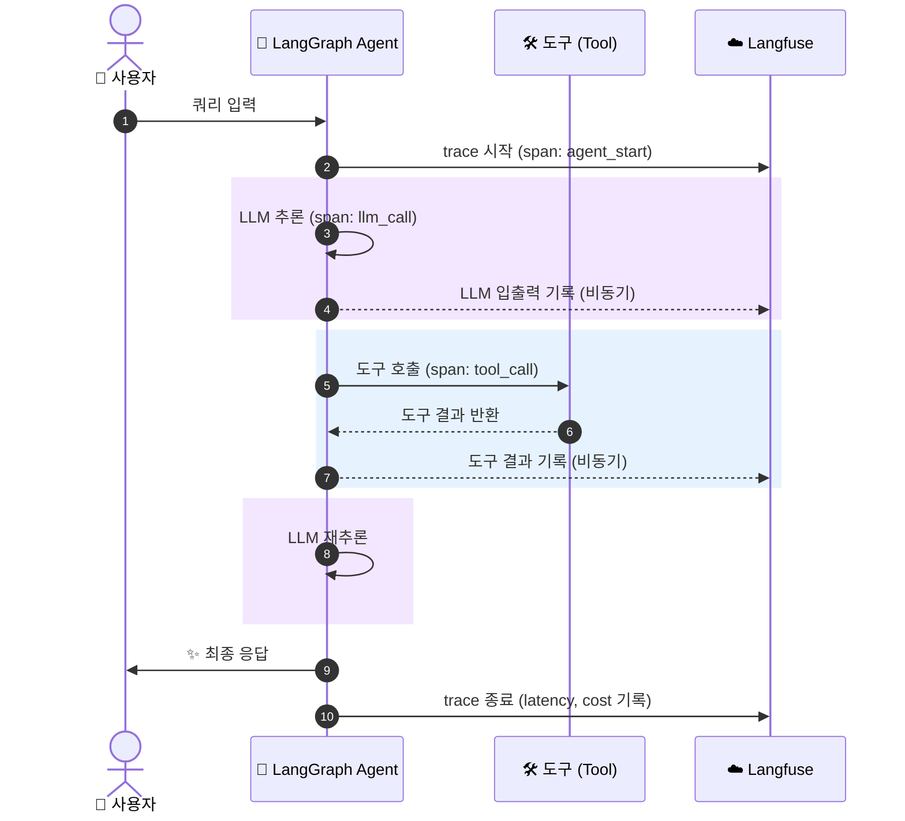
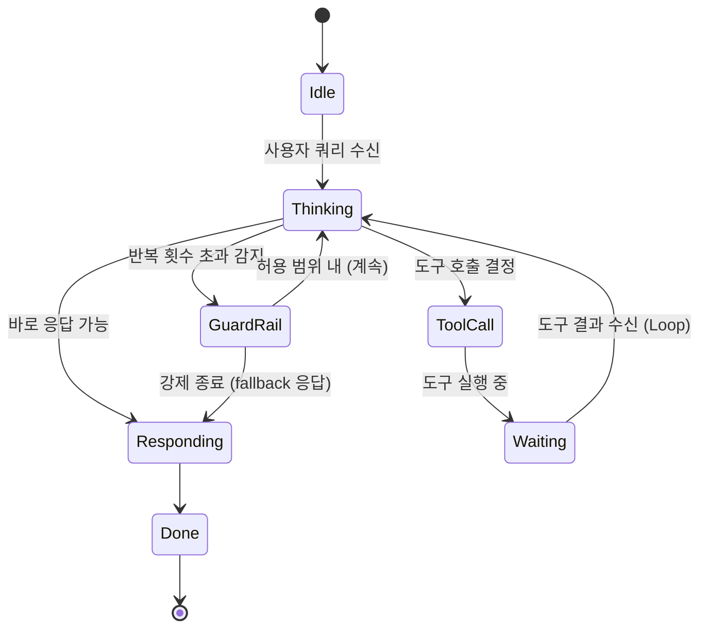
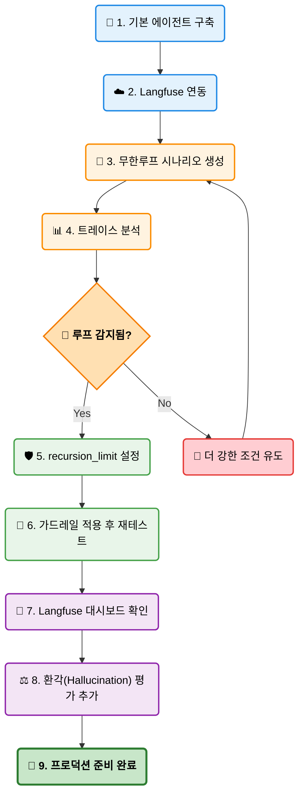

# EP06. 에이전트 디버깅 & 모니터링

## 에이전트가 루프에 빠졌을 때 탈출하는 법

> 무한루프 · 환각 · 도구 오용을 **Langfuse**로 추적하고, **가드레일**로 막는다

난이도: ⭐⭐

---

## 1. 문제 제기: 실제 에이전트 장애 사례

에이전트를 프로덕션에 배포하면 반드시 만나는 세 가지 함정

| 장애 유형 | 증상 | 원인 |
|-----------|------|------|
| **무한루프** | API 비용 폭증, 응답 없음 | 탈출 조건 부재, 도구 반환값 무시 |
| **환각(Hallucination)** | 없는 사실 생성, 잘못된 참조 | 컨텍스트 부족, 과도한 신뢰 |
| **도구 오용(Tool Misuse)** | 잘못된 파라미터, 중복 호출 | 도구 설명 불명확, 프롬프트 결함 |

실제 사례: 검색 도구가 빈 결과를 반환하자 에이전트가 동일한 쿼리를 **47번** 반복 호출



---

## 2. 왜 디버깅이 어려운가?

```
일반 프로그램  →  스택 트레이스 → 즉시 원인 파악
에이전트      →  ???           → 어느 스텝에서 무엇을 왜?
```

**에이전트 디버깅의 특수성**

- 비결정적(Non-deterministic): 같은 입력에 다른 행동
- 멀티스텝: 오류가 10 스텝 뒤에 나타남
- LLM 블랙박스: 내부 추론 불투명
- 비용: 디버깅 자체가 API 비용 발생

**해결책**: 모든 스텝을 **트레이스(Trace)**로 기록하고 시각화



---

## 3. Langfuse 트레이싱 아키텍처

```mermaid
flowchart LR
    A((👤 사용자 쿼리)):::user --> B{"🤖 LangGraph 에이전트"}:::agent
    B --> C("🛠️ 도구 호출"):::tool
    C --> D("⚡ 도구 실행"):::tool
    D --> B
    B --> E([✨ 최종 응답]):::end
    
    B -. 비동기 트레이스 .-> F[/"📡 Langfuse SDK"\]:::sdk
    C -. span .-> F
    D -. span .-> F
    
    F --> G[("☁️ Langfuse 서버")]:::server
    G --> H("📊 대시보드 시각화"):::dash
    G --> I("⚖️ LLM-as-Judge 평가"):::dash
    G --> J("🚨 알림 / 경보"):::dash
    
    classDef user fill:#e3f2fd,stroke:#1e88e5,stroke-width:2px,color:#000
    classDef agent fill:#fff3e0,stroke:#fb8c00,stroke-width:2px,color:#000
    classDef tool fill:#f3e5f5,stroke:#8e24aa,stroke-width:2px,color:#000
    classDef end fill:#e8f5e9,stroke:#43a047,stroke-width:2px,color:#000
    classDef sdk fill:#e0f7fa,stroke:#00acc1,stroke-width:2px,color:#000
    classDef server fill:#eceff1,stroke:#607d8b,stroke-width:2px,color:#000
    classDef dash fill:#ffecb3,stroke:#ffb300,stroke-width:2px,color:#000
```

모든 LLM 호출, 도구 실행, 중간 상태가 **자동으로** 기록됨



---

## 4. Langfuse vs LangSmith 비교

| 항목 | Langfuse | LangSmith |
|------|----------|-----------|
| **라이선스** | MIT (오픈소스) | 상용 |
| **셀프호스팅** | 가능 (Docker) | 불가 |
| **무료 티어** | 관대함 | 제한적 |
| **LangChain 통합** | CallbackHandler | 네이티브 |
| **LLM-as-Judge** | 내장 | 내장 |
| **데이터 주권** | 완전 통제 | 클라우드 의존 |
| **SDK 언어** | Python, JS, Ruby | Python, JS |
| **평가 API** | score API | feedback API |

국내 기업 프로덕션 환경에서는 **데이터 주권** 이슈로 Langfuse 셀프호스팅 선호

---

## 5. Langfuse Python SDK 설치 및 초기화

```bash
uv pip install langfuse langchain langgraph langchain-anthropic
```

```python
import os
from langfuse import Langfuse

# 환경 변수로 관리
os.environ["LANGFUSE_PUBLIC_KEY"] = "pk-lf-..."
os.environ["LANGFUSE_SECRET_KEY"] = "sk-lf-..."
os.environ["LANGFUSE_HOST"] = "https://cloud.langfuse.com"  # 또는 셀프호스팅 URL

# SDK 초기화
langfuse = Langfuse()

# 연결 확인
langfuse.auth_check()
print("Langfuse 연결 성공!")
```

SDK v4에서는 환경 변수를 자동으로 읽어 초기화

---

## 6. LangChain CallbackHandler로 자동 트레이싱

```python
from langfuse.langchain import CallbackHandler

# 핸들러 생성 (트레이스마다 또는 전역으로)
langfuse_handler = CallbackHandler(
    public_key=os.environ["LANGFUSE_PUBLIC_KEY"],
    secret_key=os.environ["LANGFUSE_SECRET_KEY"],
    session_id="debug-session-001",   # 세션 그룹핑
    user_id="user-123",               # 사용자 식별
    tags=["ep06", "debugging"],       # 필터용 태그
)

# LangGraph 에이전트 실행 시 주입
result = agent.invoke(
    {"messages": [HumanMessage(content="질문")]},
    config={"callbacks": [langfuse_handler]},
)
```

**코드 한 줄**로 모든 LLM 호출과 도구 실행이 자동 기록됨

---

## 7. LangGraph 트레이스 시각화

Langfuse 대시보드에서 LangGraph 실행 흐름을 시각적으로 확인



---

## 8. 무한루프 탐지 패턴

**패턴 1: Iteration Count 추적**

```python
from langfuse import Langfuse

langfuse = Langfuse()

def track_iterations(trace_id: str, iteration: int, max_iter: int = 10):
    """Langfuse score API로 반복 횟수 기록"""
    langfuse.score(
        trace_id=trace_id,
        name="iteration_count",
        value=iteration,
        comment=f"반복 {iteration}/{max_iter}"
    )
    if iteration >= max_iter:
        raise RuntimeError(f"무한루프 감지: {iteration}회 초과")
```

**패턴 2: 동일 도구 반복 호출 감지**

```python
tool_call_history = []
if tool_call_history[-3:] == [current_tool] * 3:
    raise ValueError(f"동일 도구 연속 3회 호출 감지: {current_tool}")
```

---

## 9. 환각(Hallucination) 탐지: LLM-as-Judge

Langfuse의 내장 평가 기능으로 응답 품질 자동 측정

```python
from langfuse import Langfuse

langfuse = Langfuse()

# Langfuse에 LLM-as-Judge 평가 등록
evaluation = langfuse.score(
    trace_id=trace_id,
    name="hallucination_score",
    value=0.85,          # 0~1 (1 = 환각 없음)
    data_type="NUMERIC",
    comment="근거 문서와 응답 일치율"
)
```

**자기일관성(Self-Consistency) 체크**: 동일 질문을 3회 실행하여 응답 분산 측정
- 분산이 높을수록 환각 가능성 증가
- 핵심 팩트 불일치 → 환각 플래그

---

## 10. 도구 오용(Tool Misuse) 패턴과 탐지법

**흔한 도구 오용 패턴**

```
1. 파라미터 타입 오류    search(query=42)     # int 전달
2. 필수 파라미터 누락    send_email(to=None)
3. 중복 호출            동일 URL 3회 fetch
4. 부적절한 도구 선택   계산에 검색 도구 사용
```

**탐지 코드**

```python
def validate_tool_call(tool_name: str, tool_args: dict, schema: dict):
    """도구 호출 전 유효성 검사"""
    for field, field_type in schema["required"].items():
        if field not in tool_args:
            langfuse.score(trace_id=..., name="tool_misuse",
                          value=0, comment=f"필수 파라미터 누락: {field}")
            raise ValueError(f"필수 파라미터 누락: {field}")
```

---

## 11. 가드레일 설계 원칙



**3층 방어 구조**

```
1층: 입력 가드레일  → 쿼리 검증, 토큰 제한
2층: 실행 가드레일  → max_iterations, timeout, 도구 검증
3층: 출력 가드레일  → 응답 품질 검사, 민감정보 필터
```

**가드레일 파라미터 권장값**

| 파라미터 | 권장값 | 설명 |
|---------|--------|------|
| `recursion_limit` | 15~25 | LangGraph 기본 최대 노드 방문 횟수 |
| `max_iterations` | 10~15 | 에이전트 루프 최대 반복 |
| `timeout` | 30~60s | 전체 실행 타임아웃 |
| `tool_timeout` | 5~10s | 개별 도구 타임아웃 |

---

## 12. LangGraph 가드레일 구현

```python
from langgraph.graph import StateGraph, END
from langgraph.errors import GraphRecursionError

# recursion_limit으로 무한루프 방지
try:
    result = app.invoke(
        {"messages": [HumanMessage(content=query)]},
        config={
            "recursion_limit": 20,          # 최대 20 노드 방문
            "callbacks": [langfuse_handler],
        }
    )
except GraphRecursionError as e:
    # Langfuse에 루프 감지 기록
    langfuse.score(
        trace_id=langfuse_handler.get_trace_id(),
        name="loop_detected",
        value=0,
        comment=str(e)
    )
    result = {"messages": [AIMessage(content="처리 한도 초과. 다시 시도해주세요.")]}
```

---

## 13. interrupt()로 인간 검토 포인트 추가

```python
from langgraph.types import interrupt

def sensitive_action_node(state):
    """민감한 작업 전 인간 승인 요청"""
    action = state["planned_action"]

    if action["risk_level"] == "high":
        # 실행을 일시 중단하고 인간 검토 대기
        human_approval = interrupt({
            "question": f"이 작업을 승인하시겠습니까? {action}",
            "action": action,
        })
        if not human_approval["approved"]:
            return {"messages": [AIMessage(content="작업이 취소되었습니다.")]}

    # 승인된 경우 계속 실행
    return execute_action(action)
```

Human-in-the-Loop: 고위험 작업은 자동화하지 않고 검토 단계 삽입

---

## 14. Langfuse 실시간 모니터링 대시보드

**대시보드 핵심 지표**

| 지표 | 의미 | 알림 기준 |
|------|------|-----------|
| **P99 Latency** | 99번째 백분위 응답 시간 | > 30초 |
| **Error Rate** | 실패 트레이스 비율 | > 5% |
| **Avg Iterations** | 평균 에이전트 반복 횟수 | > 8회 |
| **LLM Cost / trace** | 트레이스당 평균 비용 | > $0.10 |
| **Hallucination Score** | 환각 평가 평균 점수 | < 0.7 |

**활용 팁**
- `tags`로 실험 그룹 구분 (A/B 테스트)
- `session_id`로 대화 흐름 추적
- `user_id`로 사용자별 품질 분석

---

## 15. 프로덕션 모니터링 체크리스트

모든 에이전트를 배포하기 전 반드시 확인

- [ ] `recursion_limit` 설정 완료
- [ ] `timeout` 설정 완료 (전체 + 도구별)
- [ ] Langfuse `CallbackHandler` 연동
- [ ] 무한루프 시나리오 테스트 통과
- [ ] 환각 평가 파이프라인 구성
- [ ] Fallback 응답 구현
- [ ] 비용 알림 설정 (일일 예산 초과 시)
- [ ] 에러율 알림 설정 (> 5%)
- [ ] 로그 보존 정책 설정

---

## 16. 실습 흐름 요약



---

## Exercise 1: 무한루프 에이전트 만들고 Langfuse로 탐지

**목표**: 의도적으로 무한루프에 빠지는 에이전트를 만들고, Langfuse 트레이스로 루프를 시각적으로 확인한다

**단계**:
1. 항상 같은 도구를 호출하도록 유도하는 에이전트 구성
2. `recursion_limit=100` (높게)으로 실행하여 루프 발생
3. Langfuse 대시보드에서 트레이스 확인 → 반복 패턴 시각화
4. `iteration_count` score를 기록하는 커스텀 노드 추가
5. 루프가 5회를 초과하면 자동으로 종료되도록 수정

**확인 기준**: Langfuse 대시보드에서 루프 패턴이 명확히 보이고, 5회 초과 시 정상 종료

---

## Exercise 2: LangGraph 가드레일 적용 전후 비교

**목표**: 동일한 에이전트에 가드레일을 적용하여 Langfuse로 전후 성능을 수치로 비교한다

**단계**:
1. 가드레일 없는 에이전트로 10개 테스트 쿼리 실행 → Langfuse 기록
2. 다음 가드레일 순차 적용:
   - `recursion_limit=15`
   - `tool_call_dedup` (중복 도구 호출 차단)
   - `fallback` 응답 추가
3. 동일 10개 쿼리 재실행 → Langfuse 기록
4. Langfuse 대시보드에서 **전후 비교 리포트** 생성:
   - 평균 latency, error rate, iterations, cost

**제출**: 전후 비교 스크린샷 + 개선율 표

---

## 정리 & 다음 에피소드

**오늘 배운 것**

- Langfuse로 LangGraph 에이전트 전체 실행 흐름 추적
- 무한루프, 환각, 도구 오용 3대 장애 패턴과 탐지법
- `recursion_limit`, `interrupt()`, `fallback`으로 가드레일 구현
- Langfuse score API로 정량적 품질 측정

**다음 에피소드**: EP07. 에이전트 평가 자동화 — RAGAS로 배치 평가 파이프라인 구축

> 코드와 노트북은 GitHub 레포에서 확인하세요
