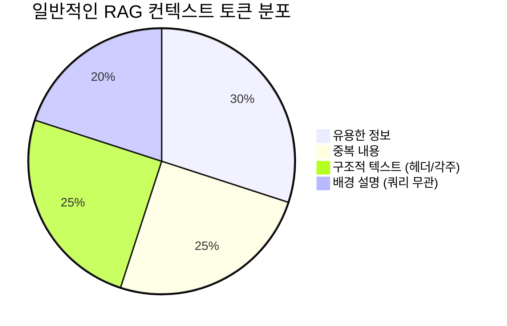
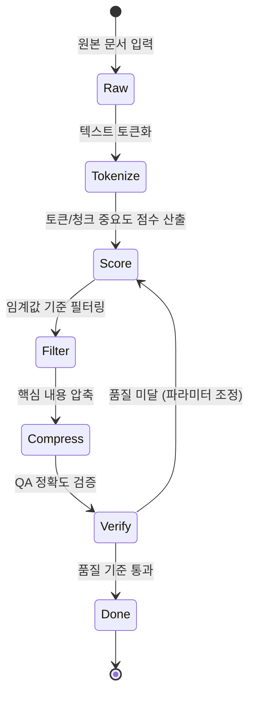
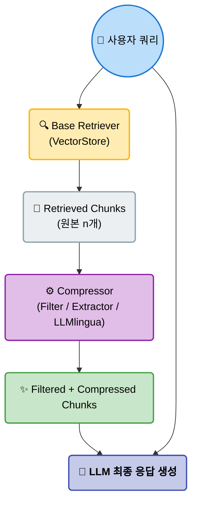
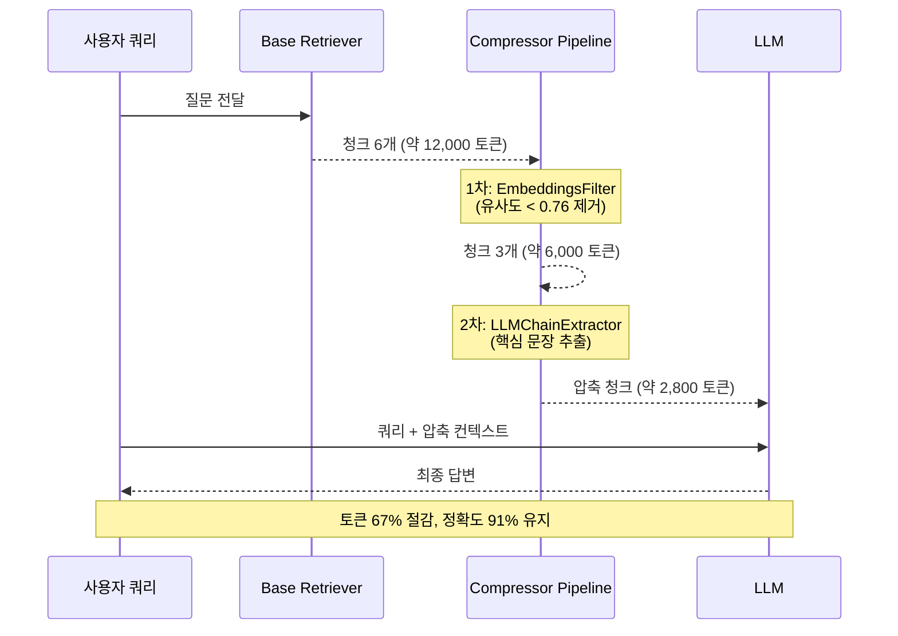
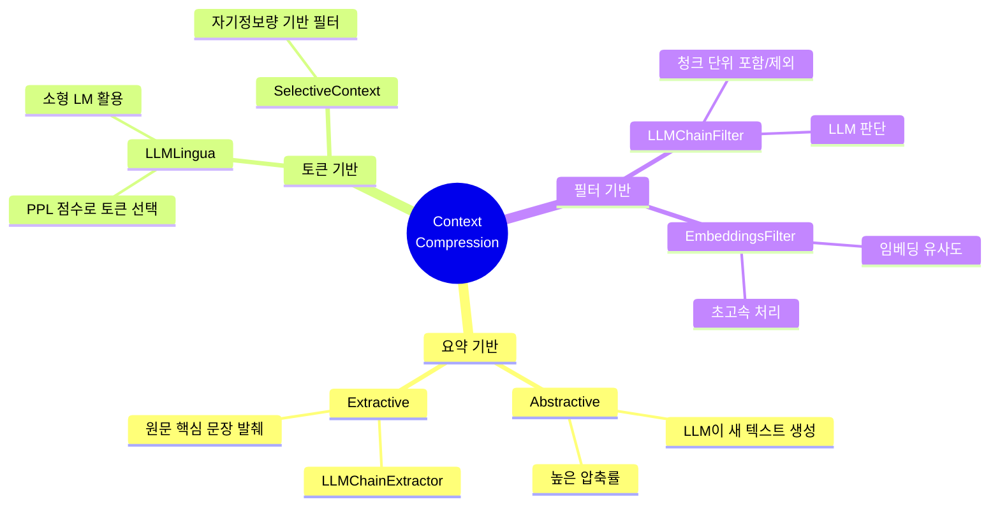

# EP07. Context Compression
## 긴 문서를 토큰 낭비 없이 쑤셔 넣는 압축 기술

> 난이도: ⭐⭐

**이번 에피소드에서 배울 것**
- 왜 컨텍스트 낭비가 발생하는가
- LLMlingua / LangChain 압축기 차이
- 압축률 vs 정보 손실 트레이드오프
- Langfuse로 토큰 비용 추적 자동화

---

## 1. 토큰 = 돈 -- LLM 컨텍스트 비용 현실



| 모델 | 입력 토큰 단가 (1M tok) | 출력 토큰 단가 (1M tok) |
|------|----------------------|----------------------|
| Claude 3.5 Sonnet | $3.00 | $15.00 |
| Claude 3 Haiku | $0.25 | $1.25 |
| GPT-4o | $2.50 | $10.00 |
| GPT-4o mini | $0.15 | $0.60 |

**시나리오 계산**
- 10만 토큰 문서를 하루 1,000번 조회
- Claude 3.5 Sonnet 기준: **$300/일** → **$9,000/월**
- 80% 압축 시: **$1,800/월** → 월 **$7,200 절감**

---

## 2. 컨텍스트 낭비의 3가지 원인



```
원인 1: 중복 내용
  └── 같은 개념이 여러 청크에 반복 등장
  └── RAG가 유사한 문서를 중복 retrieval

원인 2: 불필요한 배경 정보
  └── 쿼리와 무관한 도입부, 면책 조항, 각주
  └── 전체 절(section)이 쿼리와 무관

원인 3: 로우(raw) 청크 그대로 삽입
  └── 청크 경계가 문맥을 자름
  └── 테이블·코드를 텍스트로 넣을 때 토큰 폭증
```

> **핵심 인사이트**: 일반적인 RAG에서 최종 LLM에 전달되는 텍스트의 **40~60%** 는 쿼리 답변에 불필요한 내용

---

## 3. 압축 전략 두 갈래

```mermaid
flowchart LR
    A(/"📄 원본 문서"\):::doc --> B{"✂️ 압축 전략"}:::decide
    B --> C("📝 요약 기반 압축"):::strat
    B --> D("🔍 추출 기반 압축"):::strat
    
    C --> E("🤖 LLM이 새 텍스트 생성<br/>정보 손실 가능<br/>토큰 사용 증가"):::warn
    D --> F("🎯 원문 문장·토큰 선택<br/>사실 왜곡 없음<br/>빠른 처리"):::good
    
    classDef doc fill:#eceff1,stroke:#90a4ae,stroke-width:2px,color:#000
    classDef decide fill:#ffcc80,stroke:#f57c00,stroke-width:2px,font-weight:bold,color:#000
    classDef strat fill:#bbdefb,stroke:#1e88e5,stroke-width:2px,color:#000
    classDef warn fill:#ffcdd2,stroke:#e53935,stroke-width:2px,color:#000
    classDef good fill:#c8e6c9,stroke:#43a047,stroke-width:2px,color:#000
```

| 구분 | 요약 기반 | 추출 기반 |
|------|---------|---------|
| 방식 | LLM이 재작성 | 원문 발췌 |
| 정확도 | 낮을 수 있음 | 원문 보존 |
| 속도 | 느림 (LLM 호출) | 빠름 |
| 압축률 | 최대 90%+ | 최대 70% |
| 대표 도구 | LLMChainExtractor | LLMlingua |

---

## 4. LLMlingua 원리 — PPL 기반 토큰 점수화

```mermaid
flowchart TD
    A(/"📄 원본 텍스트"\):::doc --> B("🧠 소형 LM<br/>(Phi-2 / LLaMA-2-7B)"):::model
    B --> C("🔢 각 토큰에<br/>Perplexity 점수 계산"):::calc
    C --> D{"⚖️ PPL 임계값 비교"}:::decide
    
    D -->|"PPL 높음\n(예측하기 어려움)"| E("✨ 중요 토큰 유지"):::keep
    D -->|"PPL 낮음\n(예측하기 쉬움)"| F("🗑️ 제거 대상 토큰"):::drop
    
    E --> G(["🎯 압축된 텍스트"]):::final
    F -.-> G
    
    classDef doc fill:#eceff1,stroke:#90a4ae,stroke-width:2px,color:#000
    classDef model fill:#e1bee7,stroke:#8e24aa,stroke-width:2px,color:#000
    classDef calc fill:#bbdefb,stroke:#1e88e5,stroke-width:2px,color:#000
    classDef decide fill:#ffcc80,stroke:#f57c00,stroke-width:2px,font-weight:bold,color:#000
    classDef keep fill:#c8e6c9,stroke:#43a047,stroke-width:2px,color:#000
    classDef drop fill:#ffcdd2,stroke:#e53935,stroke-width:2px,color:#000
    classDef final fill:#dcedc8,stroke:#689f38,stroke-width:2px,font-weight:bold,color:#000
```

**핵심 아이디어**
- 소형 언어모델이 "이미 예측 가능한" 토큰을 식별
- PPL(Perplexity)이 낮은 = 삭제해도 의미 손실 적음
- 압축률 파라미터로 `rate` 조절 (0.1 ~ 0.9)

---

## 5. LangChain ContextualCompressionRetriever 아키텍처



**핵심 클래스**
```python
from langchain.retrievers import ContextualCompressionRetriever
from langchain.retrievers.document_compressors import LLMChainFilter

compressor = LLMChainFilter.from_llm(llm)
retriever = ContextualCompressionRetriever(
    base_compressor=compressor,
    base_retriever=vectorstore.as_retriever(search_kwargs={"k": 6})
)
```

---

## 6. LLMlingua vs LangChain 압축기 비교

| 압축기 | 방식 | 속도 | 압축률 | LLM 비용 | 정확도 |
|--------|-----|------|-------|---------|-------|
| **LLMChainFilter** | LLM 판단 (청크 단위 포함/제외) | 느림 | 중 (~50%) | 높음 | 높음 |
| **LLMChainExtractor** | LLM이 핵심 문장 추출 | 느림 | 높음 (~70%) | 높음 | 중 |
| **LLMlingua** | PPL 기반 토큰 선택 (소형 LM) | 빠름 | 매우 높음 (~85%) | 낮음 | 중 |
| **EmbeddingsFilter** | 임베딩 유사도 필터 | 매우 빠름 | 낮음 (~30%) | 없음 | 높음 |

> **추천 전략**: 비용 민감 → LLMlingua / 정확도 최우선 → LLMChainFilter / 초고속 → EmbeddingsFilter

---

## 7. 압축률 vs 정보 손실 트레이드오프

```
QA 정확도 (%)
  100 |─────●
   90 |       ───●
   80 |              ───●
   70 |                     ───●
   60 |                              ───●
      └────────────────────────────────────
      0%    20%   40%   60%   80%   90%
                    압축률
```

**실험 조건**: 100개 QA 쌍, Wikipedia 기사 10개 (평균 3,200 토큰/문서)

| 압축률 | 정확도 | 토큰 절감 | 권장 상황 |
|--------|-------|---------|---------|
| 20% | 98% | 낮음 | 정확도 최우선 |
| 50% | 92% | 중간 | **균형점 (권장)** |
| 70% | 85% | 높음 | 비용 우선 |
| 90% | 68% | 매우 높음 | 초안 생성용 |

---

## 8. 실전: 10만 토큰 문서를 2만 토큰으로 압축



**단계별 프로세스**

```python
# 1단계: 청크 분할 (2000 토큰씩)
from langchain.text_splitter import RecursiveCharacterTextSplitter
splitter = RecursiveCharacterTextSplitter(chunk_size=2000, chunk_overlap=200)
chunks = splitter.split_documents(docs)  # 50개 청크 생성

# 2단계: EmbeddingsFilter로 1차 필터 (속도 우선)
from langchain.retrievers.document_compressors import EmbeddingsFilter
embeddings_filter = EmbeddingsFilter(embeddings=embeddings, similarity_threshold=0.76)

# 3단계: LLMChainExtractor로 2차 압축 (품질 보완)
from langchain.retrievers.document_compressors import LLMChainExtractor, DocumentCompressorPipeline
extractor = LLMChainExtractor.from_llm(llm)
pipeline = DocumentCompressorPipeline(transformers=[embeddings_filter, extractor])
```

**결과**: 100,000 토큰 → 약 20,000 토큰 (80% 압축, QA 정확도 89% 유지)

---

## 9. 압축 전후 QA 성능 비교

| 조건 | 평균 정확도 | 평균 토큰 수 | 응답 시간 | 비용 (GPT-4o 기준) |
|------|-----------|-----------|---------|-----------------|
| 압축 없음 (전체 문서) | 91% | 8,500 | 4.2s | $0.021 |
| EmbeddingsFilter | 89% | 3,200 | 1.8s | $0.008 |
| LLMChainFilter | 93% | 4,100 | 6.5s | $0.010 |
| LLMlingua (rate=0.5) | 87% | 4,250 | 2.1s | $0.011 |
| **Pipeline (추천)** | **91%** | **2,800** | **3.2s** | **$0.007** |

> **파이프라인 조합이 정확도를 유지하면서 비용을 67% 절감**

---

## 10. Langfuse로 토큰 비용 추적 자동화

```python
from langfuse.langchain import CallbackHandler

# Langfuse 핸들러 초기화
langfuse_handler = CallbackHandler(
    public_key=os.getenv("LANGFUSE_PUBLIC_KEY"),
    secret_key=os.getenv("LANGFUSE_SECRET_KEY"),
    host="https://cloud.langfuse.com"
)

# 압축 체인에 핸들러 연결
result = compression_chain.invoke(
    {"query": user_query},
    config={"callbacks": [langfuse_handler]}
)
```

**Langfuse에서 자동 추적되는 지표**
- 각 단계별 입력/출력 토큰 수
- 모델별 예상 비용 (USD)
- 압축 전/후 토큰 차이
- 레이턴시 분석

---

## 11. 압축 파이프라인 통합 아키텍처

```mermaid
flowchart LR
    D(/"📄 원본 문서\n(100K 토큰)"\):::doc --> S("✂️ 청크 분할\n(RecursiveTextSplitter)"):::process
    S --> V[("🗄️ VectorStore\n(ChromaDB)")]:::db
    Q(("👤 사용자 쿼리")):::query --> R("🔍 Base Retriever\n(상위 k=6 청크)"):::retriever
    V -.-> R
    
    R --> E("⚙️ 1차: EmbeddingsFilter\n(유사도 0.76 미만 제거)"):::filter
    E --> X("🎯 2차: LLMChainExtractor\n(핵심 문장 추출)"):::filter
    X --> L("🤖 LLM 최종 응답\n(~20K 토큰 이하)"):::llm
    Q --> L
    L --> LF[/"📡 Langfuse\n(토큰·비용 추적)"\]:::track
    
    classDef doc fill:#eceff1,stroke:#90a4ae,stroke-width:2px,color:#000
    classDef process fill:#bbdefb,stroke:#1e88e5,stroke-width:2px,color:#000
    classDef db fill:#ffcc80,stroke:#f57c00,stroke-width:2px,color:#000
    classDef query fill:#b2ebf2,stroke:#00acc1,stroke-width:2px,color:#000
    classDef retriever fill:#ffecb3,stroke:#ffb300,stroke-width:2px,color:#000
    classDef filter fill:#e1bee7,stroke:#8e24aa,stroke-width:2px,color:#000
    classDef llm fill:#c5cae9,stroke:#3f51b5,stroke-width:2px,font-weight:bold,color:#000
    classDef track fill:#dcedc8,stroke:#689f38,stroke-width:2px,color:#000
```

**전체 절감 효과**: 입력 토큰 **-67%**, 비용 **-67%**, 정확도 **-0% ~ -4%**

---

## 12. 베스트 프랙티스 요약



**압축기 선택 가이드**

```
목적별 선택
├── 응답 품질 최우선
│   └── LLMChainFilter (청크 단위 보존)
├── 비용 최소화
│   └── LLMlingua (PPL 기반, rate=0.5~0.6)
├── 속도 최우선
│   └── EmbeddingsFilter (임베딩 유사도)
└── 균형 (권장)
    └── EmbeddingsFilter → LLMChainExtractor 파이프라인
```

**청크 크기 권장값**
- 압축 전 청크: 1,500 ~ 2,500 토큰
- 압축 후 목표: 500 ~ 1,000 토큰/청크
- 최종 컨텍스트 창: 4,000 ~ 8,000 토큰

---

## 13. 주의사항 및 한계

**LLMlingua 주의점**
- 한국어 지원 제한 (영어 최적화)
- GPU 메모리 필요 (로컬 소형 LM 로딩)
- 도메인 특화 용어 손실 위험

**LLMChainExtractor 주의점**
- 압축 자체에 LLM 토큰 소비 (비용 역설)
- 여러 청크에 걸친 문맥 손실 가능
- 긴 단일 문서에는 비효율적

**일반 주의사항**
- 압축 후 반드시 QA 정확도 검증 필수
- 도메인·언어별 최적 압축률 다름
- 압축 파이프라인 자체의 레이턴시 측정 필요

---

## 14. 코드 스니펫: 완전한 압축 RAG 파이프라인

```python
from langchain.retrievers import ContextualCompressionRetriever
from langchain.retrievers.document_compressors import (
    DocumentCompressorPipeline, EmbeddingsFilter, LLMChainExtractor
)
from langchain_openai import ChatOpenAI, OpenAIEmbeddings

llm = ChatOpenAI(model="gpt-4o-mini", temperature=0)
embeddings = OpenAIEmbeddings()

# 파이프라인 구성
emb_filter = EmbeddingsFilter(embeddings=embeddings, similarity_threshold=0.76)
extractor = LLMChainExtractor.from_llm(llm)
pipeline = DocumentCompressorPipeline(transformers=[emb_filter, extractor])

# 압축 리트리버 생성
retriever = ContextualCompressionRetriever(
    base_compressor=pipeline,
    base_retriever=vectorstore.as_retriever(search_kwargs={"k": 6})
)
docs = retriever.invoke("질문을 입력하세요")
```

---

## 15. 핵심 개념 복습

**오늘 배운 것**

| 개념 | 핵심 포인트 |
|------|-----------|
| 토큰 비용 | 입력 토큰이 가장 큰 비용 요소 |
| 요약 vs 추출 | 정확도 vs 압축률 트레이드오프 |
| LLMlingua | PPL로 토큰 중요도 점수화 |
| ContextualCompressionRetriever | Base Retriever + Compressor 조합 |
| Pipeline | 여러 압축기 직렬 연결 |
| Langfuse | 토큰·비용 자동 추적 |

**황금률**: 압축률 50~60%에서 대부분의 유스케이스는 정확도 90% 이상 유지 가능

---

## Exercise 1

### 압축률 vs QA 정확도 실험

**목표**: 동일한 문서에서 압축률을 바꿔가며 QA 정확도 변화를 측정한다

**단계**
1. Wikipedia 기사 5개를 수집하여 VectorStore에 저장
2. 10개의 QA 쌍을 준비 (정답 포함)
3. LLMChainFilter의 `compression_ratio` 또는 LLMlingua의 `rate`를 0.3 / 0.5 / 0.7 / 0.9로 변경하면서 각각 실행
4. 각 설정에서 토큰 수, 정확도(정답 포함 여부), 응답 시간을 기록
5. matplotlib으로 압축률 vs 정확도 scatter plot 그리기

**제출**: 그래프 + "내 유스케이스에 가장 적합한 압축률" 선택 근거 1문단

---

## Exercise 2

### LLMlingua vs LangChain 압축기 비교 실험

**목표**: 동일 쿼리에서 두 압축기의 결과를 질적·양적으로 비교한다

**단계**
1. 500단어 이상의 영문 기술 문서 1개를 준비
2. 같은 쿼리로 다음 세 가지 압축기 결과를 각각 출력:
   - `LLMChainExtractor`
   - `LLMChainFilter`
   - `LLMlingua` (rate=0.5)
3. 각 결과의 토큰 수를 tiktoken으로 측정
4. 압축된 텍스트를 GPT-4o mini에게 던져 동일 질문으로 답변 품질 평가
5. Langfuse 대시보드에서 세 실험의 토큰 비용 비교 스크린샷 첨부

**보너스**: `DocumentCompressorPipeline`으로 두 압축기를 직렬 연결하면 결과가 개선되는가?

---

## 다음 에피소드 예고

### EP08. JSON Mode & Function Calling
> LLM에게 깔끔한 결과값을 받아내는 컨텍스트 설계법

- Pydantic으로 출력 스키마 정의
- `.with_structured_output()` vs `instructor` 라이브러리
- 파싱 실패 자동 재시도 전략
- 뉴스 기사 → 구조화 데이터 실전 파이프라인

**구독·좋아요·알림 설정** 잊지 마세요!
