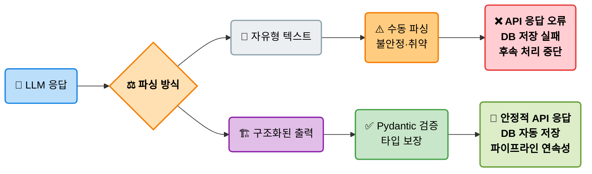
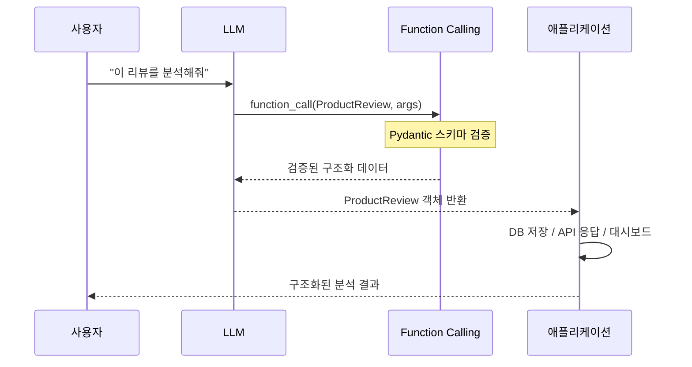
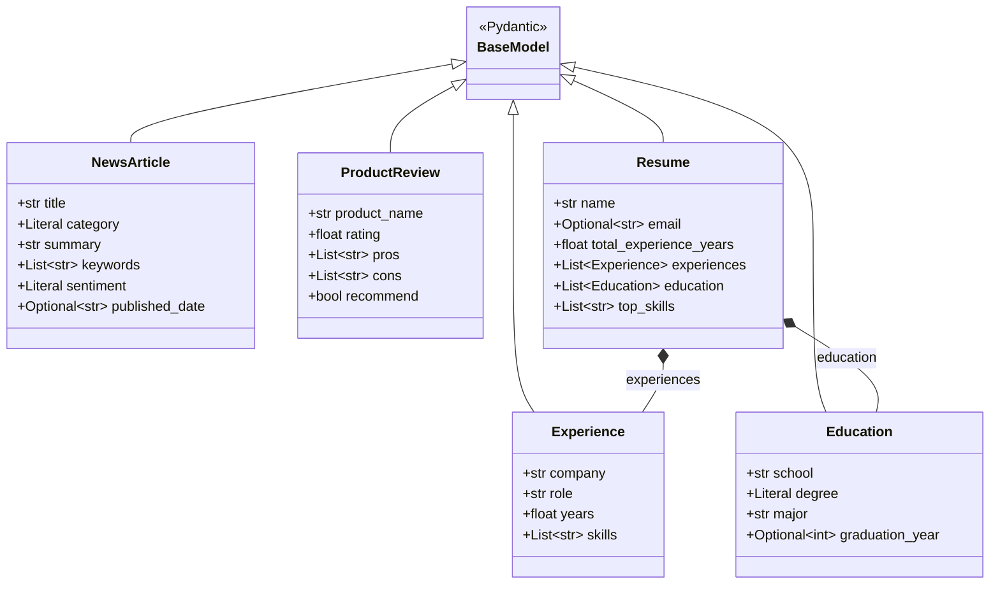
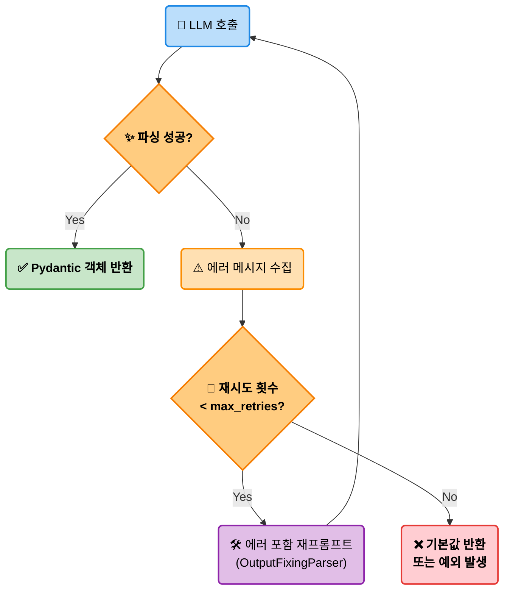
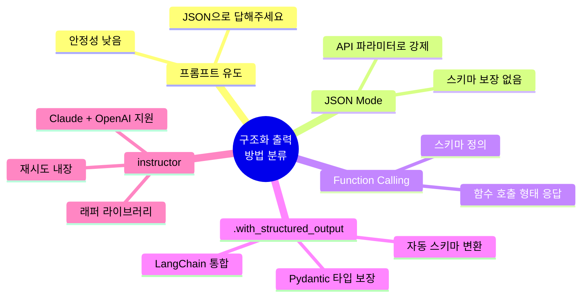

# EP08. JSON Mode & Function Calling
## LLM에게 깔끔한 결과값을 받아내는 컨텍스트 설계법

> 난이도: ⭐⭐

**이번 에피소드에서 배울 것**
- 자유형 텍스트 응답이 왜 문제인가
- Pydantic + `.with_structured_output()` 사용법
- `instructor` 라이브러리로 Claude/OpenAI 구조화 출력
- 파싱 실패 자동 재시도 전략

---

## 1. 문제: LLM 응답 파싱이 깨지는 순간

**현실에서 자주 마주치는 상황**

```python
# LLM이 이렇게 응답하면 좋겠지만...
{"name": "iPhone 15", "price": 1200000, "rating": 4.5}

# 실제로 오는 응답들
"제품 이름은 iPhone 15이고, 가격은 1,200,000원입니다. 평점은 4.5점이에요!"
"```json\n{\"name\": \"iPhone 15\", \"price\": \"1,200,000원\"}\n```"
"{ name: 'iPhone 15', price: 1200000 }"  # JSON 파싱 에러
```

**파싱 실패가 일으키는 문제**
- 프로덕션 파이프라인 중단
- 데이터 타입 불일치 (문자열 vs 숫자)
- 후속 처리 로직 오류
- 재시도 비용 증가

---

## 2. 구조화된 출력이 필요한 이유



**구조화 출력이 핵심인 유스케이스**
- 뉴스 기사 → DB 자동 저장 파이프라인
- 이력서 파싱 → 채용 시스템 연동
- 상품 리뷰 → 감성 분석 대시보드
- 계약서 → 주요 조항 추출 시스템

---

## 3. 접근 방법 4가지 비교



| 방법 | 설명 | 안정성 | 복잡도 | 비용 |
|------|-----|-------|-------|-----|
| **프롬프트 유도** | "JSON으로 답해주세요" | 낮음 | 낮음 | 낮음 |
| **JSON Mode** | API 파라미터로 JSON 강제 | 중간 | 낮음 | 낮음 |
| **Function Calling** | 스키마 정의 후 함수 호출 형태 | 높음 | 중간 | 중간 |
| **.with_structured_output()** | Pydantic 모델로 타입 검증 | 매우 높음 | 낮음 | 중간 |
| **instructor** | 래퍼 라이브러리, 재시도 내장 | 매우 높음 | 낮음 | 중간 |

> **권장**: 프로덕션에서는 `.with_structured_output()` 또는 `instructor` 사용

---

## 4. Pydantic 모델로 스키마 정의

```python
from pydantic import BaseModel, Field
from typing import Optional, List, Literal
from datetime import date

class NewsArticle(BaseModel):
    """뉴스 기사 구조화 스키마"""
    title: str = Field(description="기사 제목 (100자 이내)")
    category: Literal["정치", "경제", "사회", "문화", "IT"] = Field(
        description="기사 카테고리"
    )
    summary: str = Field(description="기사 요약 (3문장 이내)")
    keywords: List[str] = Field(description="핵심 키워드 3~5개")
    sentiment: Literal["긍정", "중립", "부정"] = Field(
        description="전체적인 기사 논조"
    )
    published_date: Optional[str] = Field(
        default=None, description="발행일 (YYYY-MM-DD)"
    )
```

**핵심**: `Field(description=...)`의 설명이 LLM의 이해도를 결정한다

---

## 5. LangChain .with_structured_output() 사용법

```python
from langchain_anthropic import ChatAnthropic
from langchain_openai import ChatOpenAI

# Claude 사용
llm = ChatAnthropic(model="claude-3-5-haiku-20241022")
structured_llm = llm.with_structured_output(NewsArticle)

# 실행
result = structured_llm.invoke(
    "다음 기사를 분석해주세요:\n\n" + article_text
)

# result는 NewsArticle 인스턴스 — 타입 보장!
print(result.title)      # str
print(result.keywords)   # List[str]
print(result.sentiment)  # "긍정" | "중립" | "부정"
```

**내부 동작**: LangChain이 자동으로 Function Calling 스키마를 생성하고 응답을 Pydantic 모델로 변환

---

## 6. instructor로 Claude 구조화 출력

```python
import anthropic
import instructor
from pydantic import BaseModel

# instructor로 Anthropic 클라이언트 패치
client = instructor.from_anthropic(anthropic.Anthropic())

class ProductReview(BaseModel):
    product_name: str
    rating: float = Field(ge=1.0, le=5.0)
    pros: List[str]
    cons: List[str]
    recommend: bool

# 구조화 출력 요청
review = client.messages.create(
    model="claude-3-5-haiku-20241022",
    max_tokens=1024,
    response_model=ProductReview,
    messages=[{
        "role": "user",
        "content": f"다음 리뷰를 분석하세요:\n{review_text}"
    }]
)
print(type(review))  # <class 'ProductReview'>
```

---

## 7. Function Calling 스키마 설계 베스트 프랙티스

**description 작성이 핵심**

```python
# 나쁜 예시 — 모호한 description
class Bad(BaseModel):
    value: float = Field(description="값")
    type: str = Field(description="타입")

# 좋은 예시 — 구체적이고 예시 포함
class Good(BaseModel):
    price_krw: float = Field(
        description="상품 가격 (원화, 숫자만, 예: 15000.0)"
    )
    category: Literal["전자", "의류", "식품", "기타"] = Field(
        description="상품 카테고리. 명확하지 않으면 '기타' 선택"
    )
```

**5가지 베스트 프랙티스**
1. 필드마다 예시 값 포함
2. 단위·형식 명시 (날짜: YYYY-MM-DD)
3. Optional은 기본값 제공
4. Literal로 허용 값 제한
5. 모델 docstring에 전체 맥락 설명

---

## 8. 중첩 Pydantic 모델



```python
from pydantic import BaseModel
from typing import List, Optional, Union

class Experience(BaseModel):
    company: str
    role: str
    years: float = Field(description="근무 기간 (년, 예: 2.5)")
    skills: List[str]

class Education(BaseModel):
    school: str
    degree: Literal["학사", "석사", "박사", "기타"]
    major: str
    graduation_year: Optional[int] = None

class Resume(BaseModel):
    """이력서 전체 구조"""
    name: str
    email: Optional[str] = None
    total_experience_years: float
    experiences: List[Experience]  # 중첩 리스트
    education: List[Education]
    top_skills: List[str] = Field(
        description="핵심 기술 스택 상위 5개"
    )
```

---

## 9. 파싱 실패 자동 재시도 전략

```mermaid
stateDiagram-v2
    [*] --> Call : LLM 호출
    Call --> Parse : 응답 수신
    Parse --> Success : JSON 유효 + Pydantic 검증 통과
    Parse --> Fail : 파싱 오류 / 검증 실패
    Fail --> Retry : 재시도 횟수 < max_retries
    Retry --> Fix : 에러 메시지 포함 재프롬프트
    Fix --> Call
    Fail --> Default : 재시도 횟수 >= max_retries
    Default --> [*] : 기본값 반환 또는 예외
    Success --> [*] : Pydantic 객체 반환
```



**tenacity로 자동 재시도**
```python
from tenacity import retry, stop_after_attempt, wait_exponential

@retry(stop=stop_after_attempt(3),
       wait=wait_exponential(multiplier=1, min=1, max=10))
def parse_with_retry(text: str) -> ProductReview:
    return structured_llm.invoke(text)
```

---

## 10. LangChain OutputFixingParser

```python
from langchain.output_parsers import (
    PydanticOutputParser, OutputFixingParser
)
from langchain_openai import ChatOpenAI

# 기본 파서
base_parser = PydanticOutputParser(pydantic_object=NewsArticle)

# 자동 수정 파서 (실패 시 LLM에게 수정 요청)
fixing_parser = OutputFixingParser.from_llm(
    parser=base_parser,
    llm=ChatOpenAI(model="gpt-4o-mini", temperature=0)
)

# 잘못된 JSON도 자동 수정
bad_output = "제목은 '주가 급등', 카테고리는 경제입니다..."
try:
    result = fixing_parser.parse(bad_output)
    print(result)  # NewsArticle 객체 반환
except Exception as e:
    print(f"수정 불가: {e}")
```

---

## 11. Langfuse로 구조화 출력 성공률 추적

```python
from langfuse import Langfuse
from langfuse.langchain import CallbackHandler

langfuse = Langfuse(
    public_key=os.getenv("LANGFUSE_PUBLIC_KEY"),
    secret_key=os.getenv("LANGFUSE_SECRET_KEY")
)
langfuse_handler = CallbackHandler()

def parse_article(text: str, trace_id: str) -> Optional[NewsArticle]:
    try:
        result = structured_llm.invoke(
            text, config={"callbacks": [langfuse_handler]}
        )
        # 성공 스코어 기록
        langfuse.score(trace_id=trace_id, name="parse_success", value=1)
        return result
    except Exception:
        # 실패 스코어 기록
        langfuse.score(trace_id=trace_id, name="parse_success", value=0)
        return None
```

---

## 12. 실전 유스케이스 1: 뉴스 기사 → 구조화 데이터

```python
import httpx
from langchain_anthropic import ChatAnthropic

# 뉴스 기사 대량 처리 파이프라인
articles = load_news_articles(count=100)  # 100개 기사 로드

structured_llm = ChatAnthropic(
    model="claude-3-5-haiku-20241022"
).with_structured_output(NewsArticle)

results = []
for article in articles:
    try:
        parsed = structured_llm.invoke(article["content"])
        results.append(parsed.model_dump())
    except Exception as e:
        results.append({"error": str(e), "raw": article["content"][:200]})

# DB 저장
import pandas as pd
df = pd.DataFrame([r for r in results if "error" not in r])
df.to_csv("parsed_news.csv", index=False)
print(f"성공: {len(df)}/100, 실패: {100 - len(df)}")
```

---

## 13. 실전 유스케이스 2: 이력서 → 구조화 파싱

**처리 흐름**

```mermaid
flowchart LR
    A(/"📄 이력서 PDF/텍스트"\):::doc --> B("✂️ 텍스트 추출<br/>(pdfplumber)"):::process
    B --> C("🤖 Claude<br/>(.with_structured_output)"):::llm
    C --> D("🏗️ Resume Pydantic 객체"):::struct
    
    D --> E[("🗄️ 채용 DB 저장")]:::db
    D --> F("🔍 기술 스택 매칭"):::action
    D --> G("⏱️ 경력 연수 자동 계산"):::action
    
    E & F & G --> H("📊 채용 대시보드"):::dash
    
    classDef doc fill:#eceff1,stroke:#90a4ae,stroke-width:2px,color:#000
    classDef process fill:#bbdefb,stroke:#1e88e5,stroke-width:2px,color:#000
    classDef llm fill:#c5cae9,stroke:#3f51b5,stroke-width:2px,color:#000
    classDef struct fill:#e1bee7,stroke:#8e24aa,stroke-width:2px,font-weight:bold,color:#000
    classDef db fill:#ffcc80,stroke:#f57c00,stroke-width:2px,color:#000
    classDef action fill:#fff3e0,stroke:#fb8c00,stroke-width:2px,color:#000
    classDef dash fill:#c8e6c9,stroke:#43a047,stroke-width:2px,font-weight:bold,color:#000
```

**핵심 이점**
- 이력서 형식에 관계없이 동일 스키마 추출
- `total_experience_years` 자동 계산
- 중첩 `List[Experience]` 완전 파싱
- 실패 시 `Optional` 필드로 부분 성공 허용

---

## 14. 성능 및 비용 최적화 팁

**모델 선택 전략**
| 작업 복잡도 | 권장 모델 | 이유 |
|-----------|---------|-----|
| 단순 필드 추출 | Claude Haiku / GPT-4o mini | 낮은 비용, 충분한 성능 |
| 중첩 복잡 스키마 | Claude Sonnet / GPT-4o | 높은 정확도 |
| 대량 배치 | Claude Haiku (배치 API) | 50% 비용 절감 |

**온도(temperature) 설정**
```python
# 구조화 출력은 항상 temperature=0
llm = ChatAnthropic(
    model="claude-3-5-haiku-20241022",
    temperature=0  # 결정론적 출력 필수
)
```

---

## 15. 베스트 프랙티스 요약



**구조화 출력 체크리스트**

```
설계 단계
├── Pydantic 모델에 모든 필드 description 작성
├── Optional로 누락 가능 필드 명시
├── Literal로 허용 값 제한
└── 모델 docstring에 전체 맥락 설명

구현 단계
├── temperature=0 설정
├── instructor 또는 .with_structured_output() 사용
├── try/except로 파싱 실패 처리
└── OutputFixingParser 또는 @retry로 재시도

운영 단계
├── Langfuse로 성공률 추적
├── 실패 케이스 로깅 및 분석
└── 주기적으로 실패 패턴 → 프롬프트 개선
```

---

## Exercise 1

### 제품 리뷰 → Pydantic 모델로 파싱

**목표**: 다양한 형식의 제품 리뷰 텍스트를 Pydantic 모델로 파싱하는 파이프라인 구현

**단계**
1. 아래 스키마를 완성하세요:
   ```python
   class ProductReview(BaseModel):
       product_name: str
       rating: float  # 1.0 ~ 5.0
       pros: List[str]
       cons: List[str]
       recommend: bool
       # TODO: 감성 점수, 핵심 키워드 필드 추가
   ```
2. Claude와 GPT-4o mini 각각으로 동일 리뷰 20개 파싱
3. 파싱 성공률, 소요 시간, 비용 비교 테이블 작성
4. 실패한 케이스의 공통 패턴 분석 (리뷰 길이? 언어 혼용?)

**제출**: 비교 테이블 + 실패 케이스 분석 1문단

---

## Exercise 2

### 재시도 전략 구현 + 성공률 측정

**목표**: 의도적으로 파싱을 어렵게 만든 텍스트로 재시도 전략의 효과를 측정한다

**단계**
1. 파싱하기 어려운 "트릭 입력" 10개 준비 (불완전한 JSON, 혼합 언어, 아이러니 표현)
2. 재시도 없는 기본 파싱 성공률 측정
3. `@retry(stop=stop_after_attempt(3))` 적용 후 성공률 재측정
4. `OutputFixingParser` 적용 후 성공률 재측정
5. 각 전략의 추가 토큰 비용 계산

**비교 지표**
| 전략 | 성공률 | 추가 비용 | 권장 상황 |
|------|-------|---------|---------|
| 기본 | ?% | $0 | ? |
| @retry | ?% | ?$ | ? |
| OutputFixingParser | ?% | ?$ | ? |

**제출**: 표 완성 + "어떤 전략을 언제 쓸 것인가" 결론 1문단

---

## 다음 에피소드 예고

### EP09. Long Context vs RAG
> 128K 컨텍스트 창과 RAG, 언제 뭘 써야 하나

- Long Context 모델의 실제 성능 한계
- RAG vs Long Context 비용·속도·정확도 비교
- 하이브리드 전략: Long Context + RAG 조합
- 실전 벤치마크 실험

**구독·좋아요·알림 설정** 잊지 마세요!
