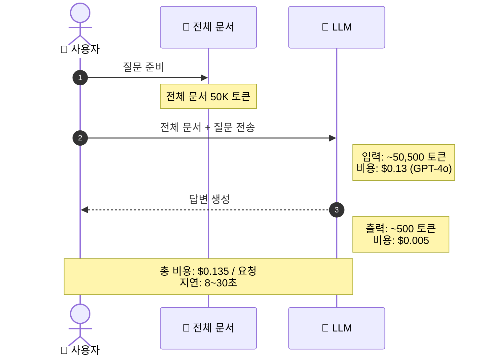
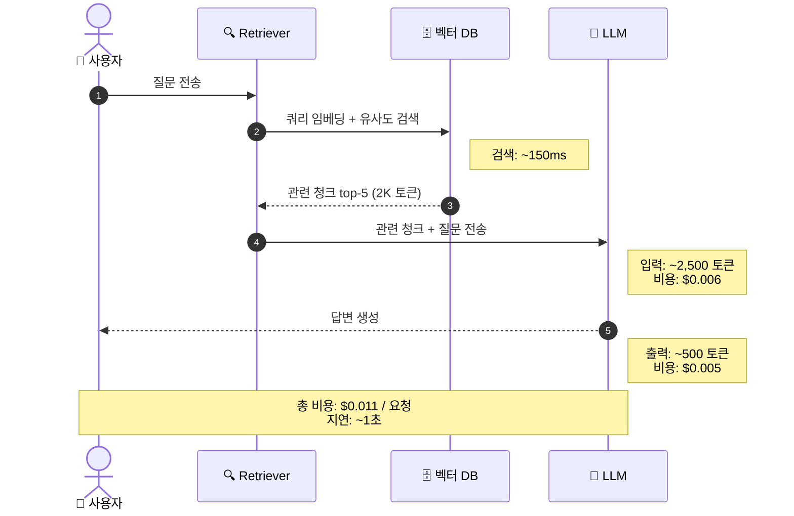
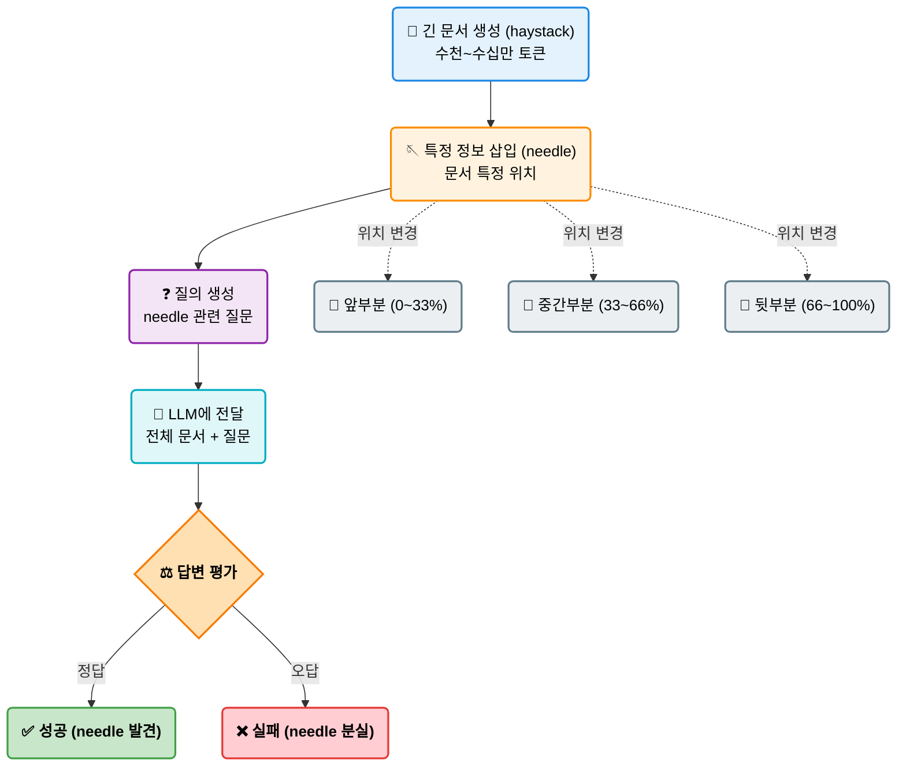
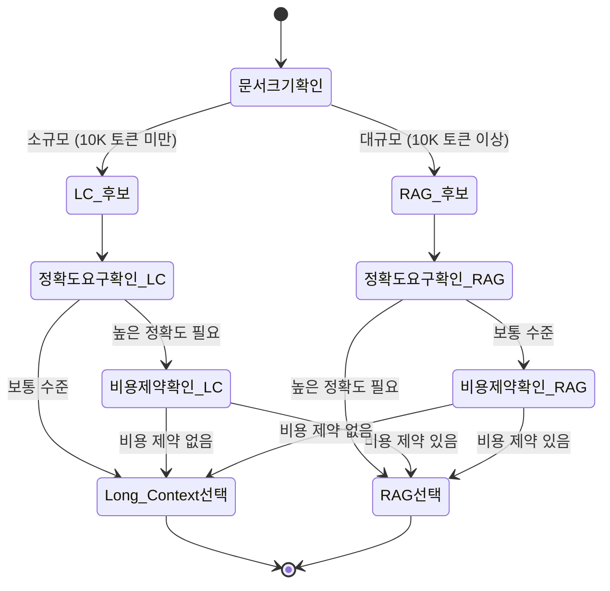
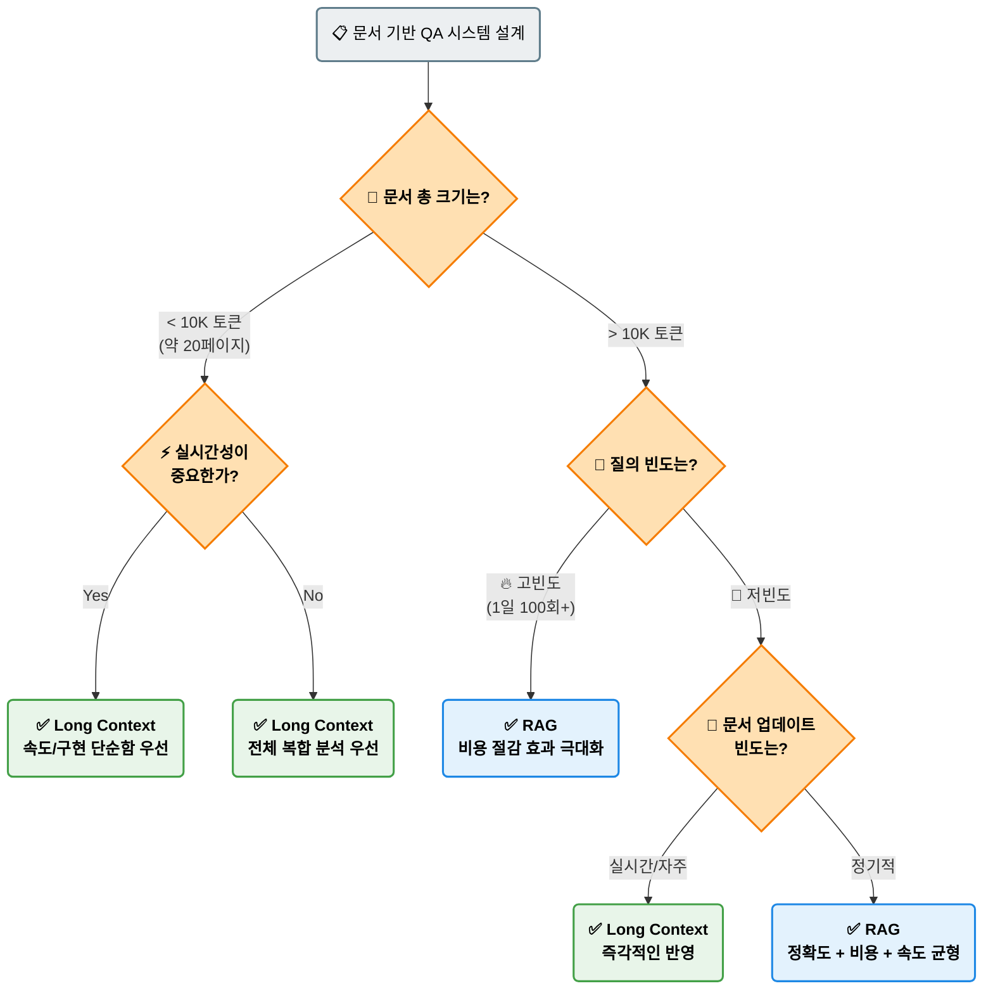
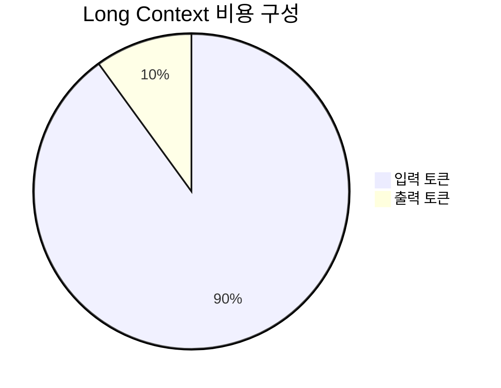
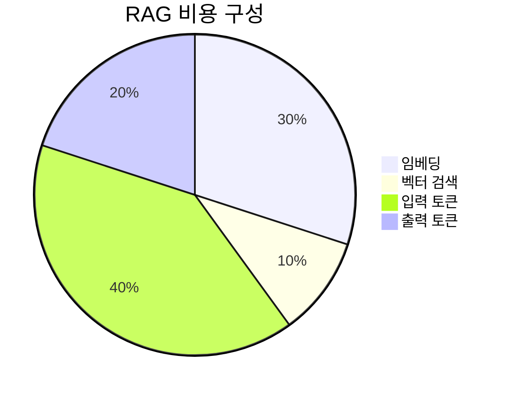

# EP09. Long Context vs RAG

## 200K 컨텍스트 시대, RAG가 정말 필요 없을까?

<br>

> **Claude 200K · Gemini 1M · GPT-4o 128K**
> 모델의 컨텍스트 창이 폭발적으로 커졌습니다.
> 그렇다면 문서를 통째로 넣으면 끝일까요?

<br>

| 구분 | 내용 |
|------|------|
| 난이도 | ⭐⭐⭐ |
| 학습 시간 | 약 60분 |
| 핵심 키워드 | NIAH, Lost-in-the-Middle, RAG, Stuff-All-In, Langfuse |

---

## 목차

1. 문제 제기: Long Context의 등장
2. Long Context vs RAG 개요 비교
3. Needle In A Haystack (NIAH) 테스트 원리
4. NIAH 실험 결과: Lost-in-the-Middle 문제
5. Long Context 실제 한계
6. 비용 비교 분석
7. 정확도 비교 실험
8. 지연시간(Latency) 비교
9. 비용·정확도·속도 3축 비교
10. 결론: 언제 무엇을 선택할 것인가
11. LangChain RAG 파이프라인 아키텍처
12. LangChain Stuff-All-In 아키텍처
13. Langfuse로 비용 자동 추적
14. Exercise 1: NIAH 실험 구현
15. Exercise 2: RAG vs Long Context 비교

---

## 1. 문제 제기: Long Context 모델의 등장

### "이제 RAG는 필요 없다?"

<br>

최근 LLM 컨텍스트 창 크기의 변화:

| 모델 | 출시 시기 | 컨텍스트 길이 |
|------|-----------|--------------|
| GPT-3.5 | 2022년 | 4K 토큰 |
| Claude 2 | 2023년 | 100K 토큰 |
| GPT-4o | 2024년 | 128K 토큰 |
| Claude 3 Opus | 2024년 | 200K 토큰 |
| Gemini 1.5 Pro | 2024년 | 1M 토큰 |
| Gemini 1.5 Ultra | 2024년 | 2M 토큰 |

<br>

> **A4 용지 1장 ≈ 500 토큰** → 200K = 약 400페이지 분량
> → 웬만한 사내 문서를 **통째로** 넣을 수 있게 되었습니다!

---

## 2. Long Context vs RAG 개요 비교

| 항목 | Long Context (Stuff-All-In) | RAG (Retrieval-Augmented Generation) |
|------|----------------------------|--------------------------------------|
| 동작 방식 | 문서 전체를 프롬프트에 삽입 | 질의와 유사한 청크만 검색 후 삽입 |
| 구현 복잡도 | 낮음 (간단) | 높음 (벡터DB, 임베딩 필요) |
| 비용 | 높음 (토큰 수 비례) | 낮음 (관련 청크만 사용) |
| 응답 속도 | 느림 (긴 컨텍스트 처리) | 빠름 (짧은 컨텍스트) |
| 정확도 | 중간 (위치에 따라 변동) | 높음 (관련 문서 집중) |
| 최신성 | 즉시 반영 | 인덱싱 주기에 의존 |
| 적합 케이스 | 소규모 문서, 전체 분석 | 대규모 문서, 특정 질의 |

<br>

**핵심 질문:** 단순히 "더 긴 컨텍스트 = 더 좋은 성능"일까요?





---

## 3. Needle In A Haystack (NIAH) 테스트 원리

NIAH 테스트: 긴 문서(haystack) 속에 숨겨진 정보(needle)를 찾을 수 있는가?



**실험 변수:**
- **문서 길이**: 1K ~ 200K 토큰
- **Needle 위치**: 문서 앞 / 중간 / 뒤
- **측정 지표**: 정답률 (Exact Match / Similarity Score)

---

## 4. NIAH 실험 결과: Lost-in-the-Middle 문제

### 핵심 발견: 문서 중간부분에서 성능이 급격히 저하됩니다

| Needle 위치 | 짧은 문서 (8K) | 중간 문서 (32K) | 긴 문서 (128K) |
|------------|--------------|----------------|----------------|
| 앞부분 (0~20%) | 98% | 95% | 91% |
| 중간부분 (40~60%) | 94% | **71%** | **52%** |
| 뒷부분 (80~100%) | 97% | 93% | 88% |

<br>

```
[문서 길이가 길수록 중간 정보는 "잊혀진다"]

앞 ████████████████████ 높은 정확도 (Primary Effect)
중 ██████████░░░░░░░░░░ 낮은 정확도 ← Lost-in-the-Middle
뒤 ████████████████████ 높은 정확도 (Recency Effect)
```

<br>

> **학술 근거:** "Lost in the Middle: How Language Models Use Long Contexts"
> (Liu et al., 2023) - 멀티-문서 QA에서 관련 문서가 중간에 있을 때 성능 최대 20% 저하

---

## 5. Long Context 실제 한계

### 3가지 핵심 제약

<br>

**① 비용 문제**
- 토큰 수 × 단가 = 비용
- 100K 토큰 문서를 1,000번 질의 → 막대한 비용 발생
- 문서 내용과 무관한 질의에도 전체 토큰 과금

**② 지연시간(Latency) 문제**
- 컨텍스트가 길수록 처리 시간 증가
- Attention 연산: O(n²) 복잡도
- 실시간 서비스에서 사용자 경험 저하

**③ 정확도(Accuracy) 문제**
- Lost-in-the-Middle 현상
- "Attention Dilution": 관련 없는 텍스트가 집중도 분산
- 긴 컨텍스트에서 환각(Hallucination) 증가 경향

---

## 6. 비용 비교 분석

### 실제 사용 시나리오: 100페이지 문서 (약 50K 토큰)에 1일 500회 질의

| 방식 | 입력 토큰/회 | 출력 토큰/회 | 일 비용 (GPT-4o) | 일 비용 (Claude Haiku) |
|------|-------------|-------------|-----------------|----------------------|
| Long Context | 50,000 | 500 | **$125.00** | **$31.25** |
| RAG (top-5) | 2,000 | 500 | **$6.25** | **$2.00** |
| **절감율** | - | - | **95% 절감** | **93.6% 절감** |

<br>

**토큰 단가 기준 (2024년 기준):**

| 모델 | 입력 (1M 토큰) | 출력 (1M 토큰) |
|------|---------------|---------------|
| GPT-4o | $2.50 | $10.00 |
| GPT-4o-mini | $0.15 | $0.60 |
| Claude 3.5 Haiku | $0.80 | $4.00 |
| Claude 3.5 Sonnet | $3.00 | $15.00 |

> RAG는 **관련 청크 2~3K 토큰**만 사용 → 비용이 압도적으로 낮음

---

## 7. 정확도 비교 실험

### NIAH 기반 정확도 측정 결과 (Exact Match Score)

| 실험 조건 | Long Context | RAG (top-3) | RAG (top-5) |
|-----------|-------------|-------------|-------------|
| 짧은 문서 (8K) | **0.95** | 0.88 | 0.91 |
| 중간 문서 (32K) | 0.78 | 0.85 | **0.89** |
| 긴 문서 (128K) | 0.61 | 0.82 | **0.87** |
| 중간 위치 needle | 0.52 | **0.83** | **0.86** |
| 복수 needle | 0.48 | 0.71 | **0.79** |

<br>

**결론:**
- 문서가 짧을 때 (< 10K): Long Context 우세
- 문서가 길거나 특정 정보 검색 시: RAG 우세
- Needle이 중간에 있을 때: RAG가 30%+ 더 정확

---

## 8. 지연시간(Latency) 비교

### 컨텍스트 길이별 평균 응답 시간 (초)

| 컨텍스트 크기 | Long Context | RAG 전처리 포함 | RAG 추론만 |
|-------------|-------------|----------------|-----------|
| 4K 토큰 | 1.2초 | 0.8초 | 0.6초 |
| 16K 토큰 | 2.8초 | 1.1초 | 0.7초 |
| 64K 토큰 | 8.5초 | 1.3초 | 0.8초 |
| 128K 토큰 | 18.2초 | 1.5초 | 0.9초 |
| 200K 토큰 | 32.0초+ | 1.8초 | 1.0초 |

<br>

**RAG 지연 구성 요소:**
```
[쿼리 임베딩: ~50ms] → [벡터 검색: ~100ms] → [LLM 추론: ~700ms]
                                                 총: ~850ms (고정)
```

> Long Context는 문서 크기에 비례하여 선형적으로 증가
> RAG는 문서 크기와 무관하게 **거의 일정한 응답 시간** 유지

---

## 9. 비용·정확도·속도 3축 비교

### 종합 성능 평가

| 평가 항목 | Long Context | RAG | 비고 |
|-----------|:---:|:---:|------|
| 비용 효율 | ★★☆☆☆ | ★★★★★ | RAG가 90%+ 절감 |
| 정확도 (단순) | ★★★★☆ | ★★★☆☆ | 짧은 문서에서 LC 우세 |
| 정확도 (복잡) | ★★☆☆☆ | ★★★★☆ | 긴 문서에서 RAG 우세 |
| 응답 속도 | ★★☆☆☆ | ★★★★☆ | RAG가 4~30배 빠름 |
| 구현 난이도 | ★★★★★ | ★★☆☆☆ | LC가 구현 단순 |
| 최신 문서 반영 | ★★★★★ | ★★★☆☆ | LC가 즉시 반영 |
| 확장성 | ★★☆☆☆ | ★★★★★ | RAG는 무한 확장 가능 |

<br>

> **핵심 인사이트:** "실버 불릿은 없다. 상황에 맞는 선택이 중요하다."



---

## 10. 결론: 언제 무엇을 선택할 것인가



---

## 11. LangChain RAG 파이프라인 아키텍처

```mermaid
flowchart LR
    subgraph Indexing ["📚 인덱싱 파이프라인 (오프라인)"]
        direction LR
        D(/"📄 문서 (Documents)"\):::doc --> S("✂️ 청킹 (TextSplitter)"):::process
        S --> E("🧠 임베딩 (Embeddings)"):::model
        E --> V[("🗄️ 벡터 DB (ChromaDB)")]:::db
    end
    
    subgraph Retrieval ["🔍 검색 및 생성 파이프라인 (온라인)"]
        direction LR
        Q(("👤 사용자 질의")):::query --> QE("🧠 쿼리 임베딩"):::model
        QE --> VS("🔍 유사도 검색 (top-k)"):::search
        V -.-> VS
        VS --> P{"✨ 질의 + 청크 조합"}:::merge
        P --> LLM("🤖 LLM (GPT/Claude)"):::llm
        LLM --> A(["🎯 최종 답변"]):::ans
    end
    
    classDef doc fill:#eceff1,stroke:#90a4ae,stroke-width:2px,color:#000
    classDef process fill:#bbdefb,stroke:#1e88e5,stroke-width:2px,color:#000
    classDef model fill:#e1bee7,stroke:#8e24aa,stroke-width:2px,color:#000
    classDef db fill:#ffcc80,stroke:#f57c00,stroke-width:2px,color:#000
    classDef query fill:#b2ebf2,stroke:#00acc1,stroke-width:2px,color:#000
    classDef search fill:#ffecb3,stroke:#ffb300,stroke-width:2px,color:#000
    classDef merge fill:#f8bbd0,stroke:#d81b60,stroke-width:2px,color:#000
    classDef llm fill:#c5cae9,stroke:#3f51b5,stroke-width:2px,color:#000
    classDef ans fill:#c8e6c9,stroke:#43a047,stroke-width:2px,font-weight:bold,color:#000
```

**LangChain 주요 컴포넌트:**
- `CharacterTextSplitter` / `RecursiveCharacterTextSplitter`
- `OpenAIEmbeddings` / `HuggingFaceEmbeddings`
- `Chroma` / `FAISS` / `Pinecone`
- `RetrievalQA` / `ConversationalRetrievalChain`

---

## 12. LangChain Stuff-All-In 아키텍처

```mermaid
flowchart LR
    subgraph Stuffing ["📥 Stuff-All-In 아키텍처"]
        direction LR
        D(/"📄 전체 문서 (Raw Text)"\):::doc --> T("🔢 토큰 수 확인 (tiktoken)"):::check
        T --> C{"한도 초과?"}:::decide
        C -->|"No"| P{"프롬프트 전체 삽입"}:::insert
        C -->|"Yes"| TR("✂️ 자르기 (Truncation)\n또는 Map-Reduce"):::process
        P --> LLM("🤖 대용량 LLM 호출"):::llm
        TR --> LLM
        LLM --> A(["🎯 답변"]):::ans
    end
    
    classDef doc fill:#eceff1,stroke:#90a4ae,stroke-width:2px,color:#000
    classDef check fill:#e1bee7,stroke:#8e24aa,stroke-width:2px,color:#000
    classDef decide fill:#ffcc80,stroke:#f57c00,stroke-width:2px,font-weight:bold,color:#000
    classDef insert fill:#bbdefb,stroke:#1e88e5,stroke-width:2px,color:#000
    classDef process fill:#ffcdd2,stroke:#e53935,stroke-width:2px,color:#000
    classDef llm fill:#c5cae9,stroke:#3f51b5,stroke-width:2px,color:#000
    classDef ans fill:#c8e6c9,stroke:#43a047,stroke-width:2px,font-weight:bold,color:#000
```

<br>

**LangChain Stuff Chain 코드:**
```python
from langchain.chains.summarize import load_summarize_chain
from langchain.chains import StuffDocumentsChain

# Stuff 방식: 모든 문서를 하나의 프롬프트로
chain = load_summarize_chain(llm, chain_type="stuff")

# Map-Reduce 방식: 문서 초과 시 자동 분할
chain = load_summarize_chain(llm, chain_type="map_reduce")
```

---

## 13. Langfuse로 비용 자동 추적

### CallbackHandler 방식 (Python SDK v3+)

```python
import os
from langfuse.callback import CallbackHandler
from langchain_anthropic import ChatAnthropic
from langchain_core.prompts import ChatPromptTemplate

# Langfuse 콜백 핸들러 초기화
langfuse_handler = CallbackHandler(
    public_key=os.environ["LANGFUSE_PUBLIC_KEY"],
    secret_key=os.environ["LANGFUSE_SECRET_KEY"],
    host="https://cloud.langfuse.com"
)

# LLM에 콜백 등록
llm = ChatAnthropic(
    model="claude-haiku-4-5-20251001",
    callbacks=[langfuse_handler]
)

# 체인 실행 시 자동으로 토큰/비용 추적
chain = prompt | llm
response = chain.invoke(
    {"question": "What is RAG?"},
    config={"callbacks": [langfuse_handler]}
)
```

**Langfuse 대시보드에서 확인 가능:**
- 입력/출력 토큰 수
- 모델별 비용 (USD)
- 응답 지연시간
- 실험 간 비용 비교





---

## Exercise 1: NIAH 실험 직접 구현

### 목표: Needle In A Haystack 테스트를 직접 구현하고 위치별 정확도를 측정한다

<br>

**구현 단계:**

1. **Haystack 생성**: 랜덤 텍스트로 원하는 길이의 문서 생성
   - 길이 변형: 8K / 32K / 64K 토큰
   
2. **Needle 삽입**: 특정 정보를 문서의 앞/중간/뒤에 삽입
   ```
   Needle 예시: "피자집 비밀번호는 7749입니다."
   ```

3. **Long Context 방식으로 질의**: 전체 문서 + 질문 전송

4. **RAG 방식으로 질의**: 문서 청킹 → 검색 → 질의

5. **결과 비교**: 위치별, 방식별 정확도 측정

<br>

**제출 기준:** 최소 3가지 needle 위치 × 2가지 문서 길이 = 6가지 실험 결과

---

## Exercise 2: RAG vs Long Context 비용/정확도 비교

### 목표: 실제 문서로 두 방식의 비용, 정확도, 속도를 정량적으로 비교한다

<br>

**구현 단계:**

1. **실제 문서 준비**: PDF 또는 텍스트 파일 (10페이지 이상)

2. **RAG 파이프라인 구축**:
   - `CharacterTextSplitter`로 청킹
   - `ChromaDB` 인덱싱
   - `RetrievalQA` 체인 구성

3. **Long Context 파이프라인 구축**:
   - `tiktoken`으로 토큰 수 확인
   - 전체 문서 직접 삽입

4. **비교 측정** (각 10회 이상):
   - 정확도: Exact Match 또는 LLM-as-Judge
   - 비용: tiktoken으로 토큰 수 계산 후 단가 적용
   - 속도: `time.perf_counter()` 측정

5. **Langfuse 통합**: 모든 실험 결과를 Langfuse에 자동 기록

<br>

**보너스:** Claude Haiku vs GPT-4o-mini 모델 간 비교도 추가
