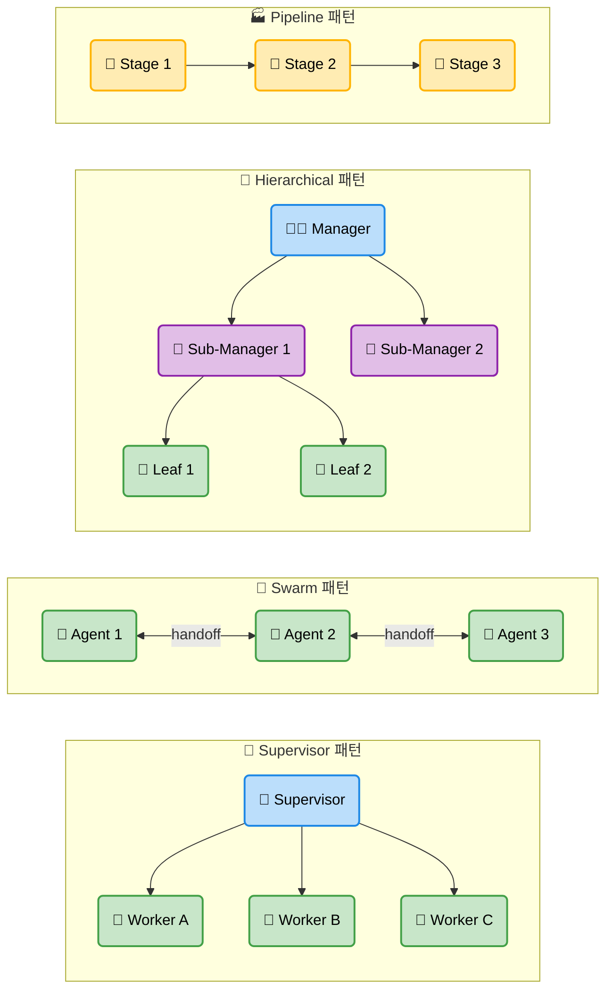
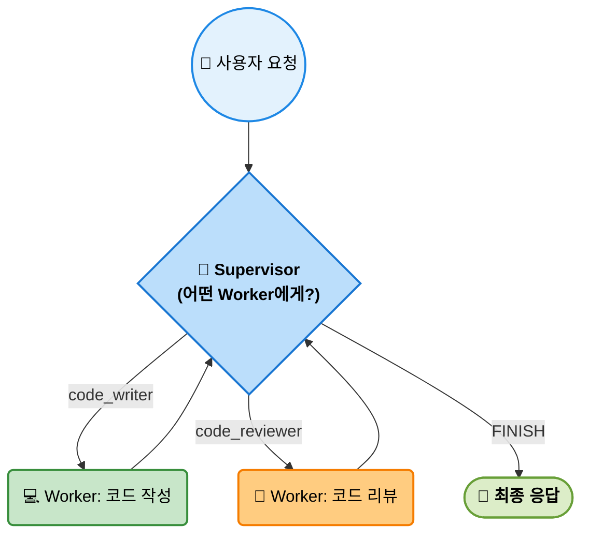
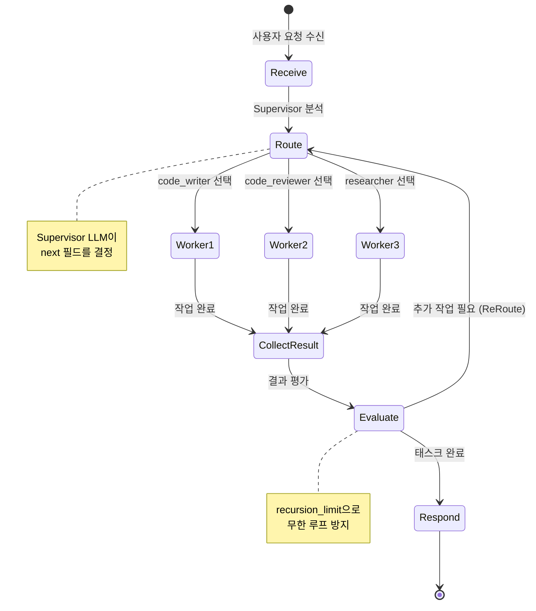
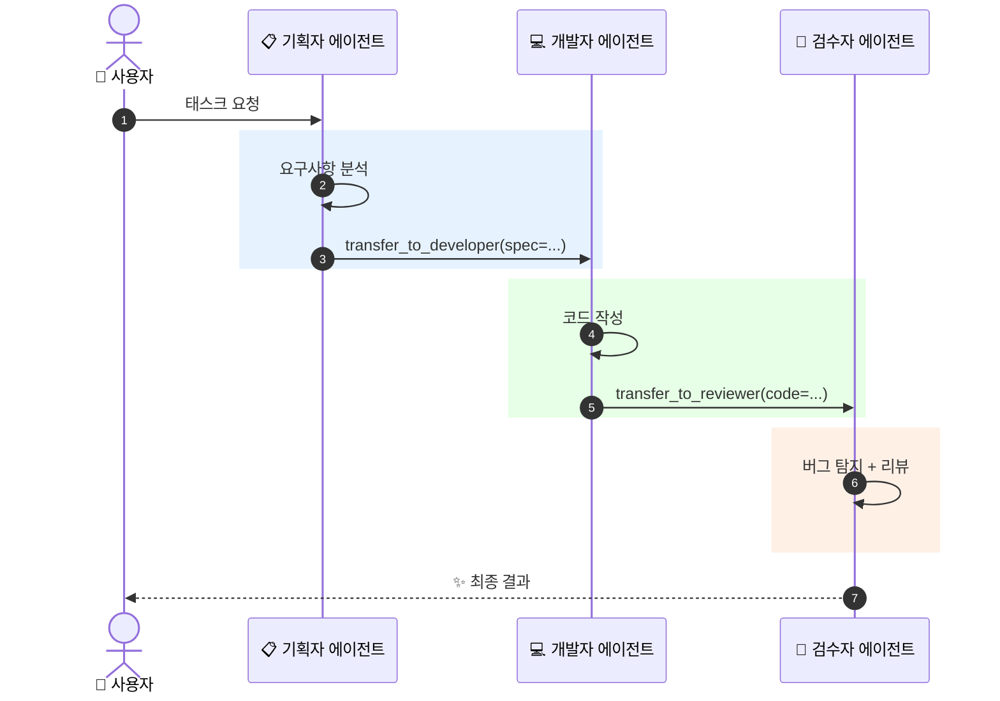
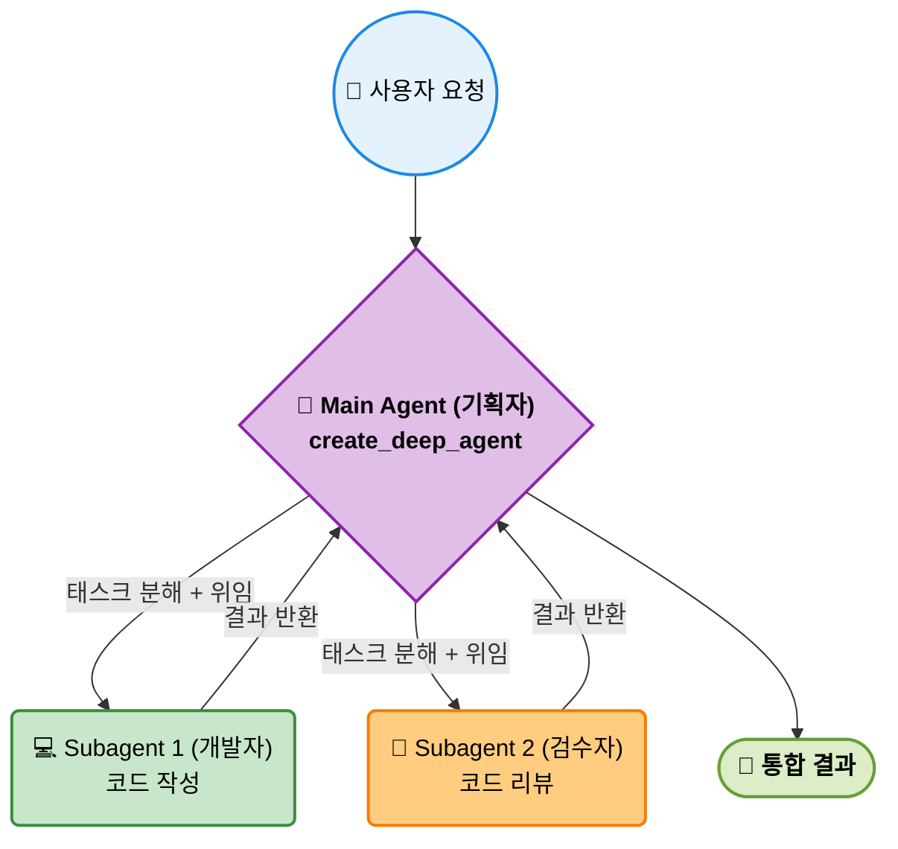
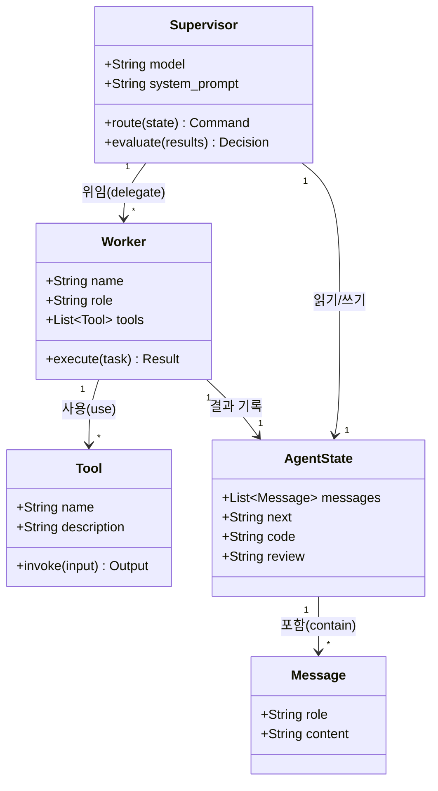
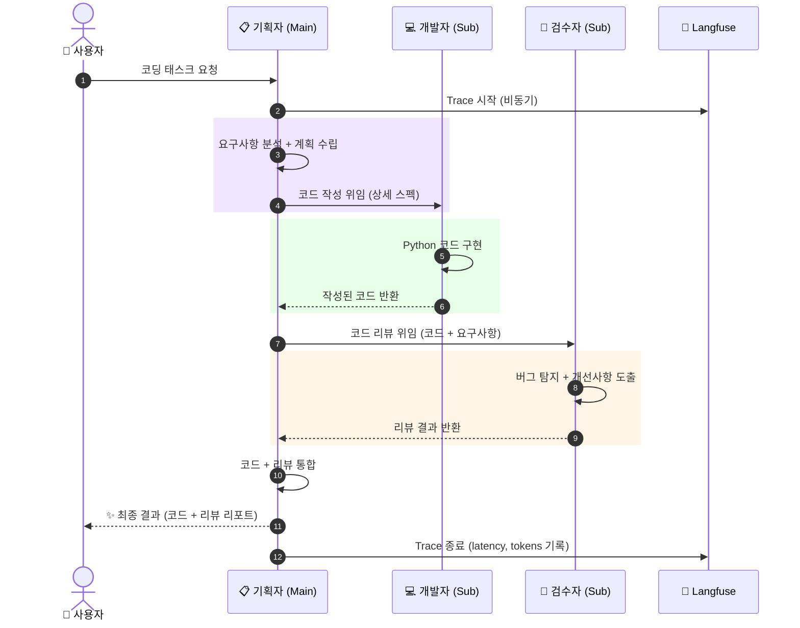
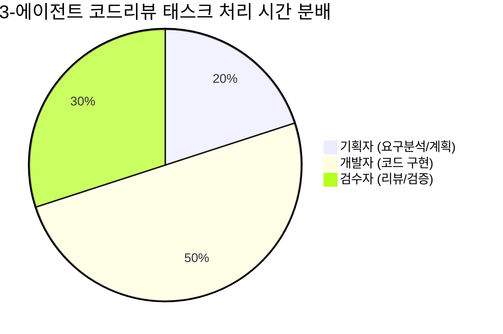
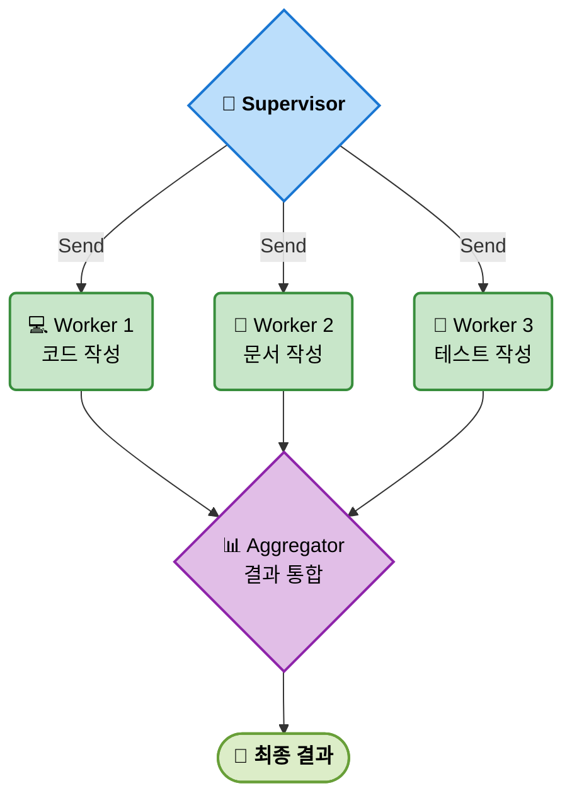

# EP10. 멀티 에이전트 시스템 심화

## 기획자 AI, 개발자 AI, 검수자 AI를 한 팀으로

> LangGraph · deepagents · Langfuse로 3-에이전트 코드 리뷰 파이프라인 구축

난이도: ⭐⭐⭐

---

## 1. 단일 에이전트의 한계

**복잡한 태스크를 혼자 처리할 때 생기는 문제**

| 문제 | 원인 | 영향 |
|------|------|------|
| **컨텍스트 과부하** | 긴 대화 기록 + 도구 결과 누적 | 핵심 정보 망각 |
| **전문성 부재** | 단일 시스템 프롬프트의 한계 | 범용적 → 피상적 답변 |
| **순차 처리 병목** | 모든 단계를 하나의 루프가 담당 | 속도 저하 |
| **오류 전파** | 앞 단계 실수가 뒤 단계로 그대로 흐름 | 최종 품질 저하 |

**결론**: 복잡한 실무 태스크는 *역할 분리된 팀*이 필요하다

---

## 2. 멀티 에이전트 패턴 분류



---

## 3. 역할 분리의 3가지 장점

**① 전문화 (Specialization)**
- 각 에이전트에 특화된 시스템 프롬프트 적용
- 예: 코드 작성 전문가 / 보안 리뷰 전문가 / 테스트 전문가

**② 병렬 처리 (Parallelism)**
- 독립적인 태스크를 동시에 실행 → 전체 처리 시간 단축
- LangGraph의 `Send` API로 팬아웃(fan-out) 구현 가능

**③ 오류 격리 (Error Isolation)**
- 한 에이전트의 실패가 전체 파이프라인을 멈추지 않음
- 각 노드에서 독립적인 재시도/폴백 로직 적용 가능

---

## 4. LangGraph Supervisor 패턴

Supervisor가 요청을 분석하고 적절한 Worker에게 위임



- Supervisor는 LLM이 `next` 필드를 결정 → `Command(goto=next)`
- Worker가 작업 완료 후 결과를 State에 기록 → Supervisor로 복귀
- `recursion_limit`으로 무한 루프 방지



---

## 5. LangGraph Swarm 패턴 (handoff 기반)

에이전트가 자율적으로 다음 에이전트에게 제어권을 넘김



- `transfer_to_*` 도구를 통해 자연스러운 핸드오프
- 각 에이전트는 자신의 작업이 끝나면 다음 전문가를 호출
- 중앙 오케스트레이터 없이도 파이프라인 구성 가능

---

## 6. deepagents: create_deep_agent + subagents 구조



```python
from deepagents import create_deep_agent

agent = create_deep_agent(
    model="anthropic:claude-haiku-4-5-20251001",
    tools=[...],
    system_prompt="당신은 기획자입니다...",
    subagents=[
        {"name": "developer", "description": "코드 작성", "model": "...", ...},
        {"name": "reviewer", "description": "코드 리뷰", "model": "...", ...},
    ]
)
```

---

## 7. deepagents의 Planning 능력

**태스크 분해 → 서브에이전트 위임의 흐름**

```
사용자: "정렬 알고리즘 구현 후 리뷰해줘"
          ↓
Main Agent (기획자)
  1. 태스크 분석: 코드 작성 + 리뷰 필요
  2. 계획 수립:
     - Step 1 → developer 서브에이전트에 위임
     - Step 2 → reviewer 서브에이전트에 위임
  3. 서브에이전트 순차 실행
  4. 결과 통합 및 최종 답변 생성
```

**deepagents가 자동으로 처리하는 것**
- 태스크 분해 (Planning)
- 서브에이전트 선택 및 호출 순서 결정
- 결과 수집 및 통합

---

## 8. LangGraph vs deepagents 비교

| 항목 | LangGraph | deepagents |
|------|-----------|------------|
| **추상화 수준** | 저수준 (세밀한 제어) | 고수준 (높은 추상화) |
| **그래프 정의** | 명시적 (StateGraph, 노드/엣지) | 암묵적 (자동 플래닝) |
| **에이전트 통신** | State 공유 / Command | 메시지 기반 (subagents 호출) |
| **병렬 처리** | Send API로 수동 구현 | 자동 (Planning 단계에서 결정) |
| **디버깅** | 노드 단위 세밀 추적 | 상위 수준 트레이싱 |
| **코드 복잡도** | 높음 | 낮음 |
| **적합한 케이스** | 복잡한 조건 분기, 정밀 제어 | 빠른 프로토타입, 위임 중심 |

**선택 기준**: 파이프라인 구조가 고정적 → LangGraph / 동적 위임 → deepagents

---

## 9. 에이전트 간 통신 프로토콜

**LangGraph: State 기반 통신**

```python
class AgentState(TypedDict):
    messages: Annotated[list, add_messages]
    next: str          # 다음 에이전트 지정
    code: str          # 작성된 코드 전달
    review: str        # 리뷰 결과 전달
```

**deepagents: 메시지 기반 통신**

```
Main Agent → Subagent: 자연어 지시문 + 컨텍스트
Subagent → Main Agent: 결과 메시지 반환
```

| 특성 | State 기반 | 메시지 기반 |
|------|-----------|------------|
| 데이터 구조화 | TypedDict로 명시적 | 자연어 + 비정형 |
| 타입 안전성 | 높음 | 낮음 |
| 유연성 | 낮음 | 높음 |



---

## 10. 3-에이전트 코드 리뷰 파이프라인 아키텍처



---

## 11. 실습: 3-에이전트 deepagents 구현

```python
from deepagents import create_deep_agent

code_review_agent = create_deep_agent(
    model="anthropic:claude-haiku-4-5-20251001",
    tools=[],
    system_prompt="""당신은 소프트웨어 기획자입니다.
    복잡한 코딩 태스크를 개발자와 검수자에게 위임하여 완성합니다.""",
    subagents=[
        {
            "name": "developer",
            "description": "Python 코드를 작성하는 전문 개발자",
            "model": "anthropic:claude-haiku-4-5-20251001",
            "system_prompt": "당신은 Python 개발 전문가입니다. "
                             "클린하고 효율적인 코드를 작성하세요.",
            "tools": [],
        },
        {
            "name": "reviewer",
            "description": "코드를 리뷰하고 버그를 탐지하는 검수자",
            "model": "anthropic:claude-haiku-4-5-20251001",
            "system_prompt": "당신은 시니어 코드 리뷰어입니다. "
                             "버그, 보안 취약점, 성능 문제를 찾아내세요.",
            "tools": [],
        },
    ]
)
```

---

## 12. Langfuse로 멀티에이전트 트레이싱

멀티에이전트 실행 흐름이 **트리 구조**로 시각화됨

```
Trace (루트)
├── Span: Main Agent (기획자)
│   ├── LLM: 요구사항 분석
│   ├── Span: Subagent - developer
│   │   └── LLM: 코드 작성
│   ├── Span: Subagent - reviewer
│   │   └── LLM: 코드 리뷰
│   └── LLM: 결과 통합
```

```python
from langfuse.langchain import CallbackHandler

langfuse_handler = CallbackHandler(
    tags=["ep10", "multi-agent", "code-review"],
    session_id="code-review-session",
)

result = code_review_agent.invoke(
    {"messages": [{"role": "user", "content": "피보나치 함수 구현해줘"}]},
    config={"callbacks": [langfuse_handler]},
)
```

---

## 13. 성능 측정: 단일 vs 멀티 에이전트

**LLM-as-Judge로 0~10점 품질 평가**

| 태스크 | 단일 에이전트 점수 | 멀티 에이전트 점수 | 향상 |
|--------|-----------------|-----------------|------|
| 피보나치 구현 | 6.2 | 8.7 | **+40%** |
| 퀵소트 구현 | 5.8 | 8.5 | **+47%** |
| API 클라이언트 | 5.1 | 8.9 | **+75%** |
| **평균** | **5.7** | **8.7** | **+53%** |

**개선 요인**:
- 개발자 에이전트: 구현에만 집중 → 코드 품질 향상
- 검수자 에이전트: 독립적 시각 → 더 많은 버그 발견
- 기획자 에이전트: 명확한 요구사항 전달 → 방향성 오류 감소



---

## 14. 실전 deepagents: 모델 선택 전략

**서브에이전트별 최적 모델 할당**

| 에이전트 역할 | 권장 모델 | 이유 |
|-------------|----------|------|
| Main Agent (기획자) | claude-opus-4-5 | 복잡한 계획 수립, 높은 추론 능력 |
| Developer (개발자) | claude-haiku-4-5 | 코드 생성은 빠른 모델로 충분 |
| Reviewer (검수자) | claude-haiku-4-5 | 패턴 매칭 기반, 저렴하게 처리 |

**비용 최적화 전략**

```python
code_review_agent = create_deep_agent(
    model="anthropic:claude-opus-4-5",      # 기획: 고성능
    tools=[],
    system_prompt="...",
    subagents=[
        {
            "name": "developer",
            "model": "anthropic:claude-haiku-4-5-20251001",  # 개발: 저비용
            ...
        },
        {
            "name": "reviewer",
            "model": "anthropic:claude-haiku-4-5-20251001",  # 검수: 저비용
            ...
        },
    ]
)
```

---

## 15. 병렬 처리: LangGraph Send API

독립적인 태스크를 동시에 실행하여 전체 처리 시간 단축



```python
from langgraph.types import Send

def supervisor_fanout(state: AgentState):
    """여러 Worker에게 동시에 태스크 분배"""
    tasks = state["tasks"]
    return [Send("worker", {"task": t}) for t in tasks]

builder.add_conditional_edges(
    "supervisor",
    supervisor_fanout,     # 팬아웃 → 병렬 실행
    ["worker"]
)
```

**효과**: 3개 Worker 직렬 실행 대비 최대 3배 속도 향상

---

## 16. 멀티에이전트 멀티모달 확장

**이미지 + 텍스트를 처리하는 멀티에이전트**

```python
subagents=[
    {
        "name": "vision_analyzer",
        "description": "스크린샷/다이어그램을 분석하는 에이전트",
        "model": "anthropic:claude-haiku-4-5-20251001",
        "system_prompt": "이미지를 분석하여 UI 버그와 개선사항을 찾으세요.",
        "tools": [],
    },
    {
        "name": "code_fixer",
        "description": "분석 결과를 바탕으로 코드를 수정하는 에이전트",
        "model": "anthropic:claude-haiku-4-5-20251001",
        "system_prompt": "분석 결과를 바탕으로 수정된 코드를 제공하세요.",
        "tools": [],
    },
]
```

**활용 사례**
- UI 버그: 스크린샷 → 버그 분석 → 코드 수정
- 문서 처리: PDF 파싱 → 내용 요약 → 보고서 생성
- 코드 리뷰: 코드 시각화 → 아키텍처 분석 → 개선안 제시

---

## 17. 멀티에이전트 설계 시 주의사항

**⚠️ 무한 핑퐁 (Infinite Loop)**
- 에이전트들이 서로에게 계속 위임하는 상황
- 해결: `recursion_limit` 설정 (LangGraph 기본값: 25)

```python
result = graph.invoke(input, config={"recursion_limit": 10})
```

**⚠️ 비용 폭발 (Cost Explosion)**
- 에이전트 수 × 호출 수 × 토큰 = 예상보다 큰 비용
- 해결: 저렴한 모델(`claude-haiku`) 사용, 컨텍스트 압축

**⚠️ 컨텍스트 중복 전달**
- 동일한 정보를 여러 에이전트에게 반복 전송
- 해결: 핵심 요약만 전달, 전체 히스토리 공유 지양

**⚠️ 오케스트레이터 단일 장애점**
- Supervisor/Main Agent 실패 시 전체 중단
- 해결: 폴백 에이전트 또는 타임아웃 + 재시도 로직

---

## 18. Exercise 1: LangGraph Supervisor로 2-에이전트 파이프라인

**목표**: LangGraph `StateGraph`와 `Command`를 사용하여 Supervisor + 2 Worker 패턴을 직접 구현한다

**단계**:
1. `AgentState` TypedDict 정의 (`messages`, `next`, `output` 포함)
2. Supervisor 에이전트 노드 구현 (다음 Worker를 `Command(goto=...)`로 결정)
3. Worker 1: 코드 작성 에이전트 구현 (`claude-haiku-4-5` 사용)
4. Worker 2: 코드 리뷰 에이전트 구현
5. `StateGraph`에 노드 등록 및 조건부 엣지 연결
6. `recursion_limit=8`로 3가지 코딩 태스크 실행
7. Langfuse에서 각 실행의 트레이스 트리 확인

**제출**: 실행 결과 스크린샷 + Supervisor가 어떤 근거로 Worker를 선택했는지 분석

---

## 19. Exercise 2: deepagents 서브에이전트로 연구 → 작성 파이프라인

**목표**: `create_deep_agent`의 `subagents`를 활용하여 연구자 → 작성자 파이프라인을 구축한다

**단계**:
1. Main Agent: 주제 분석 + 파이프라인 조율 (기획자 역할)
2. Subagent 1 (`researcher`): 주제 관련 정보 수집 및 요약
3. Subagent 2 (`writer`): 수집된 정보로 구조화된 문서 작성
4. 3가지 주제로 테스트: "Python async/await", "LangGraph 핵심 개념", "벡터 데이터베이스 비교"
5. 단일 에이전트 결과와 품질 비교 (LLM-as-Judge 0~10점)
6. Langfuse `CallbackHandler`로 트레이싱 + `score` 기록

**기대 결과**: 단일 에이전트 대비 구조화 품질 30% 이상 향상

**제출**: 3가지 주제 결과물 + Langfuse 트레이스 스크린샷 + 단일 vs 멀티 품질 비교표

---

## 정리 & 마무리

**오늘 배운 것**

- 단일 에이전트의 한계와 멀티 에이전트가 필요한 이유
- LangGraph: Supervisor / Swarm 패턴 및 State 기반 통신
- deepagents: `create_deep_agent` + `subagents`로 빠른 멀티에이전트 구현
- 3-에이전트 코드 리뷰 파이프라인 (기획자 → 개발자 → 검수자)
- Langfuse로 멀티에이전트 트레이스 트리 시각화
- 무한 핑퐁 방지, 비용 최적화 등 실전 주의사항

**다음 EP11**: RAG + Context Engineering + deepagents를 통합한 사규 마스터 에이전트 종합 프로젝트

> 전체 코드는 GitHub 레포에서, 심화 내용은 커뮤니티에서
