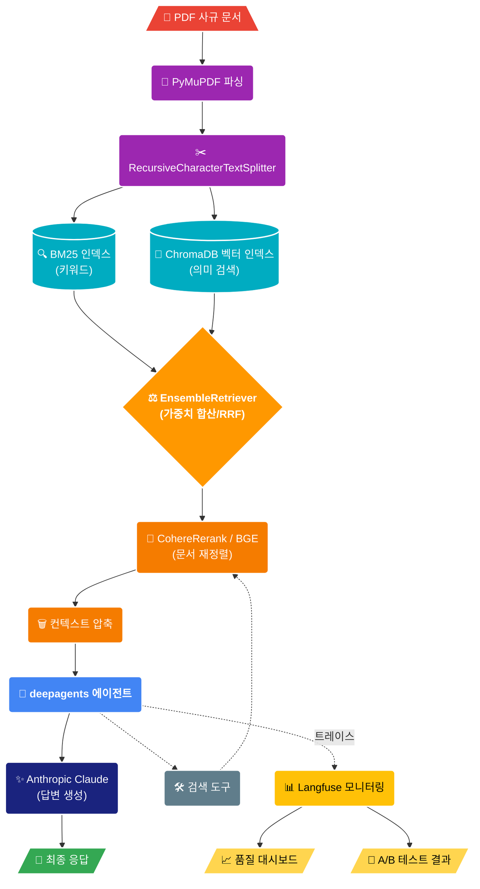
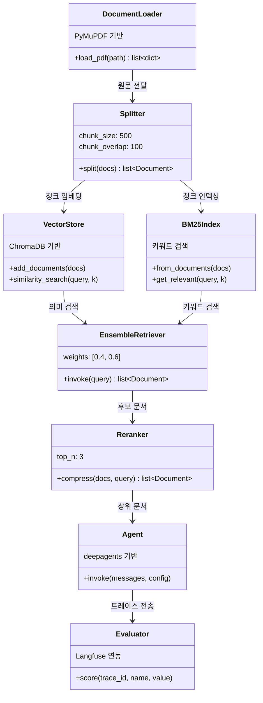
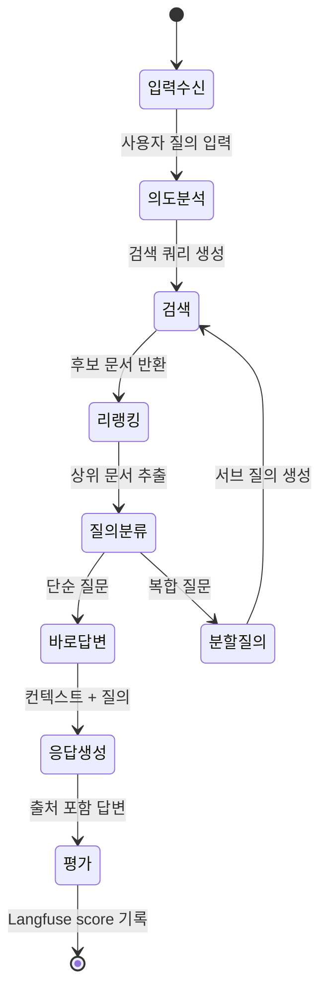
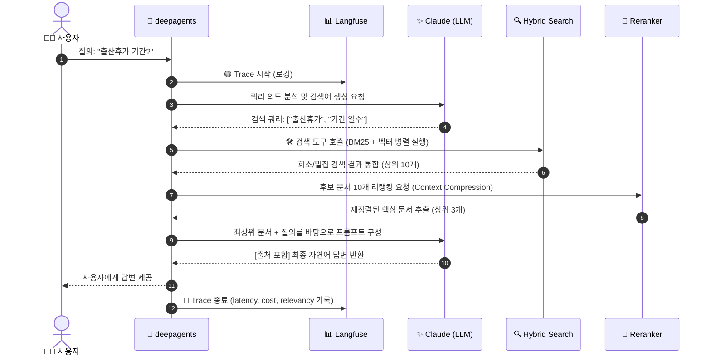
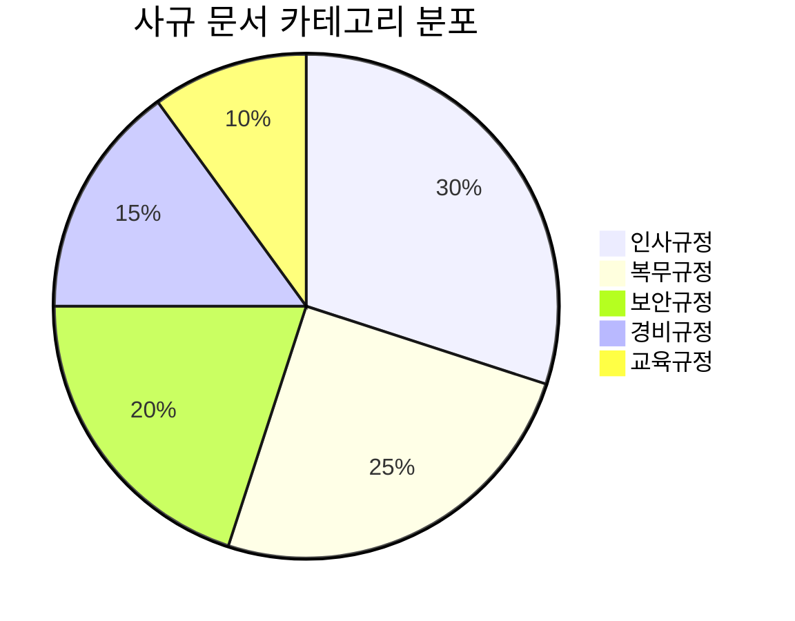
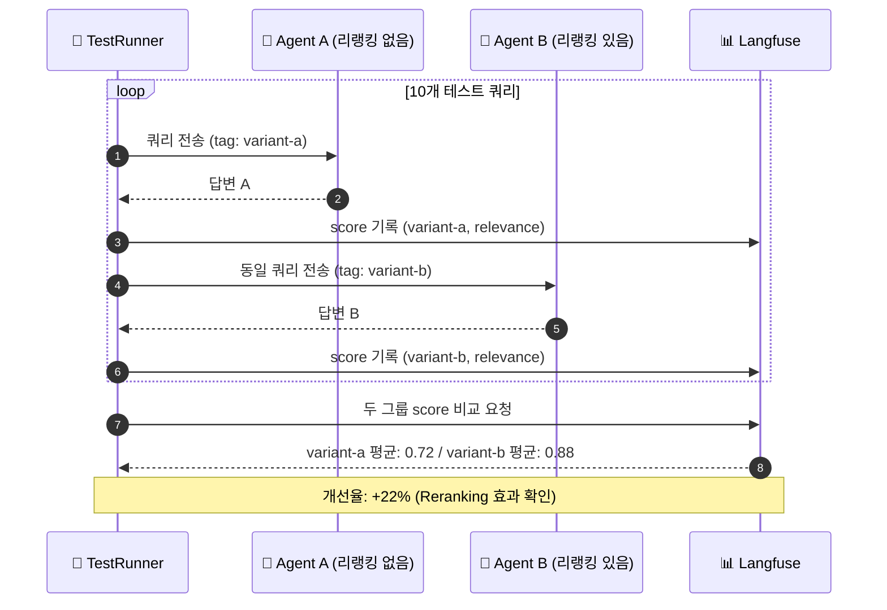
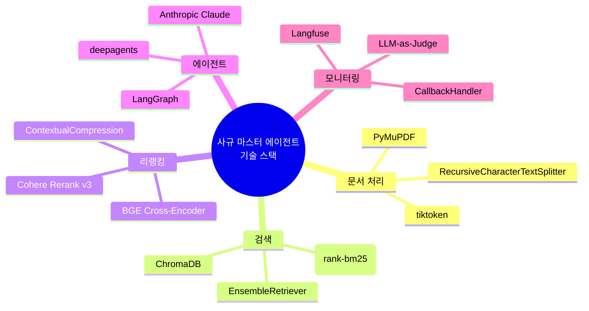

# EP11. 종합 프로젝트: 사규 마스터 에이전트

## RAG + Context Engineering으로 우리 회사 사규를 완전 정복

> Hybrid Search · Reranking · deepagents · Langfuse 모니터링을 하나로 통합

난이도: ⭐⭐⭐

---

## 1. 프로젝트 개요

**배경**: 회사에 사규(취업규칙, 인사규정, 보안정책 등)가 있지만

- 직원들이 어디에 있는지 모름
- HR에 매번 물어봐야 함
- 검색해도 관련 없는 문서만 나옴

**목표**: PDF 형태의 사규 문서를 업로드하면, 자연어로 질의응답이 가능한 **사규 마스터 에이전트** 구축

**핵심 가치**:
- HR 부서 반복 문의 80% 감소
- 신입사원 온보딩 시간 단축
- 규정 준수 리스크 감소

---

## 2. 요구사항 분석

**기능 요구사항**

| 번호 | 요구사항 | 우선순위 |
|------|---------|---------|
| F-01 | PDF 사규 문서 업로드 및 인덱싱 | 필수 |
| F-02 | 자연어 질의응답 (한국어) | 필수 |
| F-03 | 관련 규정 조항 출처 명시 | 필수 |
| F-04 | 복잡한 조건부 규정 멀티스텝 추론 | 필수 |
| F-05 | 유사 규정 비교 답변 | 권장 |
| F-06 | 응답 품질 모니터링 | 필수 |
| F-07 | A/B 테스트 (검색 전략 비교) | 권장 |

---

## 3. 전체 아키텍처 다이어그램





---

## 4. 컴포넌트별 기술 선택 이유

| 컴포넌트 | 선택 기술 | 선택 이유 |
|---------|-----------|---------|
| **PDF 파싱** | PyMuPDF | 표/이미지 처리, 레이아웃 보존 |
| **청크 분할** | RecursiveCharacterTextSplitter | 의미 단위 보존, 한국어 최적화 |
| **키워드 검색** | BM25 (rank-bm25) | 정확한 조항 번호/용어 검색 |
| **벡터 검색** | ChromaDB | 로컬 실행, 영속성, 빠른 설정 |
| **임베딩** | HuggingFace (multilingual) | 한국어 지원, 무료 |
| **Reranking** | CohereRerank / BGE | 검색 정확도 30~50% 향상 |
| **에이전트** | deepagents | 멀티스텝 추론, 서브에이전트 |
| **모니터링** | Langfuse | 오픈소스, 셀프호스팅 가능 |

---

## 5. Phase 1: 문서 수집 및 전처리

```python
import fitz  # PyMuPDF
from langchain.text_splitter import RecursiveCharacterTextSplitter

def load_pdf_documents(pdf_path: str) -> list[dict]:
    """PyMuPDF로 PDF 로드 및 메타데이터 추출"""
    doc = fitz.open(pdf_path)
    pages = []
    for i, page in enumerate(doc):
        text = page.get_text("text")
        pages.append({
            "content": text,
            "metadata": {
                "source": pdf_path,
                "page": i + 1,
                "total_pages": len(doc),
            }
        })
    return pages

# 한국어에 최적화된 청크 분할
splitter = RecursiveCharacterTextSplitter(
    chunk_size=500,
    chunk_overlap=100,
    separators=["\n\n", "\n", ".", "。", " ", ""],
)
```

---

## 6. Phase 2: Hybrid Search 구현

BM25 (키워드) + ChromaDB (벡터)를 결합하여 검색 정확도 극대화

```python
from langchain_community.retrievers import BM25Retriever
from langchain_community.vectorstores import Chroma
from langchain.retrievers import EnsembleRetriever
from langchain_community.embeddings import HuggingFaceEmbeddings

# BM25 인덱스
bm25_retriever = BM25Retriever.from_documents(documents)
bm25_retriever.k = 5

# 벡터 인덱스 (ChromaDB)
embeddings = HuggingFaceEmbeddings(
    model_name="snunlp/KR-ELECTRA-discriminator"  # 한국어 특화
)
vectorstore = Chroma.from_documents(documents, embeddings)
vector_retriever = vectorstore.as_retriever(search_kwargs={"k": 5})

# EnsembleRetriever로 통합 (BM25 40% + 벡터 60%)
ensemble_retriever = EnsembleRetriever(
    retrievers=[bm25_retriever, vector_retriever],
    weights=[0.4, 0.6]
)
```

---

## 7. Phase 3: Reranking 통합

검색된 후보 문서를 재순위화하여 가장 관련성 높은 문서를 상위에 배치

```python
from langchain.retrievers import ContextualCompressionRetriever
from langchain_cohere import CohereRerank

# Cohere Rerank (API 키 필요)
compressor = CohereRerank(
    model="rerank-multilingual-v3.0",
    top_n=3,   # 최종 3개 문서만 반환
)

# 또는 BGE Cross-Encoder (무료, 로컬 실행)
# from langchain.retrievers.document_compressors import CrossEncoderReranker
# from langchain_community.cross_encoders import HuggingFaceCrossEncoder
# compressor = CrossEncoderReranker(
#     model=HuggingFaceCrossEncoder(model_name="BAAI/bge-reranker-v2-m3"),
#     top_n=3,
# )

reranking_retriever = ContextualCompressionRetriever(
    base_compressor=compressor,
    base_retriever=ensemble_retriever,
)
```

---

## 8. Phase 4: deepagents로 멀티스텝 질의응답



```python
from deepagents import create_deep_agent
from langchain_anthropic import ChatAnthropic

model = ChatAnthropic(model="claude-opus-4-5")

# 검색 도구 정의
@tool
def search_company_policy(query: str) -> str:
    """회사 사규에서 관련 조항을 검색합니다."""
    docs = reranking_retriever.invoke(query)
    return "\n\n".join([
        f"[{d.metadata['source']} p.{d.metadata['page']}]\n{d.page_content}"
        for d in docs
    ])

# deepagents로 멀티스텝 에이전트 생성
policy_agent = create_deep_agent(
    model=model,
    tools=[search_company_policy],
    system_prompt="""당신은 회사 사규 전문가입니다.
    반드시 검색 도구로 조항을 확인한 후 답변하세요.
    출처(문서명, 페이지)를 항상 명시하세요.""",
)
```

---

## 9. Phase 5: Langfuse 품질 평가 및 모니터링

```python
from langfuse.langchain import CallbackHandler
from langfuse import Langfuse

langfuse = Langfuse()
langfuse_handler = CallbackHandler(
    tags=["ep11", "company-policy", "production"],
    session_id="policy-qa-session",
)

# 에이전트 실행 + 트레이싱
result = policy_agent.invoke(
    {"messages": [HumanMessage(content="연차 사용 기준이 어떻게 되나요?")]},
    config={"callbacks": [langfuse_handler]},
)

# 응답 품질 점수 기록
langfuse.score(
    trace_id=langfuse_handler.get_trace_id(),
    name="answer_relevance",
    value=0.92,
    comment="출처 명시 완료, 조항 번호 정확"
)
```

---

## 10. 컨텍스트 압축으로 비용 최적화

Reranking 후에도 컨텍스트가 길면 추가 압축으로 비용 절감

```
검색 결과 5개 × 500 토큰 = 2,500 토큰
     ↓ Reranking
상위 3개 × 500 토큰 = 1,500 토큰
     ↓ 컨텍스트 압축
핵심 발췌 3개 × 150 토큰 = 450 토큰

비용 절감: 82% ↓
```

**비용 대비 효과 분석**

| 전략 | 입력 토큰 | 정확도 | 비용 |
|------|---------|--------|------|
| 전체 검색 결과 | ~2,500 | 70% | $0.025 |
| Reranking만 | ~1,500 | 85% | $0.015 |
| Reranking + 압축 | ~450 | 83% | $0.005 |

---

## 11. 전체 파이프라인 실행 흐름



---

## 12. 성능 평가 기준

**평가 지표 및 목표치**

| 지표 | 측정 방법 | 목표 |
|------|---------|------|
| **정확도(Accuracy)** | LLM-as-Judge (GPT-4o) | > 85% |
| **관련성(Relevance)** | RAGAS context_relevancy | > 0.8 |
| **출처 정확도** | 조항 번호 매뉴얼 검증 | > 90% |
| **응답 시간** | P90 latency | < 10초 |
| **비용/쿼리** | Langfuse cost tracking | < $0.02 |

**평가 데이터셋**: 사규별 10~20개 골든 QA 쌍을 미리 준비



---

## 13. 프로덕션 배포 고려사항

**보안**
- PDF 문서는 프라이빗 스토리지에 보관
- 사용자별 접근 권한 분리 (직급별 열람 가능 규정 다를 수 있음)
- 응답에 민감 정보 필터링

**확장성**
- ChromaDB → Pinecone/Weaviate 마이그레이션 경로 확보
- 문서 업데이트 시 증분(incremental) 인덱싱 구현
- 응답 캐시로 자주 묻는 질문 비용 절감

**운영**
- 사규 개정 시 자동 재인덱싱 파이프라인
- Langfuse 대시보드로 일일 품질 모니터링
- 주간 정확도 리포트 자동 생성

---

## 14. Exercise 1: 자신의 문서로 파이프라인 구축

**목표**: 직접 보유한 PDF 문서(사규, 매뉴얼, 보고서 등)로 전체 파이프라인을 처음부터 구축한다

**단계**:
1. PDF 3~5개 준비 (또는 노트북의 샘플 사규 텍스트 활용)
2. PyMuPDF로 파싱 → RecursiveCharacterTextSplitter로 분할
3. BM25 + ChromaDB 인덱스 구축
4. EnsembleRetriever + Reranking 연결
5. deepagents 에이전트에 검색 도구 연결
6. 5개 이상의 실제 질의로 테스트
7. Langfuse에서 트레이스 확인 및 score 기록

**제출**: Langfuse 대시보드 스크린샷 + 테스트 질의 5개와 답변

---

## 15. Exercise 2: Langfuse로 A/B 테스트 (Reranking 유무)

**목표**: Reranking 유무에 따른 답변 품질 차이를 Langfuse로 수치로 측정한다

**단계**:
1. Variant A: EnsembleRetriever만 사용 (Reranking 없음)
2. Variant B: EnsembleRetriever + Reranking 사용
3. 동일한 10개 테스트 쿼리를 두 Variant로 각각 실행
4. Langfuse `tags`로 구분: `["variant-a"]` / `["variant-b"]`
5. 각 응답에 `answer_relevance` score 수동 기록 (0~1)
6. Langfuse 대시보드에서 두 그룹 score 비교 차트 확인

**기대 결과**: Reranking 적용 시 answer_relevance 점수 10~20% 향상

**제출**: 두 Variant의 score 비교 표 + 개선율 분석



---

## 정리 & 마무리

**오늘 구축한 것**

- PDF 사규 문서를 자동 파싱하고 인덱싱하는 파이프라인
- BM25 + 벡터 검색을 결합한 Hybrid Search
- Reranking으로 검색 정확도 향상
- deepagents로 멀티스텝 질의응답 에이전트
- Langfuse로 품질 모니터링 및 A/B 테스트

**Series 4 완결**: 이 에피소드로 실전 에이전트 아키텍처 시리즈를 마무리합니다



> 전체 코드는 GitHub 레포에서, 심화 내용은 커뮤니티에서
