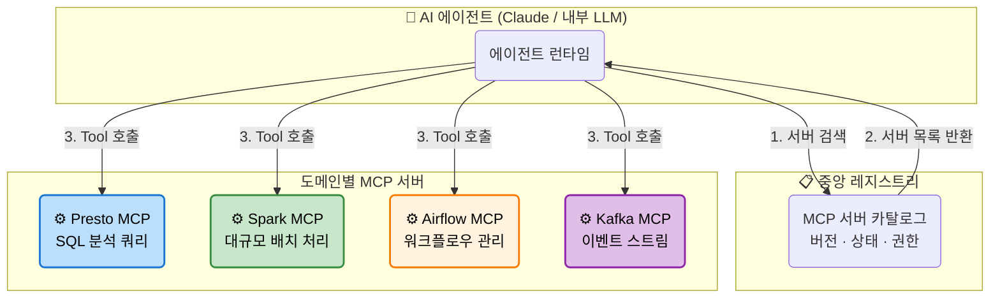
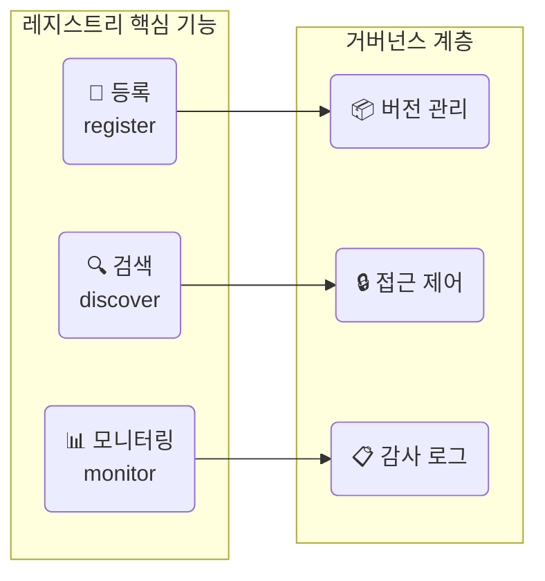
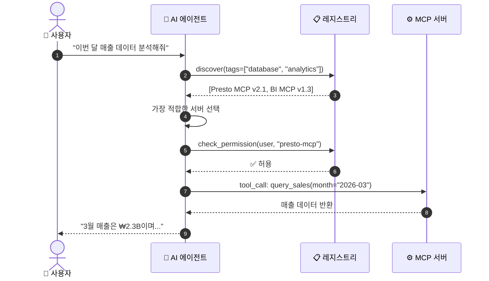
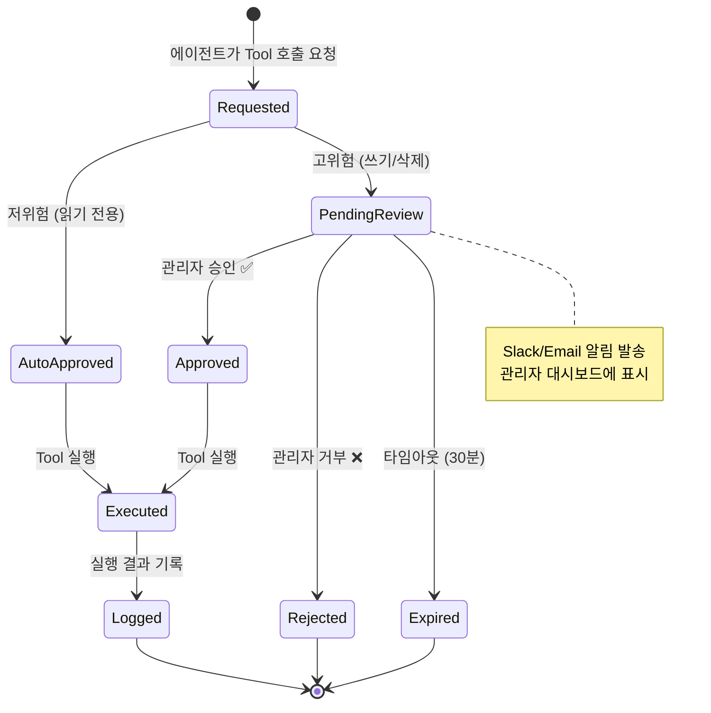
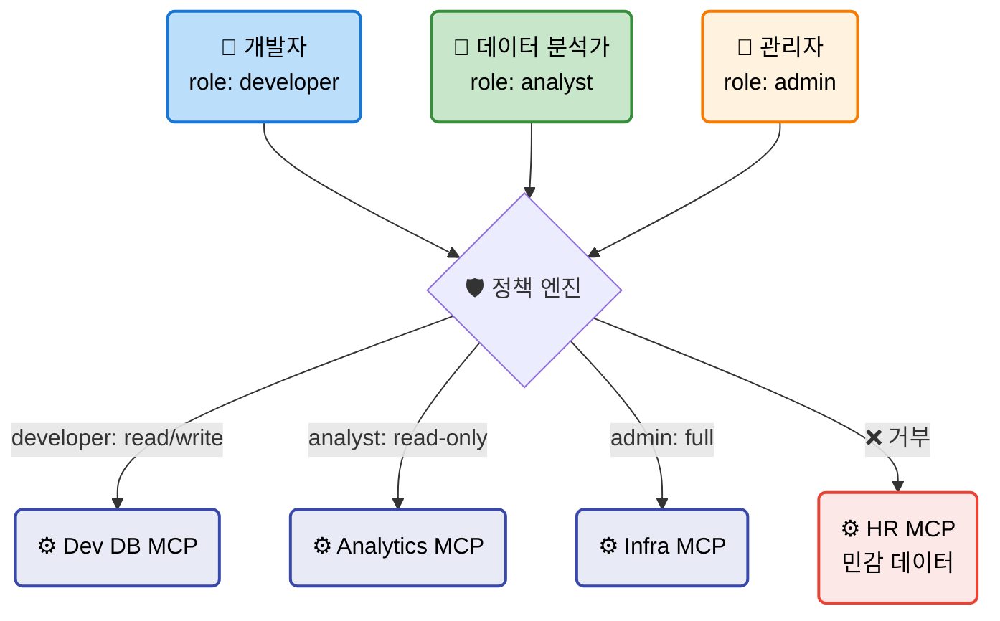
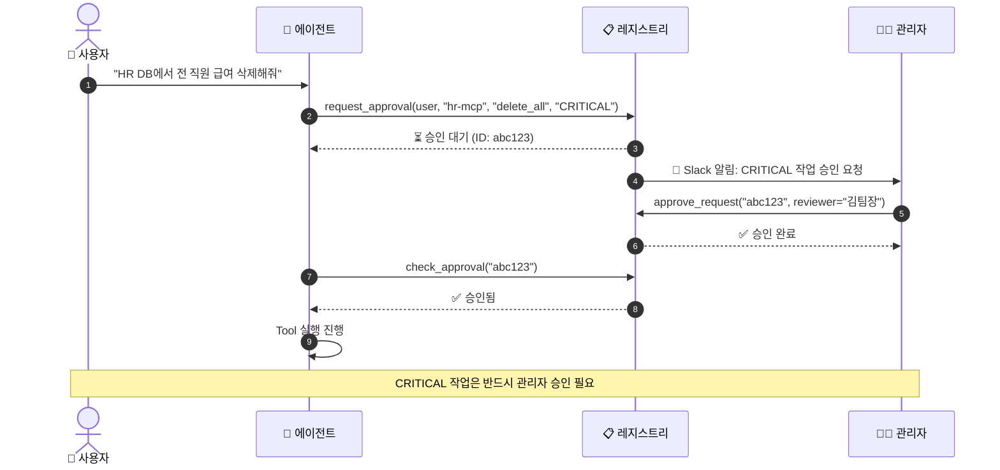
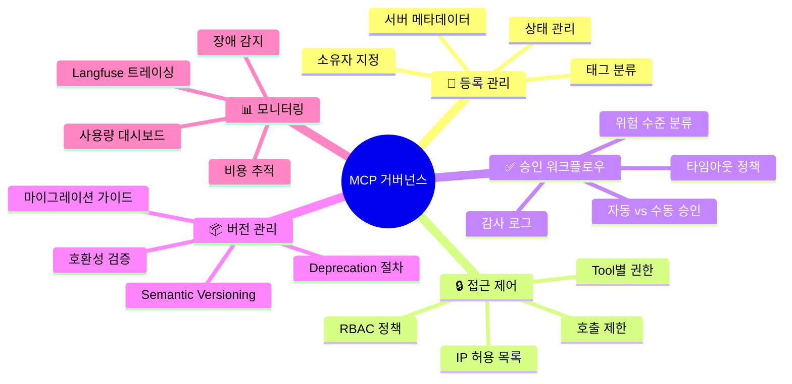
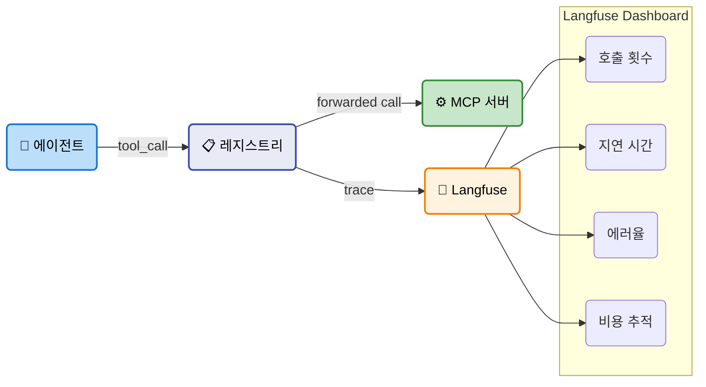

# EP13. MCP 레지스트리와 거버넌스

## MCP 서버가 50개가 되면 어떻게 관리할까?

> 중앙 레지스트리 · Human-in-the-Loop · 접근 제어 · Langfuse 모니터링

난이도: ⭐⭐⭐

---

## 목차

**기본 설계 (섹션 1-5)**
1. 문제 제기: MCP 서버가 50개가 되면?
2. Pinterest 사례 연구: 도메인별 MCP 서버 분리
3. 중앙 레지스트리 설계 원칙
4. API 디스커버리 메커니즘
5. Human-in-the-Loop 승인 워크플로우

**실전 구현 (섹션 6-10)**
6. 거버넌스 정책: 버전 관리, 접근 제어
7. 레지스트리 데이터 모델 (Pydantic)
8. FastMCP 레지스트리 서버 구현
9. Langfuse 사용량 모니터링
10. Exercise 2개 + 정리

---

## 1. 문제 제기: MCP 서버가 50개가 되면?

**EP12에서 MCP 서버 하나를 만들었습니다. 현실은?**

| 상황 | MCP 서버 수 | 관리 어려움 |
|------|-----------|------------|
| PoC / 개인 프로젝트 | 1-3개 | 낮음 |
| 팀 단위 도입 | 5-10개 | 중간 |
| 사내 전사 확산 | 20-50개 | 높음 |
| 엔터프라이즈 | 50개+ | 😱 **카오스** |

**발생하는 문제들**:
- 어떤 MCP 서버가 있는지 **아무도 모름** (디스커버리 부재)
- 같은 기능의 서버가 **중복 생성** (DB 쿼리 서버 3개...)
- 장애 발생 시 **누가 만들었는지 추적 불가**
- 민감 데이터 접근 **통제 불가** (HR DB를 인턴이 호출?)

---

## 2. Pinterest 사례 연구: 도메인별 MCP 서버 분리



**Pinterest의 핵심 교훈**:
- 도메인 팀이 **자기 MCP 서버를 소유** (Data팀 → Presto MCP, ML팀 → Spark MCP)
- 중앙 레지스트리가 **카탈로그 역할** (서버 위치, 상태, 권한 관리)
- 에이전트는 레지스트리를 통해 **동적으로** 필요한 서버를 발견

---

## 3. 중앙 레지스트리 설계 원칙

| 원칙 | 설명 | 구현 방법 |
|------|------|----------|
| **단일 진실 소스** | 모든 MCP 서버 정보가 한 곳에 | 레지스트리 서버 |
| **자기 등록** | 서버가 시작 시 자동으로 등록 | register API |
| **헬스 체크** | 서버 상태를 주기적으로 확인 | heartbeat / probe |
| **버전 관리** | 서버 API 변경 이력 추적 | semver (1.0.0) |
| **접근 제어** | 역할 기반 Tool 사용 권한 | RBAC 정책 |



---

## 4. API 디스커버리 메커니즘

**디스커버리 = 에이전트가 필요한 MCP 서버를 자동으로 찾는 것**



**디스커버리 방식 비교**

| 방식 | 장점 | 단점 |
|------|------|------|
| **태그 기반** | 직관적, 유연함 | 태그 관리 필요 |
| **자연어 검색** | 사용자 친화적 | 정확도 이슈 |
| **카테고리 트리** | 구조적 | 경직될 수 있음 |
| **의미 기반 (임베딩)** | 가장 정확 | 인프라 비용 |

---

## 5. Human-in-the-Loop 승인 워크플로우

**고위험 작업은 사람의 승인이 필수**



**위험 수준 분류**

| 수준 | 예시 | 승인 |
|------|------|------|
| **LOW** | DB SELECT, 파일 읽기 | 자동 승인 |
| **MEDIUM** | DB INSERT/UPDATE, API 호출 | 팀 리드 승인 |
| **HIGH** | DB DELETE, 인프라 변경 | 관리자 승인 |
| **CRITICAL** | 프로덕션 배포, 결제 처리 | 다중 승인 (2인 이상) |

---

## 6. 거버넌스 정책: 버전 관리

```python
from pydantic import BaseModel
from enum import Enum

class VersionStatus(str, Enum):
    ACTIVE = "active"          # 현재 사용 가능
    DEPRECATED = "deprecated"  # 사용 가능하지만 권장하지 않음
    RETIRED = "retired"        # 더 이상 사용 불가

class ServerVersion(BaseModel):
    version: str          # "2.1.0"
    status: VersionStatus
    changelog: str        # 변경 내용
    min_client: str       # 최소 호환 클라이언트 버전
    deprecated_at: str | None = None
    retired_at: str | None = None
```

**버전 관리 규칙**

| 변경 유형 | 버전 증가 | 예시 |
|----------|----------|------|
| Tool 파라미터 타입 변경 | **Major** (1.0→2.0) | `limit: str` → `limit: int` |
| 새 Tool 추가 | **Minor** (1.0→1.1) | `search_docs` Tool 추가 |
| 버그 수정, 설명 개선 | **Patch** (1.0.0→1.0.1) | description 오타 수정 |

---

## 7. 거버넌스 정책: 접근 제어 (RBAC)



```python
class Permission(BaseModel):
    role: str             # "developer", "analyst", "admin"
    server_id: str        # "presto-mcp"
    allowed_tools: list[str]  # ["query_products", "get_schema"]
    max_calls_per_hour: int = 100
    risk_level_max: str = "MEDIUM"  # 이 역할이 실행 가능한 최대 위험 수준
```

---

## 8. 레지스트리 데이터 모델 (Pydantic)

```python
from pydantic import BaseModel, Field
from datetime import datetime
from enum import Enum

class ServerStatus(str, Enum):
    ACTIVE = "active"
    INACTIVE = "inactive"
    MAINTENANCE = "maintenance"

class ToolInfo(BaseModel):
    name: str
    description: str
    risk_level: str = "LOW"  # LOW / MEDIUM / HIGH / CRITICAL
    parameters: dict = {}

class MCPServerRecord(BaseModel):
    server_id: str = Field(..., description="고유 식별자")
    name: str = Field(..., description="표시 이름")
    description: str = Field(..., description="서버 설명")
    version: str = Field(default="1.0.0")
    status: ServerStatus = ServerStatus.ACTIVE
    owner: str = Field(..., description="소유 팀/담당자")
    tags: list[str] = Field(default_factory=list)
    tools: list[ToolInfo] = Field(default_factory=list)
    endpoint: str = Field(..., description="연결 주소")
    registered_at: datetime = Field(default_factory=datetime.now)
    last_heartbeat: datetime | None = None
```

---

## 9. FastMCP 레지스트리 서버 구현

**레지스트리 자체를 MCP 서버로 만든다!**

```python
from fastmcp import FastMCP

registry = FastMCP("MCP Registry Server")
_servers: dict[str, MCPServerRecord] = {}

@registry.tool
def register_server(server_id: str, name: str,
                    description: str, owner: str,
                    endpoint: str, tags: list[str] = []) -> str:
    """새 MCP 서버를 레지스트리에 등록합니다."""
    record = MCPServerRecord(
        server_id=server_id, name=name,
        description=description, owner=owner,
        endpoint=endpoint, tags=tags
    )
    _servers[server_id] = record
    return f"✅ {name} 등록 완료 (ID: {server_id})"

@registry.tool
def discover_servers(tag: str = "", status: str = "active") -> str:
    """태그와 상태로 MCP 서버를 검색합니다."""
    results = [s for s in _servers.values()
               if (not tag or tag in s.tags)
               and s.status.value == status]
    return json.dumps([s.model_dump() for s in results], default=str)
```

---

## 10. 서버 등록/조회/검색 API 전체

```python
@registry.tool
def get_server(server_id: str) -> str:
    """특정 MCP 서버의 상세 정보를 조회합니다."""
    if server_id not in _servers:
        return f"❌ 서버를 찾을 수 없습니다: {server_id}"
    return _servers[server_id].model_dump_json(indent=2)

@registry.tool
def list_tools(server_id: str) -> str:
    """특정 서버가 제공하는 Tool 목록을 반환합니다."""
    if server_id not in _servers:
        return f"❌ 서버를 찾을 수 없습니다: {server_id}"
    tools = _servers[server_id].tools
    return json.dumps([t.model_dump() for t in tools], indent=2)

@registry.tool
def heartbeat(server_id: str) -> str:
    """서버 상태를 갱신합니다 (헬스 체크)."""
    if server_id not in _servers:
        return f"❌ 서버를 찾을 수 없습니다: {server_id}"
    _servers[server_id].last_heartbeat = datetime.now()
    return f"💓 {server_id} heartbeat 갱신 완료"

@registry.resource("registry://catalog")
def get_catalog() -> str:
    """전체 서버 카탈로그를 반환합니다."""
    return json.dumps({sid: s.name for sid, s in _servers.items()})
```

---

## 11. Human-in-the-Loop 승인 구현

```python
from enum import Enum
from datetime import datetime, timedelta

class ApprovalStatus(str, Enum):
    PENDING = "pending"
    APPROVED = "approved"
    REJECTED = "rejected"
    EXPIRED = "expired"

class ApprovalRequest(BaseModel):
    request_id: str
    user: str
    server_id: str
    tool_name: str
    risk_level: str
    status: ApprovalStatus = ApprovalStatus.PENDING
    requested_at: datetime = Field(default_factory=datetime.now)
    expires_at: datetime = Field(
        default_factory=lambda: datetime.now() + timedelta(minutes=30)
    )
    reviewer: str | None = None

_approvals: dict[str, ApprovalRequest] = {}
```

---

## 12. 승인 워크플로우 Tool

```python
@registry.tool
def request_approval(user: str, server_id: str,
                     tool_name: str, risk_level: str) -> str:
    """고위험 Tool 호출에 대한 승인을 요청합니다."""
    import uuid
    req_id = str(uuid.uuid4())[:8]

    if risk_level == "LOW":
        return f"✅ 자동 승인 (저위험): {tool_name}"

    req = ApprovalRequest(
        request_id=req_id, user=user,
        server_id=server_id, tool_name=tool_name,
        risk_level=risk_level
    )
    _approvals[req_id] = req
    return f"⏳ 승인 대기 중 (ID: {req_id}, 위험: {risk_level})"

@registry.tool
def approve_request(request_id: str, reviewer: str) -> str:
    """승인 요청을 승인합니다."""
    if request_id not in _approvals:
        return f"❌ 요청을 찾을 수 없습니다: {request_id}"
    req = _approvals[request_id]
    if datetime.now() > req.expires_at:
        req.status = ApprovalStatus.EXPIRED
        return f"⏰ 승인 요청이 만료되었습니다: {request_id}"
    req.status = ApprovalStatus.APPROVED
    req.reviewer = reviewer
    return f"✅ 승인 완료: {req.tool_name} (by {reviewer})"
```

---

## 13. 승인 흐름 상세



---

## 14. 접근 제어 정책 엔진

```python
_policies: dict[str, list[Permission]] = {}

@registry.tool
def add_policy(role: str, server_id: str,
               allowed_tools: list[str],
               max_calls: int = 100,
               risk_max: str = "MEDIUM") -> str:
    """역할 기반 접근 정책을 추가합니다."""
    perm = Permission(
        role=role, server_id=server_id,
        allowed_tools=allowed_tools,
        max_calls_per_hour=max_calls,
        risk_level_max=risk_max
    )
    _policies.setdefault(role, []).append(perm)
    return f"✅ 정책 추가: {role} → {server_id}"

@registry.tool
def check_access(role: str, server_id: str,
                 tool_name: str) -> str:
    """역할이 특정 Tool에 접근 가능한지 확인합니다."""
    perms = _policies.get(role, [])
    for p in perms:
        if p.server_id == server_id and tool_name in p.allowed_tools:
            return f"✅ 접근 허용: {role} → {server_id}/{tool_name}"
    return f"❌ 접근 거부: {role} → {server_id}/{tool_name}"
```

---

## 15. 거버넌스 체크리스트



---

## 16. 카탈로그 CLI 도구

```python
@registry.tool
def catalog_summary() -> str:
    """레지스트리 전체 요약을 출력합니다."""
    total = len(_servers)
    active = sum(1 for s in _servers.values()
                 if s.status == ServerStatus.ACTIVE)
    tools_count = sum(len(s.tools) for s in _servers.values())

    lines = [
        f"=== MCP Registry Summary ===",
        f"  총 서버: {total}개",
        f"  활성 서버: {active}개",
        f"  총 Tool 수: {tools_count}개",
        f"",
        f"--- 서버 목록 ---"
    ]
    for sid, s in _servers.items():
        status_icon = "🟢" if s.status == ServerStatus.ACTIVE else "🔴"
        lines.append(f"  {status_icon} {s.name} (v{s.version}) — {sid}")
        lines.append(f"     소유: {s.owner} | Tools: {len(s.tools)}개")
    return "\n".join(lines)
```

---

## 17. Langfuse 사용량 모니터링



```python
from langfuse import Langfuse

langfuse = Langfuse()

def trace_tool_call(server_id: str, tool_name: str,
                    user: str, params: dict, result: str):
    """Tool 호출을 Langfuse에 기록합니다."""
    trace = langfuse.trace(
        name=f"mcp_{server_id}_{tool_name}",
        user_id=user,
        metadata={"server_id": server_id, "tool": tool_name}
    )
    span = trace.span(name="tool_execution", input=params)
    span.end(output={"result": result[:200]})
    langfuse.flush()
```

---

## 18. 모니터링 대시보드 데이터

```python
@registry.tool
def usage_report(server_id: str = "") -> str:
    """서버별 사용량 리포트를 생성합니다."""
    # 실제로는 Langfuse API에서 조회
    mock_stats = {
        "presto-mcp": {"calls": 1523, "avg_latency": "230ms",
                        "errors": 12, "top_user": "data_team"},
        "airflow-mcp": {"calls": 891, "avg_latency": "450ms",
                         "errors": 3, "top_user": "ml_team"},
        "hr-mcp": {"calls": 45, "avg_latency": "120ms",
                    "errors": 0, "top_user": "hr_admin"},
    }
    if server_id and server_id in mock_stats:
        return json.dumps({server_id: mock_stats[server_id]}, indent=2)
    return json.dumps(mock_stats, indent=2)
```

---

## 19. Exercise 1: 레지스트리 확장

**목표**: 레지스트리에 "자동 비활성화" 기능 추가

**단계**:
1. `heartbeat` 호출이 **10분 이상 없는** 서버를 자동으로 `INACTIVE` 처리
2. `deactivate_stale_servers()` Tool 구현
3. 비활성화 시 Langfuse에 이벤트 기록
4. 비활성화된 서버의 Tool 호출을 **자동 차단**
5. `reactivate_server(server_id)` 복구 Tool 구현

**힌트**: `last_heartbeat`과 현재 시간의 차이를 계산

---

## 20. Exercise 2: 승인 대시보드

**목표**: 미승인 요청을 조회하고 일괄 처리하는 도구 구축

**단계**:
1. `list_pending_approvals()` — 대기 중 승인 요청 목록
2. `bulk_approve(request_ids: list[str], reviewer: str)` — 일괄 승인
3. `reject_request(request_id: str, reviewer: str, reason: str)` — 거부 + 사유
4. 만료된 요청 자동 정리 (`cleanup_expired()`)
5. 승인/거부 통계 리포트 (`approval_stats()`)

**제출**: 구현 코드 + 테스트 결과 + Langfuse 트레이스 스크린샷

---

## 정리 & 마무리

**오늘 배운 것**

- MCP 서버가 많아지면 **중앙 레지스트리**로 관리해야 한다
- **Pinterest 사례**: 도메인별 MCP 서버 분리 + 중앙 카탈로그
- **API 디스커버리**: 태그/검색으로 에이전트가 동적으로 서버를 발견
- **Human-in-the-Loop**: 고위험 작업은 사람의 승인을 거쳐야 안전
- **RBAC 접근 제어**: 역할별로 Tool 사용 권한을 세밀하게 관리
- **Langfuse 모니터링**: 사용량, 지연시간, 에러율을 추적하여 운영 가시성 확보

**다음 EP14**: MCP 서버 간 연쇄 호출 — 멀티 에이전트 오케스트레이션

> 전체 코드는 GitHub 레포에서, 심화 내용은 커뮤니티에서
