# EP14. Agent-to-Agent 통신: MCP + A2A

## 에이전트끼리 대화하는 시대가 왔다

> Google A2A 프로토콜 · MCP 결합 · 멀티벤더 에이전트 협업

난이도: ⭐⭐⭐

---

## 목차

**기본 개념 (섹션 1-5)**
1. 문제 제기: 에이전트끼리 대화하는 시대
2. MCP vs A2A 역할 구분
3. Google A2A 프로토콜 구조 분석
4. Agent Card 개념
5. Task / Artifact 모델

**실전 구현 (섹션 6-11)**
6. A2A 통신 흐름
7. 멀티벤더 에이전트 협업 시나리오
8. MCP + A2A 결합 아키텍처
9. A2A HTTP 서버/클라이언트 구현
10. Langfuse 통합
11. Exercise 2개 + 정리

---

## 1. 문제 제기: 에이전트끼리 대화하는 시대

**MCP로 도구 연결은 해결했지만... 에이전트 간 협업은?**

| 상황 | MCP | A2A |
|------|-----|-----|
| Claude가 DB를 조회한다 | ✅ Tool 호출 | - |
| Claude가 GPT 에이전트에게 번역을 요청한다 | ❌ 불가능 | ✅ |
| 여러 벤더의 에이전트가 협업한다 | ❌ 불가능 | ✅ |
| 에이전트가 자신의 능력을 공개한다 | ❌ 없음 | ✅ Agent Card |

**핵심 질문**: "내 에이전트가 다른 에이전트와 대화하려면 어떻게 해야 할까?"

→ Google이 2024년 발표한 **A2A(Agent-to-Agent) 프로토콜**이 답

---

## 2. MCP vs A2A 역할 구분

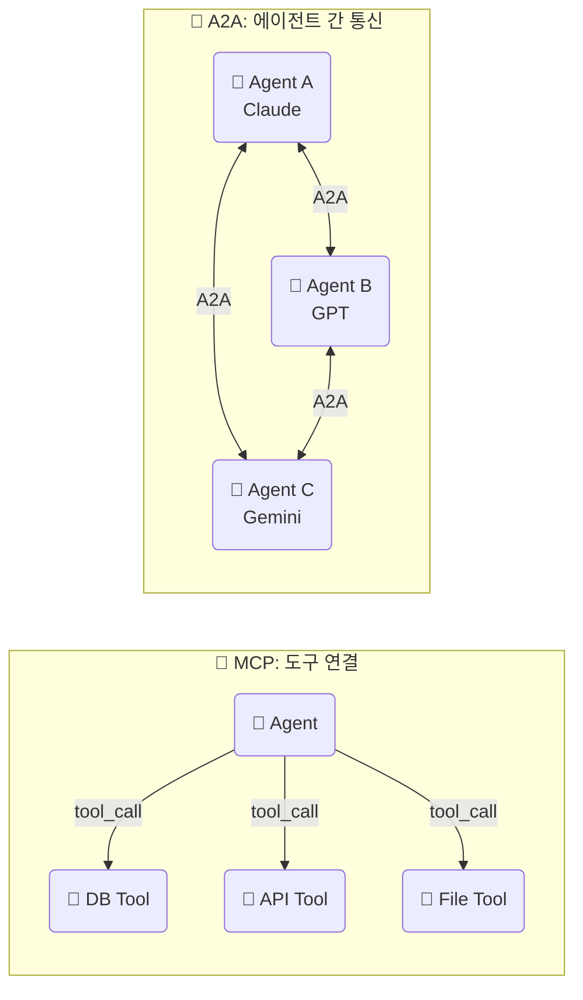

| 구분 | MCP | A2A |
|------|-----|-----|
| **목적** | LLM ↔ 도구 연결 | 에이전트 ↔ 에이전트 통신 |
| **비유** | USB-C 케이블 | 전화번호 교환 |
| **단위** | Tool, Resource, Prompt | Task, Artifact, Message |
| **통신** | JSON-RPC (stdio/HTTP) | HTTP + JSON |
| **발표** | Anthropic (2024) | Google (2024) |

---

## 3. Google A2A 프로토콜 구조 분석

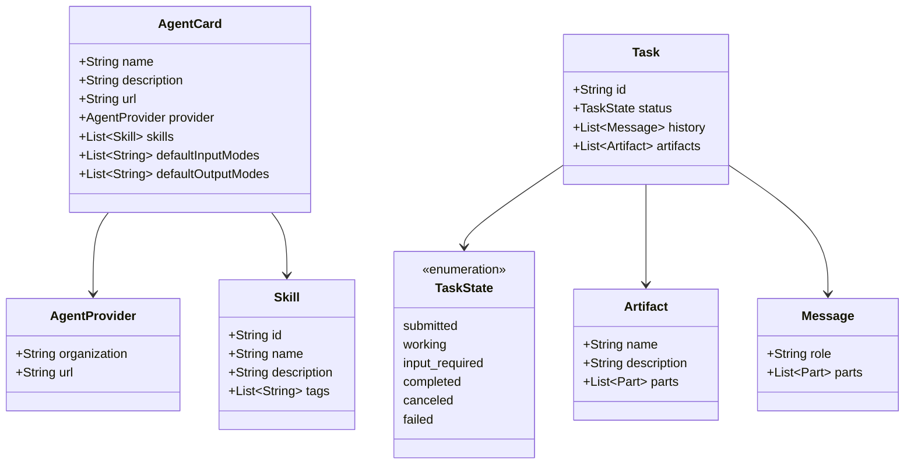

**A2A의 핵심 구조**:
- **Agent Card**: 에이전트의 신분증 (이름, 능력, 엔드포인트)
- **Task**: 에이전트 간 작업 단위 (상태 추적 가능)
- **Artifact**: Task의 결과물 (텍스트, 파일 등)

---

## 4. Agent Card 개념

**Agent Card = 에이전트의 명함**

```json
{
  "name": "번역 에이전트",
  "description": "한국어 ↔ 영어 전문 번역 에이전트",
  "url": "https://translate-agent.example.com",
  "provider": {
    "organization": "PDStudio",
    "url": "https://pdstudio.dev"
  },
  "skills": [
    {
      "id": "ko-en-translate",
      "name": "한영 번역",
      "description": "한국어를 영어로 번역합니다",
      "tags": ["translation", "korean", "english"]
    }
  ],
  "defaultInputModes": ["text/plain"],
  "defaultOutputModes": ["text/plain"]
}
```

**Agent Card 발견 경로**: `GET /.well-known/agent.json`

---

## 5. Task / Artifact 모델

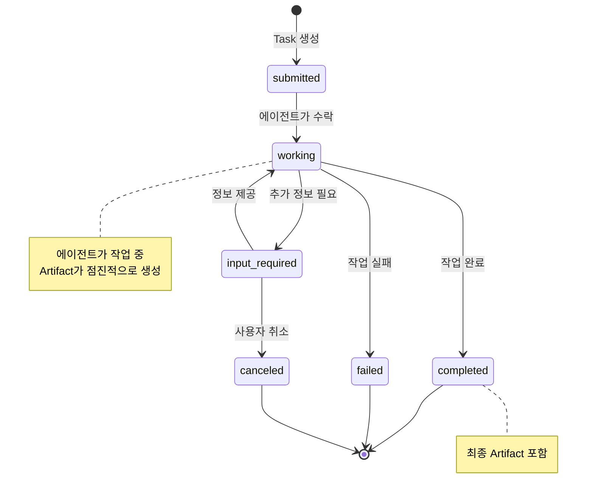

| 개념 | 설명 | 예시 |
|------|------|------|
| **Task** | 에이전트에게 보내는 작업 요청 | "이 문서를 번역해줘" |
| **Message** | Task 내 대화 기록 | 요청/응답 메시지 |
| **Artifact** | Task의 결과물 | 번역된 문서 |
| **Part** | Message/Artifact의 구성 요소 | 텍스트, 파일, 이미지 |

---

## 6. A2A 통신 흐름

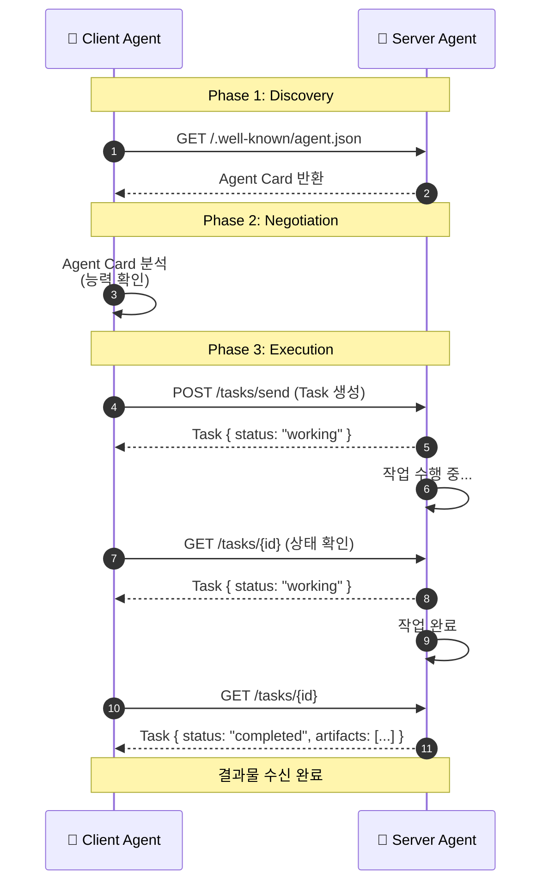

**3단계 통신 패턴**:
1. **Discovery**: Agent Card로 상대 에이전트의 능력 확인
2. **Negotiation**: 적합한 에이전트인지 판단
3. **Execution**: Task 전송 → 상태 추적 → 결과 수신

---

## 7. 멀티벤더 에이전트 협업 시나리오

**시나리오: 글로벌 고객 지원 시스템**

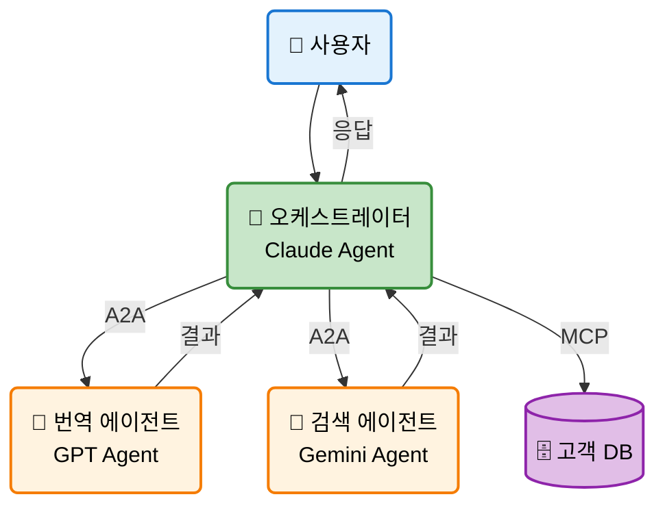

| 역할 | 벤더 | 프로토콜 | 기능 |
|------|------|---------|------|
| 오케스트레이터 | Claude | - | 전체 흐름 관리 |
| 번역 에이전트 | GPT | A2A | 한영 번역 |
| 검색 에이전트 | Gemini | A2A | 문서 검색 |
| 고객 DB | - | MCP | 데이터 조회 |

**핵심**: MCP와 A2A를 **함께** 사용하여 도구 + 에이전트 협업

---

## 8. MCP + A2A 결합 아키텍처

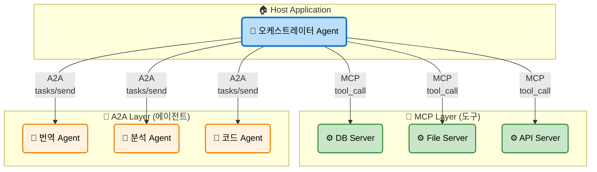

**설계 원칙**:
- **MCP**: 데이터/도구 접근 (단방향, Tool 호출)
- **A2A**: 에이전트 협업 (양방향, Task 교환)
- 오케스트레이터가 **두 프로토콜을 동시에** 사용

---

## 9. A2A 에이전트 통신 맵

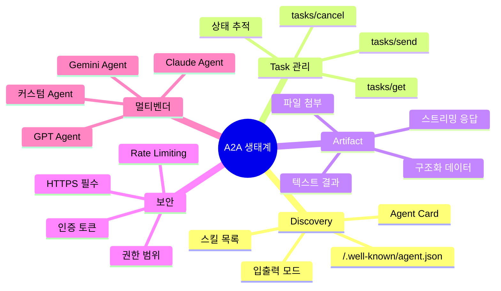

---

## 10. A2A HTTP 서버 구현

```python
from fastapi import FastAPI, Request
from pydantic import BaseModel
import uuid

app = FastAPI()

# Agent Card 노출
@app.get("/.well-known/agent.json")
async def agent_card():
    return {
        "name": "요약 에이전트",
        "description": "텍스트를 3줄로 요약합니다",
        "url": "http://localhost:8000",
        "skills": [{"id": "summarize", "name": "요약",
                     "description": "텍스트 요약", "tags": ["nlp"]}],
    }

# Task 수신
@app.post("/tasks/send")
async def handle_task(request: Request):
    body = await request.json()
    task_id = str(uuid.uuid4())
    user_text = body["message"]["parts"][0]["text"]

    summary = f"요약 결과: {user_text[:50]}..."
    return {
        "id": task_id,
        "status": "completed",
        "artifacts": [{"parts": [{"text": summary}]}]
    }
```

---

## 11. A2A 클라이언트 구현

```python
import httpx

class A2AClient:
    def __init__(self, base_url: str):
        self.base_url = base_url
        self.agent_card = None

    async def discover(self):
        """Agent Card 가져오기"""
        async with httpx.AsyncClient() as client:
            resp = await client.get(
                f"{self.base_url}/.well-known/agent.json"
            )
            self.agent_card = resp.json()
            return self.agent_card

    async def send_task(self, text: str):
        """Task 전송 및 결과 수신"""
        async with httpx.AsyncClient() as client:
            resp = await client.post(
                f"{self.base_url}/tasks/send",
                json={"message": {"role": "user",
                       "parts": [{"text": text}]}}
            )
            return resp.json()
```

```python
# 사용 예시
client = A2AClient("http://localhost:8000")
card = await client.discover()
print(f"에이전트: {card['name']}")

result = await client.send_task("긴 문서를 요약해주세요...")
print(f"결과: {result['artifacts'][0]['parts'][0]['text']}")
```

---

## 12. MCP Tool에서 A2A 에이전트 호출

```python
from fastmcp import FastMCP
import httpx

mcp = FastMCP("MCP+A2A Bridge Server")

@mcp.tool
async def ask_translate_agent(text: str, target_lang: str) -> str:
    """A2A 번역 에이전트에게 번역을 요청합니다."""
    async with httpx.AsyncClient() as client:
        # 1. Discovery
        card = await client.get(
            "http://translate-agent:8000/.well-known/agent.json"
        )

        # 2. Task 전송
        result = await client.post(
            "http://translate-agent:8000/tasks/send",
            json={
                "message": {
                    "role": "user",
                    "parts": [{"text": f"{target_lang}로 번역: {text}"}]
                }
            }
        )

        task = result.json()
        return task["artifacts"][0]["parts"][0]["text"]
```

**MCP Tool 안에서 A2A 호출** = MCP 클라이언트가 자연스럽게 A2A 에이전트 사용

---

## 13. Langfuse 통합: A2A 트레이싱

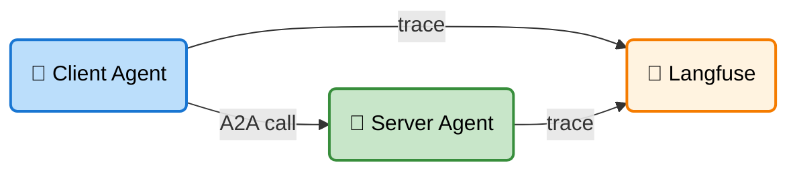

```python
from langfuse import Langfuse

langfuse = Langfuse()

async def send_task_with_trace(agent_url, text):
    trace = langfuse.trace(
        name="a2a_task",
        metadata={"agent_url": agent_url}
    )
    span = trace.span(name="a2a_send_task")

    result = await a2a_client.send_task(text)

    span.end(output={"status": result["status"]})
    trace.update(output=result)
    return result
```

---

## 14. Agent Card 구조 상세

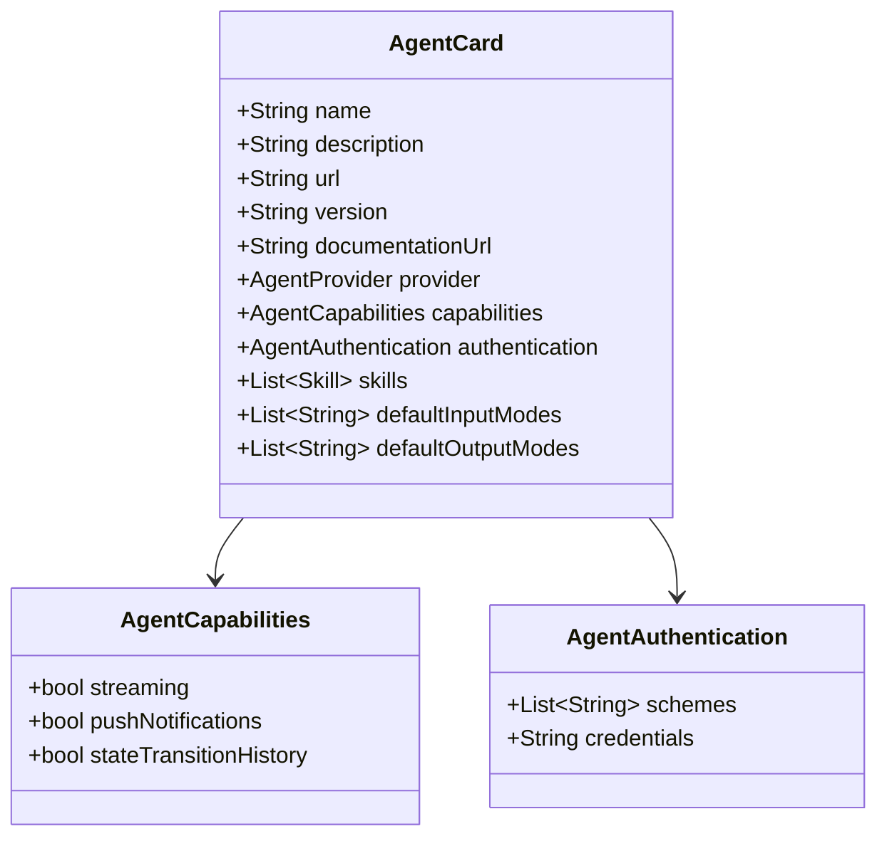

**주요 필드 설명**:
- `capabilities.streaming`: 스트리밍 응답 지원 여부
- `capabilities.pushNotifications`: 푸시 알림 지원
- `authentication.schemes`: 지원하는 인증 방식 (Bearer 등)

---

## 15. A2A vs 기존 방식 비교

| 방식 | 에이전트 발견 | 표준화 | 상태 추적 | 벤더 독립 |
|------|-------------|--------|----------|----------|
| **직접 API 호출** | 수동 | ❌ | ❌ | ❌ |
| **Message Queue** | 수동 | 부분적 | ❌ | ✅ |
| **gRPC** | 수동 | ✅ | ❌ | ✅ |
| **A2A 프로토콜** | Agent Card 자동 | ✅ | ✅ | ✅ |

**A2A의 강점**:
1. **자동 발견**: `/.well-known/agent.json`으로 에이전트 능력 파악
2. **표준 Task 모델**: 상태 추적, 결과물 관리 통일
3. **벤더 독립**: Claude, GPT, Gemini 에이전트가 같은 프로토콜로 소통

---

## 16. 실전 시나리오: 코드 리뷰 파이프라인

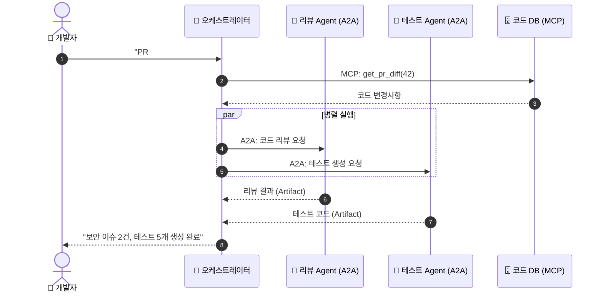

---

## 17. A2A 보안 고려사항

| 위협 | 대응 방안 | 구현 |
|------|----------|------|
| 비인가 접근 | Bearer Token 인증 | `authentication.schemes: ["Bearer"]` |
| 데이터 유출 | HTTPS 필수 | TLS 인증서 적용 |
| DDoS 공격 | Rate Limiting | 요청 횟수 제한 |
| Agent Spoofing | Agent Card 검증 | 디지털 서명 확인 |
| 악의적 Task | 입력 검증 | 스키마 검증 + 샌드박스 |

```python
# Agent Card 인증 설정 예시
agent_card = {
    "name": "보안 에이전트",
    "authentication": {
        "schemes": ["Bearer"],
        "credentials": "https://auth.example.com/.well-known/jwks.json"
    },
    "capabilities": {
        "streaming": False,
        "pushNotifications": False
    }
}
```

---

## 18. MCP + A2A 통합 패턴 정리

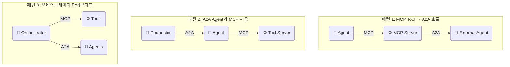

| 패턴 | 설명 | 사용 시기 |
|------|------|----------|
| **MCP → A2A** | MCP Tool이 내부적으로 A2A 호출 | 기존 MCP 생태계에 에이전트 추가 |
| **A2A → MCP** | A2A 에이전트가 MCP Tool 활용 | 에이전트에게 도구 접근 제공 |
| **하이브리드** | 두 프로토콜 병행 사용 | 복잡한 실전 시스템 |

---

## 19. Exercise 1: A2A 에이전트 구축

**목표**: A2A 프로토콜을 따르는 요약 에이전트 구축

**단계**:
1. Agent Card 정의 (이름, 스킬, 입출력 모드)
2. Pydantic 모델로 Task/Artifact 구조 정의
3. HTTP 엔드포인트 구현 (`/.well-known/agent.json`, `/tasks/send`)
4. A2A 클라이언트로 Discovery + Task 전송 테스트
5. Langfuse trace 추가

---

## 20. Exercise 2: MCP + A2A 브릿지 구현

**목표**: MCP Tool 안에서 A2A 에이전트를 호출하는 브릿지 구현

**단계**:
1. 번역 A2A 에이전트 서버 구현
2. FastMCP Tool에서 A2A 클라이언트로 번역 요청
3. Claude Agent가 MCP Tool을 통해 A2A 에이전트 활용
4. 멀티 에이전트 협업 시나리오 구성
5. Langfuse로 전체 흐름 트레이싱

**제출**: 서버/클라이언트 코드 + Langfuse 트레이스 스크린샷

---

## 21. 전체 프로토콜 비교 정리

| | MCP | A2A | 결합 |
|---|-----|-----|------|
| **대상** | LLM ↔ Tool | Agent ↔ Agent | Agent ↔ 모든 것 |
| **발견** | 설정 파일 | Agent Card | 두 가지 모두 |
| **통신** | JSON-RPC | HTTP/JSON | 하이브리드 |
| **상태** | Stateless | Task 상태 추적 | Task 기반 |
| **결과** | 함수 반환값 | Artifact | Artifact |
| **보안** | JWT, OAuth | Bearer, TLS | 계층별 적용 |
| **발표** | Anthropic | Google | 커뮤니티 |

---

## 정리 & 마무리

**오늘 배운 것**

- **MCP vs A2A**: 도구 연결 vs 에이전트 간 통신, 상호 보완적 관계
- **A2A 프로토콜**: Agent Card로 발견, Task/Artifact로 작업 교환
- **통신 3단계**: Discovery → Negotiation → Execution
- **결합 아키텍처**: MCP Tool에서 A2A 호출, A2A Agent가 MCP 사용
- **멀티벤더 협업**: Claude + GPT + Gemini 에이전트가 표준 프로토콜로 소통
- **Langfuse**: A2A 통신 전체 흐름 트레이싱

**다음 EP15**: A2A 에이전트를 프로덕션에 배포하면? → 오케스트레이션과 관찰가능성

> 전체 코드는 GitHub 레포에서, 심화 내용은 커뮤니티에서
