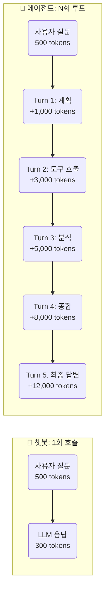
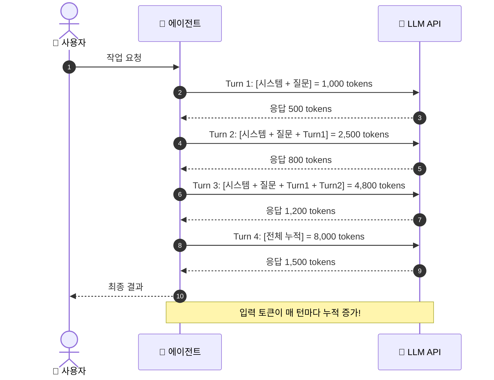
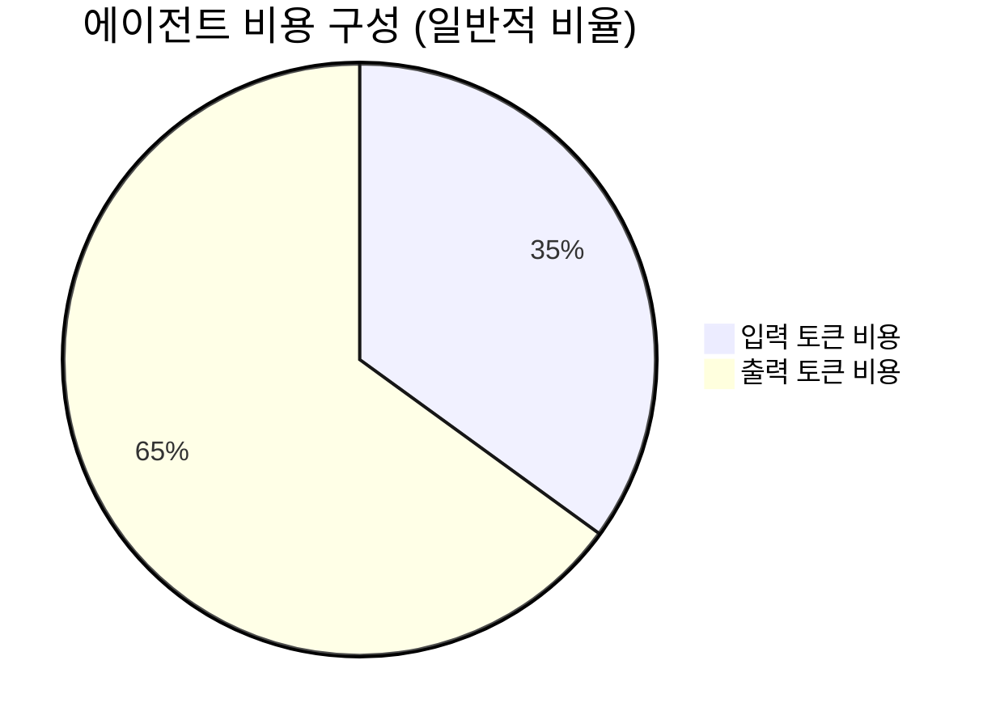
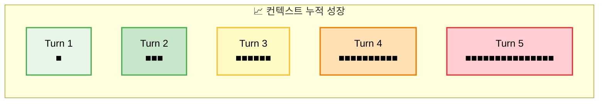
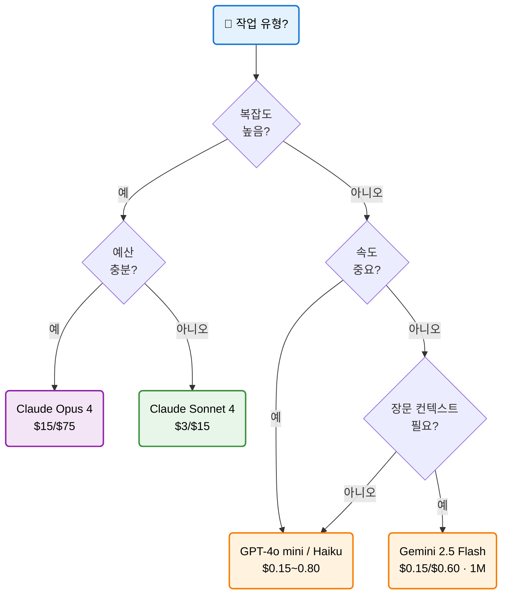
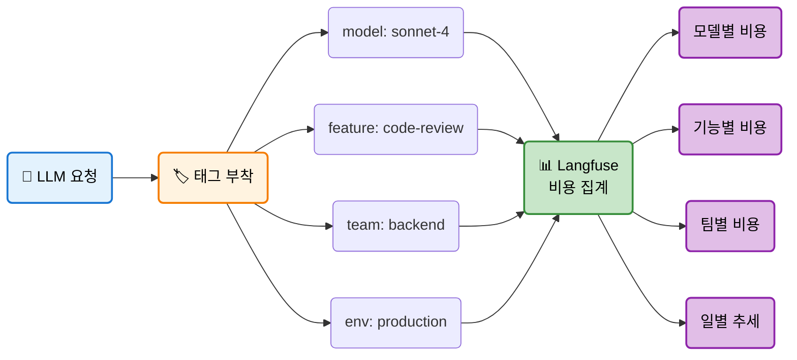
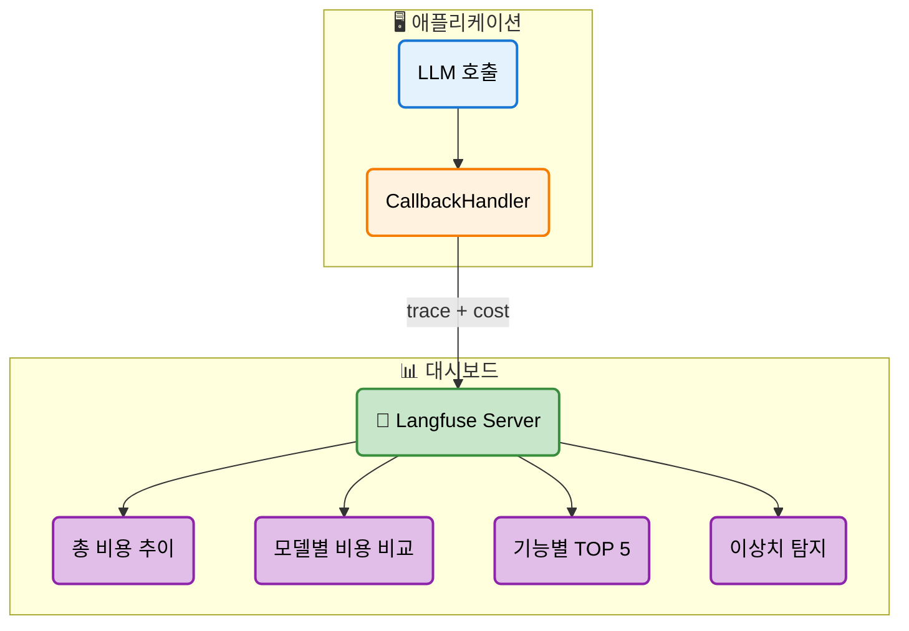
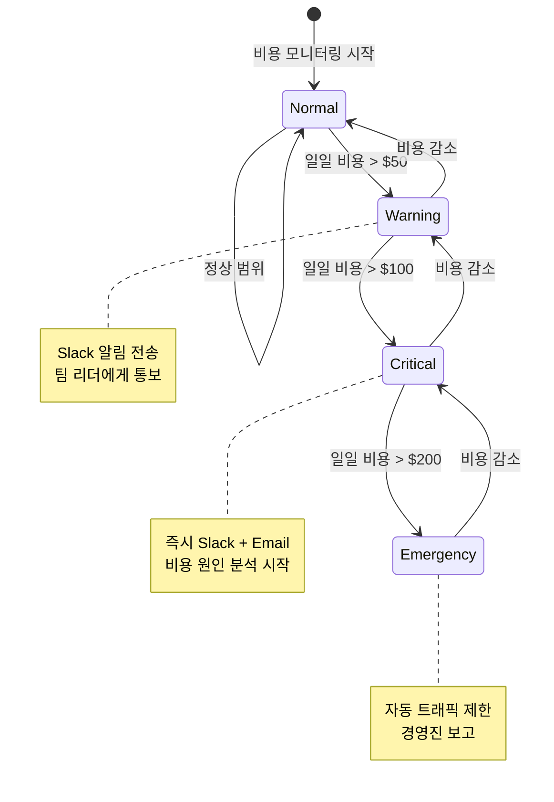
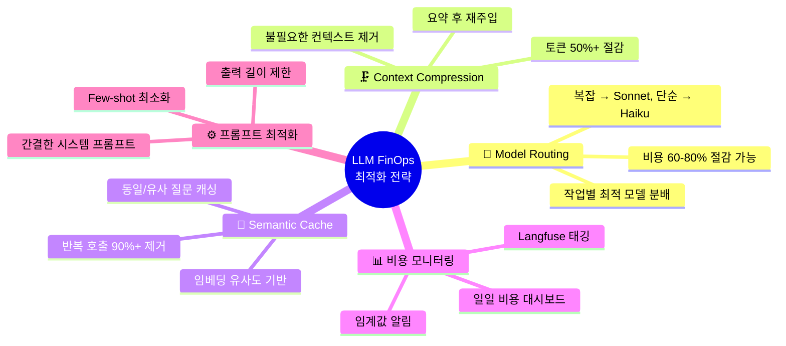
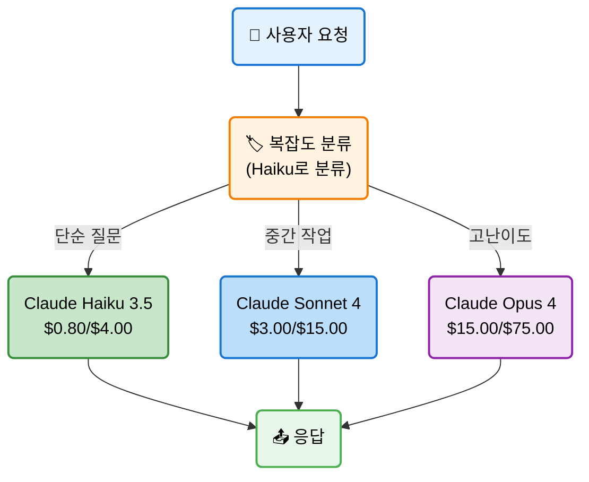

# EP15. 에이전트 토큰 경제학

## 에이전트 1회 호출에 $8? 비용 폭발을 막는 실전 전략

> Multi-turn 비용 분석 · 모델별 가격 비교 · Langfuse 비용 대시보드

난이도: ⭐⭐

---

## 목차

**비용 구조 이해 (섹션 1-5)**
1. 문제 제기: 에이전트 1회 호출에 $8?
2. 에이전트 vs 챗봇 비용 차이 (3~10x)
3. Multi-turn Loop 비용 분석
4. 입력/출력 토큰 비대칭
5. Context Accumulation 비용 시뮬레이션

**실전 관리 (섹션 6-10)**
6. 주요 모델별 비용 비교표
7. 비용 추적 방법론: 태깅 전략
8. Langfuse 비용 대시보드 구축
9. 비용 알림 시스템 설계
10. 비용 최적화 전략 정리 + Exercise

---

## 1. 문제 제기: 에이전트 1회 호출에 $8?

**실제 사례: 코드 리뷰 에이전트**

| 단계 | 설명 | 토큰 수 |
|------|------|---------|
| Turn 1 | 파일 읽기 요청 | 2,000 |
| Turn 2 | 코드 분석 | 8,000 |
| Turn 3 | 리뷰 생성 | 15,000 |
| Turn 4 | 수정 제안 | 22,000 |
| Turn 5 | 최종 정리 | 30,000 |
| **합계** | **입력+출력** | **~77,000** |

**Claude Sonnet 기준**: 입력 $3/M + 출력 $15/M = **약 $1.5~8/회**

> "챗봇은 $0.01인데, 같은 모델의 에이전트는 왜 $8인가?"

---

## 2. 에이전트 vs 챗봇 비용 차이



| | 챗봇 | 에이전트 |
|---|------|---------|
| **호출 횟수** | 1회 | 5~15회 |
| **컨텍스트** | 고정 | 매 턴마다 누적 |
| **총 토큰** | ~800 | ~30,000~100,000 |
| **비용 배수** | 1x | **3~10x** |

**핵심 원인**: 에이전트는 매 턴마다 **이전 대화 전체**를 다시 보냄

---

## 3. Multi-turn Loop 비용 분석



**각 턴의 입력 토큰 = 이전 모든 턴의 합 + 새 입력**

Turn N의 입력 토큰 수 = `base + sum(output_1 ... output_N-1)`

---

## 4. 입력/출력 토큰 비대칭

**왜 출력 토큰이 더 비싼가?**

| | 입력 토큰 | 출력 토큰 |
|---|----------|----------|
| **처리 방식** | 병렬 처리 (한 번에) | 순차 생성 (하나씩) |
| **GPU 활용** | 배치 최적화 가능 | auto-regressive |
| **지연 시간** | 짧음 | 길음 |
| **상대 가격** | 1x | **4~8x** |



> 토큰 수는 입력이 많지만, **비용은 출력이 더 크다**

**2026년 주요 모델 가격표**

| 모델 | 입력 ($/M) | 출력 ($/M) | 출력/입력 배율 |
|------|-----------|-----------|--------------|
| Claude Sonnet 4 | $3.00 | $15.00 | 5.0x |
| Claude Haiku 3.5 | $0.80 | $4.00 | 5.0x |
| GPT-4o | $2.50 | $10.00 | 4.0x |
| GPT-4o mini | $0.15 | $0.60 | 4.0x |
| Gemini 2.5 Pro | $1.25 | $10.00 | 8.0x |
| Gemini 2.5 Flash | $0.15 | $0.60 | 4.0x |

---

## 5. Context Accumulation 비용 시뮬레이션

**10턴 에이전트의 총 입력 토큰 계산**

| 턴 | 새 출력 | 누적 입력 | 누적 비용 ($3/M) |
|----|--------|----------|-----------------|
| 1 | 500 | 1,000 | $0.003 |
| 2 | 800 | 2,500 | $0.008 |
| 3 | 1,200 | 4,500 | $0.014 |
| 4 | 1,500 | 7,200 | $0.022 |
| 5 | 2,000 | 10,700 | $0.032 |
| 6 | 1,800 | 14,500 | $0.044 |
| 7 | 2,200 | 18,500 | $0.056 |
| 8 | 2,500 | 23,200 | $0.070 |
| 9 | 2,000 | 27,700 | $0.083 |
| 10 | 2,500 | 32,200 | $0.097 |
| **합계** | **17,000** | **누적 합 ~142K** | **$0.43 입력만** |

> 입력 토큰 총합이 **O(n^2)** 으로 증가한다!

---

## 5-1. O(n^2) 성장 시각화



**수학적 분석**:
- 턴 당 평균 출력: `avg_output`
- 총 입력 토큰 = `n * base + avg_output * n * (n-1) / 2`
- **n이 클수록 입력 비용이 n^2에 비례하여 폭발**

---

## 6. 주요 모델별 비용 비교표

| 모델 | 입력 ($/M) | 출력 ($/M) | 컨텍스트 | 속도 | 추천 용도 |
|------|-----------|-----------|---------|------|----------|
| **Claude Sonnet 4** | $3.00 | $15.00 | 200K | 빠름 | 코드 생성, 분석 |
| **Claude Haiku 3.5** | $0.80 | $4.00 | 200K | 매우빠름 | 분류, 추출 |
| **Claude Opus 4** | $15.00 | $75.00 | 200K | 느림 | 고난이도 추론 |
| **GPT-4o** | $2.50 | $10.00 | 128K | 빠름 | 범용 |
| **GPT-4o mini** | $0.15 | $0.60 | 128K | 매우빠름 | 경량 작업 |
| **Gemini 2.5 Pro** | $1.25 | $10.00 | 1M | 보통 | 장문 분석 |
| **Gemini 2.5 Flash** | $0.15 | $0.60 | 1M | 매우빠름 | 경량 + 장문 |
| **Llama 3.3 70B** | $0.40 | $0.40 | 128K | 빠름 | 자체 호스팅 |

---

## 6-1. 모델 선택 의사결정 트리



---

## 7. 비용 추적 방법론: 태깅 전략



**태깅 규칙**
| 태그 키 | 값 예시 | 용도 |
|---------|--------|------|
| `model` | sonnet-4, haiku-3.5 | 모델별 비용 추적 |
| `feature` | code-review, summarize | 기능별 비용 분석 |
| `team` | backend, data, infra | 팀별 비용 할당 |
| `env` | prod, staging, dev | 환경별 분리 |
| `priority` | high, medium, low | 비용 최적화 우선순위 |

---

## 8. Langfuse 비용 대시보드 구축



**Langfuse CallbackHandler 기본 코드**

```python
from langfuse.callback import CallbackHandler

handler = CallbackHandler(
    public_key=os.environ["LANGFUSE_PUBLIC_KEY"],
    secret_key=os.environ["LANGFUSE_SECRET_KEY"],
    host="https://cloud.langfuse.com",
    tags=["feature:code-review", "team:backend"],
)

response = llm.invoke("코드를 리뷰해줘", config={"callbacks": [handler]})
```

---

## 9. 비용 알림 시스템 설계



**알림 임계값 설계**

| 레벨 | 임계값 | 액션 |
|------|-------|------|
| **Normal** | < $50/일 | 모니터링만 |
| **Warning** | $50~100/일 | Slack 알림 |
| **Critical** | $100~200/일 | Slack + Email + 원인 분석 |
| **Emergency** | > $200/일 | 자동 제한 + 경영진 보고 |

---

## 9-1. 비용 알림 구현 코드

```python
from dataclasses import dataclass
from enum import Enum

class AlertLevel(Enum):
    NORMAL = "normal"
    WARNING = "warning"
    CRITICAL = "critical"
    EMERGENCY = "emergency"

@dataclass
class CostAlert:
    level: AlertLevel
    daily_cost: float
    threshold: float
    message: str

def check_cost_alert(daily_cost: float) -> CostAlert:
    if daily_cost > 200:
        return CostAlert(AlertLevel.EMERGENCY, daily_cost, 200,
                         "비상! 자동 트래픽 제한 발동")
    elif daily_cost > 100:
        return CostAlert(AlertLevel.CRITICAL, daily_cost, 100,
                         "위험: 비용 원인 분석 필요")
    elif daily_cost > 50:
        return CostAlert(AlertLevel.WARNING, daily_cost, 50,
                         "경고: 비용 증가 감지")
    return CostAlert(AlertLevel.NORMAL, daily_cost, 50,
                     "정상 범위")
```

---

## 10. 비용 최적화 전략 정리



---

## 10-1. 최적화 전략 비교표

| 전략 | 구현 난이도 | 절감 효과 | 적용 시점 |
|------|-----------|----------|----------|
| **Model Routing** | 중간 | 60~80% | 즉시 적용 가능 |
| **Context Compression** | 중간 | 30~50% | 장문 에이전트에 효과적 |
| **Semantic Cache** | 높음 | 최대 90% | 반복 패턴이 있을 때 |
| **프롬프트 최적화** | 낮음 | 10~30% | 항상 먼저 적용 |
| **출력 길이 제한** | 낮음 | 20~40% | max_tokens 설정 |
| **배치 API** | 낮음 | 50% | 비실시간 작업 |

**ROI 순위**: 프롬프트 최적화 > Model Routing > 출력 제한 > 캐싱 > 압축

---

## 10-2. Model Routing 패턴



```python
def route_model(query: str) -> str:
    """복잡도에 따라 모델을 선택합니다."""
    # 1단계: 저비용 모델로 복잡도 판단
    complexity = classify_complexity(query)  # haiku로 분류
    
    if complexity == "simple":
        return "claude-haiku-3.5"    # $0.80/M
    elif complexity == "medium":
        return "claude-sonnet-4"     # $3.00/M
    else:
        return "claude-opus-4"       # $15.00/M
```

---

## 11. Exercise 1: 비용 시뮬레이터 구축

**목표**: 에이전트의 턴 수와 모델에 따른 비용을 계산하는 시뮬레이터 구현

**단계**:
1. 모델별 가격 딕셔너리 정의
2. 턴별 컨텍스트 누적 로직 구현
3. 총 비용 계산 함수 작성
4. matplotlib로 턴 수별 비용 그래프 시각화
5. 3개 모델을 비교하는 차트 생성

---

## 12. Exercise 2: Langfuse 비용 대시보드

**목표**: Langfuse로 LLM 호출 비용을 추적하고 알림 시스템 구현

**단계**:
1. Langfuse CallbackHandler 설정
2. 여러 모델로 LLM 호출 실행 (태그 포함)
3. 비용 데이터 집계 (모델별, 기능별)
4. 임계값 기반 알림 함수 구현
5. pandas DataFrame으로 비용 리포트 생성

**제출**: 비용 시뮬레이션 결과 + 대시보드 스크린샷 + 알림 로직

---

## 정리 & 마무리

**오늘 배운 것**

- 에이전트는 Multi-turn Loop 때문에 챗봇보다 **3~10x 비싼 비용** 발생
- 컨텍스트 누적으로 입력 토큰이 **O(n^2)** 증가하는 구조 이해
- 출력 토큰이 입력보다 **4~8배 비싼** 비대칭 가격 구조
- Langfuse **태깅 + 대시보드**로 비용을 모델/기능/팀별로 추적
- **임계값 기반 알림**으로 비용 폭발을 사전에 방지
- Model Routing, Context Compression, Caching으로 **60~90% 비용 절감** 가능

**다음 EP16**: Model Routing 심화 -- 작업별 최적 모델을 자동 선택하는 방법

> 전체 코드는 GitHub 레포에서, 심화 내용은 커뮤니티에서
