# EP16. Model Router: 최적 모델 자동 선택

## 단순 질문에 GPT-4o를 쓰면 190배 손해 -- 자동 라우팅으로 비용 90% 절감

> LiteLLM · Portkey AI Gateway · 복잡도 분류기 · Plan-and-Execute 패턴

난이도: ⭐⭐⭐

---

## 목차

**기본 개념 (섹션 1-5)**
1. 문제 제기: 단일 모델 전략의 비용 함정
2. 계층형 모델 전략 (Frontier / Mid-tier / Small)
3. Plan-and-Execute 패턴으로 비용 90% 절감
4. LiteLLM 소개: 100+ 모델 통합 인터페이스
5. LiteLLM 구현 코드

**실전 구현 (섹션 6-11)**
6. Portkey AI Gateway 소개
7. 질문 복잡도 분류기 설계
8. 자동 라우팅 시스템 아키텍처
9. 라우팅 전후 비용 비교 (Langfuse)
10. A/B 테스트: 라우팅 품질 검증
11. Exercise + 정리

---

## 1. 문제 제기: 단일 모델 전략의 비용 함정

**"오늘 날씨 알려줘"에 Claude Opus를 호출하고 있진 않나요?**

| 질문 유형 | 예시 | 실제 필요 모델 | 현실 |
|----------|------|--------------|------|
| 단순 인사 | "안녕하세요" | Haiku ($0.25/1M) | Opus ($15/1M) |
| 번역 | "Hello를 한국어로" | GPT-4o-mini ($0.15/1M) | GPT-4o ($2.50/1M) |
| 코드 리뷰 | "이 함수 최적화해줘" | Sonnet ($3/1M) | Opus ($15/1M) |
| 논문 분석 | "이 논문의 핵심 기여는?" | Opus ($15/1M) | Opus ($15/1M) |

**단순 질문에 Frontier 모델을 쓰면 60배 손해**
"안녕하세요"에 Opus를 쓰면: $15 / $0.25 = **60배 과금**

---

## 2. 계층형 모델 전략

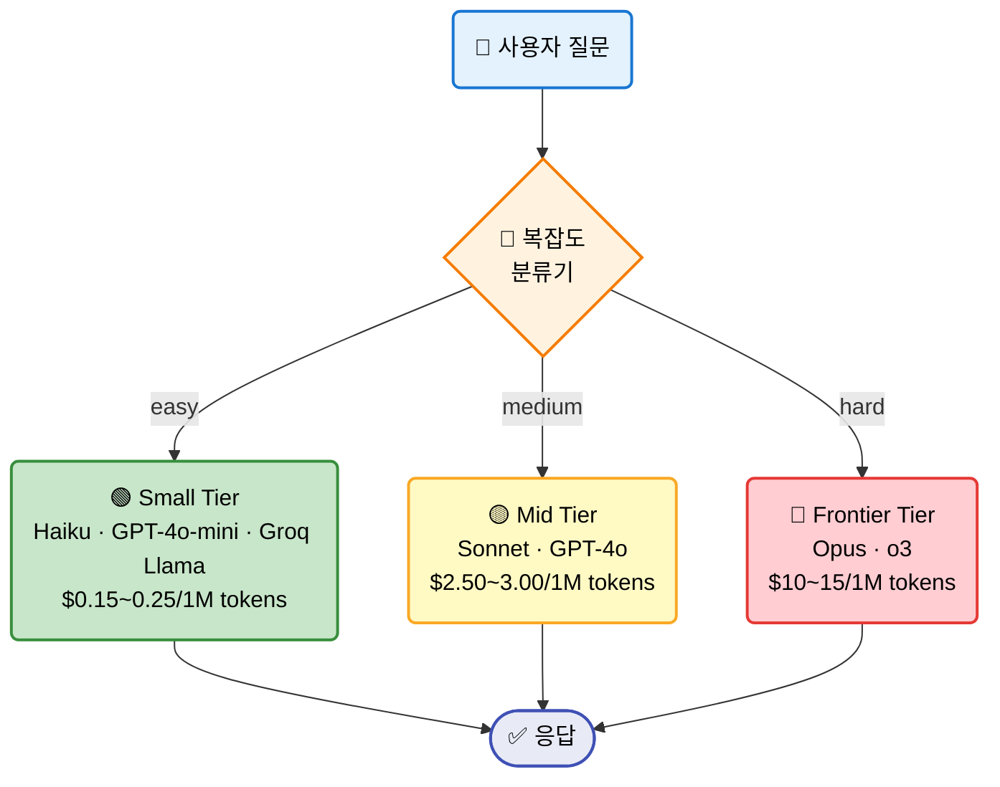

---

## 2-1. 비용 테이블 상세

| Tier | 모델 | Input $/1M | Output $/1M | 속도 | 적합 업무 |
|------|------|-----------|------------|------|----------|
| **Frontier** | Claude Opus | $15.00 | $75.00 | 느림 | 논문 분석, 복잡한 추론 |
| | GPT-4o | $2.50 | $10.00 | 중간 | 코드 생성, 다단계 추론 |
| **Mid-tier** | Claude Sonnet | $3.00 | $15.00 | 빠름 | 요약, 코드 리뷰 |
| | GPT-4o-mini | $0.15 | $0.60 | 빠름 | 번역, 분류 |
| **Small** | Claude Haiku | $0.25 | $1.25 | 초고속 | 인사, FAQ, 키워드 추출 |
| | Groq Llama 3 | $0.05 | $0.08 | 초고속 | 간단 분류, 포맷 변환 |

**핵심**: 트래픽의 60~70%는 easy/medium -- Small/Mid-tier로 처리 가능

---

## 3. Plan-and-Execute 패턴

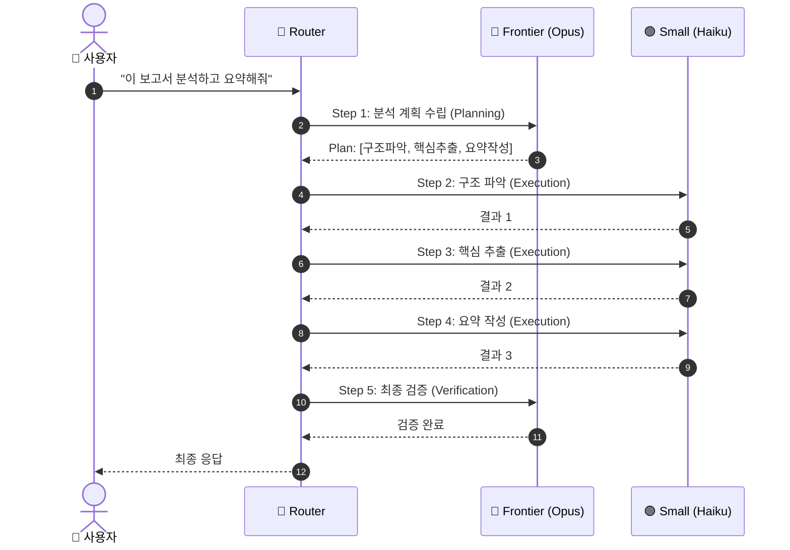

**Planning = Frontier, Execution = Small** --> 비용 90% 절감 가능

---

## 3-1. Plan-and-Execute 비용 비교

| 접근 방식 | 모델 | 호출 수 | 예상 토큰 | 비용 |
|----------|------|--------|----------|------|
| **All Frontier** | Opus x5 | 5회 | ~10K | ~$0.15 |
| **Plan-and-Execute** | Opus x2 + Haiku x3 | 5회 | ~10K | ~$0.035 |
| | | | **절감율** | **~77%** |

대규모 배치 처리 시:
- 일 1,000건 기준: **$150 --> $35** (월 $3,450 절감)
- 일 10,000건 기준: **$1,500 --> $350** (월 $34,500 절감)

---

## 4. LiteLLM 소개: 100+ 모델 통합 인터페이스

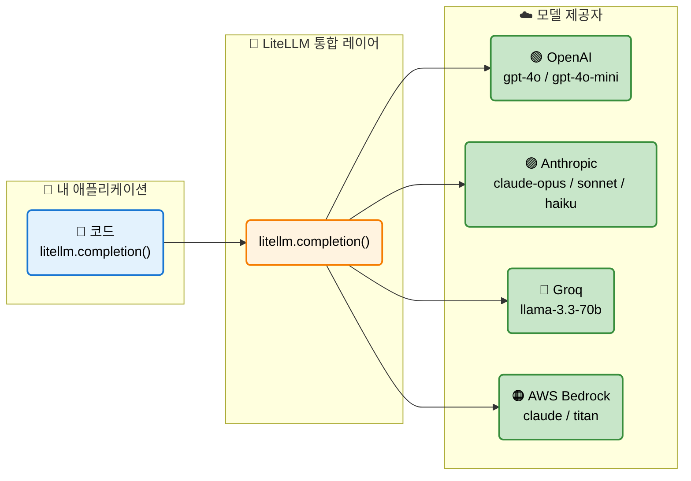

**LiteLLM**: `model=` 파라미터만 바꾸면 100+ 모델을 동일한 인터페이스로 호출

---

## 5. LiteLLM 구현 코드

```python
import litellm

# OpenAI 모델 호출
response = litellm.completion(
    model="gpt-4o-mini",
    messages=[{"role": "user", "content": "안녕하세요"}]
)

# Anthropic 모델 호출 — 코드 변경 없이 model만 교체
response = litellm.completion(
    model="anthropic/claude-3-5-haiku-20241022",
    messages=[{"role": "user", "content": "안녕하세요"}]
)

# Groq 모델 호출 — 역시 동일 인터페이스
response = litellm.completion(
    model="groq/llama-3.3-70b-versatile",
    messages=[{"role": "user", "content": "안녕하세요"}]
)
```

**Model Fallback** -- 특정 모델 장애 시 자동 대체:

```python
response = litellm.completion(
    model="gpt-4o",
    messages=messages,
    fallbacks=["anthropic/claude-3-5-sonnet-20241022",
               "groq/llama-3.3-70b-versatile"]
)
```

---

## 5-1. LiteLLM 비용 추적

```python
from litellm import completion_cost

response = litellm.completion(
    model="gpt-4o-mini",
    messages=[{"role": "user", "content": "Python의 GIL을 설명해주세요"}]
)

# 호출 비용 즉시 확인
cost = completion_cost(completion_response=response)
print(f"비용: ${cost:.6f}")
print(f"Input tokens: {response.usage.prompt_tokens}")
print(f"Output tokens: {response.usage.completion_tokens}")
```

| 기능 | 설명 |
|------|------|
| `completion_cost()` | 단일 호출 비용 계산 |
| `litellm.max_budget` | 예산 한도 설정 |
| `litellm.success_callback` | 성공 시 콜백 (Langfuse 등) |
| `litellm.callbacks` | 커스텀 콜백 리스트 |

---

## 6. Portkey AI Gateway

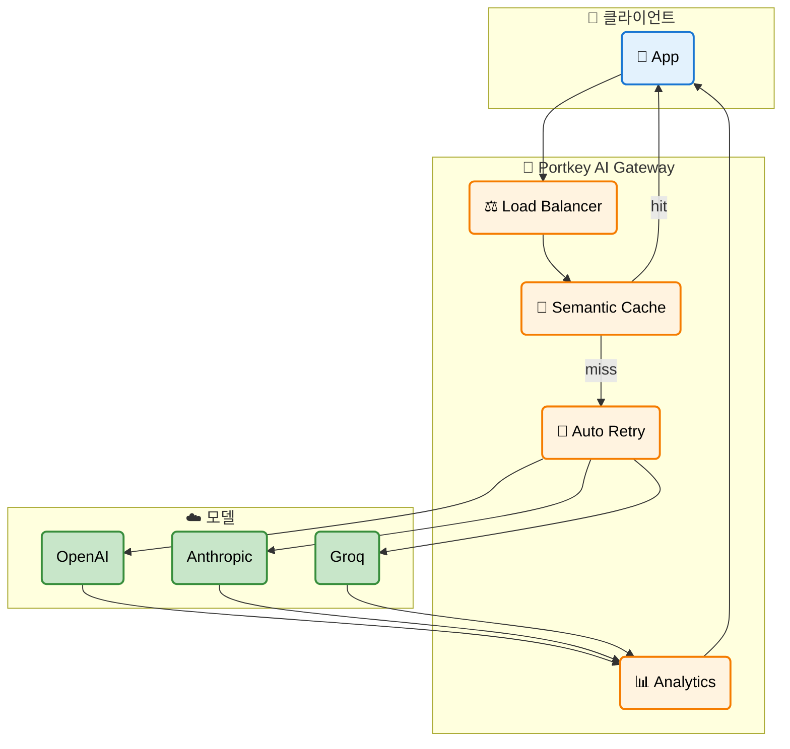

**Portkey 핵심 기능**: 라우팅, 로드 밸런싱, 시맨틱 캐싱, 자동 재시도, 분석

---

## 6-1. LiteLLM vs Portkey 비교

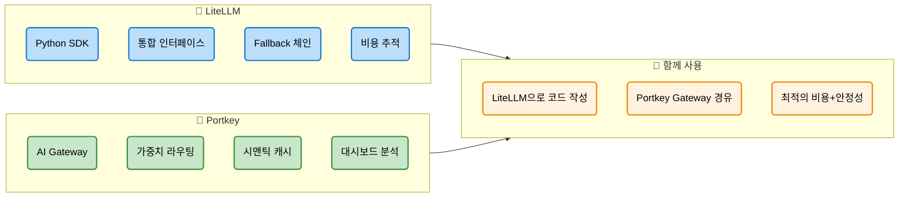

| 비교 항목 | LiteLLM | Portkey |
|----------|---------|--------|
| **형태** | Python 라이브러리 | AI Gateway (SaaS/Self-host) |
| **라우팅** | Fallback 체인 | 가중치 기반 + 조건부 |
| **캐싱** | 없음 | 시맨틱 캐시 |
| **모니터링** | 기본 콜백 | 전용 대시보드 |
| **사용 방식** | `litellm.completion()` | OpenAI SDK + Gateway URL |

---

## 7. 질문 복잡도 분류기 설계

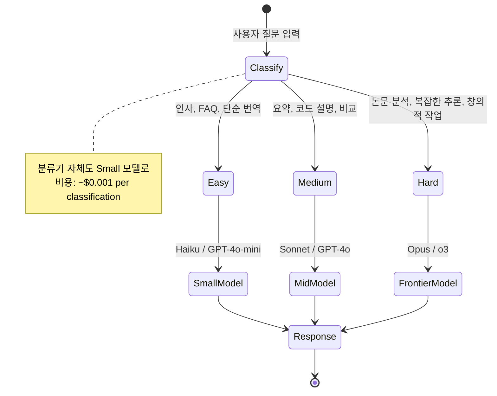

**핵심 설계**: 분류기 자체를 Small 모델로 실행 --> 분류 비용 최소화

---

## 7-1. 분류기 프롬프트 설계

```python
CLASSIFIER_PROMPT = """
당신은 질문 복잡도 분류기입니다.
다음 질문의 복잡도를 easy/medium/hard 중 하나로 분류하세요.

분류 기준:
- easy: 인사, 날씨, 단순 번역, FAQ, 키워드 추출, 포맷 변환
- medium: 요약, 코드 설명, 장단점 비교, 데이터 분석
- hard: 논문 분석, 수학 증명, 복잡한 코드 생성, 다단계 추론, 창의적 글쓰기

반드시 easy, medium, hard 중 하나만 출력하세요.

질문: {question}
"""
```

| 분류 결과 | 라우팅 모델 | 예상 비용 (1K tokens) |
|----------|-----------|---------------------|
| `easy` | `claude-3-5-haiku` | ~$0.0004 |
| `medium` | `claude-3-5-sonnet` | ~$0.0045 |
| `hard` | `claude-3-opus` | ~$0.0225 |

분류기 호출 자체 비용: ~$0.0001 (무시 가능)

---

## 8. 자동 라우팅 시스템 아키텍처

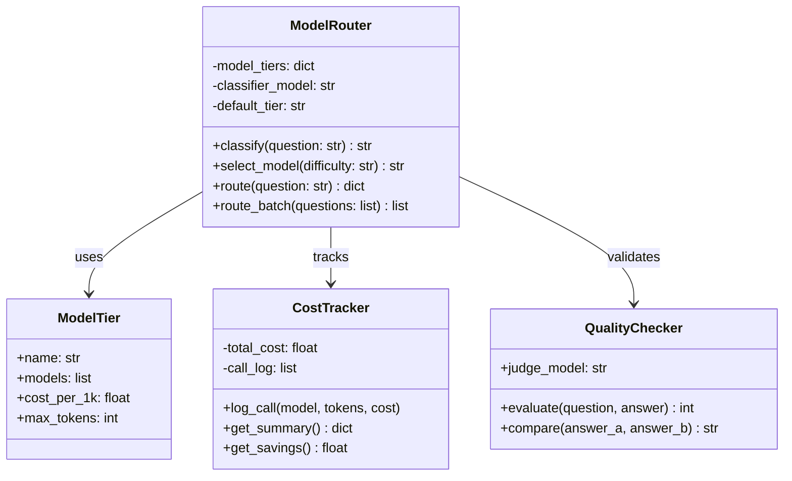

---

## 8-1. 라우팅 요청 흐름

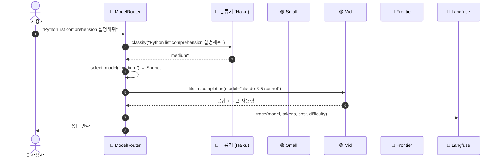

---

## 9. 라우팅 전후 비용 비교 (Langfuse)

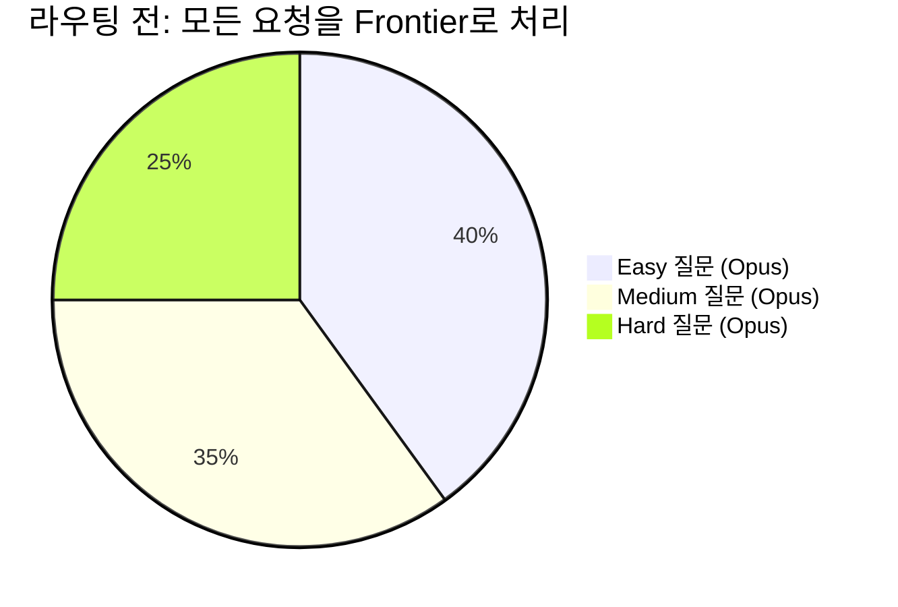

---

## 9-1. 라우팅 후 비용 분포

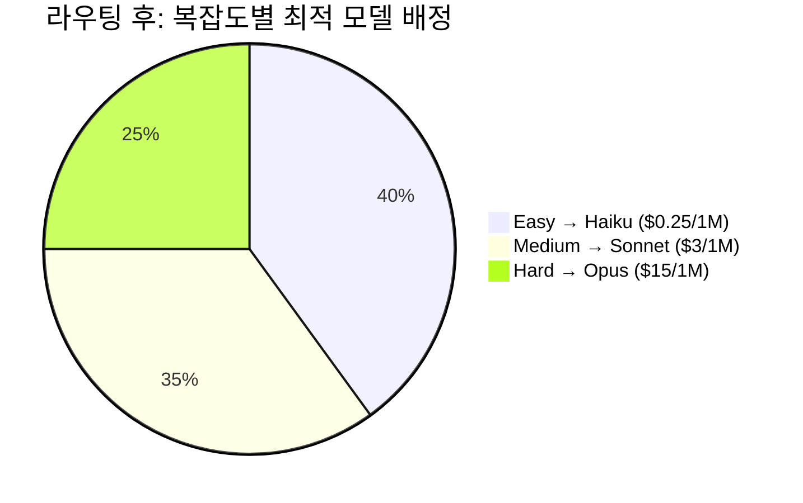

| 메트릭 | Before (All Opus) | After (Router) | 절감 |
|--------|-------------------|----------------|------|
| 월간 API 비용 | $4,500 | $1,125 | **75%** |
| 평균 응답 시간 | 3.2s | 1.8s | **44%** |
| 품질 점수 (1-5) | 4.8 | 4.6 | -4% (허용 범위) |

**결론**: 품질 4% 감소로 비용 75% 절감 -- 대부분의 프로덕션에서 합리적 트레이드오프

---

## 10. A/B 테스트: 라우팅 품질 검증

**LLM-as-Judge 방식**으로 라우팅 품질을 자동 검증

```python
JUDGE_PROMPT = """
다음 질문과 답변의 품질을 1-5점으로 평가하세요.

평가 기준:
- 1점: 완전히 잘못된 답변
- 2점: 부분적으로 맞지만 주요 오류 있음
- 3점: 대체로 맞지만 깊이 부족
- 4점: 정확하고 충분한 답변
- 5점: 완벽하고 통찰력 있는 답변

질문: {question}
답변: {answer}

점수(숫자만):
"""
```

| 비교 그룹 | 평균 품질 | 평균 비용/건 | 비용 대비 품질 |
|----------|----------|-------------|-------------|
| All Frontier | 4.8 | $0.030 | 160 |
| All Small | 3.2 | $0.001 | 3,200 |
| **Router** | **4.6** | **$0.008** | **575** |

**Router가 비용 대비 품질에서 최고 효율**

---

## 11. 전체 시스템 아키텍처 (종합)

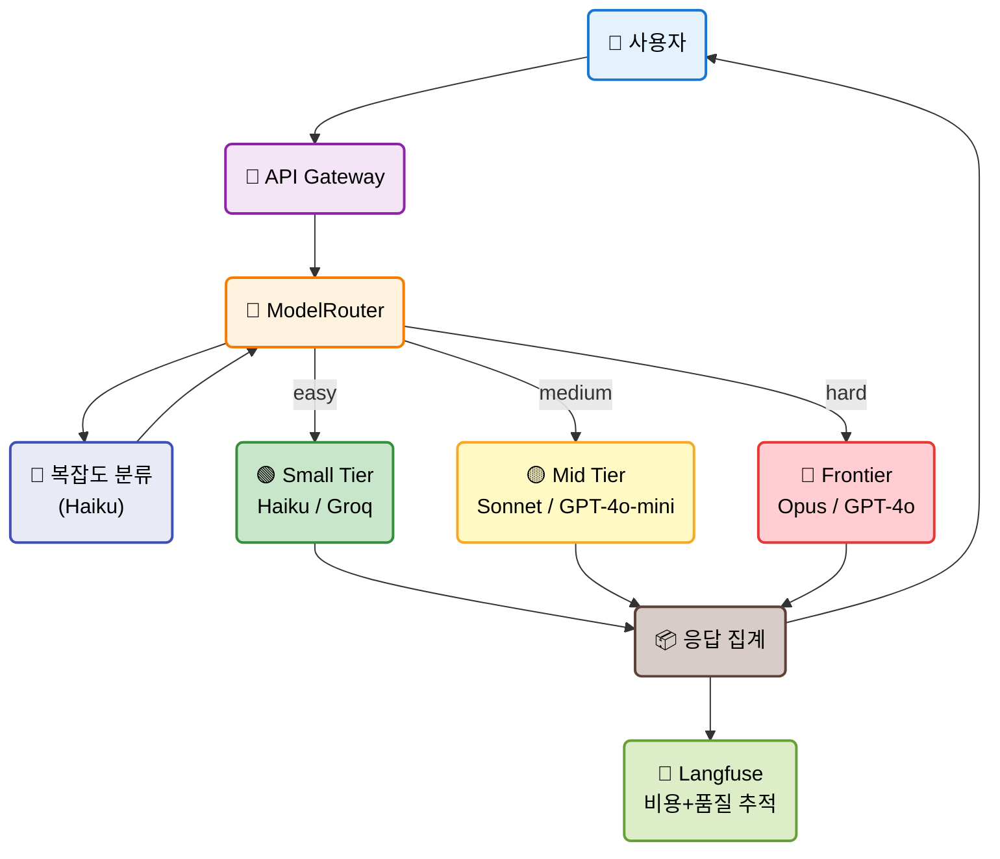

---

## Exercise 1: 커스텀 분류 규칙 추가

**목표**: 도메인 특화 분류기를 설계하여 라우팅 정확도 향상

**단계**:
1. 키워드 기반 사전 분류 (정규식 매칭)
2. LLM 분류기와 키워드 분류기 결합 (하이브리드)
3. 분류 결과 로깅 + 정확도 측정
4. 오분류 샘플 분석 후 프롬프트 개선

**힌트**:
```python
KEYWORD_RULES = {
    "easy": ["안녕", "날씨", "번역", "몇 시"],
    "hard": ["증명", "논문", "아키텍처 설계", "최적화"]
}
```

---

## Exercise 2: Fallback 체인 구현

**목표**: 모델 장애 시 자동으로 대체 모델로 전환하는 시스템 구축

**단계**:
1. Primary / Secondary / Tertiary 모델 정의
2. 응답 시간 초과 (5초) 시 자동 fallback
3. 에러 유형별 다른 fallback 전략 (rate limit vs timeout vs error)
4. Langfuse에 fallback 이벤트 추적
5. fallback 빈도 기반 모델 신뢰도 대시보드 설계

**제출**: 라우터 코드 + 10개 질문 테스트 결과 + Langfuse 트레이스

---

## 정리 & 마무리

**오늘 배운 것**

- 단일 모델 전략은 비용 낭비 -- 트래픽의 60-70%는 Small/Mid-tier로 처리 가능
- LiteLLM으로 100+ 모델을 동일 인터페이스(`litellm.completion()`)로 호출
- Portkey AI Gateway로 라우팅, 캐싱, 로드 밸런싱을 인프라 레벨에서 처리
- 복잡도 분류기(Small 모델) + 자동 라우팅으로 비용 75% 절감
- Plan-and-Execute 패턴: Planning=Frontier, Execution=Small
- LLM-as-Judge A/B 테스트로 라우팅 품질 검증

**다음 EP17**: 프롬프트 캐싱과 Batch API -- 동일 요청 반복 비용을 0으로

> 전체 코드는 GitHub 레포에서, 심화 내용은 커뮤니티에서
