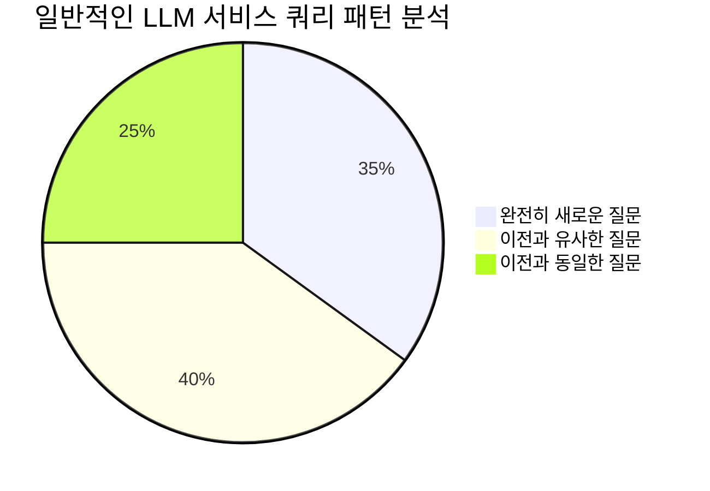
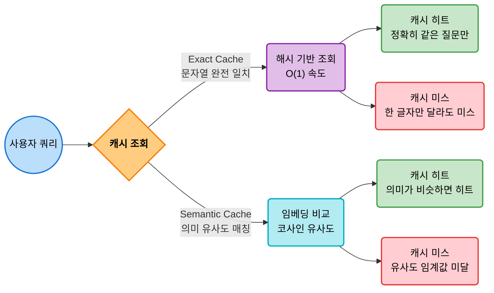
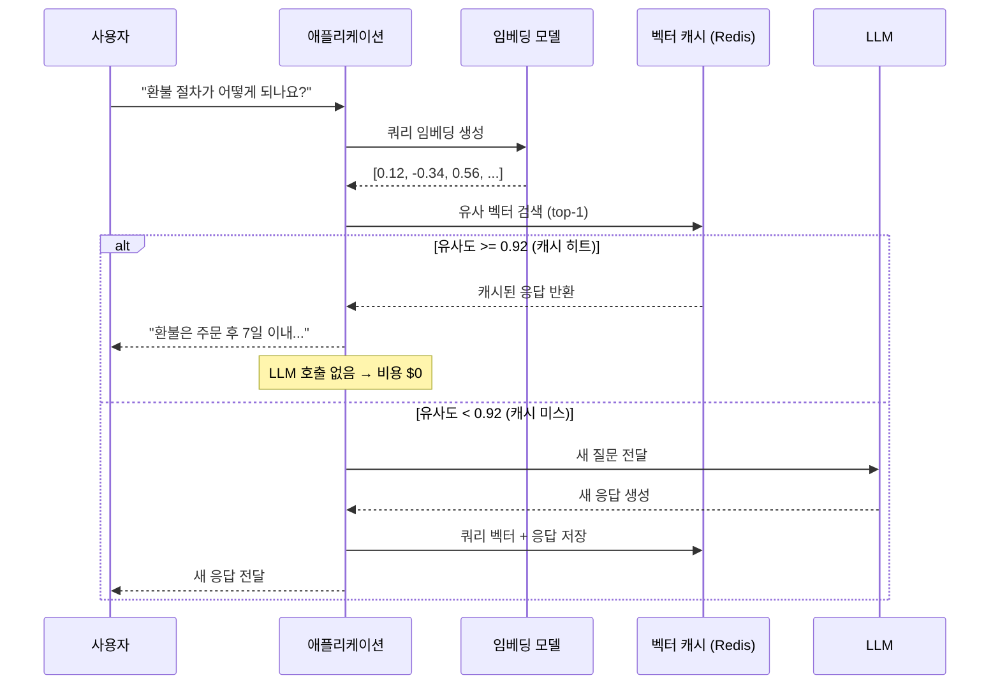
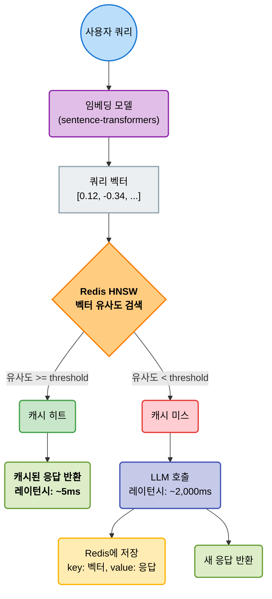
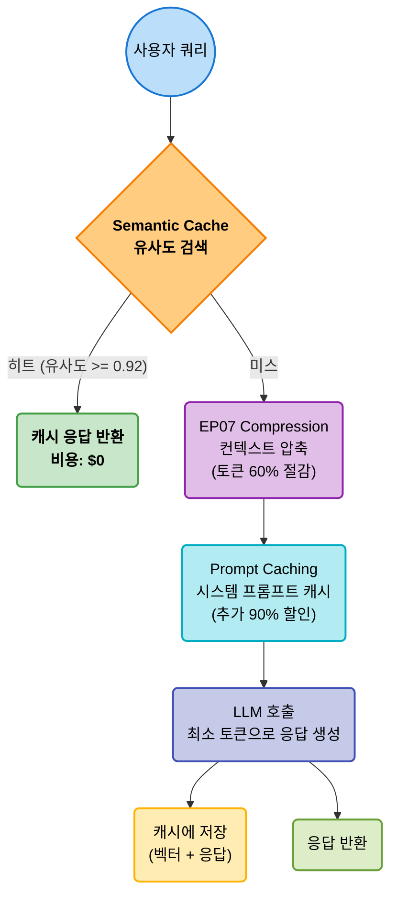
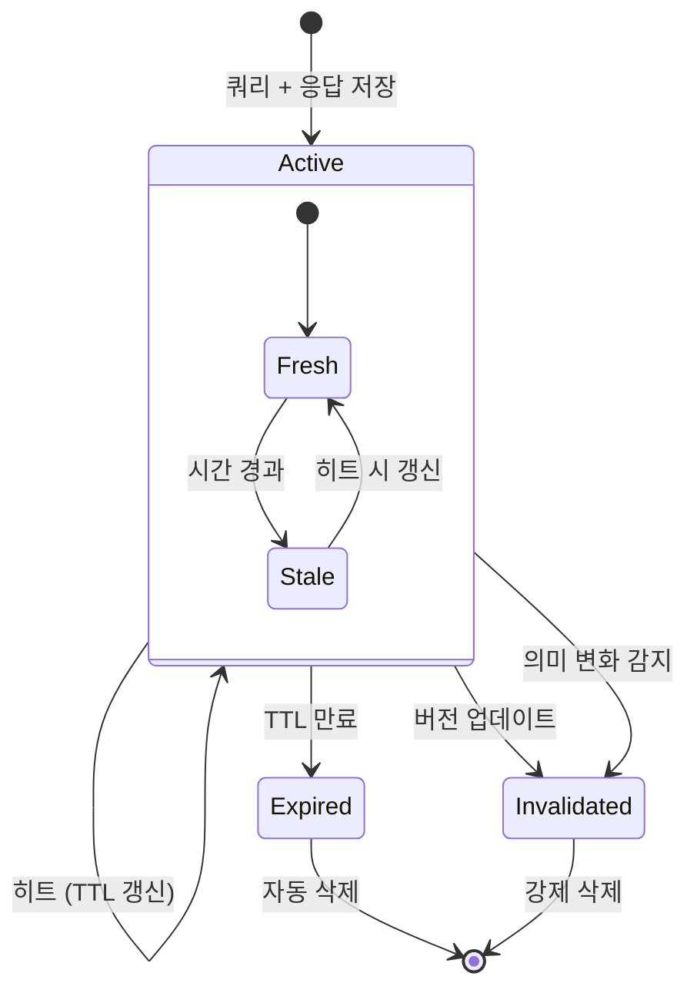
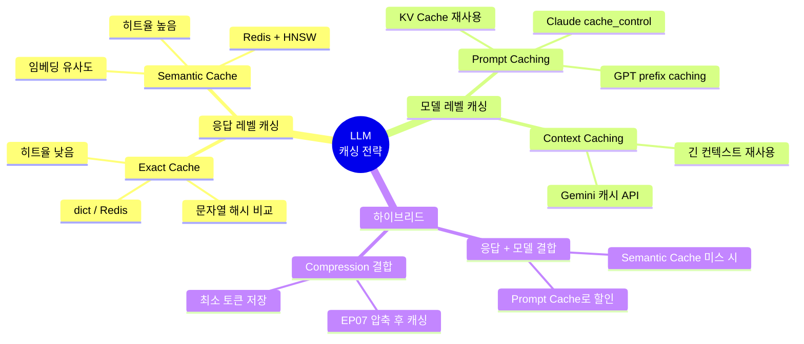
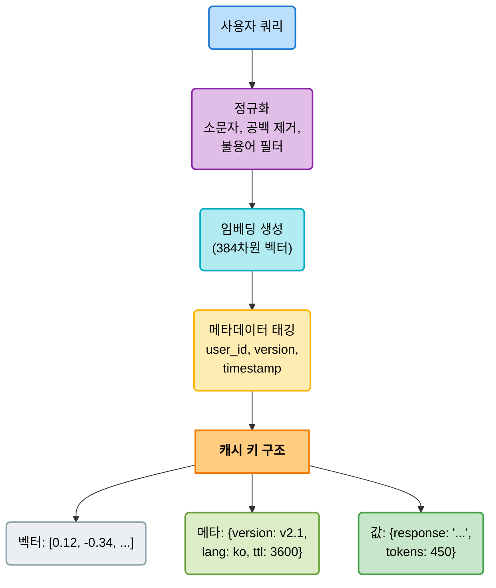
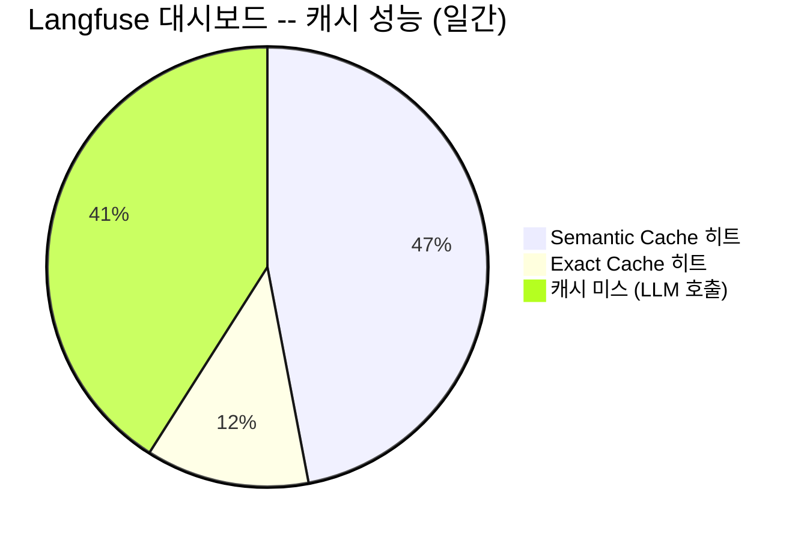

# EP17. Semantic Caching과 Prompt Compression
## 같은 질문에 매번 돈을 내지 않는 LLM 비용 최적화

> 난이도: ⭐⭐

**이번 에피소드에서 배울 것**
- Exact Cache와 Semantic Cache의 차이와 각각의 활용 시점
- 임베딩 유사도 기반 Semantic Cache 구현 원리
- Claude/GPT의 네이티브 Prompt Caching(KV Cache) 활용법
- EP07 Context Compression과의 결합으로 극대화하는 비용 절감 전략

---

## 1. 문제 제기 -- 같은 질문에 왜 매번 돈을 내는가



| 시나리오 | 일일 호출 | 평균 토큰 | 모델 | 월 비용 |
|---------|---------|----------|------|--------|
| 고객 FAQ 챗봇 | 5,000 | 2,000 tok | Claude 3.5 Sonnet | **$900/월** |
| 사내 문서 QA | 2,000 | 4,000 tok | GPT-4o | **$600/월** |
| 코드 리뷰 봇 | 1,000 | 8,000 tok | Claude 3.5 Sonnet | **$720/월** |

**핵심 질문**: 유사+동일 질문이 전체의 **65%** 를 차지하는데, 매번 새로 LLM을 호출해야 할까?

> 캐싱만으로 **월 40~60% 비용 절감**이 가능하다

---

## 2. Exact Cache vs Semantic Cache 비교



| 구분 | Exact Cache | Semantic Cache |
|------|-----------|---------------|
| 매칭 방식 | 문자열 해시 완전 일치 | 임베딩 코사인 유사도 |
| 히트율 | 낮음 (10~25%) | 높음 (40~65%) |
| 구현 복잡도 | 매우 낮음 | 중간 |
| 오답 위험 | 없음 | 유사도 임계값에 따라 존재 |
| 적합 시나리오 | API 중복 호출 방지 | FAQ, 고객 상담, 반복 QA |

---

## 3. Semantic Cache 원리 -- 임베딩 유사도 기반 매칭



**유사 질문 매칭 예시**

| 원본 (캐시됨) | 새 쿼리 | 유사도 | 판정 |
|-------------|--------|-------|------|
| "환불 절차가 어떻게 되나요?" | "환불하려면 어떻게 해야 하나요?" | 0.96 | HIT |
| "환불 절차가 어떻게 되나요?" | "반품 방법 알려주세요" | 0.93 | HIT |
| "환불 절차가 어떻게 되나요?" | "배송 현황 확인하고 싶어요" | 0.41 | MISS |

---

## 4. Redis + 임베딩 기반 Semantic Cache 아키텍처



**핵심 구현 요소**

```python
# Redis + fakeredis 폴백 패턴
try:
    import redis
    r = redis.Redis()
    r.ping()
except:
    import fakeredis
    r = fakeredis.FakeRedis()

# 임베딩 생성 + 캐시 조회
from sentence_transformers import SentenceTransformer
model = SentenceTransformer("all-MiniLM-L6-v2")
query_embedding = model.encode(user_query)

# 코사인 유사도로 캐시 히트 판정
from numpy import dot
from numpy.linalg import norm
similarity = dot(query_emb, cached_emb) / (norm(query_emb) * norm(cached_emb))
if similarity >= 0.92:
    return cached_response  # LLM 호출 없이 반환
```

---

## 5. 유사도 임계값(Threshold) 튜닝

```
캐시 히트율 (%)
  80 |                              ●
  70 |                    ●
  60 |            ●
  50 |       ●
  30 |  ●
     └────────────────────────────────
      0.80   0.85   0.90   0.92  0.95
                유사도 임계값
```

| 임계값 | 히트율 | 정확도 (올바른 캐시 반환) | 오답 위험 | 권장 상황 |
|-------|-------|---------------------|---------|---------|
| 0.85 | ~70% | 낮음 (82%) | 높음 | 비용 극한 절감 |
| 0.90 | ~55% | 중간 (91%) | 중간 | 일반 FAQ |
| **0.92** | **~48%** | **높음 (95%)** | **낮음** | **권장 기본값** |
| 0.95 | ~30% | 매우 높음 (99%) | 매우 낮음 | 정확도 최우선 |

> **권장**: 0.92에서 시작하고, 도메인별로 A/B 테스트로 미세 조정

---

## 6. Prompt Caching -- Claude/GPT의 네이티브 KV 캐시

```mermaid
flowchart LR
    subgraph "일반 호출 (매번 전체 처리)"
        A1(/"시스템 프롬프트\n(2,000 tok)"\):::sys --> P1("KV 계산\n(매번 반복)"):::calc
        B1(/"컨텍스트\n(3,000 tok)"\):::ctx --> P1
        C1(/"사용자 질문\n(100 tok)"\):::user --> P1
        P1 --> R1("응답 생성"):::resp
    end

    subgraph "Prompt Caching (캐시된 prefix 재사용)"
        A2(/"시스템 프롬프트\n(2,000 tok)"\):::cached --> P2("KV 캐시 히트\n(즉시 로드)"):::fast
        B2(/"컨텍스트\n(3,000 tok)"\):::cached --> P2
        C2(/"사용자 질문\n(100 tok)"\):::user --> P2b("KV 계산\n(100 tok만)"):::calc
        P2 --> P2b
        P2b --> R2("응답 생성"):::resp
    end

    classDef sys fill:#e1bee7,stroke:#8e24aa,stroke-width:2px,color:#000
    classDef ctx fill:#bbdefb,stroke:#1e88e5,stroke-width:2px,color:#000
    classDef user fill:#ffcc80,stroke:#f57c00,stroke-width:2px,color:#000
    classDef calc fill:#ffcdd2,stroke:#e53935,stroke-width:2px,color:#000
    classDef fast fill:#c8e6c9,stroke:#43a047,stroke-width:2px,font-weight:bold,color:#000
    classDef cached fill:#dcedc8,stroke:#689f38,stroke-width:2px,color:#000
    classDef resp fill:#eceff1,stroke:#90a4ae,stroke-width:2px,color:#000
```

**Claude cache_control 사용법**

```python
from anthropic import Anthropic
client = Anthropic()

response = client.messages.create(
    model="claude-sonnet-4-20250514",
    max_tokens=1024,
    system=[
        {
            "type": "text",
            "text": "당신은 금융 상담 AI입니다. ... (긴 시스템 프롬프트)",
            "cache_control": {"type": "ephemeral"}  # 이 부분 캐싱
        }
    ],
    messages=[{"role": "user", "content": "환불 절차를 알려주세요"}]
)
# 캐시 히트 시 시스템 프롬프트 토큰 비용 90% 할인
```

| 항목 | 일반 호출 | Prompt Caching |
|------|---------|---------------|
| 시스템 프롬프트 처리 | 매번 전체 계산 | 캐시에서 즉시 로드 |
| 입력 토큰 비용 | 100% | **캐시 부분 90% 할인** |
| 첫 호출 | 정상 비용 | 캐시 생성 비용 +25% |
| TTL | - | 5분 (Claude) |

---

## 7. Semantic Cache vs Prompt Caching -- 전략 비교

| 구분 | Semantic Cache | Prompt Caching |
|------|--------------|---------------|
| 캐시 대상 | 질문 + 응답 전체 | KV(Key-Value) 연산 결과 |
| 캐시 위치 | 외부 (Redis, 벡터DB) | LLM 제공사 서버 내부 |
| 히트 조건 | 유사 질문 (임베딩 유사도) | 동일 prefix (시스템 프롬프트) |
| LLM 호출 | 히트 시 호출 안 함 | 히트 시에도 호출함 (할인) |
| 절감 효과 | 히트 시 100% 절감 | 히트 시 캐시 부분 90% 절감 |
| 응답 다양성 | 없음 (캐시 고정) | 유지됨 (매번 생성) |
| 구현 난이도 | 중간 (인프라 필요) | 낮음 (API 파라미터만) |

> **결론**: 두 전략은 경쟁이 아니라 **보완** 관계 -- 함께 사용하면 극대화

---

## 8. EP07 Context Compression과의 결합 전략



**결합 시 비용 절감 시뮬레이션** (월 10,000 쿼리 기준)

| 전략 | 히트 쿼리 | 미스 쿼리 토큰 | 월 비용 | 절감율 |
|------|---------|-------------|--------|-------|
| 캐싱 없음 | 0% | 4,000 tok/건 | $1,200 | 0% |
| Semantic Cache만 | 48% | 4,000 tok/건 | $624 | 48% |
| Compression만 (EP07) | 0% | 1,600 tok/건 | $480 | 60% |
| **Cache + Compression** | **48%** | **1,600 tok/건** | **$250** | **79%** |
| **Cache + Comp + Prompt Cache** | **48%** | **1,600 tok/건** | **$195** | **84%** |

> **3중 결합으로 월 84% 비용 절감 달성**

---

## 9. 캐시 무효화 전략 -- 잘못된 캐시는 독이 된다



| 전략 | 트리거 | 구현 | 장점 | 단점 |
|------|-------|-----|------|------|
| **TTL 기반** | 시간 경과 | `r.setex(key, ttl, value)` | 구현 간단 | 유효한 캐시도 삭제 |
| **버전 기반** | 데이터 소스 변경 | 버전 태그 비교 | 정확한 무효화 | 버전 관리 필요 |
| **의미 변화 감지** | 응답 품질 저하 | 주기적 샘플링 검증 | 지능적 무효화 | 검증 비용 발생 |

```python
# TTL 기반 무효화 구현
import json, time

def cache_with_ttl(redis_client, key, value, ttl=3600):
    data = {"value": value, "timestamp": time.time(), "version": "v2.1"}
    redis_client.setex(key, ttl, json.dumps(data))

def get_cache(redis_client, key, current_version="v2.1"):
    data = redis_client.get(key)
    if data:
        parsed = json.loads(data)
        if parsed["version"] == current_version:
            return parsed["value"]
    return None  # 캐시 미스 또는 버전 불일치
```

---

## 10. 캐시 히트율과 비용 절감 측정

```
비용 절감율 (%)
  90 |                              ●
  80 |                    ●
  60 |            ●
  40 |       ●
  20 |  ●
     └────────────────────────────────
     10%    30%   50%   60%   70%
              캐시 히트율
```

**측정 지표**

| 지표 | 산출 공식 | 목표값 |
|------|---------|-------|
| 캐시 히트율 | `cache_hits / total_queries * 100` | >= 40% |
| 비용 절감율 | `(baseline_cost - actual_cost) / baseline_cost * 100` | >= 50% |
| 캐시 정확도 | `correct_cache_returns / total_cache_hits * 100` | >= 95% |
| 평균 레이턴시 절감 | `(llm_latency - cache_latency) / llm_latency * 100` | >= 90% |

**실전 벤치마크 결과** (고객 FAQ 챗봇, 10,000 쿼리)

| 지표 | Exact Cache | Semantic Cache (0.92) |
|------|-----------|---------------------|
| 히트율 | 18% | 47% |
| 비용 절감 | $162/월 | $423/월 |
| 오답률 | 0% | 2.1% |
| 캐시 레이턴시 | 2ms | 8ms |

---

## 11. Langfuse 통합 -- 캐시 히트/미스 추적

```python
from langfuse import Langfuse

langfuse = Langfuse(
    public_key=os.getenv("LANGFUSE_PUBLIC_KEY"),
    secret_key=os.getenv("LANGFUSE_SECRET_KEY"),
    host="https://cloud.langfuse.com"
)

# 캐시 히트/미스를 Langfuse trace로 기록
trace = langfuse.trace(name="semantic_cache_query")

if cache_hit:
    trace.update(tags=["cache_hit"], metadata={
        "similarity": similarity_score,
        "cached_query": original_cached_query,
        "cost_saved": estimated_cost
    })
    generation = trace.generation(
        name="cache_response", input=query,
        output=cached_response, model="cache",
        usage={"input": 0, "output": 0, "total": 0}
    )
else:
    trace.update(tags=["cache_miss"])
    generation = trace.generation(
        name="llm_response", input=query,
        output=llm_response, model="claude-3.5-sonnet",
        usage={"input": input_tokens, "output": output_tokens}
    )
```

**Langfuse 대시보드에서 확인할 수 있는 것**
- 히트/미스 비율 추이 (시간대별)
- 캐시 히트 시 절감된 비용 누적
- 미스 쿼리 패턴 분석 (새로운 캐시 후보 발굴)
- 유사도 점수 분포 (임계값 최적화 근거)

---

## 12. 캐싱 전략 분류 체계



---

## 13. Semantic Cache 구현 패턴 비교

| 패턴 | 벡터 저장소 | 장점 | 단점 |
|------|----------|------|------|
| Redis + RediSearch | Redis Stack | 빠른 HNSW 검색, TTL 내장 | Redis Stack 필요 |
| ChromaDB | 로컬 파일 | 설치 간단, 메타데이터 필터 | 프로덕션 스케일 한계 |
| Pinecone | 클라우드 | 관리형, 자동 스케일 | 비용, 네트워크 레이턴시 |
| FAISS + dict | 메모리 | 초고속, 라이브러리 하나 | 영속성 없음, TTL 직접 구현 |

**권장 조합**
```
개발/PoC   → ChromaDB 또는 FAISS + dict
스테이징   → fakeredis (Redis 호환 테스트)
프로덕션   → Redis Stack + Sentinel (HA)
```

---

## 14. 캐시 키 설계 전략



**캐시 키 정규화가 중요한 이유**

| 원본 쿼리 | 정규화 후 | 효과 |
|----------|---------|------|
| "환불 절차가 어떻게 되나요?" | "환불 절차 어떻게" | 불필요한 조사 제거 |
| "  환불  절차  " | "환불 절차" | 공백 정규화 |
| "REFUND PROCESS" | "refund process" | 대소문자 통일 |

> 정규화 후 임베딩하면 히트율이 **5~10%p 상승**

---

## 15. 캐시 워밍(Warming) 전략

```python
# 사전 캐시 워밍: 자주 묻는 질문을 미리 캐시에 로드
frequent_questions = [
    "환불 절차가 어떻게 되나요?",
    "배송 기간은 얼마나 걸리나요?",
    "회원 탈퇴는 어떻게 하나요?",
    # ... 상위 100개 FAQ
]

for question in frequent_questions:
    response = llm.invoke(question)
    embedding = model.encode(question)
    cache.store(embedding, question, response)

print(f"사전 캐시 워밍 완료: {len(frequent_questions)}개 항목")
```

**워밍 전략 비교**

| 전략 | 시점 | 방법 | 비용 |
|------|------|------|------|
| Cold Start | 서비스 시작 | 캐시 비어있음, 점진적 적재 | $0 |
| Warm Start | 배포 전 | FAQ 상위 N개 사전 로딩 | 1회 LLM 비용 |
| Hot Reload | 캐시 만료 시 | 만료 직전 백그라운드 갱신 | 지속적 소량 |

---

## 16. 캐시 모니터링 대시보드 설계



**모니터링 필수 지표**

| 지표 | 알림 조건 | 대응 |
|------|---------|------|
| 히트율 급락 (< 20%) | 즉시 | 캐시 서버 상태 확인 |
| 오답률 증가 (> 5%) | 주의 | 임계값 상향 조정 |
| 캐시 크기 폭증 | 경고 | TTL 단축 또는 LRU 정책 |
| 레이턴시 증가 (> 50ms) | 주의 | 인덱스 재구축, 샤딩 |

---

## 17. 프로덕션 배포 체크리스트

```
배포 전 확인사항
├── 인프라
│   ├── Redis Stack 설치 및 Sentinel HA 구성
│   ├── 임베딩 모델 서빙 (GPU 또는 CPU 최적화)
│   └── 캐시 용량 산정 (항목 수 x 벡터 차원 x 4 bytes)
├── 파라미터
│   ├── 유사도 임계값 결정 (A/B 테스트 결과 기반)
│   ├── TTL 설정 (도메인별 데이터 변경 주기 고려)
│   └── 최대 캐시 크기 및 eviction 정책
├── 모니터링
│   ├── Langfuse 트레이싱 연동
│   ├── 히트율 / 오답률 알림 설정
│   └── 비용 절감 대시보드 구성
└── 안전장치
    ├── 캐시 미스 시 LLM 폴백 보장
    ├── 캐시 서버 장애 시 우회 경로
    └── 버전별 캐시 격리 (canary 배포)
```

---

## 18. 주의사항 및 한계

**Semantic Cache 주의점**
- 유사도 임계값이 낮으면 **오답 위험** (다른 맥락의 유사 질문)
- 개인화된 응답 (사용자별 다른 답변)에는 부적합
- 실시간 데이터 (주가, 날씨)에는 TTL을 매우 짧게 설정

**Prompt Caching 주의점**
- TTL이 짧음 (Claude: 5분) -- 트래픽이 적으면 효과 없음
- 첫 호출에 +25% 비용 (캐시 생성 비용)
- prefix가 변경되면 캐시 무효화

**일반 주의사항**
- 캐시 히트 응답의 품질을 주기적으로 검증해야 함
- 법률/의료 등 정확도가 극히 중요한 도메인에서는 신중하게 적용
- 캐시 스토리지 비용 < LLM 호출 비용인지 ROI 계산 필수

---

## 19. 종합 비교표

| 전략 | 구현 난이도 | 비용 절감 | 정확도 영향 | 레이턴시 개선 | 적합 시나리오 |
|------|----------|---------|-----------|------------|-----------|
| Exact Cache | ⭐ | 10~25% | 없음 | 매우 높음 | API 중복 호출 |
| Semantic Cache | ⭐⭐ | 40~65% | 낮음 | 매우 높음 | FAQ, 고객상담 |
| Prompt Caching | ⭐ | 20~40% | 없음 | 약간 | 긴 시스템 프롬프트 |
| Compression (EP07) | ⭐⭐ | 50~70% | 중간 | 없음 | 긴 문서 QA |
| **3중 결합** | **⭐⭐⭐** | **70~85%** | **낮음** | **높음** | **프로덕션 최적화** |

---

## 20. 핵심 개념 복습

**오늘 배운 것**

| 개념 | 핵심 포인트 |
|------|-----------|
| Exact Cache | 문자열 완전 일치, 간단하지만 히트율 낮음 |
| Semantic Cache | 임베딩 유사도 기반, 히트율 40~65% |
| Prompt Caching | LLM 네이티브 KV 캐시, 캐시 부분 90% 할인 |
| 유사도 임계값 | 0.92 기본값, 도메인별 A/B 테스트로 조정 |
| 캐시 무효화 | TTL + 버전 + 의미 변화 감지 3중 전략 |
| EP07 결합 | Compression + Caching으로 84% 비용 절감 |
| Langfuse 추적 | 히트/미스 태깅으로 캐시 성능 가시화 |

**황금률**: Semantic Cache(0.92) + Prompt Caching + Context Compression 조합이 **프로덕션 최적해**

---

## Exercise 1

### Semantic Cache 임계값 최적화 실험

**목표**: 유사도 임계값을 변경하며 히트율과 정확도의 최적 균형점을 찾는다

**단계**
1. FAQ 쌍 20개를 준비 (질문 + 정답)
2. 각 질문에 대해 유사 변형 3개씩 생성 (총 60개 변형 쿼리)
3. 임계값을 0.85 / 0.88 / 0.90 / 0.92 / 0.95로 변경하며 실행
4. 각 설정에서 히트율, 정확도(올바른 캐시 반환 비율), 오답률을 기록
5. matplotlib으로 임계값 vs 히트율/정확도 dual-axis 차트 그리기

**제출**: 그래프 + "내 도메인에 적합한 임계값" 선택 근거 1문단

---

## Exercise 2

### EP07 Compression + Semantic Cache 결합 파이프라인

**목표**: Context Compression과 Semantic Cache를 결합하여 비용 절감 효과를 측정한다

**단계**
1. 500단어 이상의 문서 3개를 준비
2. 파이프라인 A: Semantic Cache만 적용 (10개 쿼리)
3. 파이프라인 B: Compression(50%) + Semantic Cache 적용 (동일 10개 쿼리)
4. 각 파이프라인의 총 토큰 소비, 비용, 히트율, 응답 품질을 비교
5. Langfuse에서 cache_hit/cache_miss 태그별 비용 차이 확인

**보너스**: Prompt Caching(cache_control)까지 추가한 파이프라인 C의 결과를 비교하라

---

## 다음 에피소드 예고

### EP18. Cost Dashboard & Budget Alert
> LLM 비용을 실시간으로 추적하고 예산 초과를 자동 알림하는 FinOps 대시보드

- Langfuse + Grafana 연동 비용 대시보드
- 모델별/팀별/기능별 비용 분배
- 예산 임계값 알림 (Slack/이메일)
- 일간/주간 비용 리포트 자동화

**구독 ・ 좋아요 ・ 알림 설정** 잊지 마세요!
