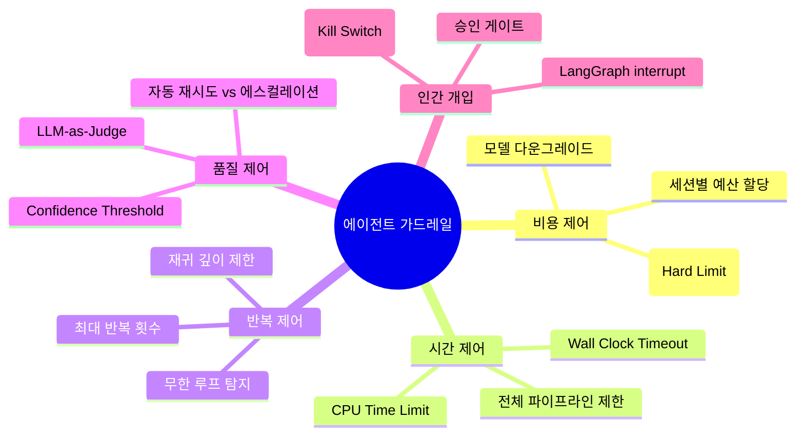
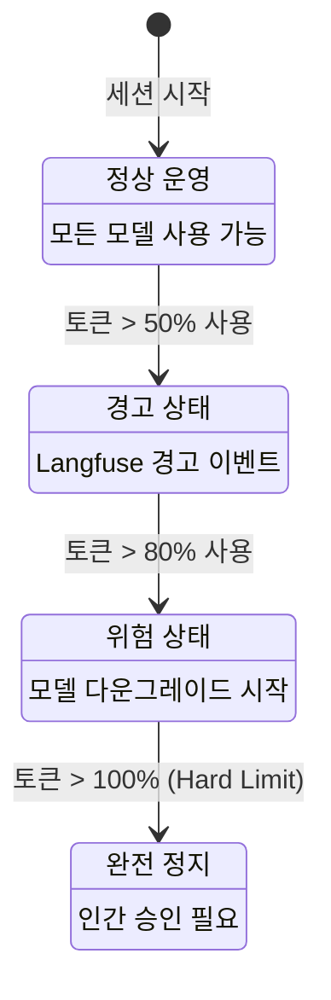
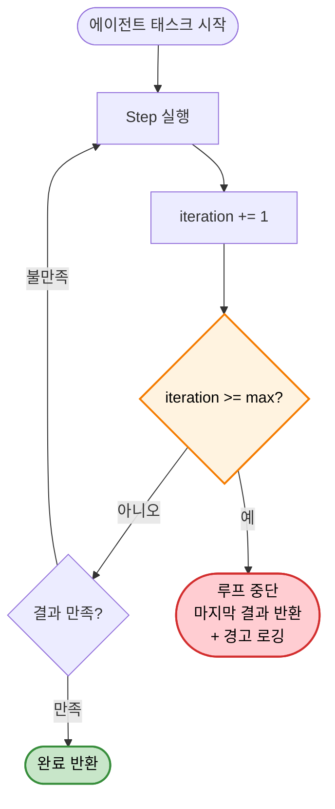
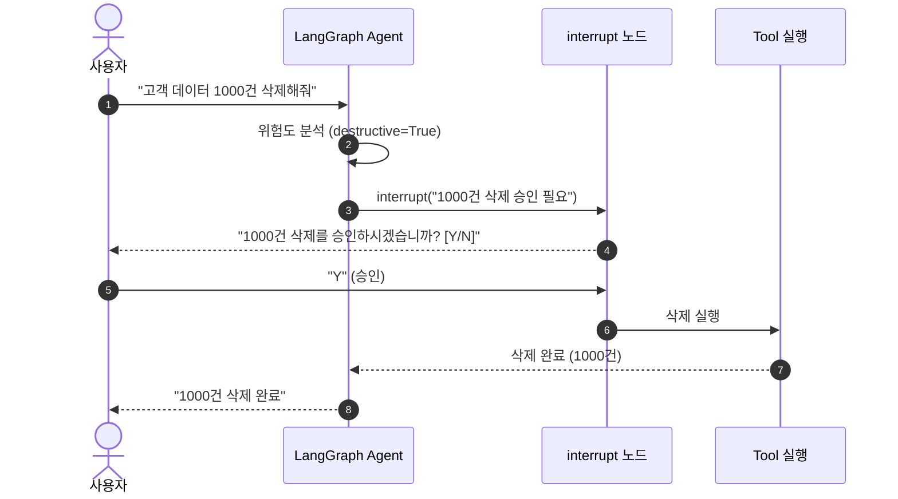
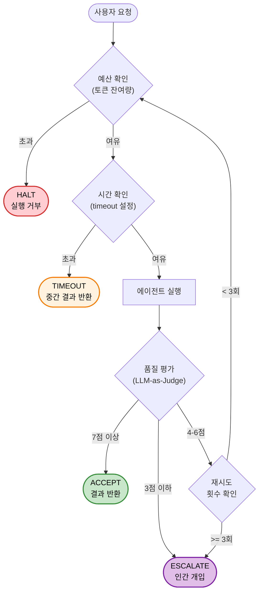
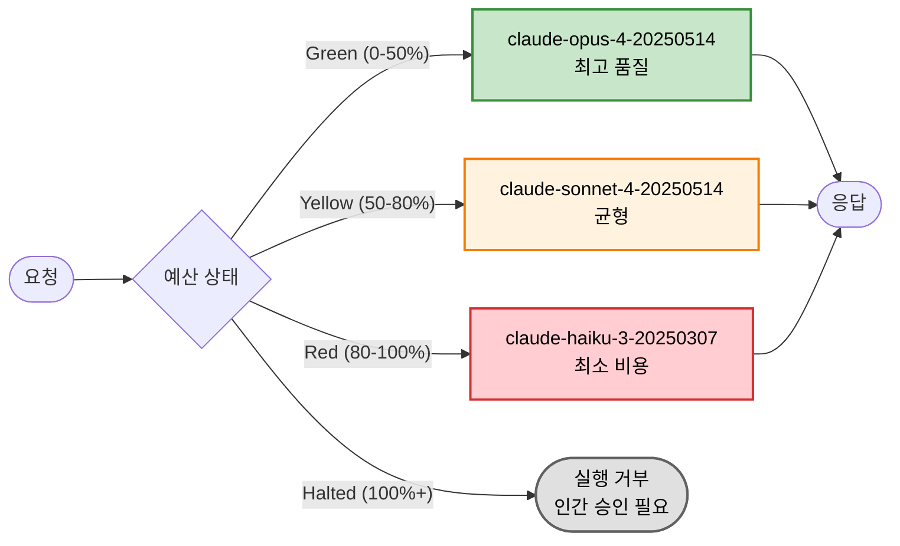
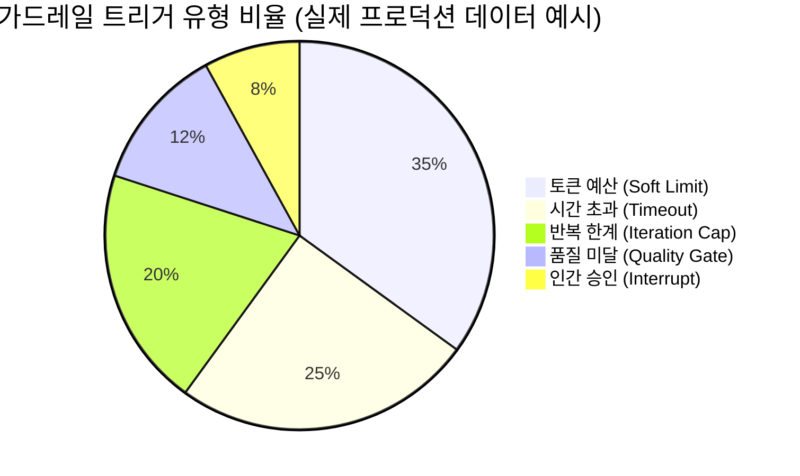
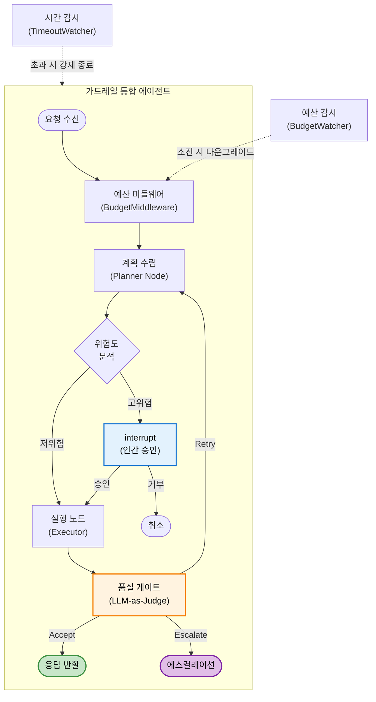

# EP19. 에이전트 가드레일 고급편

## 새벽 2시, 에이전트가 $3,000을 태웠습니다

> 토큰 예산 · 시간 제한 · 품질 게이트 · Graceful Degradation으로 에이전트를 통제하는 법

난이도: ⭐⭐⭐

---

## 목차

**위험 인식 (섹션 1-2)**
1. 문제 제기: 새벽 2시에 에이전트가 $3,000을 태웠습니다
2. 가드레일 분류 체계

**핵심 가드레일 (섹션 3-6)**
3. 토큰 예산 제한 (Hard Limit + Graceful Degradation)
4. 시간 예산 (Wall Clock timeout + CPU time)
5. 재귀 루프 자동 종료 (Iteration Cap + Timeout)
6. 품질 게이트: 기준 미달 자동 재시도 vs 에스컬레이션

**통합 패턴 (섹션 7-10)**
7. LangGraph interrupt 메커니즘 (human-in-the-loop)
8. 예산 미들웨어 구현 패턴
9. 복합 가드레일: 예산+시간+품질 삼중 제어
10. Graceful Degradation (Frontier → Mid → Small → Refuse)

**모니터링 & 실습 (섹션 11-12)**
11. Langfuse 모니터링 (가드레일 트리거 이벤트)
12. Exercise 2개 + 정리 & 마무리

---

## 1. 문제 제기: 새벽 2시에 에이전트가 $3,000을 태웠습니다

**실제 사고 시나리오**

| 시간 | 이벤트 | 누적 비용 |
|------|--------|----------|
| 02:00 | 에이전트 자동 실행 (야간 배치) | $0 |
| 02:05 | "결과 불만족" → 자동 재시도 시작 | $12 |
| 02:30 | 재시도 루프 50회 돌파 | $180 |
| 03:15 | Opus 모델로 장문 생성 반복 | $850 |
| 05:00 | 담당자 기상, Slack 알림 확인 | **$3,012** |

**근본 원인**: 가드레일 없이 에이전트에게 "알아서 해"라고 맡김

> "자율주행차에 브레이크 없이 출발한 것과 같습니다"

---

## 2. 가드레일 분류 체계



**5가지 축**으로 에이전트를 통제 — 하나만으로는 부족합니다

---

## 3. 토큰 예산 제한 — Hard Limit + Soft Limit



**BudgetTracker 클래스 핵심**

```python
class BudgetTracker:
    def __init__(self, hard_limit=50000, soft_limit=40000):
        self.hard_limit = hard_limit   # 절대 초과 불가
        self.soft_limit = soft_limit   # 경고 + 다운그레이드
        self.used_tokens = 0

    def check(self, requested_tokens: int) -> str:
        if self.used_tokens + requested_tokens > self.hard_limit:
            return "HALT"
        elif self.used_tokens > self.soft_limit:
            return "DEGRADE"
        return "OK"
```

---

## 4. 시간 예산 — Wall Clock + CPU Time

**Wall Clock Timeout**: 전체 경과 시간 제한 (사용자 체감 시간)
**CPU Time Limit**: 실제 연산 시간 제한 (비용 직결)

```python
import asyncio
import signal

# 방법 1: asyncio.wait_for (비동기 타임아웃)
async def run_with_timeout(coro, timeout_sec=30):
    try:
        return await asyncio.wait_for(coro, timeout=timeout_sec)
    except asyncio.TimeoutError:
        return {"status": "timeout", "action": "escalate"}

# 방법 2: signal 기반 (동기 타임아웃)
def timeout_handler(signum, frame):
    raise TimeoutError("에이전트 실행 시간 초과!")

signal.signal(signal.SIGALRM, timeout_handler)
signal.alarm(60)  # 60초 제한
```

| 제한 유형 | 대상 | 권장값 | 초과 시 |
|----------|------|--------|---------|
| Wall Clock | 전체 파이프라인 | 60-120초 | 에스컬레이션 |
| Per-Step | 개별 LLM 호출 | 30초 | 재시도 1회 |
| Total CPU | 세션 전체 | 300초 | 강제 종료 |

---

## 5. 재귀 루프 자동 종료



**IterationLimiter 구현**

```python
class IterationLimiter:
    def __init__(self, max_iterations=10):
        self.max_iterations = max_iterations
        self.current = 0

    def step(self) -> bool:
        """True면 계속, False면 중단"""
        self.current += 1
        if self.current >= self.max_iterations:
            logger.warning(f"반복 한계 도달: {self.current}/{self.max_iterations}")
            return False
        return True
```

**권장 설정**: 단순 질의 `max=5`, 복합 분석 `max=15`, 코드 생성 `max=20`

---

## 6. 품질 게이트 — LLM-as-Judge

**기준 미달 시 자동 재시도 vs 에스컬레이션**

```python
JUDGE_PROMPT = """
다음 응답의 품질을 1-10 점으로 평가하세요.

[원래 질문]: {question}
[에이전트 응답]: {response}

평가 기준:
- 정확성 (1-10)
- 완전성 (1-10)
- 관련성 (1-10)

JSON으로 응답: {{"score": N, "reason": "..."}}
"""

async def quality_gate(question, response, threshold=7):
    score = await llm_judge(question, response)
    if score >= threshold:
        return {"action": "accept", "score": score}
    elif score >= 4:
        return {"action": "retry", "score": score}   # 재시도 가치 있음
    else:
        return {"action": "escalate", "score": score}  # 인간 개입 필요
```

| 점수 범위 | 액션 | 설명 |
|----------|------|------|
| 7-10 | Accept | 결과 그대로 반환 |
| 4-6 | Retry | 프롬프트 보강 후 재시도 (최대 2회) |
| 1-3 | Escalate | 인간에게 즉시 에스컬레이션 |

---

## 7. LangGraph interrupt 메커니즘



**LangGraph interrupt 핵심 코드**

```python
from langgraph.types import interrupt, Command

def human_approval_node(state):
    """위험한 작업 전 인간 승인 요청"""
    action = state["pending_action"]
    
    # interrupt: 그래프 실행을 일시 중단하고 사용자 입력 대기
    approval = interrupt(
        f"다음 작업을 승인하시겠습니까?\n"
        f"작업: {action['type']}\n"
        f"대상: {action['target']}\n"
        f"영향 범위: {action['scope']}"
    )
    
    if approval == "approved":
        return Command(goto="execute_action")
    else:
        return Command(goto="cancel_action")
```

---

## 8. 예산 미들웨어 구현 패턴

```python
import tiktoken

class BudgetMiddleware:
    """모든 LLM 호출에 자동 적용되는 예산 미들웨어"""
    
    def __init__(self, session_budget=100000):
        self.budget = BudgetTracker(hard_limit=session_budget)
        self.encoder = tiktoken.get_encoding("cl100k_base")
    
    def estimate_tokens(self, messages: list) -> int:
        """메시지 리스트의 토큰 수 추정"""
        total = 0
        for msg in messages:
            total += len(self.encoder.encode(msg["content"]))
        return total
    
    async def __call__(self, messages, model, **kwargs):
        # 1. 입력 토큰 추정
        input_tokens = self.estimate_tokens(messages)
        
        # 2. 예산 확인
        status = self.budget.check(input_tokens * 3)  # 출력 포함 3배 추정
        
        if status == "HALT":
            return {"error": "예산 초과 — 실행 중단", "used": self.budget.used_tokens}
        elif status == "DEGRADE":
            model = self._downgrade_model(model)  # 모델 다운그레이드
        
        # 3. 실제 호출
        response = await call_llm(messages, model, **kwargs)
        
        # 4. 사용량 기록
        self.budget.used_tokens += response.usage.total_tokens
        return response
```

**핵심 포인트**: 모든 LLM 호출 경로에 미들웨어를 삽입 → 예산 우회 불가

---

## 9. 복합 가드레일: 예산+시간+품질 삼중 제어



**삼중 가드레일 핵심 로직**

```python
async def guarded_agent_run(request, budget, timer, limiter):
    while limiter.step():
        # 1. 예산 체크
        if budget.check(estimated_tokens) == "HALT":
            return GuardrailResult("HALT", "예산 초과")
        
        # 2. 시간 체크 + 실행
        try:
            result = await asyncio.wait_for(
                agent.run(request), timeout=timer.remaining()
            )
        except asyncio.TimeoutError:
            return GuardrailResult("TIMEOUT", "시간 초과")
        
        # 3. 품질 체크
        quality = await quality_gate(request, result)
        if quality["action"] == "accept":
            return GuardrailResult("ACCEPT", result)
        elif quality["action"] == "escalate":
            return GuardrailResult("ESCALATE", "품질 미달")
    
    return GuardrailResult("ITERATION_LIMIT", "반복 한계 도달")
```

---

## 10. Graceful Degradation



**모델 다운그레이드 체인**

```python
MODEL_CHAIN = [
    {"name": "claude-opus-4-20250514",   "cost_per_1k": 0.075, "quality": "최고"},
    {"name": "claude-sonnet-4-20250514", "cost_per_1k": 0.015, "quality": "균형"},
    {"name": "claude-haiku-3-20250307",  "cost_per_1k": 0.001, "quality": "최소"},
]

def select_model(budget_pct: float) -> dict:
    if budget_pct < 0.5:
        return MODEL_CHAIN[0]  # Opus
    elif budget_pct < 0.8:
        return MODEL_CHAIN[1]  # Sonnet
    elif budget_pct < 1.0:
        return MODEL_CHAIN[2]  # Haiku
    else:
        raise BudgetExhaustedError("예산 소진 — 실행 거부")
```

**핵심**: 비용을 절감하면서도 서비스 중단 없이 품질을 점진적으로 조절

---

## 11. Langfuse 모니터링 — 가드레일 트리거 이벤트

```python
from langfuse import Langfuse

langfuse = Langfuse()

def log_guardrail_event(trace_id, guardrail_type, action, details):
    """가드레일 트리거 이벤트를 Langfuse에 기록"""
    langfuse.event(
        trace_id=trace_id,
        name=f"guardrail_{guardrail_type}",
        metadata={
            "type": guardrail_type,   # budget | time | quality | iteration
            "action": action,          # warn | degrade | halt | escalate
            "details": details,
            "timestamp": datetime.now().isoformat(),
        },
        level="WARNING" if action in ["warn", "degrade"] else "ERROR",
    )
```

**Langfuse 대시보드에서 확인할 수 있는 것들**
- 가드레일 트리거 빈도 (시간대별 히트맵)
- 어떤 가드레일이 가장 자주 작동하는지 (비용 vs 시간 vs 품질)
- 에스컬레이션 비율 추이 (주간 트렌드)
- 모델 다운그레이드 패턴

---

## 12. 가드레일 트리거 유형 분석



**인사이트**
- 토큰 예산 Soft Limit이 가장 빈번 → 예산 설정이 너무 빡빡하거나, 프롬프트 최적화 필요
- 시간 초과가 2위 → 외부 API 지연이 원인인 경우 많음
- 반복 한계 20% → 에이전트 루프 설계 점검 필요
- 품질 미달 12% → Judge 프롬프트 또는 threshold 조정 검토

---

## 13. LangGraph 가드레일 통합 아키텍처



---

## 14. 가드레일 설계 원칙

**1. 방어적 기본값 (Defensive Defaults)**
```python
DEFAULT_GUARDRAILS = {
    "token_budget": 50_000,      # 세션당 5만 토큰
    "wall_timeout": 120,          # 2분 타임아웃
    "max_iterations": 10,         # 최대 10회 반복
    "quality_threshold": 7,       # 7점 이상만 통과
    "escalation_channel": "slack" # 에스컬레이션 채널
}
```

**2. Fail-Safe vs Fail-Secure**

| 전략 | 설명 | 사용 시점 |
|------|------|----------|
| **Fail-Safe** | 오류 시 안전한 기본 동작 | 읽기 전용, 분석 태스크 |
| **Fail-Secure** | 오류 시 완전 중단 | 데이터 수정, 금융 거래 |

**3. 가드레일 우회 방지**: 모든 LLM 호출 경로에 미들웨어 적용

---

## 15. 환경별 가드레일 설정

| 환경 | 토큰 예산 | 타임아웃 | 반복 한계 | 모델 |
|------|----------|---------|----------|------|
| **개발** | 200K | 300초 | 30회 | Opus |
| **스테이징** | 100K | 120초 | 15회 | Sonnet |
| **프로덕션** | 50K | 60초 | 10회 | Sonnet |
| **야간 배치** | 500K | 600초 | 50회 | Haiku |

```python
import os

GUARDRAIL_CONFIGS = {
    "development": {"budget": 200_000, "timeout": 300, "max_iter": 30},
    "staging":     {"budget": 100_000, "timeout": 120, "max_iter": 15},
    "production":  {"budget":  50_000, "timeout":  60, "max_iter": 10},
    "batch":       {"budget": 500_000, "timeout": 600, "max_iter": 50},
}

config = GUARDRAIL_CONFIGS[os.getenv("ENV", "production")]
```

---

## 16. 가드레일 테스트 전략

**각 가드레일이 정확히 작동하는지 반드시 테스트**

```python
# 토큰 예산 테스트 — 의도적으로 큰 프롬프트 전송
async def test_budget_guardrail():
    budget = BudgetTracker(hard_limit=100)
    budget.used_tokens = 95  # 거의 소진
    assert budget.check(10) == "HALT"

# 시간 초과 테스트 — 지연 함수로 타임아웃 유발
async def test_timeout_guardrail():
    async def slow_task():
        await asyncio.sleep(100)
    result = await run_with_timeout(slow_task(), timeout_sec=1)
    assert result["status"] == "timeout"

# 반복 제한 테스트
def test_iteration_guardrail():
    limiter = IterationLimiter(max_iterations=3)
    results = [limiter.step() for _ in range(5)]
    assert results == [True, True, False, False, False]
```

---

## 17. 모니터링 대시보드 설계

**Langfuse 대시보드 핵심 패널 구성**

| 패널 | 메트릭 | 알림 조건 |
|------|--------|----------|
| 예산 소진율 | 세션별 토큰 사용/한계 비율 | > 80% |
| 타임아웃 비율 | 전체 요청 중 타임아웃 % | > 15% |
| 재시도 비율 | 품질 미달 재시도 횟수/요청 | > 30% |
| 에스컬레이션 | 인간 개입 건수/시간 | > 5건/시간 |
| 모델 다운그레이드 | Opus→Sonnet→Haiku 비율 | Haiku > 50% |

```python
# Langfuse score 기록 예시
langfuse.score(
    trace_id=trace.id,
    name="guardrail_budget_usage",
    value=budget.used_tokens / budget.hard_limit,
    comment=f"사용: {budget.used_tokens} / 한계: {budget.hard_limit}"
)
```

---

## 18. 안티패턴: 이렇게 하면 안 됩니다

**안티패턴 1: 가드레일 없는 자율 에이전트**
```python
# 나쁜 예
while not satisfied:
    result = await agent.run(task)  # 무한 루프 가능!
```

**안티패턴 2: 하드 리밋만 설정**
```python
# 나쁜 예 — Soft Limit 없이 갑자기 중단
if tokens > 50000:
    raise Exception("Budget exceeded")  # 경고 없이 바로 에러
```

**안티패턴 3: 가드레일을 에이전트가 제어**
```python
# 나쁜 예 — 에이전트가 자신의 가드레일을 수정할 수 있음
agent.set_budget(999999)  # 에이전트가 자기 예산을 늘림
```

**올바른 접근**: 가드레일은 에이전트 **외부**에서 **불변**으로 적용

---

## 19. 실전 체크리스트

**프로덕션 배포 전 가드레일 체크리스트**

- [ ] 토큰 예산 Hard Limit 설정 완료
- [ ] 토큰 예산 Soft Limit (경고 임계값) 설정 완료
- [ ] Wall Clock Timeout 설정 완료
- [ ] 개별 LLM 호출 타임아웃 설정 완료
- [ ] 최대 반복 횟수 설정 완료
- [ ] 품질 게이트 (LLM-as-Judge) 적용 완료
- [ ] Graceful Degradation 모델 체인 정의 완료
- [ ] 위험 작업 interrupt (인간 승인) 설정 완료
- [ ] Langfuse 가드레일 이벤트 로깅 설정 완료
- [ ] 각 가드레일 트리거 테스트 완료
- [ ] 알림 채널 (Slack/Email) 연동 완료
- [ ] 환경별 설정 분리 완료

---

## 20. Exercise 1: 삼중 가드레일 에이전트

**목표**: 토큰 예산 + 시간 제한 + 품질 게이트를 결합한 LangGraph 에이전트 구현

**단계**:
1. BudgetTracker (hard_limit=10000, soft_limit=8000) 구현
2. asyncio.wait_for로 30초 타임아웃 적용
3. LLM-as-Judge로 품질 7점 이상만 통과 (최대 재시도 2회)
4. Langfuse에 모든 가드레일 트리거 이벤트 기록
5. 의도적으로 각 가드레일을 트리거하는 테스트 시나리오 3개 작성

**제출**: 코드 + 각 가드레일 트리거 로그 스크린샷

---

## 21. Exercise 2: Graceful Degradation 파이프라인

**목표**: 예산 소진에 따라 모델을 자동으로 다운그레이드하는 파이프라인 구현

**단계**:
1. MODEL_CHAIN 정의 (Opus → Sonnet → Haiku)
2. 각 모델별 비용 추정기 구현
3. 예산 50% 소진 시 Sonnet으로, 80% 소진 시 Haiku로 자동 전환
4. 100% 소진 시 실행 거부 + 에스컬레이션
5. Langfuse에 모델 전환 이벤트 기록
6. 전체 과정을 시각화하는 리포트 생성

**제출**: 코드 + 모델 전환 시점 로그 + Langfuse 트레이스

---

## 정리 & 마무리

**오늘 배운 것**

- **토큰 예산**: Hard Limit + Soft Limit으로 비용을 이중 제어
- **시간 예산**: Wall Clock + Per-Step 타임아웃으로 지연 방지
- **재귀 루프**: IterationLimiter로 무한 반복 자동 종료
- **품질 게이트**: LLM-as-Judge로 기준 미달 자동 재시도/에스컬레이션
- **LangGraph interrupt**: 위험 작업 전 인간 승인 요청
- **Graceful Degradation**: Opus → Sonnet → Haiku → Refuse 모델 체인
- **Langfuse 모니터링**: 가드레일 트리거 이벤트 추적 및 알림

**다음 EP20**: 프로덕션 에이전트 복원력 — 장애 복구와 자동 롤백

> 전체 코드는 GitHub 레포에서, 심화 내용은 커뮤니티에서
