# EP20. 에이전트 메모리 아키텍처

## 어제 대화를 기억 못 하는 에이전트는 쓸모없다

> Short-term / Long-term 메모리 · 압축 전략 · LangGraph Checkpointer · Langfuse 추적

난이도: ⭐⭐⭐

---

## 목차

**기본 개념 (섹션 1-5)**
1. 문제 제기: 기억 못 하는 에이전트
2. Short-term vs Long-term 메모리
3. 메모리 저장 전략 비교
4. 메모리 압축: 토큰 절약의 핵심
5. 메모리 유형 분류

**실전 구현 (섹션 6-11)**
6. LangGraph Persistent Checkpointer
7. 메모리 검색 전략
8. 세션 간 컨텍스트 유지 아키텍처
9. Langfuse로 메모리 사용량 추적
10. Exercise 2개
11. 정리 & 마무리

---

## 1. 문제 제기: 기억 못 하는 에이전트

**매번 처음부터 시작하는 에이전트 — 당신의 AI 비서도 이런가요?**

| 대화 시점 | 사용자 발화 | 에이전트 응답 |
|-----------|-----------|-------------|
| 세션 1 | "나는 Python 개발자야" | "알겠습니다!" |
| 세션 2 | "내 직업이 뭐였지?" | "죄송합니다, 모르겠습니다" |
| 세션 3 | "지난번 분석 결과 보여줘" | "이전 대화를 참고할 수 없습니다" |

**핵심 문제**: LLM은 기본적으로 **무상태(stateless)** — 세션 종료 시 모든 컨텍스트 소멸

**해결**: 외부 메모리 시스템을 구축하여 에이전트에 **장기 기억** 부여

---

## 2. Short-term vs Long-term 메모리

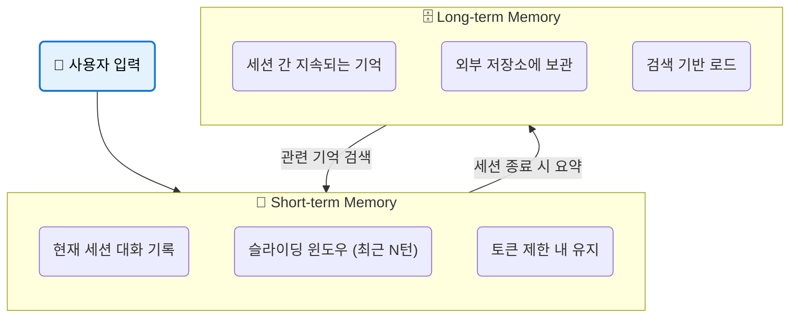

| 구분 | Short-term | Long-term |
|------|-----------|-----------|
| **지속 시간** | 현재 세션만 | 영구 |
| **저장 위치** | 메모리 (프롬프트) | DB / 파일 |
| **용량** | 토큰 제한 | 사실상 무제한 |
| **접근 방식** | 자동 포함 | 검색 후 로드 |
| **비유** | 작업 기억 | 도서관 |

---

## 3. 메모리 저장 전략 비교

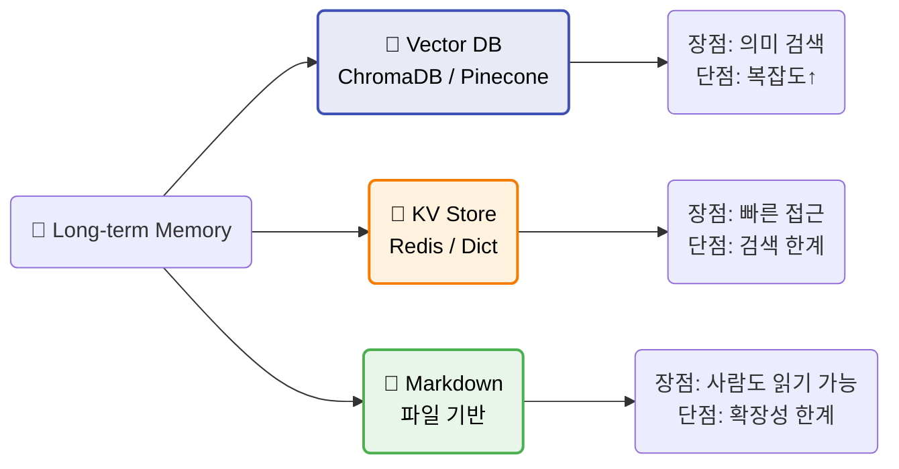

| 전략 | 검색 방식 | 적합한 경우 | 대표 도구 |
|------|----------|-----------|----------|
| **Vector DB** | 유사도 검색 | 의미 기반 기억 탐색 | ChromaDB, Pinecone |
| **KV Store** | 키 기반 조회 | 사용자 프로필, 설정 | Redis, DynamoDB |
| **Markdown** | 파일 읽기 | 소규모, 디버깅 용이 | .md 파일, Claude CLAUDE.md |

---

## 4. 메모리 압축: 토큰 절약의 핵심

**왜 압축이 필요한가?**
- 대화가 100턴 → 약 50,000 토큰 → 컨텍스트 윈도우 초과
- 오래된 대화를 **통째로** 넣을 수 없다 → **요약**하여 저장

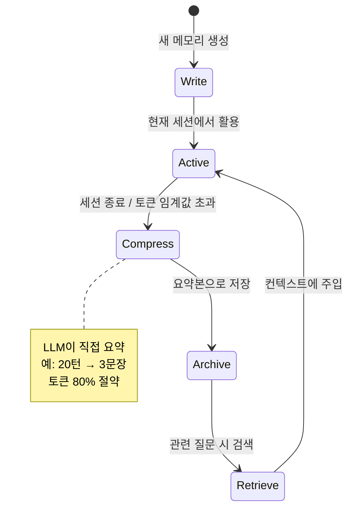

**압축 전략**:
1. **슬라이딩 윈도우**: 최근 N턴만 유지, 나머지 삭제
2. **요약 압축**: LLM이 오래된 대화를 요약문으로 변환
3. **계층적 압축**: 최근(전체) → 중간(요약) → 오래된(키워드만)

---

## 5. 메모리 유형 분류

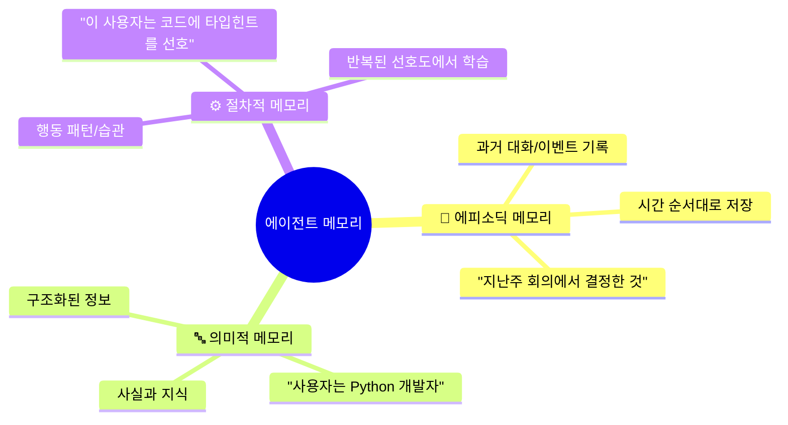

| 메모리 유형 | 저장하는 것 | 예시 | 검색 방식 |
|------------|-----------|------|----------|
| **에피소딕** | 과거 사건/대화 | "3월 1일에 버그를 수정함" | 시간 기반 |
| **의미적** | 사실/지식 | "DB 비밀번호는 env에 저장" | 키워드/유사도 |
| **절차적** | 선호도/패턴 | "항상 한국어로 응답" | 규칙 기반 |

---

## 6. LangGraph Persistent Checkpointer

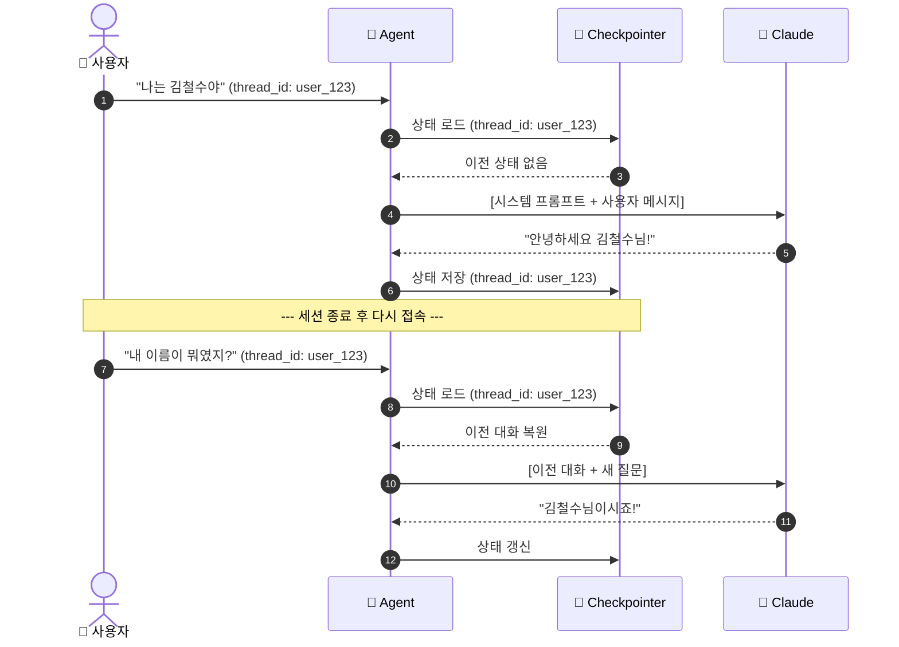

**핵심 코드**:
```python
from langgraph.checkpoint.memory import MemorySaver
checkpointer = MemorySaver()
graph = builder.compile(checkpointer=checkpointer)
config = {"configurable": {"thread_id": "user_123"}}
```

---

## 7. 메모리 검색 전략

**3가지 스코어링 축**

| 축 | 설명 | 계산 방법 |
|----|------|----------|
| **Recency** | 최근 기억일수록 높은 점수 | `exp(-decay * hours_ago)` |
| **Relevance** | 현재 질문과 유사할수록 높은 점수 | cosine similarity |
| **Importance** | 중요한 기억일수록 높은 점수 | LLM이 1~10점 부여 |

**최종 점수** = `w1 * recency + w2 * relevance + w3 * importance`

```python
def score_memory(memory, query, now):
    recency = math.exp(-0.01 * hours_since(memory.timestamp, now))
    relevance = cosine_sim(embed(query), memory.embedding)
    importance = memory.importance / 10.0
    return 0.3 * recency + 0.5 * relevance + 0.2 * importance
```

> 이 접근법은 "Generative Agents" 논문 (Park et al., 2023)에서 영감

---

## 8. 토큰 사용 비율: 메모리 없는 경우 vs 있는 경우

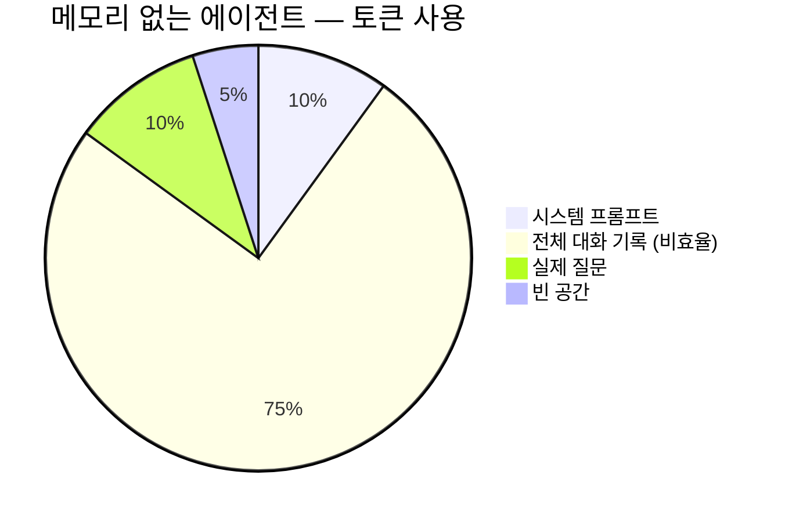

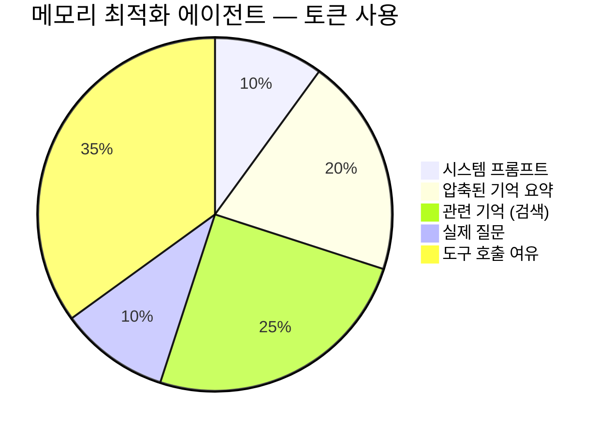

**결과**: 메모리 아키텍처 도입 시 **토큰 55% 절약**, 도구 호출 여유 확보

---

## 9. MemoryManager 설계

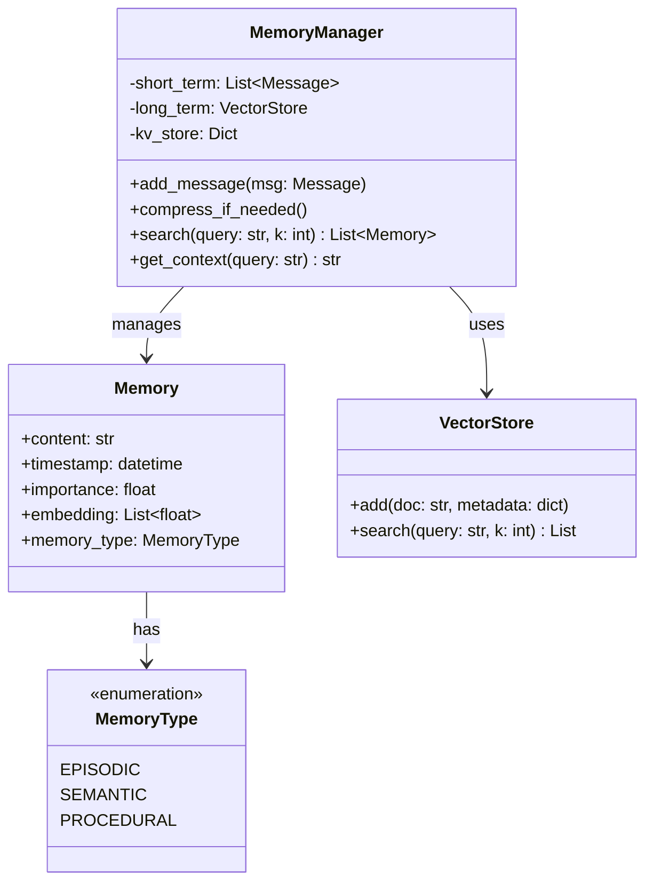

---

## 10. 세션 간 컨텍스트 유지 아키텍처

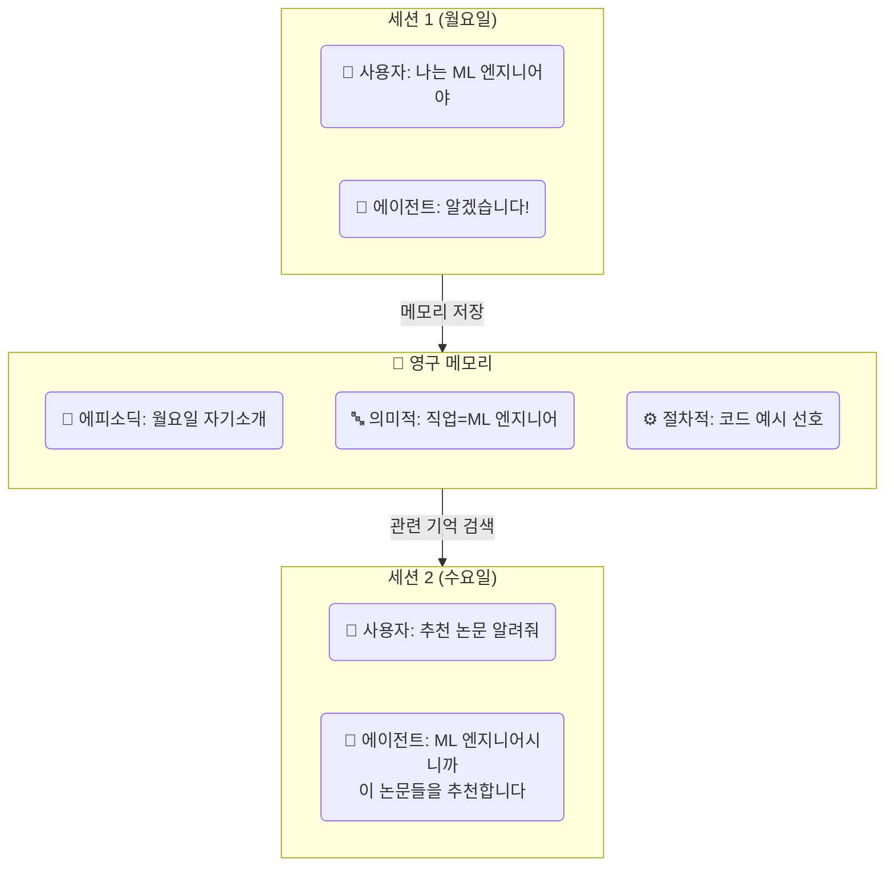

**아키텍처 핵심**:
1. 세션 종료 시 → 대화를 **분류/요약**하여 장기 메모리에 저장
2. 새 세션 시작 → 사용자 ID로 **관련 기억 검색**
3. 검색된 기억 → **시스템 프롬프트에 주입**하여 개인화

---

## 11. Langfuse로 메모리 사용량 추적

```python
from langfuse import Langfuse
langfuse = Langfuse()

trace = langfuse.trace(name="memory_operation", user_id="user_123")

# 메모리 읽기 추적
read_span = trace.span(name="memory_read",
    metadata={"query": "사용자 직업", "results_count": 3})

# 메모리 쓰기 추적
write_span = trace.span(name="memory_write",
    metadata={"type": "semantic", "content_length": 45})
```

**추적 항목**:

| 지표 | 설명 | 활용 |
|------|------|------|
| 메모리 읽기 횟수 | 세션당 몇 번 검색하는가 | 검색 비용 최적화 |
| 메모리 쓰기 횟수 | 세션당 몇 개 저장하는가 | 저장소 용량 관리 |
| 검색 관련도 | 검색된 기억의 유사도 점수 | 검색 품질 모니터링 |
| 압축 비율 | 압축 전/후 토큰 차이 | 압축 전략 평가 |

---

## 12. 메모리 라이프사이클 전체 흐름

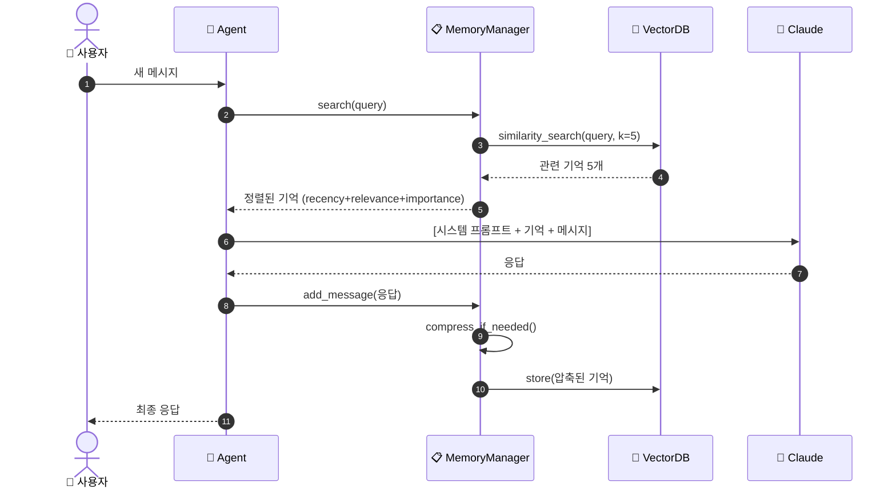

---

## 13. 실전 팁: 메모리 설계 체크리스트

**프로덕션 에이전트 메모리 체크리스트**

- [ ] **TTL (Time To Live)** 설정 — 오래된 기억 자동 만료
- [ ] **중복 제거** — 같은 내용 반복 저장 방지
- [ ] **개인 정보 필터링** — 민감 정보(비밀번호 등) 저장 차단
- [ ] **메모리 크기 제한** — 사용자당 최대 저장량 설정
- [ ] **백업 & 복구** — 메모리 데이터 정기 백업
- [ ] **모니터링** — Langfuse로 읽기/쓰기 빈도 추적

---

## 14. 메모리 압축 실전 예시

**압축 전 (원본 대화, 520 토큰)**:
```
사용자: Python으로 웹 크롤러를 만들고 싶어.
AI: requests와 BeautifulSoup을 사용하면 됩니다. 먼저 pip install...
사용자: 동적 페이지는 어떻게 해?
AI: Selenium이나 Playwright를 추천합니다. 특히...
사용자: Playwright가 더 빠르다고 들었는데?
AI: 맞습니다. Playwright는 비동기 지원이...
(... 이하 15턴 생략 ...)
```

**압축 후 (요약, 85 토큰)**:
```
[에피소딕 요약] 사용자가 Python 웹 크롤러 구현을 요청.
정적 페이지(requests+BS4)와 동적 페이지(Playwright) 논의.
Playwright 비동기 패턴으로 최종 구현. 에러 핸들링 추가.
사용자 선호: 타입힌트 포함, 비동기 우선.
```

**토큰 절약**: 520 → 85 토큰 (**84% 절약**)

---

## 15. Vector DB 메모리 저장 흐름

```python
import chromadb
from sentence_transformers import SentenceTransformer

embedder = SentenceTransformer("all-MiniLM-L6-v2")
client = chromadb.Client()
collection = client.get_or_create_collection("agent_memory")

def store_memory(content: str, memory_type: str, importance: int):
    embedding = embedder.encode(content).tolist()
    collection.add(
        documents=[content],
        embeddings=[embedding],
        metadatas=[{"type": memory_type, "importance": importance,
                    "timestamp": datetime.now().isoformat()}],
        ids=[f"mem_{uuid4().hex[:8]}"]
    )

def recall(query: str, k: int = 5):
    results = collection.query(
        query_embeddings=[embedder.encode(query).tolist()],
        n_results=k
    )
    return results["documents"][0]
```

---

## 16. KV Store 메모리: 빠른 프로필 접근

```python
# 사용자 프로필/설정 — 키-값 기반 즉시 접근
class KVMemory:
    def __init__(self):
        self.store = {}

    def set(self, key: str, value: str):
        self.store[key] = {
            "value": value,
            "updated_at": datetime.now().isoformat()
        }

    def get(self, key: str) -> str | None:
        entry = self.store.get(key)
        return entry["value"] if entry else None

# 사용 예시
kv = KVMemory()
kv.set("user_name", "김철수")
kv.set("preferred_language", "ko")
kv.set("expertise", "ML Engineering")

print(kv.get("user_name"))  # "김철수"
```

**적합한 용도**: 사용자 이름, 언어 설정, 선호도 등 **자주 조회**되는 정보

---

## 17. Markdown 파일 메모리

```python
# Claude의 CLAUDE.md와 유사한 접근
MEMORY_FILE = "agent_memory.md"

def save_to_markdown(category: str, content: str):
    with open(MEMORY_FILE, "a") as f:
        f.write(f"\n## {category}\n")
        f.write(f"- {content}\n")
        f.write(f"- _저장 시각: {datetime.now().isoformat()}_\n")

def load_markdown_memory() -> str:
    with open(MEMORY_FILE, "r") as f:
        return f.read()
```

**생성되는 파일 예시**:
```markdown
## 사용자 정보
- 이름: 김철수, ML 엔지니어
- _저장 시각: 2026-04-05T14:30:00_

## 프로젝트 맥락
- 현재 RAG 파이프라인 개선 작업 중
- _저장 시각: 2026-04-05T15:00:00_
```

**장점**: 사람이 직접 읽고 편집 가능, 버전 관리(Git) 가능

---

## 18. LangGraph + 메모리 통합 아키텍처

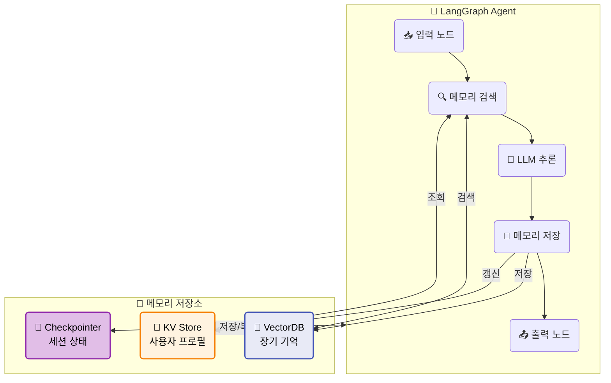

---

## 19. Exercise 1: 통합 메모리 에이전트

**목표**: Short-term + Long-term 메모리를 결합한 에이전트 구현

**요구사항**:
1. `MemoryManager` 클래스 구현 (short-term + vector DB)
2. 대화 5턴마다 자동 압축 (LLM 요약)
3. 새 세션 시작 시 관련 기억 자동 로드
4. 메모리 검색에 recency + relevance 스코어링 적용
5. Langfuse로 메모리 읽기/쓰기 추적

**평가 기준**: 세션 2에서 세션 1의 정보를 정확히 활용하는가?

---

## 20. Exercise 2: 메모리 성능 벤치마크

**목표**: 3가지 저장 전략(Vector DB / KV / Markdown)의 성능 비교

**측정 항목**:
1. 쓰기 속도: 100개 메모리 저장 시간
2. 읽기 속도: 검색 응답 시간 (ms)
3. 검색 정확도: 관련 메모리 top-5 정밀도
4. 토큰 효율: 압축 전/후 토큰 수 비교
5. 확장성: 메모리 1000개 시 성능 변화

**제출**: 벤치마크 결과 테이블 + 분석 코멘트

---

## 21. 핵심 비교: 메모리 전략 선택 가이드

| 상황 | 추천 전략 | 이유 |
|------|----------|------|
| 고객 지원 봇 | Vector DB + KV | 과거 티켓 검색 + 고객 프로필 |
| 코딩 어시스턴트 | Markdown + KV | 프로젝트 컨텍스트 + 사용자 선호 |
| 연구 에이전트 | Vector DB | 논문/자료 의미 검색 |
| 개인 비서 | 3가지 모두 | 풀 스택 메모리 필요 |
| 단순 챗봇 | Checkpointer만 | 세션 내 기억만 충분 |

**원칙**: **단순하게 시작**하고, 필요할 때 복잡도를 추가

---

## 정리 & 마무리

**오늘 배운 것**

- **Short-term vs Long-term** 메모리를 구분하여 토큰을 효율적으로 사용
- **3가지 저장 전략** (Vector DB / KV Store / Markdown)의 장단점
- **메모리 압축**으로 오래된 대화를 요약하여 토큰 80%+ 절약
- **LangGraph Checkpointer**로 세션 간 상태를 자동 유지
- **검색 전략** (Recency + Relevance + Importance)으로 최적의 기억 선택
- **메모리 유형** (에피소딕/의미적/절차적) 분류로 체계적 관리
- **Langfuse**로 메모리 사용량을 추적하여 프로덕션 운영

**다음 EP21**: 에이전트가 실수했을 때 — 자동 복구와 폴백 전략

> 전체 코드는 GitHub 레포에서, 심화 내용은 커뮤니티에서
