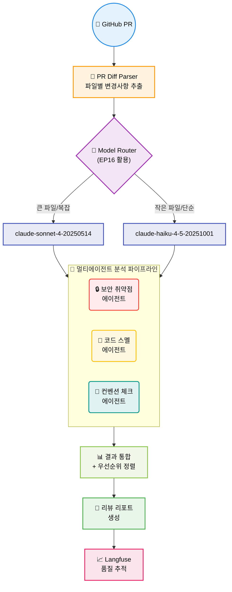
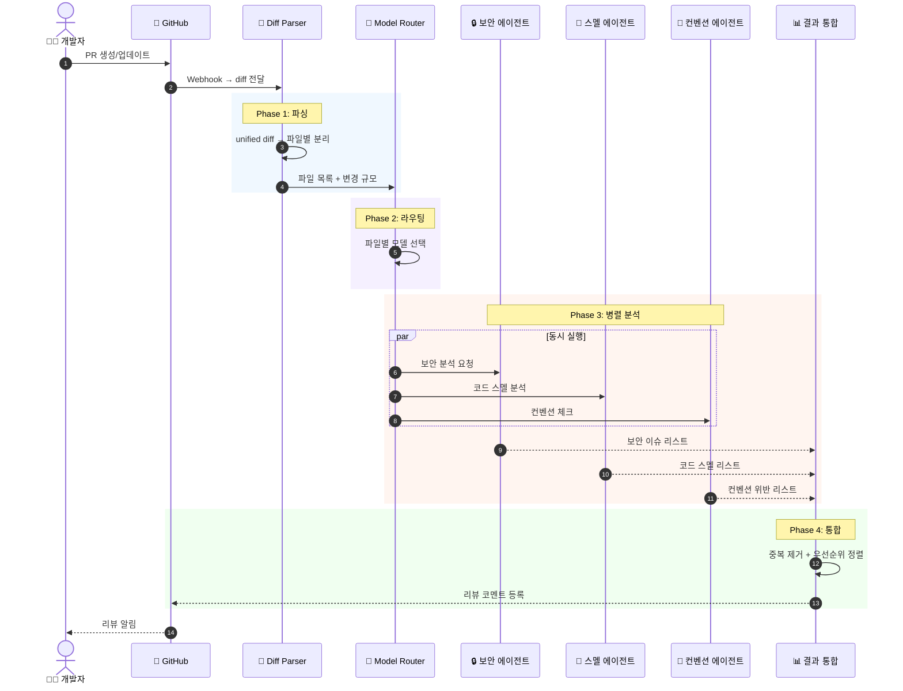
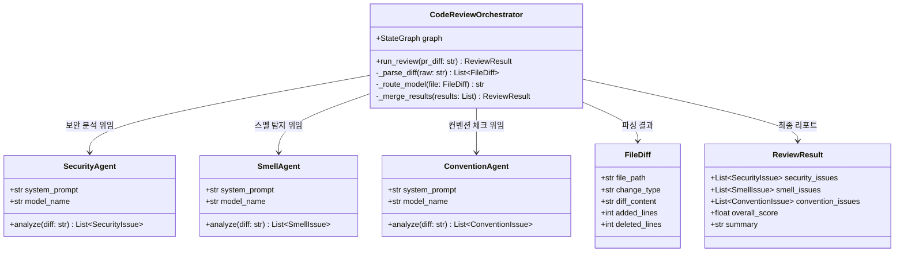
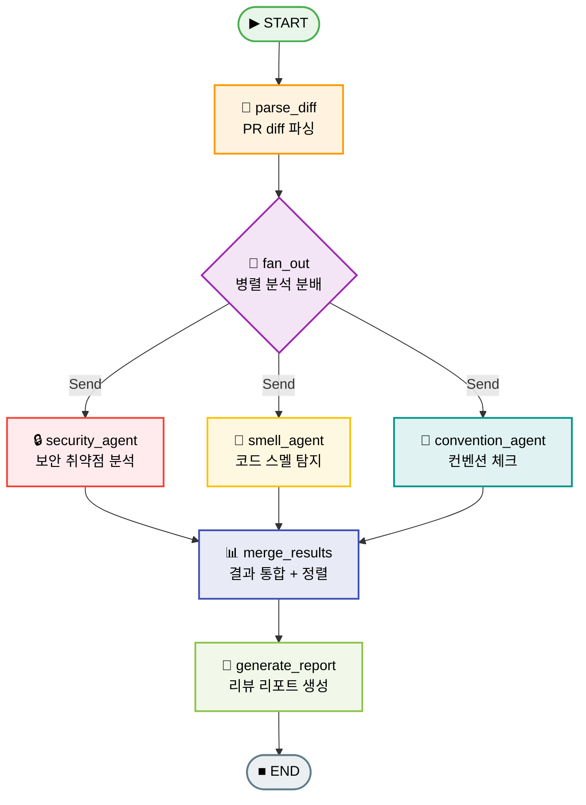
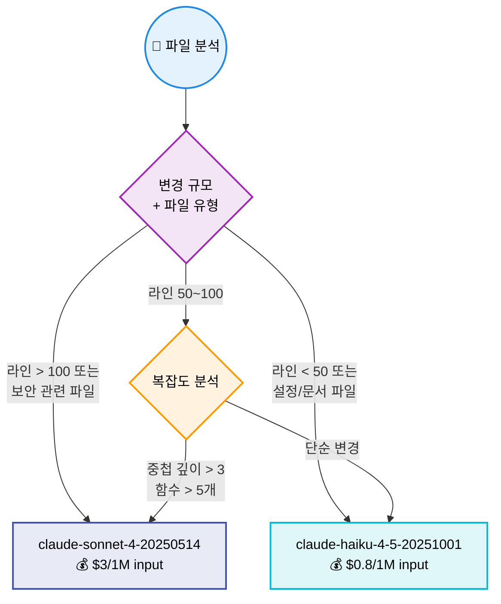
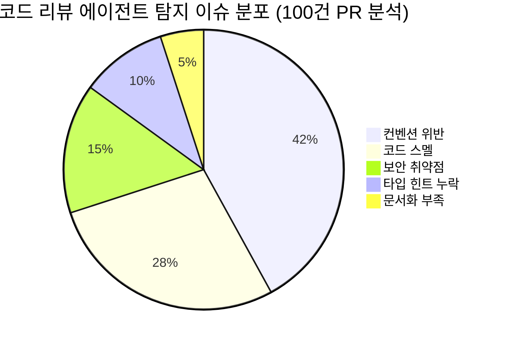
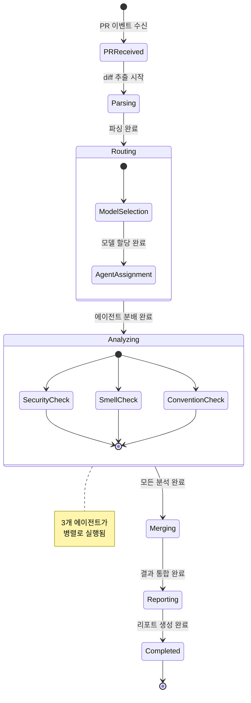

# EP21. 코드 리뷰 에이전트

## 시니어 개발자 리뷰 시간을 70% 줄인 방법

> GitHub MCP + 멀티에이전트 코드 분석 파이프라인 구축

난이도: ⭐⭐⭐

---

## 1. 문제 제기: 코드 리뷰의 현실

**시니어 개발자의 하루**

| 활동 | 시간 비율 | 문제 |
|------|----------|------|
| **PR 리뷰 대기** | 30% | 다른 업무 차단 (blocking) |
| **반복 지적** | 40% | 네이밍, 포맷팅, 컨벤션 위반 |
| **보안/로직 리뷰** | 20% | 진짜 중요한 리뷰 |
| **리뷰 코멘트 작성** | 10% | 구체적 개선안 서술 |

**핵심 통찰**: 리뷰 시간의 70%가 자동화 가능한 반복 작업

**목표**: AI 에이전트로 반복 리뷰를 자동화하고, 시니어는 아키텍처/로직에만 집중

---

## 2. 전체 아키텍처: 멀티에이전트 코드 리뷰 시스템



---

## 3. PR Diff 파싱 전략

**Unified Diff Format 구조**

```diff
diff --git a/app/auth.py b/app/auth.py
index abc1234..def5678 100644
--- a/app/auth.py
+++ b/app/auth.py
@@ -10,6 +10,15 @@ def authenticate(request):
     username = request.form["username"]
+    password = request.form["password"]
+    query = f"SELECT * FROM users WHERE name='{username}'"
+    result = db.execute(query)
```

**파싱 전략**

| 단계 | 처리 내용 | 결과 |
|------|----------|------|
| 1. 파일 분리 | `diff --git` 기준 분리 | 파일별 diff 리스트 |
| 2. 메타데이터 추출 | 파일 경로, 변경 유형(A/M/D) | 구조화된 메타 정보 |
| 3. 변경 라인 추출 | `+`/`-` 접두사 파싱 | 추가/삭제 라인 분리 |
| 4. 컨텍스트 보존 | `@@` 헝크 헤더 파싱 | 원본 라인 번호 매핑 |

---

## 4. PR → 리뷰 완료 흐름 (상세)



---

## 5. 보안 취약점 체크 에이전트

**OWASP Top 10 기반 탐지 항목**

| 카테고리 | 탐지 패턴 | 위험도 |
|----------|----------|--------|
| **SQL Injection** | f-string/format으로 쿼리 생성 | CRITICAL |
| **XSS** | 사용자 입력 미이스케이프 출력 | HIGH |
| **Secrets Exposure** | API 키, 비밀번호 하드코딩 | CRITICAL |
| **Path Traversal** | 사용자 입력 경로 직접 사용 | HIGH |
| **Command Injection** | os.system, subprocess + 입력 결합 | CRITICAL |
| **인증 우회** | 인증 체크 누락/불완전 | HIGH |

**에이전트 시스템 프롬프트 핵심**

```
당신은 시니어 보안 엔지니어입니다.
PR diff의 추가된 코드(+)를 분석하여 OWASP Top 10 관점에서
보안 취약점을 찾아주세요. 각 이슈에 대해:
- severity: CRITICAL / HIGH / MEDIUM / LOW
- category: OWASP 카테고리명
- line: 문제가 되는 코드 라인
- description: 취약점 설명 (한국어)
- suggestion: 구체적 수정 방법
```

---

## 6. 코드 스멜 탐지 에이전트

**탐지 대상**

| 스멜 유형 | 판단 기준 | 영향 |
|----------|----------|------|
| **Long Method** | 함수 30줄 초과 | 유지보수 어려움 |
| **Duplicated Code** | 유사 코드 블록 반복 | 변경 시 누락 위험 |
| **Complex Conditions** | 중첩 if 3단계 이상, or/and 3개 이상 | 가독성 저하 |
| **God Class** | 클래스 메서드 10개 초과 | 단일 책임 원칙 위반 |
| **Magic Numbers** | 의미 없는 숫자 리터럴 | 의도 파악 불가 |
| **Dead Code** | 사용되지 않는 함수/변수 | 코드베이스 오염 |

```python
SMELL_SYSTEM_PROMPT = """당신은 클린 코드 전문가입니다.
PR diff에서 코드 스멜을 탐지해주세요.
각 이슈에 대해:
- type: 스멜 유형 (long_method, duplicated_code, ...)
- severity: HIGH / MEDIUM / LOW
- location: 해당 코드 위치
- description: 문제 설명
- refactoring: 구체적 리팩토링 방법
"""
```

---

## 7. 컨벤션 체크 에이전트

**Python PEP 8 + 팀 컨벤션 기준**

| 항목 | 규칙 | 예시 |
|------|------|------|
| **Naming** | snake_case (함수/변수), PascalCase (클래스) | `getUserData` -> `get_user_data` |
| **Docstring** | 공개 함수에 필수 | `def process():` (docstring 누락) |
| **Import 순서** | stdlib -> 3rd party -> local | 순서 혼재 시 지적 |
| **타입 힌트** | 공개 함수 파라미터에 필수 | `def calc(x):` -> `def calc(x: int):` |
| **라인 길이** | 최대 88자 (Black 기준) | 초과 라인 지적 |
| **불필요한 주석** | 코드가 설명하는 주석 제거 | `i += 1  # i를 1 증가` |

```python
CONVENTION_SYSTEM_PROMPT = """당신은 Python 코드 스타일 리뷰어입니다.
PEP 8 및 팀 컨벤션을 기준으로 diff를 분석해주세요.
각 이슈에 대해:
- rule: 위반된 규칙명
- severity: HIGH / MEDIUM / LOW
- line: 해당 코드
- fix: 수정된 코드 제안
"""
```

---

## 8. CodeReviewAgent 구조



---

## 9. 멀티에이전트 통합 파이프라인 (LangGraph)



---

## 10. LangGraph 핵심 구현

```python
from langgraph.graph import StateGraph, START, END
from langgraph.types import Send
from typing import TypedDict, Annotated
from operator import add

class ReviewState(TypedDict):
    pr_diff: str
    file_diffs: list[FileDiff]
    security_issues: Annotated[list, add]
    smell_issues: Annotated[list, add]
    convention_issues: Annotated[list, add]
    review_report: str

def fan_out(state: ReviewState):
    """파일별 3가지 분석 에이전트로 병렬 분배"""
    sends = []
    for f in state["file_diffs"]:
        sends.append(Send("security_agent", {"diff": f}))
        sends.append(Send("smell_agent", {"diff": f}))
        sends.append(Send("convention_agent", {"diff": f}))
    return sends

builder = StateGraph(ReviewState)
builder.add_node("parse_diff", parse_diff_node)
builder.add_node("security_agent", security_node)
builder.add_node("smell_agent", smell_node)
builder.add_node("convention_agent", convention_node)
builder.add_node("merge_results", merge_node)
builder.add_node("generate_report", report_node)

builder.add_edge(START, "parse_diff")
builder.add_conditional_edges("parse_diff", fan_out,
    ["security_agent", "smell_agent", "convention_agent"])
builder.add_edge("security_agent", "merge_results")
builder.add_edge("smell_agent", "merge_results")
builder.add_edge("convention_agent", "merge_results")
builder.add_edge("merge_results", "generate_report")
builder.add_edge("generate_report", END)
```

---

## 11. 보안 에이전트 노드 구현

```python
from langchain_anthropic import ChatAnthropic
from pydantic import BaseModel

class SecurityIssue(BaseModel):
    severity: str   # CRITICAL, HIGH, MEDIUM, LOW
    category: str   # SQL_INJECTION, XSS, SECRETS, ...
    line: str       # 문제 코드 라인
    description: str
    suggestion: str

class SecurityAnalysis(BaseModel):
    issues: list[SecurityIssue]

def security_node(state):
    llm = ChatAnthropic(model="claude-sonnet-4-20250514")
    structured_llm = llm.with_structured_output(SecurityAnalysis)

    result = structured_llm.invoke([
        {"role": "system", "content": SECURITY_SYSTEM_PROMPT},
        {"role": "user", "content": f"다음 PR diff를 분석하세요:\n{state['diff']}"}
    ])

    return {"security_issues": result.issues}
```

**Structured Output 활용**: Pydantic 모델로 결과를 강제 구조화하여 파싱 없이 바로 사용

---

## 12. SWE-bench 기반 평가 (EP05 활용)

**리뷰 품질 평가 프레임워크**

| 평가 축 | 측정 방법 | 목표 |
|---------|----------|------|
| **Precision** | AI 지적 중 실제 이슈 비율 | > 80% |
| **Recall** | 실제 이슈 중 AI 발견 비율 | > 70% |
| **Severity 정확도** | 위험도 분류 일치율 | > 75% |
| **제안 실행 가능성** | LLM-as-Judge (0~10) | > 7.0 |

```python
# EP05에서 배운 LLM-as-Judge 활용
evaluation_prompt = """당신은 코드 리뷰 품질 평가자입니다.
AI가 생성한 리뷰 결과를 다음 기준으로 0~10점 평가하세요:

1. 정확성: 실제 문제를 정확히 짚었는가?
2. 구체성: 수정 방법이 구체적인가?
3. 우선순위: 심각도 분류가 적절한가?
4. 가독성: 리뷰 코멘트가 이해하기 쉬운가?
"""
```

---

## 13. 파일별 모델 라우팅 (EP16 활용)

**파일 특성에 따른 모델 선택 전략**



```python
def select_model(file_diff: FileDiff) -> str:
    if file_diff.added_lines > 100:
        return "claude-sonnet-4-20250514"
    if any(kw in file_diff.file_path for kw in ["auth", "security", "crypto"]):
        return "claude-sonnet-4-20250514"
    if file_diff.added_lines < 50:
        return "claude-haiku-4-5-20251001"
    return "claude-sonnet-4-20250514"  # 기본: 안전 우선
```

---

## 14. 모델 라우팅 비용 효과

| 시나리오 | Sonnet 전용 | 라우팅 적용 | 절감 |
|----------|-----------|-----------|------|
| PR 10개 (소규모) | $0.45 | $0.18 | **60%** |
| PR 10개 (대규모) | $2.10 | $1.35 | **36%** |
| PR 50개 (혼합) | $5.80 | $2.90 | **50%** |

**원칙**: 보안 관련 파일에는 항상 Sonnet 사용 (안전 > 비용)

```python
# 라우팅 결정 로깅
print(f"📁 {file_diff.file_path}")
print(f"   변경: +{file_diff.added_lines}/-{file_diff.deleted_lines}")
print(f"   모델: {selected_model}")
print(f"   사유: {routing_reason}")
```

---

## 15. Langfuse 통합: 리뷰 품질 추적

```python
from langfuse import Langfuse
from langfuse.langchain import CallbackHandler

langfuse = Langfuse()
handler = CallbackHandler(
    tags=["ep21", "code-review-agent"],
    session_id=f"pr-review-{pr_number}",
)

# 리뷰 실행
result = graph.invoke(
    {"pr_diff": raw_diff},
    config={"callbacks": [handler]},
)

# 품질 점수 기록
langfuse.score(
    trace_id=handler.trace_id,
    name="review_quality",
    value=quality_score,
    comment="보안 이슈 3개 탐지, 컨벤션 5개 지적"
)
```

---

## 16. Langfuse 대시보드 활용

**추적 지표**

| 지표 | 설명 | 활용 |
|------|------|------|
| **리뷰당 토큰** | 에이전트별 토큰 소비량 | 비용 최적화 |
| **리뷰 소요 시간** | 파싱 → 분석 → 통합 시간 | 병목 파악 |
| **이슈 탐지 수** | 에이전트별 발견 이슈 수 | 에이전트 효과 비교 |
| **품질 점수 추이** | 시간 경과에 따른 리뷰 품질 | 시스템 개선 트래킹 |

```
Langfuse Trace Tree:
├── code-review-session
│   ├── parse_diff (12ms)
│   ├── model_routing (5ms)
│   ├── security_agent (2.1s, 1,200 tokens)
│   ├── smell_agent (1.8s, 980 tokens)
│   ├── convention_agent (1.5s, 850 tokens)
│   ├── merge_results (8ms)
│   └── generate_report (1.2s, 650 tokens)
└── Score: review_quality = 8.5
```

---

## 17. 이슈 분포 분석



**분석 인사이트**

- 컨벤션 위반이 전체의 42% -> 가장 빈번하지만 자동 수정 가능
- 보안 취약점은 15%이지만 영향도가 가장 높음
- 코드 스멜 28%는 리팩토링 가이드로 개발자 성장에 기여

---

## 18. 리뷰 상태 머신



---

## 19. 실전 팁: 효과적인 프롬프트 설계

**에이전트별 프롬프트 최적화**

| 원칙 | 설명 | 예시 |
|------|------|------|
| **역할 명시** | 전문가 역할 부여 | "시니어 보안 엔지니어" |
| **출력 형식 고정** | Structured Output 활용 | Pydantic BaseModel |
| **예시 제공** | Few-shot으로 기대 형식 전달 | 이슈 1건 예시 포함 |
| **범위 한정** | 분석 범위 명확히 | "추가된 코드(+)만 분석" |
| **우선순위 기준** | 심각도 판단 기준 제시 | OWASP 기준표 포함 |

**Anti-pattern**

```
# 나쁜 예: 너무 범용적
"코드를 리뷰해주세요"

# 좋은 예: 구체적 + 구조화
"PR diff의 추가된 코드에서 SQL Injection, XSS, Secrets Exposure를
OWASP Top 10 기준으로 분석하고, SecurityIssue 스키마로 반환하세요."
```

---

## 20. GitHub MCP 연동 (확장)

**GitHub MCP Server를 통한 실제 PR 연동**

```python
from fastmcp import Client

async with Client("github-mcp-server") as client:
    # PR diff 가져오기
    diff = await client.call_tool(
        "get_pull_request_diff",
        {"owner": "myorg", "repo": "myrepo", "pull_number": 42}
    )

    # 리뷰 코멘트 등록
    await client.call_tool(
        "create_pull_request_review",
        {
            "owner": "myorg",
            "repo": "myrepo",
            "pull_number": 42,
            "body": review_report,
            "event": "COMMENT",
            "comments": review_comments,
        }
    )
```

**이 에피소드에서는 Mock diff 사용** (GitHub API 없이 동작하도록)

---

## 21. Exercise 1: 커스텀 분석 에이전트 추가

**목표**: 기존 3개 에이전트에 "성능 분석 에이전트"를 추가한다

**단계**:
1. `PerformanceIssue` Pydantic 모델 정의 (type, severity, location, description, optimization)
2. 성능 분석 시스템 프롬프트 작성 (N+1 쿼리, 불필요한 루프, 메모리 누수 탐지)
3. `performance_agent` 노드 구현 (LLM 호출 + Structured Output)
4. LangGraph에 노드 추가 및 fan_out에 Send 추가
5. merge_results에 성능 이슈 통합 로직 추가
6. 샘플 diff로 4개 에이전트 파이프라인 실행
7. Langfuse에서 4개 에이전트의 실행 시간 비교

**제출**: 성능 에이전트가 탐지한 이슈 목록 + 4개 에이전트 실행 트레이스

---

## 22. Exercise 2: 리뷰 품질 자동 평가 시스템

**목표**: LLM-as-Judge로 AI 리뷰의 품질을 자동 평가하는 파이프라인을 구축한다

**단계**:
1. 평가 기준 정의: 정확성(0~10), 구체성(0~10), 우선순위(0~10), 가독성(0~10)
2. `ReviewQualityScore` Pydantic 모델 정의
3. 평가 프롬프트 작성 (diff + AI 리뷰 결과 → 품질 점수)
4. 5개 샘플 PR에 대해 리뷰 실행 + 품질 평가
5. 에이전트별 품질 점수 분석 (어떤 에이전트가 가장 유용한가?)
6. Langfuse에 평가 점수 기록 (`langfuse.score()`)
7. 품질 점수 기반으로 프롬프트 개선안 작성

**제출**: 5개 PR 평가 결과표 + 에이전트별 평균 점수 + 개선 전/후 프롬프트 비교

---

## 정리 & 마무리

**오늘 배운 것**

- PR diff 파싱과 파일별 변경사항 추출 전략
- 보안 취약점, 코드 스멜, 컨벤션 각각의 전문 에이전트 설계
- LangGraph로 3개 에이전트를 병렬 실행하는 통합 파이프라인
- 파일 특성에 따른 모델 라우팅으로 비용 50% 절감
- Langfuse로 리뷰 품질 추적 및 시스템 개선
- Structured Output으로 안정적인 결과 포맷 보장

**활용한 이전 에피소드**

| 에피소드 | 활용 내용 |
|----------|----------|
| EP05 벤치마크 | LLM-as-Judge 품질 평가 |
| EP10 멀티에이전트 | LangGraph 병렬 파이프라인 |
| EP12 MCP | GitHub MCP 서버 연동 |
| EP16 LLM FinOps | 파일별 모델 라우팅 |

**다음 EP22**: AI 미팅 에이전트 - 회의록 자동 생성과 액션 아이템 추출

> 전체 코드는 GitHub 레포에서, 심화 내용은 커뮤니티에서
