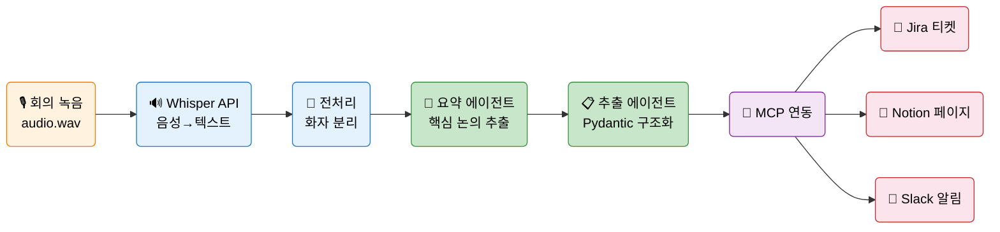
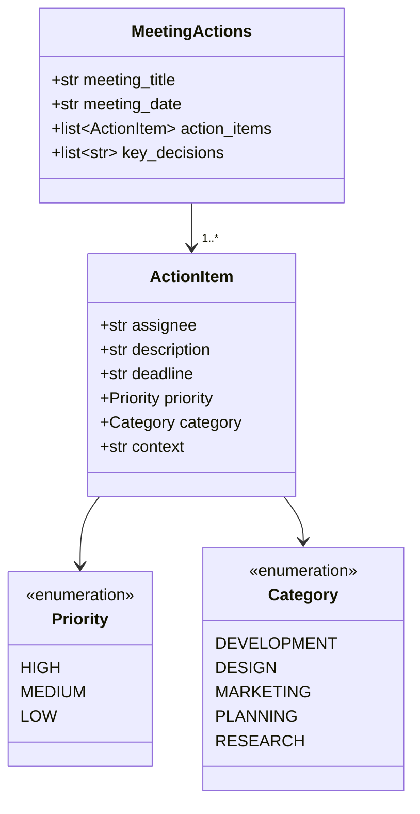
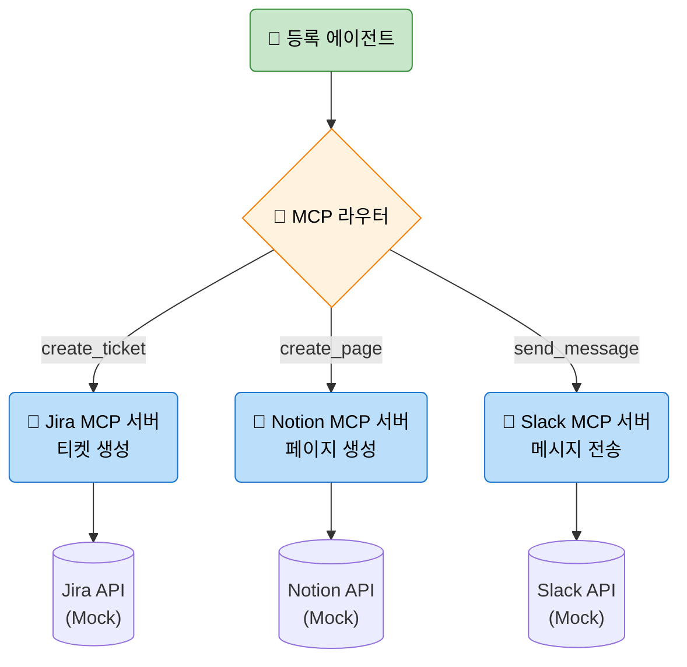
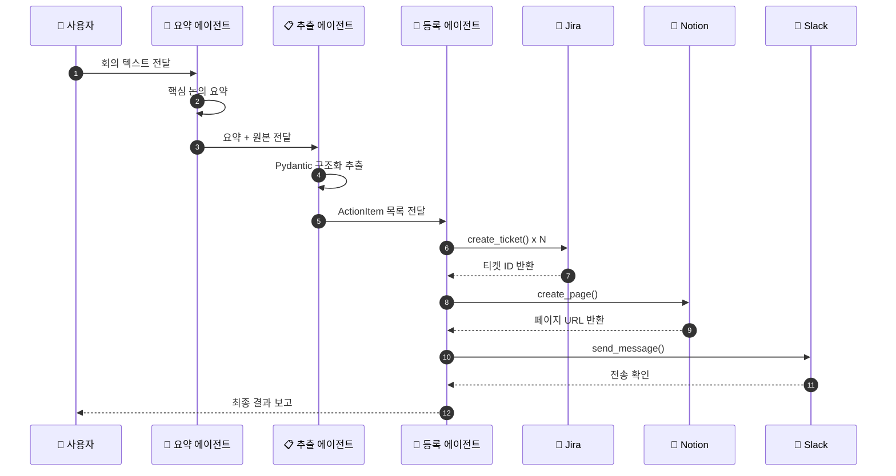
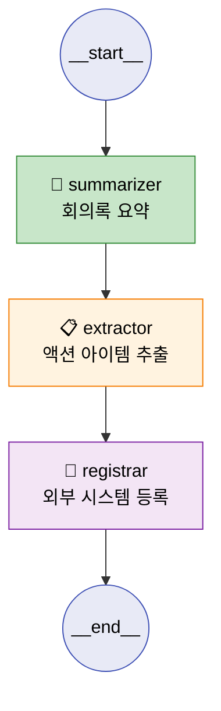
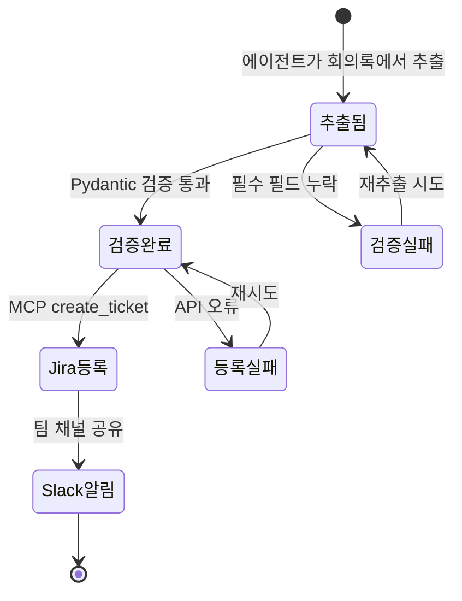
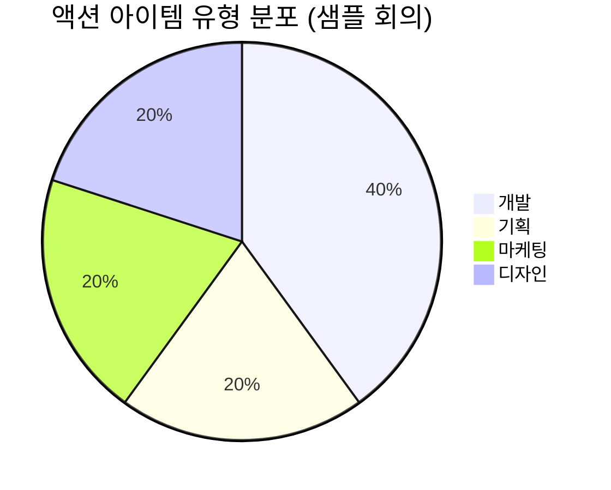
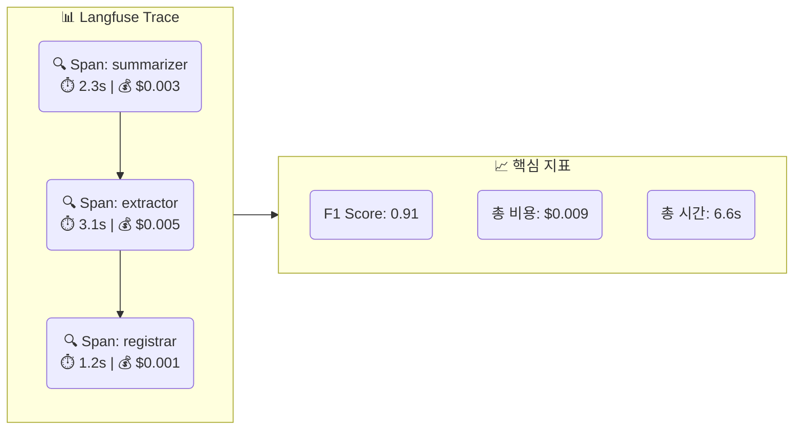
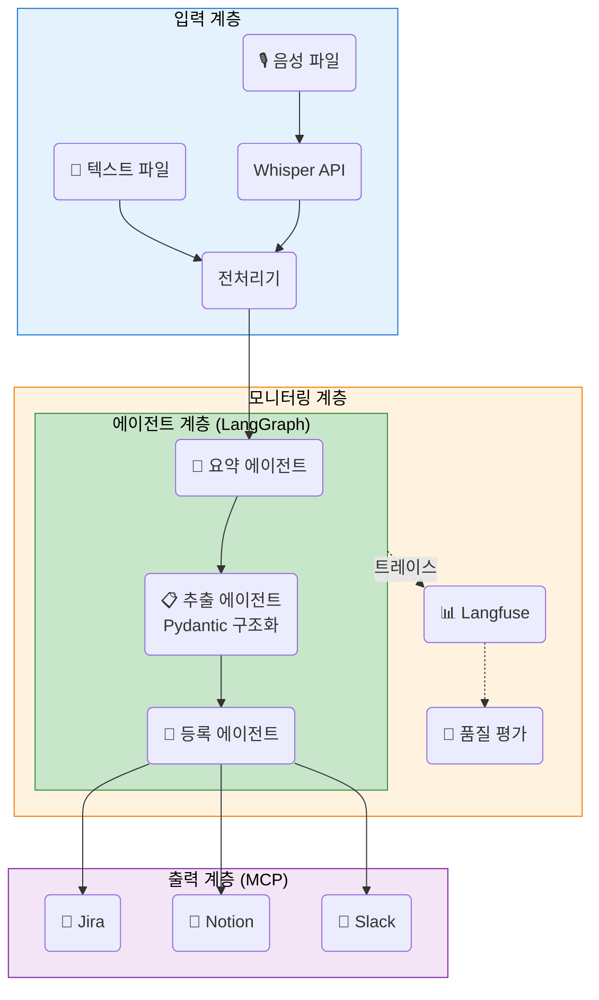

# EP22. 회의록 → 액션 아이템 에이전트

## 30분 회의에서 자동으로 Jira 티켓 5개를 생성하는 방법

> Whisper · Pydantic · FastMCP · LangGraph · Langfuse 로 구축하는 회의 자동화

난이도: ⭐⭐⭐

---

## 목차

**파이프라인 설계 (섹션 1-4)**
1. 문제 제기: 회의 → 액션 아이템의 블랙홀
2. 전체 파이프라인 개요
3. Whisper API로 음성 → 텍스트 변환
4. 회의록 전처리와 화자 분리

**에이전트 구현 (섹션 5-8)**
5. 회의록 요약 에이전트
6. 액션 아이템 추출 에이전트 (Pydantic 구조화 출력)
7. MCP로 Jira / Notion / Slack 연동 (Mock 서버)
8. 멀티에이전트 파이프라인 (LangGraph)

**평가와 통합 (섹션 9-11)**
9. EP04 Harness로 품질 평가
10. Langfuse 통합
11. Exercise + 정리

---

## 1. 문제 제기: 회의 → 액션 아이템의 블랙홀

**30분 회의 후 벌어지는 현실**

| 단계 | 소요 시간 | 문제 |
|------|----------|------|
| 회의 진행 | 30분 | 실시간 메모 어려움 |
| 회의록 작성 | 20-40분 | 담당자 부담, 누락 발생 |
| 액션 아이템 정리 | 10-15분 | 기한/담당자 불명확 |
| Jira 티켓 생성 | 10-20분 | 수동 입력, 오타 발생 |
| Slack 공유 | 5분 | 잊어버리기 쉬움 |
| **합계** | **75-110분** | 회의 시간의 2-3배 |

**에이전트 도입 후**: 30분 회의 → **2분** 만에 요약 + 티켓 5개 + Slack 알림

---

## 2. 전체 파이프라인



**6단계 파이프라인**: 음성 → 텍스트 → 전처리 → 요약 → 구조화 추출 → 외부 시스템 등록

---

## 3. Whisper API로 음성 → 텍스트 변환

```python
from openai import OpenAI

client = OpenAI()

# 음성 파일을 텍스트로 변환
with open("meeting.wav", "rb") as audio_file:
    transcript = client.audio.transcriptions.create(
        model="whisper-1",
        file=audio_file,
        language="ko",          # 한국어 지정
        response_format="verbose_json",  # 타임스탬프 포함
        timestamp_granularities=["segment"]
    )

for segment in transcript.segments:
    print(f"[{segment.start:.1f}s] {segment.text}")
```

| 파라미터 | 설명 | 권장값 |
|----------|------|--------|
| `model` | 모델 선택 | `whisper-1` |
| `language` | 언어 코드 | `ko` (한국어) |
| `response_format` | 출력 형식 | `verbose_json` |
| `temperature` | 다양성 | `0` (정확도 우선) |

---

## 4. 회의록 전처리

```python
import re

def preprocess_transcript(raw_text: str) -> list[dict]:
    """화자별 발화를 파싱합니다."""
    lines = raw_text.strip().split("\n")
    utterances = []

    pattern = re.compile(r"^(.+?):\s*(.+)$")
    for line in lines:
        match = pattern.match(line.strip())
        if match:
            utterances.append({
                "speaker": match.group(1),
                "text": match.group(2)
            })
    return utterances
```

**전처리 단계**:
1. 빈 줄/메타데이터 제거
2. `화자: 발화` 형식 파싱
3. 불필요한 인사말/잡담 필터링
4. 화자별 발화 횟수/비율 통계 생성

---

## 5. 회의록 요약 에이전트

```python
from langchain_anthropic import ChatAnthropic

llm = ChatAnthropic(model="claude-sonnet-4-20250514")

SUMMARY_PROMPT = """다음 회의록을 분석하여 구조화된 요약을 생성하세요.

## 회의록
{transcript}

## 출력 형식
1. 한줄 요약 (30자 이내)
2. 주요 논의 사항 (3-5개)
3. 주요 수치/데이터
4. 미결 사항
5. 다음 회의 안건"""

response = llm.invoke(SUMMARY_PROMPT.format(transcript=text))
```

**좋은 요약의 조건**:
- 핵심 결정 사항이 명확하게 드러남
- 수치 데이터가 정확하게 보존됨
- 미결 사항과 후속 조치가 구분됨

---

## 6. 액션 아이템 추출 — Pydantic 구조화 출력



**EP08 구조화 출력** 패턴을 활용하여 LLM 응답을 검증 가능한 객체로 변환

---

## 6-1. Pydantic 모델 정의

```python
from pydantic import BaseModel, Field
from enum import Enum

class Priority(str, Enum):
    HIGH = "high"
    MEDIUM = "medium"
    LOW = "low"

class Category(str, Enum):
    DEVELOPMENT = "development"
    DESIGN = "design"
    MARKETING = "marketing"
    PLANNING = "planning"
    RESEARCH = "research"

class ActionItem(BaseModel):
    assignee: str = Field(description="담당자 이름")
    description: str = Field(description="구체적인 업무 내용")
    deadline: str = Field(description="마감일 YYYY-MM-DD")
    priority: Priority = Field(description="우선순위")
    category: Category = Field(description="업무 카테고리")
    context: str = Field(description="회의 중 관련 발언 요약")
```

**구조화 출력의 장점**: 타입 검증 + IDE 자동 완성 + JSON 직렬화

---

## 6-2. LLM으로 구조화 추출

```python
from langchain_anthropic import ChatAnthropic

llm = ChatAnthropic(model="claude-sonnet-4-20250514")

structured_llm = llm.with_structured_output(MeetingActions)

result = structured_llm.invoke(
    f"""다음 회의록에서 모든 액션 아이템을 추출하세요.
    각 항목은 반드시 담당자, 구체적 설명, 마감일, 
    우선순위, 카테고리를 포함해야 합니다.
    
    회의록:
    {transcript}"""
)

for item in result.action_items:
    print(f"[{item.priority.value}] {item.assignee}: "
          f"{item.description} (기한: {item.deadline})")
```

---

## 7. MCP로 외부 시스템 연동



**EP12 MCP 패턴**을 활용 -- Mock 서버로 안전하게 개발 및 테스트

---

## 7-1. Mock MCP 서버 구현

```python
from fastmcp import FastMCP

jira_server = FastMCP("Jira Mock Server")

@jira_server.tool
def create_ticket(
    title: str, description: str,
    assignee: str, priority: str, deadline: str
) -> dict:
    """Jira 티켓을 생성합니다."""
    ticket_id = f"PROJ-{hash(title) % 1000:03d}"
    print(f"[Jira] 티켓 생성: {ticket_id}")
    print(f"  제목: {title}")
    print(f"  담당: {assignee} | 기한: {deadline}")
    return {
        "ticket_id": ticket_id,
        "status": "created",
        "url": f"https://jira.example.com/{ticket_id}"
    }
```

**Mock 서버**: 실제 API 대신 `print`로 결과를 출력하여 안전하게 테스트

---

## 8. 멀티에이전트 파이프라인



**EP10 멀티에이전트 패턴**: 요약 → 추출 → 등록 3단계 파이프라인

---

## 8-1. LangGraph 파이프라인 구현

```python
from langgraph.graph import StateGraph, START, END
from typing import TypedDict

class MeetingState(TypedDict):
    transcript: str          # 원본 회의록
    summary: str             # 요약 결과
    action_items: list       # 추출된 액션 아이템
    registration_results: list  # 등록 결과

graph = StateGraph(MeetingState)

# 노드 등록
graph.add_node("summarizer", summarize_meeting)
graph.add_node("extractor", extract_actions)
graph.add_node("registrar", register_actions)

# 엣지 연결
graph.add_edge(START, "summarizer")
graph.add_edge("summarizer", "extractor")
graph.add_edge("extractor", "registrar")
graph.add_edge("registrar", END)

pipeline = graph.compile()
```

---

## 8-2. LangGraph 그래프 시각화



**실행**:
```python
result = pipeline.invoke({
    "transcript": meeting_text,
    "summary": "",
    "action_items": [],
    "registration_results": []
})
print(f"추출된 액션 아이템: {len(result['action_items'])}개")
print(f"등록 완료: {len(result['registration_results'])}건")
```

---

## 9. 액션 아이템 상태 관리



**에러 처리**: 각 단계에서 실패 시 재시도 로직 포함

---

## 10. EP04 Harness로 품질 평가

```python
# 기대 액션 아이템 (정답)
expected_items = [
    {"assignee": "이개발", "description": "검색 API 최적화 PoC",
     "deadline": "2026-04-15"},
    {"assignee": "박기획", "description": "자동 완성 PRD 문서 작성",
     "deadline": "2026-04-10"},
    # ...
]

# 평가 지표
def evaluate_extraction(extracted, expected):
    matched = 0
    for exp in expected:
        for ext in extracted:
            if (exp["assignee"] in ext.assignee and
                exp["deadline"] == ext.deadline):
                matched += 1
                break
    recall = matched / len(expected)
    precision = matched / len(extracted) if extracted else 0
    f1 = 2 * precision * recall / (precision + recall) if (precision + recall) > 0 else 0
    return {"precision": precision, "recall": recall, "f1": f1}
```

**핵심 평가 기준**: 담당자 일치 + 기한 정확도 + 설명 유사도

---

## 10-1. 평가 결과 분석

| 평가 항목 | 기준 | 목표 |
|----------|------|------|
| **Recall** | 기대 항목 대비 추출 비율 | >= 0.8 |
| **Precision** | 추출 항목 중 정확한 비율 | >= 0.9 |
| **F1 Score** | Precision과 Recall의 조화 평균 | >= 0.85 |
| **담당자 정확도** | 담당자 이름 일치 비율 | >= 0.95 |
| **기한 정확도** | 날짜 형식 및 정확도 | >= 0.9 |



---

## 11. Langfuse 통합

```python
from langfuse.callback import CallbackHandler

langfuse_handler = CallbackHandler(
    public_key=os.getenv("LANGFUSE_PUBLIC_KEY"),
    secret_key=os.getenv("LANGFUSE_SECRET_KEY"),
    host=os.getenv("LANGFUSE_HOST", "https://cloud.langfuse.com")
)

# LangGraph 파이프라인에 Langfuse 콜백 연결
result = pipeline.invoke(
    {
        "transcript": meeting_text,
        "summary": "",
        "action_items": [],
        "registration_results": []
    },
    config={"callbacks": [langfuse_handler]}
)
```

**Langfuse로 추적하는 항목**:
- 각 에이전트 노드의 실행 시간
- LLM 호출별 토큰 사용량과 비용
- 추출 품질 점수 (F1 Score)

---

## 11-1. Langfuse 대시보드



**모니터링 포인트**: 비용 이상 탐지, 품질 저하 알림, 지연 시간 추적

---

## 12. Exercise 1: 후속 회의 알림 에이전트

**미션**: 액션 아이템의 기한이 다가오면 Slack으로 리마인더를 보내는 에이전트를 추가하세요.

**요구사항**:
1. `MeetingState`에 `reminders` 필드를 추가
2. 기한 3일 전에 리마인더 생성 로직 구현
3. LangGraph에 `reminder` 노드를 추가
4. Mock Slack MCP로 알림 전송

**힌트**:
```python
from datetime import datetime, timedelta

def check_deadlines(action_items, days_before=3):
    today = datetime.now()
    reminders = []
    for item in action_items:
        deadline = datetime.strptime(item.deadline, "%Y-%m-%d")
        if 0 <= (deadline - today).days <= days_before:
            reminders.append(item)
    return reminders
```

---

## 13. Exercise 2: 회의 유형별 프롬프트 최적화

**미션**: 회의 유형(브레인스토밍, 의사결정, 스프린트 리뷰)에 따라 다른 추출 프롬프트를 적용하세요.

**요구사항**:
1. 회의 유형 자동 분류 에이전트 추가
2. 유형별 전용 프롬프트 3개 작성
3. 분류 결과에 따라 적절한 프롬프트 선택
4. 각 유형별 추출 정확도 비교 평가

**힌트**:
```python
MEETING_TYPES = {
    "brainstorming": "아이디어와 제안을 중심으로 추출...",
    "decision": "결정 사항과 후속 조치를 중심으로 추출...",
    "sprint_review": "완료 항목과 다음 스프린트 과제를 추출..."
}
```

---

## 전체 아키텍처 종합



---

## 핵심 정리

| 구성 요소 | 사용 기술 | 참고 에피소드 |
|----------|----------|-------------|
| 음성 → 텍스트 | Whisper API | - |
| 요약 에이전트 | LangChain + Claude | EP10 |
| 구조화 추출 | Pydantic + `with_structured_output` | EP08 |
| 외부 시스템 연동 | FastMCP Mock 서버 | EP12 |
| 멀티에이전트 | LangGraph StateGraph | EP10 |
| 품질 평가 | Precision / Recall / F1 | EP04 |
| 모니터링 | Langfuse CallbackHandler | EP06 |

---

## 마무리

**오늘 배운 것**
1. Whisper API로 한국어 음성을 텍스트로 정확하게 변환하는 방법
2. Pydantic 구조화 출력으로 액션 아이템을 정형 데이터로 추출하는 방법
3. FastMCP Mock 서버로 Jira/Notion/Slack을 안전하게 연동하는 방법
4. LangGraph로 요약 → 추출 → 등록 멀티에이전트를 구축하는 방법

**다음 에피소드**: EP23. 기술 문서 챗봇 -- RAG + 에이전트로 사내 문서를 대화형으로

---

## 참고 자료

- [OpenAI Whisper API](https://platform.openai.com/docs/guides/speech-to-text)
- [Pydantic 공식 문서](https://docs.pydantic.dev/latest/)
- [FastMCP GitHub](https://github.com/jlowin/fastmcp)
- [LangGraph 공식 문서](https://langchain-ai.github.io/langgraph/)
- [Langfuse 공식 문서](https://langfuse.com/docs)
- **EP08** JSON & Function Calling
- **EP10** 멀티 에이전트 시스템
- **EP12** MCP 서버 직접 만들기
