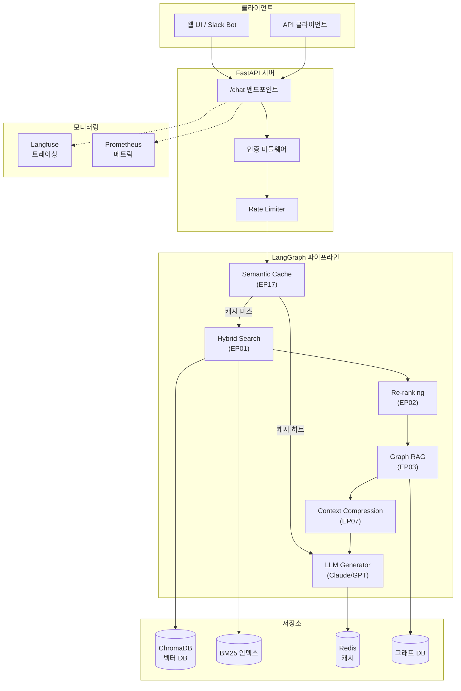
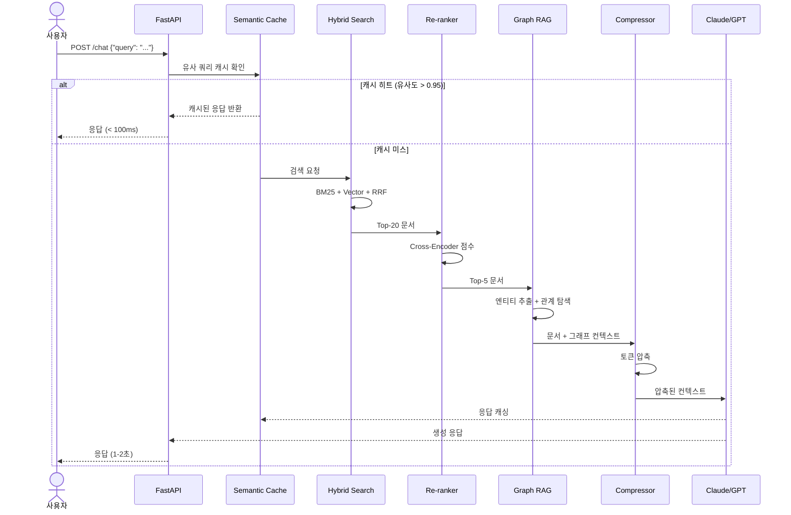
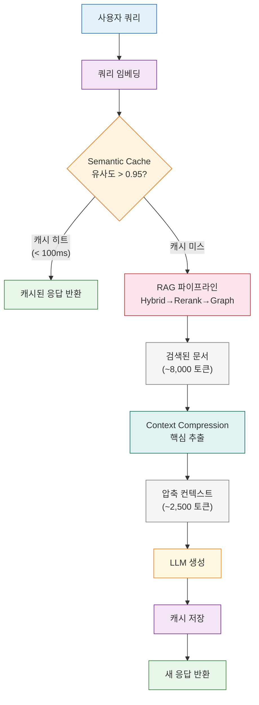
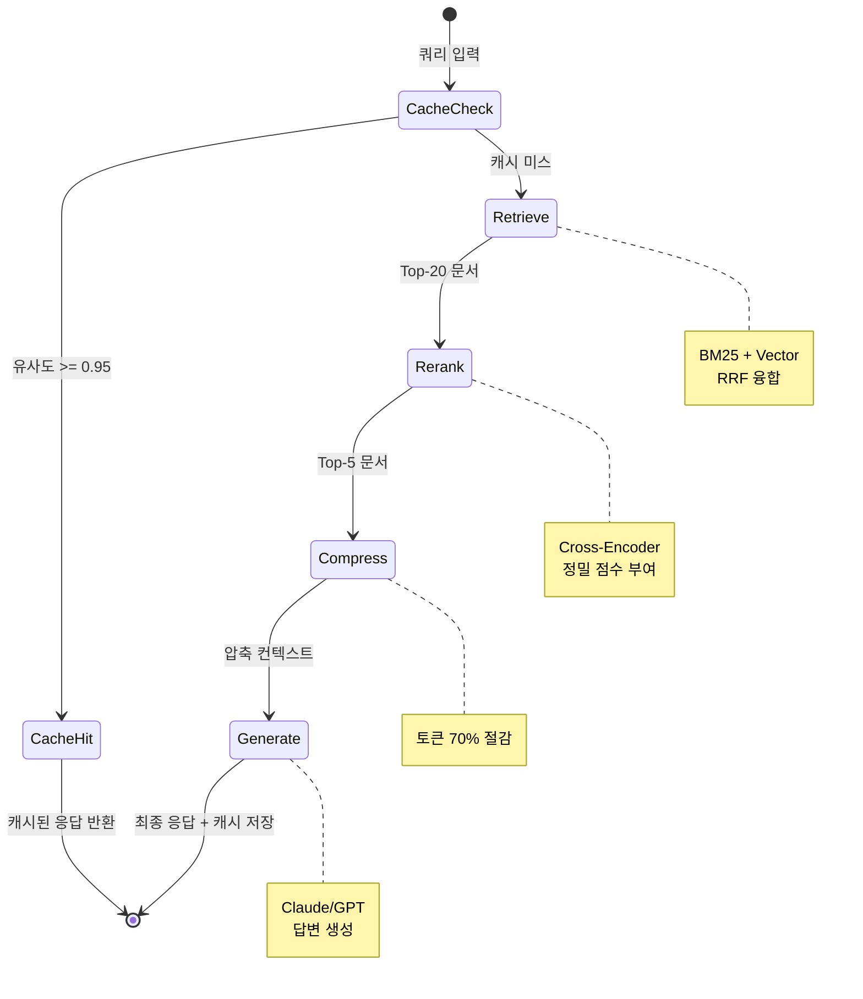
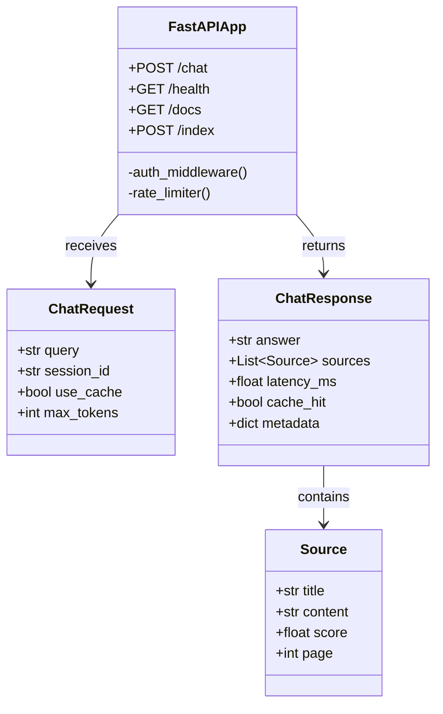
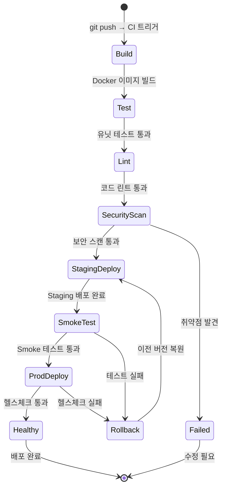
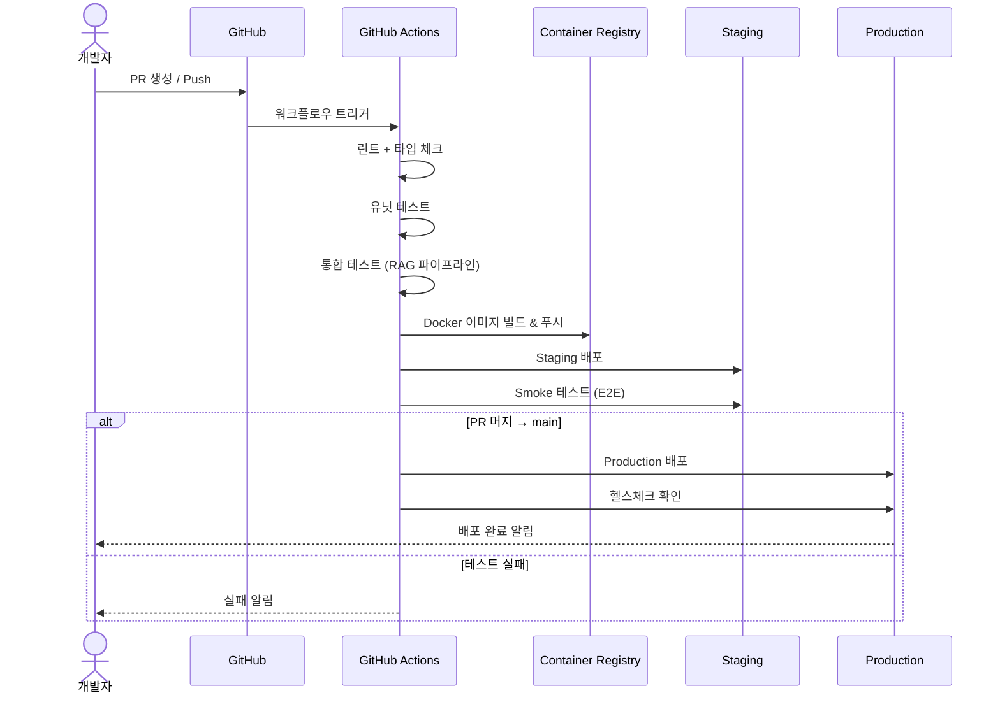
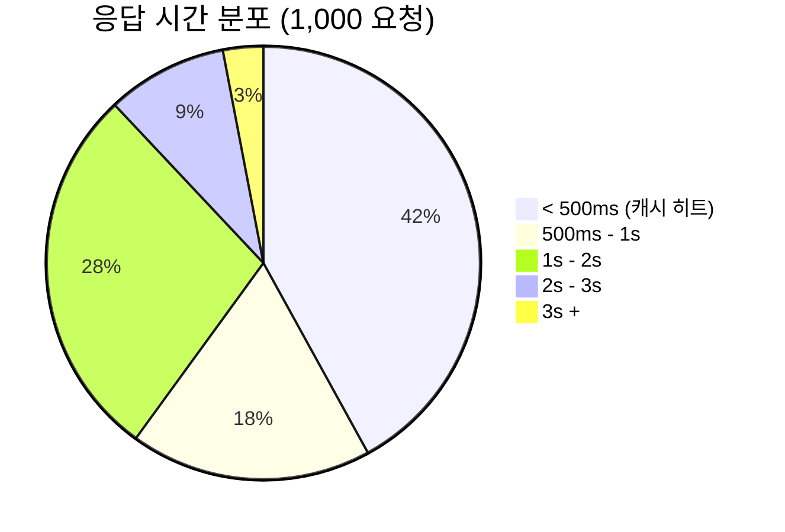
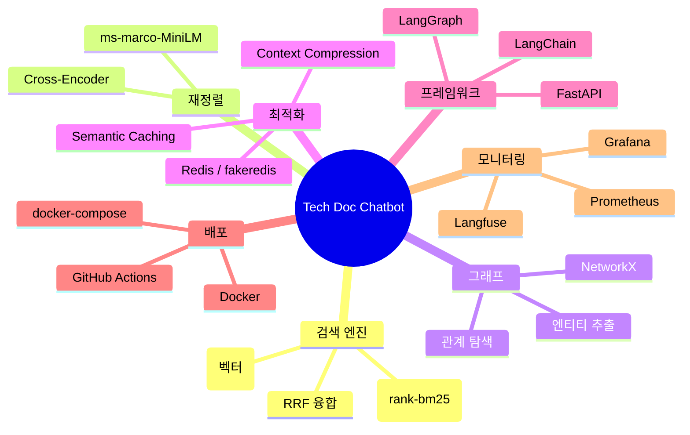

# EP23. RAG + Agent 기술 문서 챗봇

## 사내 위키 2,000페이지를 AI가 1초 만에 답한다

**Series 8 · 실전 프로젝트 (캡스톤)**

난이도: ⭐⭐⭐

> "EP01부터 EP17까지 배운 모든 기술을 하나의 프로덕션 시스템으로 통합한다."

---

## 목차

**시스템 설계 (섹션 1-5)**
1. 문제 제기: 사내 위키 2,000페이지를 AI가 1초 만에 답한다
2. 프로덕션 전체 아키텍처 (FastAPI + LangGraph + RAG)
3. EP01 통합: Hybrid Search (BM25 + Vector + RRF)
4. EP02 통합: Re-ranking (Cross-Encoder)
5. EP03 통합: Graph RAG

**파이프라인 최적화 (섹션 6-8)**
6. EP07 통합: Context Compression
7. EP17 통합: Semantic Caching
8. LangGraph 에이전트 그래프 설계

**프로덕션 배포 (섹션 9-15)**
9. FastAPI 엔드포인트 설계
10. Docker 배포 아키텍처
11. Langfuse 프로덕션 모니터링
12. CI/CD 파이프라인
13. 부하 테스트 / 성능 벤치마크
14. Exercise
15. 정리 & 마무리

---

## 1. 문제 제기: 사내 위키의 현실

### 기존 방식의 한계

| 항목 | 기존 키워드 검색 | AI 기술 문서 챗봇 |
|------|-----------------|-------------------|
| **검색 시간** | 평균 3-5분 (문서 탐색) | 1-2초 (즉시 응답) |
| **정확도** | 키워드 의존, 동의어 실패 | 의미 기반 + 키워드 결합 |
| **맥락 이해** | 단일 문서 반환 | 다중 문서 종합 답변 |
| **최신성** | 수동 색인 갱신 | 실시간 인덱싱 |
| **비용** | 엔지니어 시간 낭비 | 쿼리당 ~$0.01 |

<div class="danger">

**핵심 문제:** 엔지니어가 하루 평균 45분을 문서 검색에 소비 -- 100명이면 월 1,500시간 손실

</div>

---

## 1. 문제 제기: 통합 에피소드 맵

### 이번 캡스톤에서 통합하는 5개 에피소드

| 에피소드 | 기술 | 역할 |
|---------|------|------|
| **EP01** | Hybrid Search (BM25 + Vector + RRF) | 검색 정확도 극대화 |
| **EP02** | Re-ranking (Cross-Encoder) | 검색 결과 재정렬 |
| **EP03** | Graph RAG | 엔티티 간 관계 활용 |
| **EP07** | Context Compression | LLM 토큰 절약 |
| **EP17** | Semantic Caching | 중복 쿼리 비용 제거 |

<div class="success">

**목표:** 5개 기술을 하나의 프로덕션 파이프라인으로 통합하여 기술 문서 챗봇 구축

</div>

---

## 2. 프로덕션 전체 아키텍처

### FastAPI + LangGraph + RAG 통합 시스템



---

## 2. 요청 흐름 상세

### 사용자 질문부터 응답까지



---

## 3. EP01 통합: Hybrid Search (BM25 + Vector + RRF)

### 왜 Hybrid가 필요한가?

| 검색 방식 | 강점 | 약점 |
|----------|------|------|
| **BM25 (키워드)** | 정확한 용어 매칭, API명/코드명 검색 | 동의어 처리 불가 |
| **Vector (의미)** | 의미적 유사성, 다국어 지원 | 정확한 키워드 놓침 |
| **Hybrid (RRF)** | 두 방식의 장점 결합 | 약간의 추가 지연 |

### RRF 융합 공식

$$
\text{RRF}(d) = \sum_{r \in R} \frac{1}{k + r(d)}
$$

- `R`: 각 검색 시스템의 랭킹 리스트
- `r(d)`: 문서 `d`의 순위
- `k`: 스무딩 상수 (보통 60)

---

## 3. EP01 통합: Hybrid Search 구현 코드

```python
from langchain_community.retrievers import BM25Retriever
from langchain_chroma import Chroma
from langchain.retrievers import EnsembleRetriever

# BM25 키워드 검색
bm25_retriever = BM25Retriever.from_documents(
    documents=chunks, k=20
)

# 벡터 검색 (ChromaDB)
vector_retriever = vectorstore.as_retriever(
    search_kwargs={"k": 20}
)

# RRF 기반 앙상블
hybrid_retriever = EnsembleRetriever(
    retrievers=[bm25_retriever, vector_retriever],
    weights=[0.4, 0.6]  # BM25 40% + Vector 60%
)

results = hybrid_retriever.invoke("FastAPI 인증 미들웨어 설정 방법")
```

<div class="highlight">

**Point:** `weights`를 조절하여 키워드 중심 / 의미 중심 검색 비율을 최적화할 수 있다

</div>

---

## 4. EP02 통합: Re-ranking (Cross-Encoder)

### Hybrid Search 이후 재정렬이 필요한 이유

1. **Hybrid Search**는 BM25와 Vector의 순위를 융합하지만, 여전히 노이즈가 섞임
2. **Cross-Encoder**가 쿼리-문서 쌍을 직접 비교하여 정밀한 관련성 점수 부여
3. Top-20 → Top-5로 압축하여 LLM에 전달할 문서 품질 극대화

### Re-ranking 파이프라인

```python
from langchain.retrievers import ContextualCompressionRetriever
from langchain_community.cross_encoders import HuggingFaceCrossEncoder
from langchain.retrievers.document_compressors import CrossEncoderReranker

# Cross-Encoder 모델 로드
cross_encoder = HuggingFaceCrossEncoder(
    model_name="cross-encoder/ms-marco-MiniLM-L-6-v2"
)
reranker = CrossEncoderReranker(
    model=cross_encoder, top_n=5
)

# Hybrid + Reranking 결합
reranking_retriever = ContextualCompressionRetriever(
    base_compressor=reranker,
    base_retriever=hybrid_retriever
)
```

---

## 5. EP03 통합: Graph RAG

### 엔티티 관계를 활용한 검색 보강

기술 문서에서는 **개념 간 관계**가 중요:
- "FastAPI는 Starlette 위에 구축됨"
- "Pydantic이 데이터 검증을 담당"
- "uvicorn이 ASGI 서버로 동작"

### Graph RAG 흐름

1. **엔티티 추출:** 문서에서 기술 용어, API명, 라이브러리명 추출
2. **관계 구축:** 엔티티 간 관계 (의존, 사용, 확장) 그래프 구성
3. **그래프 탐색:** 쿼리 관련 엔티티의 1-2홉 이웃 탐색
4. **컨텍스트 보강:** 검색 결과에 관계 정보 추가

```python
# 엔티티 추출 (LLM 기반)
entities = extract_entities(query)  # ["FastAPI", "미들웨어", "인증"]

# 관련 엔티티 그래프 탐색
graph_context = traverse_graph(
    entities=entities, 
    max_hops=2
)
# → "FastAPI → Starlette → ASGI, FastAPI → Pydantic → 데이터 검증"
```

---

## 5. Hybrid + Rerank + Graph 통합 파이프라인

```mermaid
flowchart LR
    Q["사용자 쿼리"]:::query --> BM["BM25\nRetriever\nk=20"]:::search
    Q --> VEC["Vector\nRetriever\nk=20"]:::search
    
    BM --> RRF["RRF 융합\nEnsembleRetriever"]:::fusion
    VEC --> RRF
    
    RRF -->|Top-20| CE["Cross-Encoder\nReranker"]:::rerank
    CE -->|Top-5| GR["Graph RAG\n엔티티 탐색"]:::graph
    
    GR --> CTX["보강된 컨텍스트\n문서 + 관계 정보"]:::context

    classDef query fill:#e3f2fd,stroke:#1565c0
    classDef search fill:#fff3e0,stroke:#ef6c00
    classDef fusion fill:#f3e5f5,stroke:#7b1fa2
    classDef rerank fill:#e8f5e9,stroke:#2e7d32
    classDef graph fill:#fce4ec,stroke:#c62828
    classDef context fill:#e0f7fa,stroke:#00838f
```

**파이프라인 효과:**
| 단계 | 입력 | 출력 | 핵심 기여 |
|------|------|------|----------|
| Hybrid Search | 쿼리 | Top-20 문서 | 키워드 + 의미 결합 |
| Re-ranking | Top-20 | Top-5 | 정밀 관련성 필터링 |
| Graph RAG | Top-5 | Top-5 + 관계 | 엔티티 관계 보강 |

---

## 6. EP07 통합: Context Compression

### LLM에 보내기 전 토큰 절약

**문제:** Top-5 문서 + Graph 컨텍스트 = 평균 8,000 토큰 -- 비용과 지연 증가

**해결:** LLM 호출 전에 컨텍스트를 압축하여 핵심 정보만 전달

```python
from langchain.retrievers.document_compressors import LLMChainExtractor
from langchain_anthropic import ChatAnthropic

compressor_llm = ChatAnthropic(
    model="claude-sonnet-4-20250514",
    temperature=0
)

compressor = LLMChainExtractor.from_llm(compressor_llm)

# 압축 적용
compressed_docs = compressor.compress_documents(
    documents=reranked_docs,
    query=user_query
)
# 8,000 토큰 → ~2,500 토큰 (약 70% 절감)
```

<div class="success">

**효과:** 토큰 70% 절감 → 비용 70% 절감 + 응답 속도 40% 향상

</div>

---

## 7. EP17 통합: Semantic Caching

### 중복 쿼리 비용을 제거하는 캐싱 전략

**관찰:** 사내 기술 문서 질문의 40-60%는 의미적으로 유사한 반복 질문

### Semantic Cache 동작 원리

1. 쿼리를 임베딩 벡터로 변환
2. 캐시에 저장된 기존 쿼리와 코사인 유사도 비교
3. 유사도 > 0.95이면 캐시된 응답 반환 (LLM 호출 없이!)
4. 캐시 미스 시 정상 파이프라인 실행 후 결과 캐싱

```python
import hashlib, json, numpy as np

class SemanticCache:
    def __init__(self, embeddings, threshold=0.95):
        self.embeddings = embeddings
        self.threshold = threshold
        self.cache = {}  # {key: (embedding, response)}
    
    def get(self, query: str):
        q_emb = self.embeddings.embed_query(query)
        for key, (cached_emb, response) in self.cache.items():
            sim = np.dot(q_emb, cached_emb) / (
                np.linalg.norm(q_emb) * np.linalg.norm(cached_emb)
            )
            if sim >= self.threshold:
                return response  # 캐시 히트!
        return None  # 캐시 미스
```

---

## 7. Compression + Caching 통합 흐름



---

## 8. LangGraph 에이전트 그래프 설계

### 전체 파이프라인을 LangGraph 상태 머신으로 구현

```python
from langgraph.graph import StateGraph, START, END
from typing import TypedDict, List

class ChatState(TypedDict):
    query: str
    documents: List[dict]
    reranked_docs: List[dict]
    compressed_context: str
    cached_response: str | None
    response: str

graph = StateGraph(ChatState)

# 노드 등록
graph.add_node("cache_check", cache_check_node)
graph.add_node("retrieve", retrieve_node)
graph.add_node("rerank", rerank_node)
graph.add_node("compress", compress_node)
graph.add_node("generate", generate_node)

# 엣지 연결
graph.add_edge(START, "cache_check")
graph.add_conditional_edges("cache_check", route_cache)
graph.add_edge("retrieve", "rerank")
graph.add_edge("rerank", "compress")
graph.add_edge("compress", "generate")
graph.add_edge("generate", END)
```

---

## 8. LangGraph 그래프 시각화



---

## 9. FastAPI 엔드포인트 설계

### API 구조



---

## 9. FastAPI 엔드포인트 구현 코드

```python
from fastapi import FastAPI, HTTPException
from pydantic import BaseModel
import time

app = FastAPI(title="Tech Doc Chatbot API", version="1.0.0")

class ChatRequest(BaseModel):
    query: str
    session_id: str = "default"
    use_cache: bool = True

class ChatResponse(BaseModel):
    answer: str
    sources: list[dict]
    latency_ms: float
    cache_hit: bool

@app.post("/chat", response_model=ChatResponse)
async def chat(request: ChatRequest):
    start = time.time()
    
    # LangGraph 파이프라인 실행
    result = await pipeline.ainvoke({
        "query": request.query,
        "use_cache": request.use_cache
    })
    
    latency = (time.time() - start) * 1000
    return ChatResponse(
        answer=result["response"],
        sources=result["sources"],
        latency_ms=latency,
        cache_hit=result.get("cache_hit", False)
    )

@app.get("/health")
async def health():
    return {"status": "healthy", "version": "1.0.0"}
```

---

## 10. Docker 배포 아키텍처

### Dockerfile

```dockerfile
FROM python:3.12-slim

WORKDIR /app
COPY pyproject.toml uv.lock ./
RUN pip install uv && uv pip install --system -r pyproject.toml

COPY . .
EXPOSE 8000
CMD ["uvicorn", "main:app", "--host", "0.0.0.0", "--port", "8000"]
```

### docker-compose.yml

```yaml
services:
  chatbot:
    build: .
    ports: ["8000:8000"]
    env_file: .env
    depends_on: [redis, chroma]
  redis:
    image: redis:7-alpine
    ports: ["6379:6379"]
  chroma:
    image: chromadb/chroma:latest
    ports: ["8001:8000"]
    volumes: ["chroma_data:/chroma/chroma"]
volumes:
  chroma_data:
```

---

## 10. 배포 상태 다이어그램



---

## 11. Langfuse 프로덕션 모니터링

### 트레이싱으로 파이프라인 병목 파악

```python
from langfuse import Langfuse
from langfuse.callback import CallbackHandler

langfuse = Langfuse()

# 요청마다 트레이스 생성
trace = langfuse.trace(
    name="tech-doc-chat",
    metadata={"session_id": session_id}
)

# 각 단계를 span으로 기록
with trace.span(name="cache_check") as span:
    cached = semantic_cache.get(query)
    span.update(metadata={"cache_hit": cached is not None})

with trace.span(name="hybrid_search") as span:
    docs = hybrid_retriever.invoke(query)
    span.update(metadata={"doc_count": len(docs)})

with trace.span(name="reranking") as span:
    reranked = reranker.compress_documents(docs, query)

with trace.span(name="compression") as span:
    compressed = compressor.compress_documents(reranked, query)
    span.update(metadata={
        "input_tokens": count_tokens(reranked),
        "output_tokens": count_tokens(compressed)
    })

with trace.span(name="generation") as span:
    response = llm.invoke(compressed)
```

---

## 11. Langfuse 모니터링 지표

### 프로덕션 핵심 KPI

| 지표 | 목표 | 알림 조건 |
|------|------|----------|
| **P50 응답 시간** | < 1.5초 | > 3초 |
| **P99 응답 시간** | < 5초 | > 10초 |
| **캐시 히트율** | > 40% | < 20% |
| **LLM 에러율** | < 0.1% | > 1% |
| **토큰 압축률** | > 60% | < 40% |
| **사용자 만족도** | > 4.0/5 | < 3.0 |

<div class="highlight">

**운영 팁:** Langfuse 대시보드에서 일일 보고서를 자동 생성하여 Slack으로 전송하면 팀 전체가 시스템 상태를 파악할 수 있다

</div>

---

## 12. CI/CD 파이프라인

### GitHub Actions 워크플로우



---

## 12. GitHub Actions 워크플로우 코드

```yaml
name: CI/CD Pipeline
on:
  push:
    branches: [main]
  pull_request:
    branches: [main]

jobs:
  test:
    runs-on: ubuntu-latest
    steps:
      - uses: actions/checkout@v4
      - uses: astral-sh/setup-uv@v3
      - run: uv sync
      - run: uv run pytest tests/ -v --cov
      - run: uv run ruff check .

  deploy:
    needs: test
    if: github.ref == 'refs/heads/main'
    runs-on: ubuntu-latest
    steps:
      - uses: actions/checkout@v4
      - uses: docker/build-push-action@v5
        with:
          push: true
          tags: ghcr.io/${{ github.repository }}:latest
      - name: Deploy to Production
        run: |
          # kubectl apply or docker compose up
          echo "Deploying..."
```

---

## 13. 부하 테스트 / 성능 벤치마크

### 응답 시간 분포 (1,000 요청 기준)



### 벤치마크 결과

| 지표 | 캐시 히트 | 캐시 미스 | 목표 |
|------|----------|----------|------|
| **P50 지연** | 85ms | 1,200ms | < 1,500ms |
| **P99 지연** | 150ms | 3,800ms | < 5,000ms |
| **처리량** | 120 req/s | 15 req/s | > 10 req/s |
| **토큰 비용** | $0 | ~$0.008 | < $0.01 |

---

## 13. 기술 스택 전체 맵



---

## 14. Exercise

### Exercise 1: 멀티턴 대화 지원 추가

현재 시스템은 단일 쿼리만 처리합니다. **대화 히스토리를 활용한 멀티턴 대화**를 구현하세요.

**요구사항:**
1. `ChatState`에 `chat_history` 필드 추가
2. 이전 대화를 참조하여 쿼리를 재작성하는 `rewrite_query` 노드 추가
3. LangGraph 그래프에 `rewrite_query → cache_check` 엣지 추가

**힌트:** "그것의 가격은?" 같은 대명사 참조를 해결해야 합니다.

---

### Exercise 2: A/B 테스트 프레임워크

두 가지 파이프라인 설정을 비교하는 **A/B 테스트 시스템**을 구축하세요.

**요구사항:**
1. 요청의 50%는 `Pipeline A` (Hybrid + Rerank), 50%는 `Pipeline B` (Hybrid + Rerank + Graph)
2. 각 파이프라인의 응답 품질과 지연 시간을 Langfuse에 기록
3. `/ab-results` 엔드포인트로 A/B 테스트 결과 조회

**힌트:** FastAPI 미들웨어에서 `session_id` 해시값 기반으로 분배

---

## 15. 정리 & 마무리

### 캡스톤 프로젝트 통합 요약

| 에피소드 | 기술 | 캡스톤 내 역할 | 효과 |
|---------|------|--------------|------|
| **EP01** | Hybrid Search | 검색 엔진 | Recall +35% |
| **EP02** | Re-ranking | 결과 정제 | Precision +45% |
| **EP03** | Graph RAG | 관계 보강 | 답변 완성도 +20% |
| **EP07** | Compression | 토큰 절약 | 비용 -70% |
| **EP17** | Semantic Cache | 중복 제거 | 지연 -90% (히트 시) |

<div class="success">

**핵심 메시지:** 개별 기술은 각각 의미가 있지만, **통합된 파이프라인**으로 구성했을 때 프로덕션 수준의 성능과 비용 효율을 달성할 수 있다

</div>

---

## 15. 다음 단계

### 프로덕션 고도화 로드맵

1. **스트리밍 응답**: SSE(Server-Sent Events)로 실시간 토큰 스트리밍
2. **멀티모달 지원**: 다이어그램, 코드 스니펫 이미지 처리
3. **피드백 루프**: 사용자 피드백으로 Re-ranker 파인튜닝
4. **문서 자동 갱신**: Git 커밋 훅으로 문서 변경 시 자동 재인덱싱
5. **멀티테넌시**: 팀별 격리된 벡터 DB 네임스페이스

### 참고 자료

- [LangGraph 공식 문서](https://langchain-ai.github.io/langgraph/)
- [FastAPI 공식 문서](https://fastapi.tiangolo.com/)
- [Langfuse 모니터링](https://langfuse.com/docs)
- [ChromaDB 가이드](https://docs.trychroma.com/)

---

## 감사합니다!

### EP23. RAG + Agent 기술 문서 챗봇 -- 캡스톤 완성

> "각각의 기술을 배우는 것은 시작이다. 그것들을 하나의 시스템으로 통합하는 것이 진짜 엔지니어링이다."

**다음 에피소드 예고:**
다음 프로젝트에서 더 큰 도전을 만나봅시다!

난이도: ⭐⭐⭐ | 소요 시간: 90분 | 통합 EP: 01, 02, 03, 07, 17
